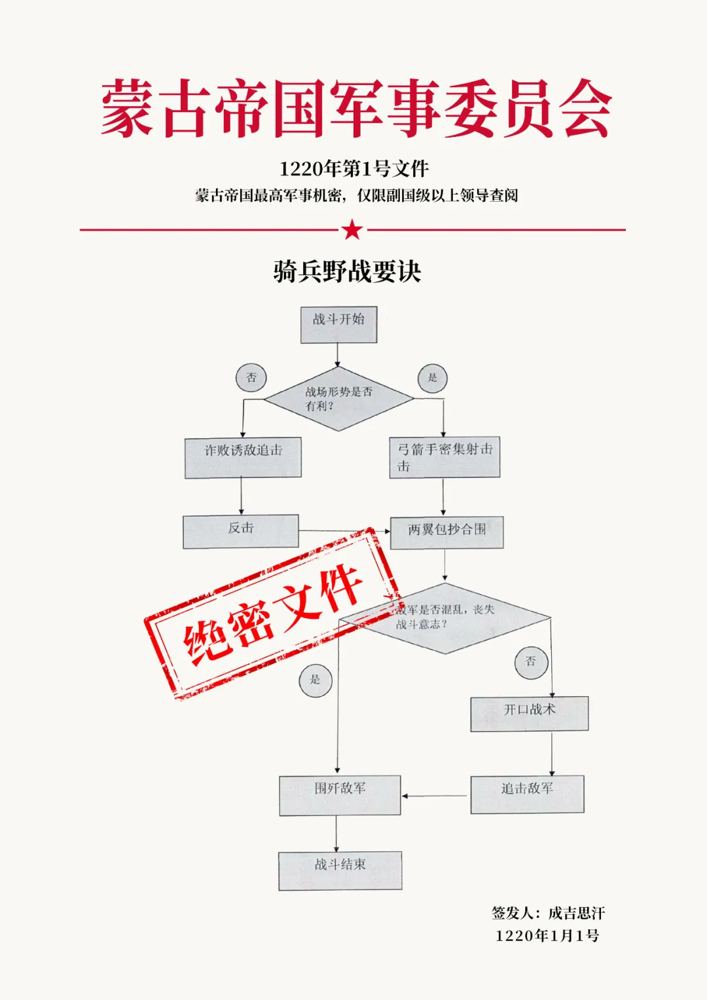

- [归因论](#归因论)
  - [归因论（一）](#归因论一)
  - [归因论（二）](#归因论二)
  - [归因论（三）](#归因论三)
  - [归因论（四）](#归因论四)
  - [归因论（五）](#归因论五)
  - [归因论（六）](#归因论六)
  - [归因论（七）](#归因论七)
  - [归因论（八）](#归因论八)
  - [归因论（九）](#归因论九)
  - [归因论（十）](#归因论十)
  - [归因论（十一）](#归因论十一)
  - [归因论（十二）](#归因论十二)
  - [归因论（十三）](#归因论十三)
  - [归因论（十四）](#归因论十四)
  - [归因论（十五）](#归因论十五)
  - [归因论（十六）](#归因论十六)
  - [归因论（十七）](#归因论十七)
  - [归因论（十八）](#归因论十八)
  - [归因论（十九）](#归因论十九)

# 归因论

## 归因论（一）

自从我们刚刚脱下开裆裤，带上红领巾，走进学校的第一天，就被老师们灌输了一个观点，先进一定会战胜落后，文明一定会战胜野蛮，我们之所以生活得像蜜儿一样甜，就是因为我们国家的制度更加先进文明。

不仅仅中国的老师这么讲，世界上其他地方的老师也是这么说的。虽然对于后面这句话，到底是实事求是，还是王婆卖瓜，自吹自夸，甚至是打肿了脸充胖子，不同的人会有不同的看法，可是对于前面那两句话，却绝对没有人敢质疑，这不就是放之四海皆准的真理吗？！

既然是真理，我自然也从来没有敢怀疑过。可是随着我读书越来越多，我却产生了一个疑惑，史书上白纸黑字写着的，怎么不是这么一回事。

谁说的先进一定会战胜落后？文明一定会战胜野蛮？事实上世界历史在大部分的时间里，都是反着来的。

不信？我下面随便给你举几个例子，足以向你证明，这套说法有多么的荒谬！

既然我们写了这么久的大清，那我们就干脆讲讲他们的老祖宗，一群生活在白山黑水之间的野蛮人，女真族，到底是怎么样轻轻松松地踩扁了大辽，这个结合了草原文明和农耕文明的二元帝国，又是如何不费吹灰之力的，消灭了中国古代封建史上，经济最发达的北宋，在短短的十多年之间，连抓了三个皇帝，单就这抓皇帝的能耐来看，即便放眼世界，那也绝对是全球第一。

记得我上学的时候，老师是这么解读这段历史的，辽朝末年，天祚帝耶律延禧继位，这个人荒淫无耻，腐败无能，把国家搞得一塌糊涂，导致内外矛盾激化，于是备受压迫的女真族人不堪忍受，揭竿而起，得到了天下响应，于是就消灭了反动没落的大辽，这个故事就结束了。

小时候身体短，见识自然也就更短，老师怎么说，我也就怎么信了，可是等到我上了大学，有机会读了读二十四史，忽然发现这事好像不大对劲。

不论是按照先进落后说，还是文明野蛮说，这女真人和辽国的契丹人，完全不在一个境界上，一个还在原始的部落社会，什么制度也没有，另一个早就进入了封建社会，建立了完善的官僚体系，还创造性地发明了南院北院制度，分别管理农耕地区和游牧民族，这文明程度根本就没法比，就算是天祚帝耶律延禧多睡了几个女人，多用了几个贪官，那也比大字不识一个的完颜阿骨打，高出了不止一点儿半点。
为什么我会这么说呢？历史书上记载了几个关于完颜阿骨打的故事，让我们可以了解一下这个人：

第一个故事是，完颜阿骨打有一次在辽国的首都，和一个契丹贵族下棋，下着下着，对方有一步棋没走好，就非要悔棋，结果完颜阿骨打马上就觉得受到了奇耻大辱，立刻就要拔刀去削对方，让他要悔棋就干脆把肠子也一起悔青。

这可是在对方的首都啊！为了这点小事就要杀人，你想想，这堂堂的金太祖，同那些晚上吃冷淡杯时，被人多看了两眼，就要拿啤酒瓶子砸人的二混子，有什么区别？

幸好和他一起去的另外一个部落首领，名叫完颜娄室的人，按住了他的刀鞘，让他拔不出刀来，才免了一场血光之灾，结果他还是不依不饶，非要用刀柄重重地猛击了对方一下，这才勉强解气。

单凭他这一连串的表现，你敢说他是雄才大略，老谋深算吗？

更重要的是，这种不计后果的冲动，差点儿让他丢了小命，毕竟对方也是辽国的权贵呀，你一个番帮酋长，居然也敢喊打喊杀，这还有没有王法？

于是状就被告到了辽道宗那里，这以下犯上，在封建社会里，可是不得了的大罪，很多人都撺掇辽道宗，让他杀了完颜阿骨打，可是天祚帝耶律延禧的这个爷爷，只是淡淡的说了一句：“吾方示信以怀远方，不可杀也。”

虽然后来有很多人说，辽道宗放虎归山，可是我必须说这纯属是马后放臭屁，而且是非常非常的臭屁，为了这点小事就随便杀人，那仅仅只有150万人的契丹，肯定就无法驾驭900万的异族了，所以辽国的皇帝，在政治上是非常的成熟的，同完颜阿骨打形成了鲜明的对比。

而且如果你再往深里想一想，完颜阿骨打已经是女真族里的精英了，是见过大世面的，但是在辽国的首都也敢杀人，那一般的女真人，和野人几乎就没有多大的差别了，所以要论文明还是野蛮，两者之间根本就没法比。

而且你千万不要以为我这是信口开河，根据宋人徐梦莘的《三朝北盟会编》里记载，公元1117年，北宋第一次派出一艘海军战舰，携带7名使者，前去和金国人联系，但是到了辽东，当他们第一次看见了岸上的女真人以后，竟然没有一个人敢下船，为什么会这样呢？

因为使者一看这群人，明显就是一群原始人，上去和这帮人谈，恐怕还没来得及张嘴，小命就不保了，结果宋金的第一次交流，就这样无疾而终。

你可别以为是这群人胆子小，实际上他们的判断是正确的，后来宋朝又派了一个胆子特大，名叫马政的人再次出使金国，结果刚一上岸，使团就被抢了个精光，团员也几次差点被杀，全靠“药师（翻译）辩论再四，得免，遂缚以行。”

第二个故事：天祚帝去黑龙江钓鱼，按规矩，千里之内的女真族部落首领，都要给老大来问个好，完颜阿骨打自然也来了，然后天祚帝就摆了一个头鱼宴，招待大家。

我没有来得及去考证，不知道今天查干湖上的这个头鱼宴，和这个辽代皇帝钓鱼的地方有没有关系，但是猜测地点应该相距不远。

既然摆了宴席，自然就少不了大吃大喝，喝多了，按照少数民族的规矩，那就跳跳舞吧。皇帝肯定是不能跳的，那就酋长们跳吧。

可是轮到了完颜阿骨打，他就是不跳，怎么劝都不跳，这就有点像酒桌上喝酒，别人敬你酒，你明明能喝，却坚持不喝，这叫不给面子了，天祚帝自然就生气了，对旁边的一个叫做萧奉先的大臣说：“找个机会把这家伙杀了算了。”

可是这个叫做萧奉先的大臣却说：“山野粗人，不懂礼仪，杀了他不利于民族团结。”就把皇帝给顶回去了，结果辽天祚皇帝只有作罢。

从这件事上我们可以看出，辽国还是要文明的多，它有一套完善的官僚制度的，皇帝并不能想做什么就做什么，所以谁先进，谁落后，自然也是高下立判。

综合这两个故事，你可以说完颜阿古达是一个顶天立地，铁骨铮铮的汉子，但是你要说他是一个又楞又横，完全不懂政治谋略的野蛮人，其实也不为过。

而且还有一点我要告诉你，历史学家对当时女真族人口的估计，在30~50万之间，他们全都过着原始的渔猎生活，而大辽当时已经有900万以上的人口，其中光是契丹族就有150万，早已进入了先进的农耕文明，在力量对比上，双方也不是一个数量级的。

所以女真能灭辽，你要是想用先进和落后，文明和野蛮这套逻辑去解释，那肯定是讲不清楚的，事实上你无论用哪种政治经济学说法，都是讲不通的。

那女真能灭辽的真正原因是什么呢？

有一种说法是，契丹人被汉化了，所以战斗力变弱了，这话听着似乎是这么回事，可是如果你知道接下来发生的事情，你就会发现这事也站不住脚，为什么呢？

因为就在辽国被灭亡的前夕，一个叫做耶律大石的人，率领200名骑兵，逃到了蒙古草原上，在那里他收拢了被金军打垮的1万多名残兵败将，靠着这些人，他一路向西打，征服了大半个蒙古，整个新疆，以及中亚的大部分地区，建立了一个叫做西辽的国家。

公元1141年，这些在女真人面前，不堪一击的弱鸡菜鸟们，在今天中亚乌兹别克斯坦的著名城市，撒马尔罕附近，和塞尔柱帝国的10万穆斯林联军打了一仗，史称卡特万战役，在世界历史上留下了浓墨重彩的一笔。

塞尔柱帝国，和后来的奥斯曼帝国很有点渊源，据说奥斯曼人最初就是臣属于罗姆苏丹国的一小部分突厥人，而罗姆苏丹国又附属于塞尔柱帝国，所以今天的土耳其人，东攀西附的，也和他们有了一点关系，于是把他们也写进了土耳其历史，自然对这场战役，也做了深刻的研究。

按照《辽史》里的说法，参战的双方，耶律大石有3万人左右，穆斯林骑兵有10万人之多，不过土耳其历史学家秉承他们一贯的风格，坚称这个数据是错误的，他们认为耶律大石也有十几万人，不然的话，就无法解释后面的结果。

后面的结果是什么呢？双方在乌兹别克斯坦的卡特万草原进行了一场决战，契丹人大获全胜，穆斯林全线崩溃，3万人阵亡，塞尔柱帝国从此走向了衰落，这让土耳其的历史学家们很抓狂，所以耶律大石的兵力绝对不能少。

我们之所以要提这场战役，其实并不是想拿土耳其的历史学家们开涮，也不仅仅只是为了告诉你，契丹人并没有因为汉化了而不能打，相反他们很能打，除了打不过女真人以外。

更重要的原因是，这场战役在东西方的历史上，具有里程碑式的意义，因为这场战役的结果，被正在东征的十字军听说了，然后他们就相信，在遥远的东方，有一个信奉上帝的约翰王，力量强大，所向无敌。

这个传说被他们带回了西欧，从此广为流传，甚至变成了他们的精神支柱，特别是当奥斯曼帝国崛起，军事坦丁堡陷落以后，西方人更加对这个约翰王朝思暮想。

所以第一支葡萄牙船队离开里斯本，揭开了大航海的序幕时，他们的一个非常重要的任务，就是去寻找这个传说中的约翰王，而因为这场胜利，中国在很长一段时间里，也被西方人称作了契丹，有一种说法，CHINA就是契丹的变音，当然，这没有什么真凭实据，只是众多的猜想之一而已。

那么既然金能灭辽，和政治制度无关，和文明程度无关，和辽接受了汉族文化也无关，那到底和什么有关呢？

答案可能会出乎你的意料，女真人拥有更好的马种，仅此而已！

够不够毁三观？是不是有点难以置信？但事实就是如此！就是这么简单！

今天的人可能很难想象，马对于古代人有多么的重要，你拥有什么样的马种，就决定了你能拥有什么样的军队，采用什么样的战术，为什么会是这样呢？

（以下资料主要来自于北宋王薄《唐会要》卷72《诸番马印》，苏颂《苏魏文公文集上册》，元马端临《文献通考》卷160 《兵考十二马政》，清徐松《宋会要辑稿》兵二十四《马政杂录一》里的记载。）

在中国古代，一共有5种主要的战马来源，最好的马是突厥马，也就是今天新疆的伊犁马和哈萨克马，这种马平均身高在1米41到1米5之间，体重在450公斤左右，以速度快见长。

不过这种马由于产地遥远，来源稀少，所以主要作为奢侈品，无论是金辽宋西夏，都只有达官贵人才能享用，基本上属于当时的劳斯莱斯，真正大规模用于作战的，却是另外几个马种。

最次的是西南马，平均身高在1米到1米25之间，体重在155~255公斤之间，自从西夏崛起，宋朝丢掉了凉州，丧失了北方马种的来源以后，被迫只能从西南买马，这种比驴大不了多少的马，就成了宋军的主力装备。

既然大小差不多等于一头驴，那驮载力自然不足，所以骑驴的宋军，基本不穿盔甲，靠左手挽一个皮盾保命。

既没有冲击力，防护也不好，那就只有玩远战了，九成的宋军骑兵都是弓手，所以北宋末年的骑兵，并不是严格意义上的骑兵，只是机动力更强的步兵而已，和宋初有好马的骑兵，已经有了天壤之别。

这一点在尹洙的《河南先生文集》卷20《奏阅习短兵状》里得到了印证，“诸处马军，每一都枪手、旗头共13人，其80余人并系弓箭手。”在李焘《续资治通鉴长篇》卷292里也有类似的记载，“马军一分习枪刀，余皆习弓。”

在我们的印象中，靠骑兵起家的契丹人，其实他们的马也不怎么好，契丹人主要用的是契丹马，这种马事实上就是今天的蒙古马，或者说是蒙古马的祖先，身高在1米25到1米35之间，体重在260公斤到360公斤之间。

蒙古马在宋代人的眼里，那也是属于一种劣马，速度不快，载重力也不强，唯一算得上优点的，大概就是耐力比较好，能爬山下坎，适应力强。

那么契丹人为什么用这种马，能够一度天下无敌呢？一个最大的原因是，这种马好养，对饲料不挑剔，经济，所以可以用数量换质量，契丹士兵都是一人三马制。

基于这个特点，辽军都是具装骑兵，也就是人马都披甲的，最早的铁鹞子，铁林军，都是从契丹人那里开始的。按照《辽史》卷34《兵卫制上》里的记载“人铁甲九事……马甲皮铁，视其力……”

虽然马多，但是马种不好终究限制了辽军，辽军的重骑兵，还远远没有达到刀枪不入的境界，宋军使用的神臂弓，照样可以在百步之外，轻松地洞穿身披一层鳞片甲的辽军士兵。

后面我们会讲到，要想挡住神臂弓，至少要穿两层当时的标准厚度盔甲，要想万无一失，至少要穿三层盔甲，马必须要披铁甲，皮甲是不够的。

这样算下来，再加上人、武器和弓箭的重量，单个战马至少要负重350~400斤，还要能快速冲刺个几公里，蒙古马是做不到的。

这些数据的来源，是根据孟古托力《骑兵兵器与盔甲的改革和发展》《北方文物》1999年4月刊里的研究，当时骑兵单层铁甲的重量在45~50斤，一套马铁甲的重量大概在80~100斤左右。

所以契丹人的战法和后来的蒙古人很类似，以突袭和骑射为主，冲阵为辅，因此每个契丹骑兵都会携带四把弓，400支箭，按照宋朝人的说法，契丹人“轻而不整，散而复聚，败退无耻，成列不战，长于弓矢，短于枪戟……”

而采用河曲马的西夏人，战法就明显和辽军不同了，河曲马要比蒙古马更大，身高在1米33到1米43之间，体重在330~400公斤之间，负重能力要明显高于蒙古马。

因此西夏人用的是重甲骑兵，就是人和马都穿着冷锻甲的铁鹞子，他们的打法是以中央突破为主，但是他们的马还是不够好，因为宋军名将吴玠就说过，西夏人玩的就是一锤子买卖，挡住了他们的一次冲锋，战斗就结束了，因为河曲马驮着350斤~400斤左右的负重，高速冲击个几里地，也就跑不动了，打不垮对方，大家就只有回去洗洗睡了。

所以你看，真是有什么样的马就决定了有什么样的军队，这样你也就能理解了，为什么汉武帝为了夺得大宛马，也就是传说中的汗血宝马，今天的阿哈尔捷金马，会不惜糜浩巨资，两次派出李广利率领数万人，远征万里之外的大宛国，也就是今天中亚的乌兹别克斯坦国的费尔干纳盆地。

这场战争耗时4年，损失惨重，但是最终达到了目的，虽然古往今来的历史学家，对汉武帝多有指责，觉得他为了几匹种马而劳师远征，不仅仅是穷兵黩武，更是疯狂到了极点，但是汉武帝真的疯了吗？

女真人给了我们最好的答案，等到他们上场的时候，游戏规则就完全变了，因为女真人不仅仅有黑龙江马，还有各种改马，也就是杂交马。

黑龙江马有两种分类，一种以速度见长，一种以驮重见长，平均身高在1米49到1米56之间，体重在500公斤左右，比西夏人用的河曲马，又大了一圈。

至于它的改马，也就是杂交马种，具体是什么情况，我们现在已经不得而知，但是我们通过一种现代的东北杂交马，铁岭挽马进行比较，来推测一下他们当时的改良品种，这种现代杂交马平均身高1米55，力量相当于普通马的2.5倍，拉着一吨重的东西，45分钟能跑完8.5公里。

这意味着什么？这意味着奔驰对奥拓，悍马对北京吉普，这意味着碾压的优势。

所以只要听过评书《说岳全传》的人都知道，金军有两大利器，拐子马和铁浮屠。

其实拐子马这个叫法，最初是宋朝人发明的，在北宋学者曾公亮等人，奉宋仁宗之命，编写的《武经总要》里，明确的提出了拐子马及其用法：

“东西拐子马阵为大阵的左右翼也，本朝西北面行营，拐子马并选精骑，夷狄用兵，每弓骑暴急，偏攻大阵一面，捍御不及，则有奔突之患，因置拐子马以为救援。”

所以拐子马泛指两翼骑兵，在宋军中扮演的，是救火队员的角色，不过宋军后来失去了战马来源，变成了骑“驴”能手，这个发明权，就戴到了两翼骑兵用的最好的金人头上，从此以后一说拐子马，都特指金军骑兵。

至于铁浮屠，也有叫连环马的，相信看过《水浒》的人都知道，那是双鞭将呼延灼的看家本领，不过在真实的历史上，没有良马的大宋王朝，只有在梦里才会有这种编制。

铁浮屠实际上是金军的重甲骑兵，是中国古代军事史上的巅峰之作，重到什么程度？按照《三朝北盟会编》里，宋沈琯写给李纲的信中指出:“金贼兜鍪极坚, 止露两目, 枪箭所不能入。”

同样根据这本书里汪若海的记载，金军士兵经常身披两层铁甲，这个防护程度，在当时基本上是刀枪不入了，根据杨汝翼的《顺昌战胜破贼录》里的记载，宋军士兵要想杀伤对方，必须先要用长枪挑掉对方的头盔，然后才能用刀斧斩杀对方，由此可见对方防护程度之高。

至于金军的重甲骑兵是不是三马相连？这个在历史上是有争议的，至少乾隆就认为这不可能，不过这也不好说，因为在郭乔年的《顺昌破敌录》里，有这样的记载“乌珠（金兀术）自将牙兵三千，往来为援，皆戴重甲，贯韦索，三人为伍，号铁骑马，左右两翼，号拐子马，皆女真人充之。”

不过这个历史细节我们就不纠结了，但是通过这些资料，我们知道了一点，由于有了比契丹人更好的战马，女真人把重甲骑兵发展到了巅峰。

而且还有更重要一点，他们可不像西夏人那样，脱衣上床三分钟，人称江湖小旋风，因为马好，他们可以来来回回地连续冲击几十次，按照他们自己的说法，不打个上百回合，叫什么马军？

所以他们同契丹重骑兵之间的差别，就好像海湾战争中，美国人的M1A1坦克和伊拉克的猴版T72之间的差别，完全可以单方面的吊打对方。

如果你觉得铁浮屠就已经厉害的不得了，那女真人的两翼的轻骑兵，拐子马就更吓人了，凭借着黑龙江马对蒙古马的速度优势，女真人追你你跑不了，女真人逃跑你追不上，契丹人完全处于一种全面受虐的地步。

这样的部队一旦成了规模，直接就碾压所有的对手，所以辽国人说女真不满万，满万不可敌，就是这个原因，以轻骑兵为主的辽国军队，面对这样一支战争怪兽，打也打不过，跑也跑不掉，所以直接就稀里哗啦了。

当然，这中间辽国人自己也送分不少，比如护步答岗战役里，前方正打的热火朝天，后方居然搞起了叛乱，自己挖了自己的墙角。

但是这些都不是关键因素，因为金辽之间打打和和持续了很多年，契丹人的动员能力是女真人的几十倍，一两场的输赢并不是决定性的因素，可是由于军事技术上的差距太大，无论怎样认真准备，契丹人自始至终，一局也没有扳回过。

不仅仅辽国人稀里哗啦了，宋军也彻底崩溃了，以前跟契丹人打仗，虽然运动战打不过辽国人，可是只要摆出阵地战，凭借着威猛无比的神臂弓，契丹人也奈何不了宋军。

可是刚刚和金军接战的时候，宋军发现这个仗完全没法打了，宋军的拿手好戏，什么平戎十全阵之类的，在金军铁浮屠的冲击下，简直就像螳螂挡车，不自量力，所以徽钦二帝只好北狩了。

公元1127年，画的了一幅工笔好鸟，写得了一纸挺拔的瘦金体的徽宗父子，被迫带着1300名被扒光了上衣的皇室男女老幼，袒胸露乳地牵着一头羊，给大字不识一个的完颜阿骨打献祭。

献俘大典后, 除了徽宗和郑皇后, 钦宗的朱皇后和朱慎德妃, 还有他们未成年的公主皇子外, 其他皇室成员, 以南宋高宗康王赵构的母亲韦贤妃为首, 包括赵构的妻子邢妃、妹妹柔福帝姬及其他帝姬、宫嫔共三百多人同入“浣衣院”为官妓。其他美貌的嫔妃、公主、宗妇宗女宫女, 全部分给金军将士为性奴。所有的男俘———包括皇子皇孙、驸马等, 全部分散给金将领为奴。

后来南宋的使者来到黄龙府，看见宋朝的贵妃和娘娘们全都赤身裸体，仅仅腰间围着一块羊皮，早已被糟蹋得不成人样，不由的放声大哭，你说这世道公平不公平？不论你发展了多么高的文明，有时候甚至不如你恰巧拥有了一匹好马。

完颜阿骨打靠着当初给辽国人当保安的时候，学会了制甲技术，再结合本地的优质战马，发明了拐子马和铁浮屠，就靠着一招鲜，吃遍天，13年间消灭了东亚两大帝国，一直到岳飞韩世忠用背嵬军（同百度百科里的说法不同，一些专家考证，这是一句西夏语，指的是圆形皮盾，泛指精锐的重甲步兵），手持长刀巨斧，专砍马蹄，才了结了金军不败的神话。

就凭着一次军事技术的革新，落后就战胜了先进，野蛮也战胜了文明，而且这种事情并不是孤证，残忍的蒙古人曾经大杀四方，西方文明的开山鼻祖罗马帝国，也是毁在一群蛮族人的手里，这种例子多得不胜枚举，东西方比比皆是，因此我们今天很多被人视为绝对真理的观点，其实是经不起推敲的。

所以我们现在经常会看到，有些人在微信群中为了某个制度的好坏，炒得面红耳赤，甚至破口大骂，但是谁也说服不了谁，这里面有一个重要的原因，就是大家都能举出反证。

迄今为止，政治经济学到现在给出的所有公式，都可以即是1+1=2，也可以是1+1=3的，完全的不科学，这促使我们不得不提一个问题，会不会这些研究，从根本上就是错的？

不过在归因之前，我还会为你举出很多反常识的例子，你会发现如果换一个角度，很多我们以为是天经地义的事，好像完全不是这么回事。

当然，我不敢保证我的解释绝对正确，但是至少看我这本书，可以让你了解这个世界上，发生的很多有趣的故事，所以……

## 归因论（二）

看完了前面一篇文章，很多读者的脑子里，都会冒出来一个念头，契丹人打不过女真人，是因为他们的马不够好，那么蒙古人同样骑着蒙古马，为什么他们又把金国给灭了呢？

这是一个好问题，刀枪不入的铁浮屠，外加速度惊人的拐子马，看起来分分钟都可以碾压蒙古人，因为蒙古人的战法，本质上和契丹人并没有太大的区别，那么到底发生了什么事呢？

什么也没发生，因为根本就没有出现过这样的场面。等到和蒙古人作战时，女真人别说什么优质战马了，有马骑就不错了，这个时候的金国军队，早就沦落成为了一只步骑混合，以步兵为主的军队。

这是不是太不可思议了一点？金军最后怎么竟然会褪化成了宋军了，居然也缺马了？看起来实在是没道理呀！

但这就是历史事实，写《金朝军制》的历史大家王曾瑜先生，就曾经在他的著作中指出：“金熙宗对宋和议以后，金军的马源似逐渐不足。”

北京师范大学历史学院的孙建权先生，也是这方面的权威，他对金朝战马供应的变化，做过非常详细的论述，他的结论也是如此。

天津师范大学历史文化学院的郑成龙先生，在这个领域也很有建树，此外还有其他一些专家学者，我就不一一点名了，都对这个奇怪的现象，做过深入的研究。

以马开国的女真人，最后竟然无马可骑，这剧情反转的实在太大了一点，我们必须要好好的聊一聊。我把专家学者们的观点，再加上我自己的思考，糅合在一起，给大家讲讲这到底是怎么回事。

更重要的是，通过研究女真人为什么没马可骑，我们又可以发现一个反常识的结论，这个结论是什么呢？我把谜题留到最后再揭开。

书归正题，言归正传，女真人的战马，为什么会越来越少了呢？

第一个原因是战损。你别看宋军总是蔫不拉叽的，一副挨打受气的样子，可是他们除了缺马以外，其实什么也不缺，特别是不缺智商。

契丹人和女真人打了将近十年，也没有找出破解铁浮屠和拐子马的办法，可是宋军只打了两年多，马上就找到了事情的关键，很简单，黑不了你的人，就专黑你的马。

用背嵬军，也就是精锐的装甲重步兵砍马蹄是第一招，接下来，宋军又发明了专门射马的强弓，据说这是韩世忠的专利，叫做克敌弓，根据《三朝北盟会编》里的记载，这种弓：“斗力雄劲，可洞犀象，贯7札，每射铁马，一发应弦而倒。”

既然女真人一切的战术规划，都是围绕着一匹好马而进行的，那么打败金军的关键，自然也就是要消灭敌人的好马。

战术对头以后，金军不败的神话立刻被打破，吴玠，岳飞，刘琦，韩世忠，张俊等人，从川陕一直到江淮平原，多次重创金军，每一场战役的胜利，都会造成金军几千甚至上万匹战马的死亡，从而导致金军的战马数量直线下跌。

第二个原因是瘟疫，由于金军节节胜利，本来生活在冰天雪地里的东北马，一路纵横驰骋到了炎热潮湿的长江边上。

对于女真人来说，这是风光无限，这是威风八面，可是对这些可怜的马儿来说，那简直就是冰火五重天，太刺激了，实在是承受不起。

于是就出现了《大金国志校正》里所说的：“是行也，攻战之久，人马疲惫，即至宿迁，复值马灾，死亡殆尽，金兵食之不尽，往往弃之道路。”

第三个原因是战线拉的太长，供应不足，金军在很短的时间里就征服了整个北宋，战场从河北一下子拉到了陕西和长江边上，但是却没有建立后勤补给制度，粮食基本靠抢。

虽然金军刚开始的时候，打了宋朝一个措手不及，老百姓都没来得及跑，让金军简直是要风得风，要雨得雨，但是宋朝人也不是傻子，到了后来一看见风声不对，该躲的躲，该藏的藏，让你连毛都薅不到一根。

这一下金军就抓瞎了，经常抢不到东西，就只有喝西北风了。可是人的肚子却不喜欢什么天地的灵气，没有五谷杂粮垫底，到点了它就开始唧唧歪歪，几天没食下肚，它就直接让你精神错乱，怎么办呢？那只有杀马吃呗。

根据《大金国志校正》里的记载：“……（宋人）自焚而去，且野无所取，无以因粮，杀马而食之……”

有人可能会说了，这打仗战马损失是不可避免的，但是女真人不是自己会养马吗？他们可以补充啊。

听起来好像是这么回事，但是不知道大家想到了没有，到了这个时候，东北已经没有多少女真人了，早就没人养马了，为什么会这样呢？

原因很简单，女真人本来就没有多少人，现在都进城了，一下子占了这么大一块儿地方，需要多少的领导？需要多少的驻军？再加上一看到北宋大辽的花花世界，谁不想把老婆孩子接过来一起享福？

你别说，我发现中国有一件怪事，最爱往南跑的几乎都是东北人，特别是到了三亚，几乎大街小巷上，到处都有人在唠嗑。

这大概是他们祖宗留下来的传统，女真人两次建国，两次都大规模的从东北迁出，金代大概迁走了90%，清代几乎迁走了99%。

我忽然发现前面一句话没说对，今天的东北人，其实都是闯关东的中原人，特别是以山东人为主，自从清代满人迁出以后，土生土长的东北人几乎已经绝迹了，

当然，这话也不能较真，只能说是女真人走了，其他的少数民族，还有一些留在了当地。

既然大家都到中原来当干部了，那优质的黑龙江马，还有它的各种杂交马，自然也就没人养了，所以当他们消耗殆尽以后，金军也就玩不成铁浮屠和拐子马了。

有人可能会问了，女真人难道不知道战马的重要性吗？他们自己当了领导，但也可以安排其他人继续养马呀，难道他们连这点都没想到吗？

女真人当然不是傻子，他们自然早就想到了，但是问题是……

我先问大家一个问题，不知道大家有没有想过，为什么北宋会缺马？

传统的历史书上都是一笔带过，说中原地区不适合养马，但是你只要稍微往深里想一下就会发现，其实这话是经不起推敲的。

河南、河北、山西和陕西的天气，其实是很适合战马生长的，至于战马要吃的草料，你弄点地来种就行了，更何况战马吃粮食还长得更好，集中饲养比敞放效率更高，现在那些马术俱乐部里的马，不都是这么养的吗？

既然战马这么重要，在北宋那么大的国土上，难道就找不到一点地方来养马吗？更何况以北宋如此强大的国力，高度发达的商品经济，花点钱养个几十万匹战马，还不是轻轻松松的事，怎么会缺马呢？

其实在北宋初年，北宋的战马真就是自己养的，而且就是在中原地区养的，至于到了后来，战马才越养越少，直到养不下去以后，才开始向周围的少数民族去买的。

可能出乎我们大部分人的意料，事实上纵观整个北宋，几乎所有的皇帝，无论是昏君还是明君，都对养马事业高度重视。你知道他们重视到了什么程度吗？

国家有多个部委专门负责养马，分别是群牧司，太仆寺和驾部，并且成立了由国防部长或者是国务院副总理牵头的养马领导小组，地方上则是由省市一把手负责，规格不可谓不高，体现了集中力量办大事的决心。

不仅仅如此，针对养马工作中发生的各种问题，宋朝政府也从不因循守旧，而是解放思想，改革创新，锐意进取。

从最初群牧司的国营马场，发展到后来的户马制的包产到户，又发展到保甲养马制的股份公司，几乎把所有的花样全都玩遍了，结果呢？

结果就是全面崩盘，最后养的彻底没马了。

这又是怎么回事呢？喜欢考据学的朋友，可以去看看山东大学丁营营的硕士论文《北宋马政研究》，至于我这里，本着无厘头的原则，用不正经的语言给大家讲一讲，这个不可思议的奇葩故事。

你看，如果国家要开一个马场，最初的时候，那总得派一个政府领导去管，另外还得有财务库管，外加几个马场工人。

可是运行了一段时间以后，大家发现这事不对头，领导太少了，难免会搞成一言堂，一手遮天，一方恶势力，最后不知道会出多少事，必须要加以制衡。

那就再派几个副领导去吧，财务库管制度也必须完善，那就得把出纳和会计分开，采购和库房分开，免得大家吃回扣，记黑帐，搞小金库。

又过了一段时间，大家发现这个制度还是不完善，万一这些人同流合污了怎么办？那就成立个纪委吧，再成立一个审计署，同时为了避免小偷小摸，那就再成立一个保卫部吧。

于是这个马场的规模就扩大了几倍，人既然多了，那总得有个组织部吧，要把大家思想统一起来，还得有一个宣传部吧，工人的福利也不能不考虑，那就再成立个工会吧。

既然有了工会，那就的为工人谋福利呀，所以还得有卫生院，托儿所，学校等等，退休人员也得有人管理呀，那还得成立一个老干办。

你以为这就完了，还不够，这些人都在一起工作，抬头不见低头见，日子久了难免互相包庇，官官相护，所以上级还得派一个巡视组来，定期检查，因此最初可能只有十来个人的马场，几十年以后，就变成了几百上千人。
当然，宋朝没有这些机构，我只是打个比方。
那规模增加了这么多，养的马会变多吗？当然不会，因为增加的都是领导，都是脱产干部，都是早晨上班泡杯茶，点支烟，然后就开始刷微信，刷抖音，混到了快下班的时候，再到大众点评上看一看，琢磨一下到哪里吃晚饭，都是闲人，所以到了后来，大宋朝每养十万匹马，大概就需要超过八千人。

可是你知道民间养这么多马，需要多少人吗？不超过一千个人，而且还不拿工资，没有社保，所以大宋朝国营马场养出来的马，大概相当于市场上一匹马价格的几十倍。

不仅仅是贵，国营马场里养出来的马，还质量低劣，瘦弱不堪，还没有送到前线，半道上就死了一大片，因此就算宋朝是中国历代王朝中，经济最发达的，这么搞，它也玩不下去了。

玩不下去怎么办？搞改革开放呗，把马放到普通老百姓家里去养，然后给他们钱，养死了他们赔，养好了归国家，这样岂不就把问题解决了？

这个聪明的主意，就是王安石想出来的，听着是不是很完美？是不是很符合市场规律？

可是王安石忘了一件事，谁负责把钱发给老百姓，谁又负责决定老百姓的马养的好不好？还得是官员，然后这事就又给搞变形了。

虽然上级说的是要大家自愿，可是地方官员为了自己的政绩，为了完成上级安排的指标，他可不管你是不是自愿，一律强行摊派，不管你以前是养鸡养鸭，甚至是养鱼的，现在都一律必须养马。

到这就已经变成苛政了，政府答应给你的钱，很可能就是一个白条，鬼才知道猴年马月能拿得到。可是这还没完，当地的官员还要时常来检查你的马养的好不好，养的不好，还要罚你的钱，这就成了官员敲诈养马户的好机会。

更可气的是，他们还要经常借出去骑一骑，拿去干干私活，累死了，弄伤了，还要赖在你头上，一匹马的价格足以让一个小户农民破产，你说这还让不让人活了？

你可以想象，这个政策会造成多大的民怨，为了一个养马，全国各地的群体事件层出不穷，于是政府也扛不住了，还得维稳，所以该怎么办呢？

那就继续改革呗，让大家按照保甲制度，几户或者十几户中，选出有能力的人替大家养马，然后费用大家来分摊。

听起来好像这次终于可以解决问题了，可是问题是，这战马毕竟不是老百姓必须的生活物资，这养马的价格费用全是当官的一拍脑袋决定的，不管上面的政策制定的多么好，到了基层，为了政绩，为了敛财，为了很多莫名其妙的原因，地方政府总能给你搞出花样来，还是能把老百姓逼到活不下去的境地。

接着肯定又是层出不穷的群体事件，为了维稳，那政策还得改吧，于是又改成了国营马场，可是国营马场养出来的马，一定是天价，政府承担不起，无奈之下，只有一方面缩小国营马厂的规模，另一方面向国外进口，也就是找少数民族买。

所以北宋为什么缺马？还真不是中原不能养马，而是因为北宋有着一个当时最先进的，组织最严密，政治制度最完善的中央政府，所以就把马给养没了。

等到女真人也缺马的时候，也准备让其他人帮他们养马的时候，他们忽然觉得，这养马不能乱搞，必须也要有一整套条条框框。

可是女真人都是野蛮人，以前都是自家自户养马的，这样大规模的找别人养马，他们没干过呀！

于是他们就决定找人学习，找谁学习最好呢？自然一个是大辽，一个是大宋。

但是契丹人本来就是半个草原民族，以前是逐水草而居，他们的生活方式，和渔猎为生，半农耕的女真人不太一样，虽然马要安排他们养，可是规章制度却得和大宋学。

为什么是大宋呢？逼格高呗，契丹人养马哪有什么理论，这本来就是他们生活的一部分，可是大宋不一样，光是规章制度，组织模式，厚厚的好几大本，说的更是头头是道，这么高大上，不学他们又学谁？然后大金国的马也就养没了。

当然，养没了是夸张的说法，但是金朝从此以后就一直开始缺马，再加上和蒙古人西夏人之间的战争，最后导致从国外进口马的渠道也全部被断绝，于是金军也彻头彻尾的变成了宋军，历史来了一个轮回。

所以我们又可以提出一个反常识的观点，文明程度越高，组织越严密的政府，越容易一事无成。

历史最气人的一点就是，它总是不按照大家相信的真理走。

你看在我们这个故事里，要想解决养马这个难题，宋朝的大臣们，就决定要动用国家力量，用权力来解决问题，可是权力本身就是一把双刃剑，它带来的成功和危害一样巨大。

所以聪明的宋朝大臣们就想，要把权力装进笼子里，但是问题是，宋朝的大臣们很快就发现，笼子本身也是一种权利，也是需要监督的，所以笼子外面还得再加上笼子。

你看，你要想监督权力，就必须要创造新的权利，而新的权利也必须要受到监督，就要创造更新的权利，其结果就是形成了一个俄罗斯套娃式的结构。

显而易见，如果宋朝的士大夫们，要想让养马事业清廉高效，那这个俄罗斯套娃的层数就要尽可能的多，也就是组织结构要设计的尽可能的巧妙，尽可能的复杂，尽可能的受到更多人的制约。
于是问题就产生了，那就是监督本身也是有成本的，它不会给社会创造财富，它一样会挤占社会的资源，因此你的监督制度越完善，监督水平越高超，你要花掉的成本就越多。

所以大宋的国营马场，为了防范腐败所建立起来的监察制度，可能比官员贪污腐败本身，花的钱更多，因此大宋自己养马最后搞不下去的原因，不仅仅是因为贪污腐败，还包括了这一整套防范贪污腐败的制度成本，直接就压垮了大宋的财政。

你看，所有的官僚制度，刚开始的时候，都一定会是一块小鲜肉，清新可人，但是只要时间够久，就一定会腐败，所以你还必须不断的发展保鲜技术，只要时间足够长，最后投入保鲜技术的钱，一定会超过买肉的价钱。

所以在当时的生产水平之下，一个文明只要不懈的追求制度的完美，只要持续的时间够长，总有一天，它为了追求完美所付出的代价，会远远超过完美所能给它带来的好处。

那么我们能不能通过限制政府的规模，来延缓这一天的到来呢？北宋放弃了国营马场，改成户马制，就是想抛掉监督成本这个包袱。

可是问题是，权力就是一个怪兽，你一旦让它出笼，它就会开始胡作非为了，所以你简政是简了，可是权力也没人监督了，老百姓就遭殃了，省掉了监督成本，那你就得投入维稳成本，结果一样是得不偿失。

所以如果我们要用一个字来形容北宋的话，那就是一个“冗”字，冗官，冗兵，冗费，而造成这一切的根本原因，就是他们总想把制度搞得尽善尽美。

这是不是又有点反常识？在这里，我们就揭开了上面所说的那个谜题，先进文明之所以会衰败，恰恰是因为它太先进了，能创造复杂完善的社会管理体系，超出了当时的生产力水平，所以反而变成了社会发展的累赘。

相反，落后文明根本就想不出这么多条条框框，所以它的效率更高，成本更低，这也就是为什么在工业革命以前，野蛮频频战胜先进的一个重要原因。

不要说国家如此，企业也是如此，有一个广为流传的笑话，说的是有些乡镇企业做大了以后，泥腿子出身的老板，经常痛心于企业里自家亲戚太多，又太贪，也不听招呼，动不动还吵吵闹闹，搞的企业总是上不了层次。

于是他就去找麦肯锡咨询，学正规化管理，但是等到他按照麦肯锡开出的药方，把企业搞得管理有序，井井有条以后，这家企业通常也就破产了。

为什么经常会发生这种事呢？因为正规化本身也是一种成本，有时候甚至是一种非常高昂的成本，很多乡镇企业以前之所以能挣钱，并不是因为他们有多先进，恰恰是因为他们省掉了正规化这个成本，所以获得了比较优势，迅速的发展壮大，这种企业一学麦肯锡就死，自然就是天经地义的事了。

所以归因很重要，不过相比于我这些奇谈怪论，很多朋友可能会更关心，拥有拐子马和铁浮屠这两大绝招的金军，如果真的能穿越时空，迎战天下第一的蒙古骑兵，到底谁会更牛一点？

可惜的是，关公战不了秦琼，阿骨打斗不了铁木真。不过，蒙古人在征服世界的过程中，真的和其他民族的铁浮屠，拐子马都打过，那么他们是谁呢？最后的战斗结果又是如何呢？有没有女真人强大呢？

## 归因论（三）

一个汉族小朋友，自幼在草原上，和成吉思汗家的野孩子们一起玩耍，一起长大，随后又在蒙古军中效力，变成了一名骁勇无敌的战将，参加了著名的蒙古人西征，立下了赫赫战功，那么这个金庸笔下的传奇，在真实的历史中，有没有可能会发生呢？

你别说，历史上还真有这么一号人，前半生的身世，和金庸笔下的郭靖非常接近，而且这个人也姓郭，叫做郭侃。和郭靖不同的是，他一生都效忠蒙古帝国，最后成了忽必烈建立的元朝里，官衔最高的汉人。

郭侃很小的时候，就被蒙古将领木华黎的部下，史天泽所收养，虽然没有像郭靖那样，泡到一个蒙古公主华筝，但是和成吉思汗的子孙们关系密切，却是不争的事实。

为什么我们要讲郭侃的故事呢？因为前面咱们留下了个问题，一直没有解决，那就是金军的铁浮屠和拐子马，到底有没有古往今来，号称天下第一骑兵的蒙古人厉害。

可惜的是，这个应该是历史上最精彩的骑兵对决，并没有在中原上演，因为金国人找大宋学养马，算是傻徒弟拜了一个瞎师傅，找错了门，所以把这出戏给搅黄了。

而放眼东亚地区，又没有人有当年完颜阿骨打那样的好马，所以就算是想要唱一曲关公斗秦琼的大戏，也找不到演员，那该怎么办呢？

只有贴个海报，全世界海选呗。

然后这事一下就有着落了，在中东就找到了最合适的男一号，他具有金军初期的全部特征，也就是北宋抗金名将吴淩在他的著作，《兵法》中所说的金军四大牛：“曰骑兵，曰坚韧，曰重甲，曰弓矢。”而且他们也真的和蒙古军，实实在在的打了一场史诗般的战役。

那这事和郭侃又有什么关系呢？因为他是这场史诗大片的主要制片人之一，曾经率兵打到了叙利亚，实地负责选角工作，虽然最后的这一出戏不是他唱的，可是聊聊他的故事，就可以让我们知道剧情的来龙去脉。

说到这里，有读者可能已经摩拳擦掌，跃跃欲试了，这个扮演金军的替身是谁？是骡子是马，赶紧拉上来遛一遛。

别急，千万别急，咱们饭要一口一口的吃，戏也得一出一出的演，我们先要铺垫铺垫，讲讲这事是怎么发生的。

成吉思汗死了以后，他的儿子窝阔台继承了汗位，窝阔台死了以后，他的儿子贵由继承了汗位，贵由死了以后，蒙哥，就是后来在四川的钓鱼城下，被独臂大侠杨过一板砖拍死的那个家伙，抢到了汗位，然后蒙古人就开始起内讧了。

蒙古人为什么要起内讧呢？因为蒙哥不是窝阔台的后代，是郭靖的铁哥们，窝阔台的弟弟，托雷的儿子，于是窝阔台的儿孙们就不干了，蒙古就面临着分裂。

这事具体是怎么回事，我就不给大家讲了，估计要扯个三天三夜，也扯不清他们的家务事，反正在我们的故事里，这无关紧要，就像郭靖和杨过，其实也和我们的故事，没有一毛钱的关系一样。

以前草原上的人解决这种问题，通常是打个你死我活，最后你砸断我一条腿，我卸了你一根胳膊，弄得两败俱伤，然后双方就快快乐乐地又回到原始社会去了。

这就是草原民族的通病，由于没有一套完整的继承制度，所以他们经常陷于这样的内耗，因此你看见他起高楼，瞬间你就看到他楼垮了，草原民族，很少有人能连续强盛过两代人的。

所以中原的农耕民族，只要扛住了一时的压力，最后总能看到对手的笑话，如果蒙哥也让这事发生的话，那么蒙古帝国最后也就不会崛起了。

那么蒙哥该怎么解决这件事呢？小规模的互相削一削，这是不可避免的，毕竟这是他们的本性，但是他没有让这件事失控，那他是怎么做到的呢？

他给大家说，别闹了，你们跟我争来争去，也就是这么巴掌大小的一块煎饼，谁也吃不饱，要不我们去蛋糕店里抢块大蛋糕，随便画一块给你，都比这煎饼大十倍，赶紧提上裤子，拿把菜刀，别在那儿打滚了，跟我一起出门，咱们去替天行道。

你看，蒙哥多有经济学头脑，在存量中解决不了的问题，就到增量中去找。

那么谁家的蛋糕店好抢呢？蒙哥手搭凉棚往四下里一望，最有钱的是南宋，可是最难搞的也是南宋，看起来蔫不拉叽的，可是却没地方下手。

向西也没油水，中世纪的欧洲和俄罗斯，穷得叮当响，拔都当年打垮了匈牙利，踩扁了波兰，结果发现那里住的都是一群捡破烂的，跋山涉水的跑了上万里路，最后连路费都挣不回来。

看来看去，只有一个地方可以去，那就是中东，土豪的聚集地，一千零一夜的故乡，阿拉伯帝国，当时是可以比肩东亚的文明世界。

好吧，既然他有钱，那就干他！于是蒙哥就命令他的弟弟旭烈兀，带着那群还在唧唧歪歪，口不服，心也不服的亲戚们，去打这场两伊战争，到叙利亚发动阿拉伯之春，顺便把这帮亲戚打发的远远的，自己眼不见，心不烦。

按照波斯人拉施特的《史集》卷3里的记载，蒙哥从成吉思汗分封的诸王子王孙的军队中，每10个人中，抽调出了2个人参加了这次西征，而郭侃就作为这支军队的炮兵总司令，参加了这次远征。

可能有人听到这里，马上就会说，等等，蒙古人会有炮？还有炮兵部队？你是不是在说穿越故事？请严肃一点，讲历史事实好不好？！

你放心，这绝对不是割韭菜不用镰刀，瞎扯，这可是记载在《元史》里的，而且为了他带的是什么炮，还有一段公案，等一下我会引经据典的给你讲一讲。

这个时候的蒙古，虽然骨子里头还是一群土匪，可是在当年耶律楚才的帮助下，早就老婊子立牌坊，装正经了，虽然人人腰里都别了一把西瓜刀，可是个个却西装革履，人模狗样的，变成了有组织的黑社会了。

既然档次提升了，那就不能再一脚踹开别人的房门，高呼一声打劫了，这是江湖小瘪三的玩法，黑社会是要讲境界的，虽然还是要抢你，但是得先说出一个子丑寅卯。

找什么理由呢？这就要提到一个叫做阿萨辛的小教派，玩过《刺客信条》这个游戏的，自然会会心的一笑，没玩过的，先听听金庸老爷子，在《倚天屠龙记》里是怎么讲的：

>谢逊道：“……波斯大哲野芒设帐授徒，门下有三个杰出的弟子：峨默长于文学，尼若牟擅于政事，霍山武功精强……不料霍山雄心勃勃，不甘久居人下，阴谋叛变。事败后结党据山，成为威震天下的一个宗派首领。该派专以杀人为务，名为依斯美良派，当十字军之时，西域提起‘山中老人’霍山之名，无不心惊色变。其时西域各国君王丧生于‘山中老人’手下者不计其数……后来‘山中老人’一派武功为波斯明教中人习得。波斯三使武功诡异古怪，料想便出于这山中老人。”
——《倚天屠龙记》第三十回东西永隔如参商

那么金毛狮王说的对不对呢？如果张无忌学过世界历史，他就会发现，干爹纯属是信口开河，咱们明教应该是琐罗亚斯德教，也就是俗称的拜火教，那霍山却是伊斯兰教的，八竿子都打不着。

那么这个八竿子都打不着的阿萨辛派，是怎么让蒙古大汗蒙哥，找到了出兵的理由呢？按照瑞典人多桑所写，冯承均翻译的《多桑蒙古史》里的说法，蒙哥是为了维护国际正义，摧毁中世纪的基地组织，发动了这场西征。

而叙利亚雅各派(Jacobi)编年史学家巴赫布拉攸斯(Bar Hebraeus)指出，蒙哥已经与这些阿萨辛派（Assassins）斗争了一段时间了，战争的起因是他们发动了911恐怖袭击，暗杀了蒙古汗王察合台，所以蒙哥必须惩罚他们。

这个说法记载在《Bar Hebraeus ，The Chronography of Greory Abu'l Faraj Being the First Part of hisPolitical History of the World（M） London :Oxford University Press》这本书里，不过我在中国的史籍中，没有看到相对应的记载。

说到这里，你发现了没有，这个阿萨辛派充满了邪气，居然被比作了中世纪的基地组织，他的创建者霍山，真名叫做哈桑·本·萨巴，被历史学家公认，是中世纪的本.拉登。

两个人的名字中间都有一个“本”字，看来要想在某一个行业干到最牛逼，名字中间一定少不了这个字，你看人家赵山多聪明，就是因为他给自己的名字中间，硬生生的加了一个“本”字，变成了赵本山，所以一下就火遍了全国。

当然，这只是一个玩笑而已，阿萨辛派真正牛逼的地方，是因为它是古往今来天下第一暗杀组织，没有人可以和他比肩，大名鼎鼎的CIA和克格勃和它相比，都属于菜鸟级别。

仅仅只凭着简单的匕首和毒药，没有任何高科技装备，阿萨辛教派分别在1130年，干掉了法蒂玛王朝的埃米尔（国王的意思），1152年，刺杀了的黎波里国王雷蒙二世，1192年，暗算了耶路撒冷国王康拉德，至于各国的政要，那简直就是不计其数了。

看过好莱坞大片《天国王朝》的读者，肯定都知道萨拉丁这个人，也就是从十字军手里收复耶路撒冷的伊斯兰世界的英雄，他在1176年，派兵围攻阿萨辛派的马斯雅德(Masyad)要塞时，刺客居然神不知鬼不觉的进入了他的帐篷里，在他的枕头边上留下了一个有毒的蛋糕，一把匕首和一封警告信。

这可是外有千军万马，内有重兵防守的萨拉丁的中军大帐里呀！刺客们居然能来去如入无人之境，除了在武侠小说里，在真实的历史中，这是几乎不可能发生的事情，但是阿萨辛派的刺客们，真的就做到了！

所以英勇无敌的萨拉丁，人生中唯一一次，真正被吓坏了，紧张到了浑身被汗湿透，赶紧叫停了攻城，立刻开始和对方和谈。

停战的唯一条件，就是要对方发誓保证，不再对他发动暗杀，阿萨辛派一度牛到了这个程度，按照四川话里的一句说法，简直是不摆了。因此英语里暗杀者，刺客这个单词，assassin，就是来源于阿萨辛教派的这个名称。

但这还不是它最牛的地方，它是古往今来，第一个发明了洗脑技术的组织，被他们洗过以后，他们要你生你就生，要你死你就死，绝对心甘情愿，绝对毫不迟疑，他们是怎么做到这一点的呢？

马可波罗游记最早记载了他们的手法，暗杀组织的首领，也就是被称作“山中老人”的那些家伙们，会在驻地附近，招募很多未成年的儿童，从小就把他们与世隔绝，开始培训各种技能，同时向他们灌输，为了领袖而死，死后可以上天堂的信念。

到此为止，一切都稀疏平常，这样教出来的刺客，有些确实会为你卖命，但是也有一些年轻人，在见识了外面的花花世界，又听到了其他人的奇谈怪论以后，很可能就不想为你卖命了，甚至有可能走到你的对立面，如果他们只有这两把刷子，实在也没有什么值得吹嘘的地方。

所以，接下来才是关键，当一个刺客已经被培养成功，可以外出执行任务之前，他会接受一次终极洗脑，这次洗完之后，就再也不用担心他的忠诚了。

假如你是这个刺客，你会在某一天的晚餐时，吃下被山中老人下了药的饭，然后当你回到宿舍，倒头就睡，失去知觉以后，你会被人悄悄的从简陋的房间里抬走，运到一个神秘的地方。

当你药醒以后，你会忽然发现，自己躺在锦被玉榻之上，四周更是金碧辉煌，奢美无比，早就不是你自己那个四面漏风，阴冷潮湿的茅屋。

更让你诧异的是，在你的怀中，躺着两个赤裸裸的美女，一个是冰冰，一个是幂幂，酥胸玉腿，缠绕在你的身上，全都是水灵灵的秀色可餐，即使在你最夸张的梦里，也想不到世间竟然会有这样的地方。

于是你被震撼了，很本能的就会问：“这是哪里，我怎么会来到这里？”然后冰冰和幂幂，就会用粉嫩的手指轻轻的挠着你的胸，梳理着你稀稀拉拉的几根胸毛，用喷着香气的朱唇，含情脉脉地向你轻声诉说：“这里是天堂，真主招你到这里来，就是为了向你展示，忠于领袖，为他们而死，最后会得到的回报。”

然后她打了一个响指，又是一群美女鱼贯而入，伊俐姐姐，baby妹妹，你能想到的人世间美女，全都痴迷的爱着你，为你唱歌，为你跳舞，为你端来一盘盘的美酒佳肴，一个个的被你征服，在你的胯下气喘吁吁，妩媚的呻吟，你已经幸福的忘记了一切……

几天以后，当你再次大汗淋漓的爽了一把之后，冰冰姐姐不失时机地为你端来一杯美酒，你喝下去以后，感到双眼有点儿迷离，然后幂幂来到了你的耳边，轻轻地叮嘱你说：“当你完成了尘事间的任务，为领袖光荣的牺牲以后，你会回到这里，永生永世的和我们在一起，记着，我们在等你……”

然后你依稀的记得，她的香唇压在了你的嘴上，似乎把一块红丝巾也塞到了你的手上，作为信物，然后你就昏昏然的睡去了……

等你再次醒来的时候，你又回到了那个四面漏风，低矮逼仄的茅屋里，这一切显得太不真实了，心中的落差实在是太大了，过去那几天到底是梦还是真的，你自己也搞不清楚了，你太失落了，你太想念她们了，然后你下意识的去口袋里摸，居然摸出了那根红丝巾……

就在这个时候，你的房门恰好被推开了，山中老人带着另外一个端着药的弟子，走了进来，他们说你已经昏睡了几天，让他们很担心，这几天大家轮班在守护你，你现在终于醒过来了，终于让他们松了一口气。

看见如此慈爱的师傅和师兄们，你再次被感动了，于是你更加坚信，这一切一定是神的旨意，从此以后，你对于死亡没有任何恐惧，甚至渴望着去死亡。

按照马可波罗书里的记载，山中老人为了向他的对手展示实力，当着来访使者的面，对着高塔上的一个卫兵做了一个手势，这个卫兵立刻毫不犹豫地跳了下来，满脸带着喜悦的微笑，摔得粉身碎骨。

读到这里，不知道阿萨辛派的手段，有没有让你倒吸一口冷气？

不过阿萨辛派自己并不承认这一切，这个组织到现在还是存在的，但是换了个名字，活跃在世界上20多个国家里，每年的经费超过30亿美元，他们现任的首领，阿迦汗四世，1936年出生在日内瓦，先后就读于瑞士著名的Le Rosey私立学校和哈佛大学，1956年继任伊斯玛仪派第49任伊玛目，在英国和美国尤为活跃，致力于慈善和环保项目。

他们说马可波罗这个人说的话你都信？这个家伙上嘴唇挨天，下嘴唇挨地，为什么叫他百万先生，不就是因为他能吹吗？他们说他们的历代教宗都是信仰坚定的伊斯兰信徒，从来没干过这种邪门歪道。

如果仅仅只有马可波罗一个人这么说，那确实可信度不高，但是问题是，这个世界上还有一个人记载了这件事，证明了马可波罗至少在这件事上，没有信口开河。

那这个人是谁呢？为什么会有这样的信誉度呢？因为他就是中国元代《西使记》的作者刘郁，他奉蒙古大汗蒙哥之命，在公元1259年，随转运使常德，出访巴格达，记录了沿途的风土人情，所以他的著作是非常可信的。

在他的书中，对于阿萨辛派有这样的记载：“纵其欲数日，复置故处。既醒，问其所见，教之能刺客，死则享福如是。”

你看，人其实是可以被洗脑的，只要给他的思维画一个圈，他就会落到你的掌控之中。阿萨辛派给手下的刺客思维画的圈，就是你为了效忠组织而死，死后一定能进天堂，只要你不要想这个圈以外的事情，你就跳不出他的五指山。

事实上，你不要以为只有阿萨辛派的刺客被人操控了思想，我们生活在今天的普罗大众，很可能也被我们不知道的力量操控着，因为我们的思维也有一个圈，我们从来也不敢想，这个圈外的事。

你看，古代的人不管怎么胡思乱想，都必须要相信天上有一个神，它能掌管一切，不管它是耶和华也好，还是安拉也吧，如果你不相信神，那你的灵魂一定是受到了魔鬼的诱惑，你就该被烧死，所以绝大多数的人，他们的思想都不敢超出这个圈。

现代人其实也是如此，我们的思想也受到了一个圈的限制，你不能突破普世价值的底线，就是“人人生而平等”，“人人生而自由”，这两句话，即使是最邪恶的统治者，也不敢挑战这两个原则，最多只是用谎言为他们自己辩护，证明他们的所作所为，符合这两个原则。

可是如果你往深里想一下，这两句话究竟是表述了一个事实，还是一个愿望呢？如果它不是一个事实，那么由此推导出来的所有理论，岂不都是扯蛋？这就像如果上帝都不存在，读圣经又有什么意义？

如果它仅仅只是一个愿望，那你不觉得这个愿望，和大同世界，共产主义，死后上天堂，又有多大的区别？更进一步的说，这和传销组织告诉你，如果有一亿人给你做下线，即便是比尔盖茨，在你面前也不过是一个要饭的，会有什么两样？

为什么我们总在追求，这些不可能实现的愿望，这不就是被人洗了脑的典型特征吗？

但是大多数人都不敢这么想，现在虽然没有人会烧死我们，但是大家会唾弃你，会觉得你是一个阴谋论者，所以这就是我们当代人思维的边界，我们也是被圈套着的。

当然，就我本人感性而言，我非常喜欢这两个判断，因为没有这两条基本的价值，那是不是意味着，很多人都可以合理的欺压我们？所以正是这两条原则保护了我们。

我有时候甚至想，即使这两条原则不能实现，但是追求它的过程，一定会让世界更加美好。这个想法让我感到释然，感到平静，但是据说吸食了迷幻药以后，人也会有类似的反应。

说到迷幻药，1809年5月，著名的东方学家、阿拉伯语专家西尔维斯特·德·萨西(Silverstre deSacy)，在法兰西学院，作了一场名为“关于阿萨辛王朝及其名称的语源学研究报告”。

在报告中，他论证说阿萨辛是阿拉伯语中大麻(Hashīsh)一词的变体，然后他又解释说，该派别的首领会秘密地使用大麻，让自己派出的使者相信成功完成任务之后，能够享受到与此类似的天堂般的愉悦。
（Silvertre deSacy.Memoir on the Dynasty of the Assassins, and on the Etymology of TheirName[A].translated byAzizeh Azodi, in Assassin Legends:Myth of the Ismai'lis[M].London:I.B.Tauris,1995.）

这个手法和今天的皮条客控制妓女的方法很类似，也是先找个良家女孩，诱使她吸毒，等她不能自拔以后，再逼她上街出卖肉体。看来无论是用思想，还是用迷幻药洗脑，都需要先给人一点甜头，不然人怎么可能会上当呢？

好了，点到为止，对不对也不重要，不必和我辩论，我只是为大家推开一扇思考的窗户，毕竟我的《归因论》，还是要以讲故事为主的。

所以蒙古大军西征的借口，就是要消灭这群刺客，维护人间正义。只有搬掉了这群绊脚石，才能上演关公战秦琼的大戏。

阿萨辛派的堡垒，通常都修建在远离世俗的高山之上，被称作了鹰巢，普通的军队是拿他们无可奈何的，所以郭侃的炮兵部队，就登上了舞台。

但是郭侃的炮兵，究竟是用的火炮还是投石机呢？1994年第2期的《科学与文化》杂志里，曾经刊登了齐轩和瞿大明的一篇文章，说郭侃发明了世界上第一种利用火药的力量，发射石弹的身管火炮，射程能达到250米。

按照这篇文章的说法，蒙古西征军用他的火炮，接连轰垮了几座阿萨辛派的堡垒，取得了赫赫战功。不过文中没有指出，他们这种说法的出处，《元史》里也只是说，“郭侃架炮攻之。”

至于是什么炮，《元史》里一个字也没写，所以我也只能半信半疑。波斯人拉施特，在他的《史集》卷三里写过，旭烈兀从汉地征召了“一个由炮手，火焰放射手，和弩军组成的千人队。”听起来好像和火药沾点边。

不过拉施特在后面又说过：“面对阿扎姆城楼，蒙古人架起了石砲，把城楼打出了窟窿。”听起来又像投石机。

按照西方近代学者弗兰克和尼德汉姆的研究，西征的蒙古军队使用的是投石机和弩炮，投射力可以达到250磅，射程可以达到167码，同时还拥有射程能达到2500码的火箭和石油燃烧瓶。

这些资料来自于《Linda Komaroff.The Legacy of Genghis Khan ( M )Leiden :Brill Academic Publishers》。

不过根据《三朝北盟会编》里的记载，宋军在汴京保卫战时，也使用过火炮，李刚曾经指挥霹雳炮重创了金军，但是这个炮按照《宋史》兵志一二卷里的说法，是用投石机发射的一种铁制炸弹，把火药装在一个铁盒里，点燃引信，投出去后临空爆炸。

不论是哪一种炮，别管它是身管火炮，或者是投石机投出去的炸弹，当时的伊朗人都没有见过，郭侃给他们带来了巨大的心理威慑力，让这个天不怕地不怕的刺客组织，还是被吓住了，于是他们就向旭烈兀请求，归顺蒙古人，为他们效忠。

旭烈兀爽快的就答应了，等他们走出了城堡以后，让他们没有想到的是，看起来豪爽重义的蒙古汉子，一样是会骗人的。蒙古骑兵把他们团团围住，杀了个干净，又拆毁了他们所有的堡垒，一把火烧了一个精光，从此以后，这个传奇的教派就消失在历史的尘埃中了。

至于今天的阿萨辛派，据说只和他们有伊斯兰教义上的传承，本质是不一样的。

好了，说到这里，我们的关公战秦琼的大戏，就更进一步了，即将出场的马种，将是世界上最顶尖的马种，蒙古人能不能过得了这一关呢？郭侃又会扮演什么样的角色呢？

附录：本文之前有一个硬伤，就是写错了金朝的灭亡时间，非常感谢读者朋友们向我指出，虽然在文中只是一句话，但毕竟我这个文章，虽然在语言上是插科打诨，但是内容却是按照学术论文的标准来写的，所以必须保持严谨。

至于有的朋友，不能接受我对蒙古人的评价，这个我不会修改，因为蒙古人在当时，确实是一群土匪，他们走到哪里，就想把当地毁了，把人杀光，变成牧场，这是历史事实。

还有关于明教到底是摩尼教，还是琐罗亚斯德教，我又查了一下资料，这个在历史上是有争议的，甚至还有人说明教是白莲教，看来这个问题在历史上没有定论，所以关于这一段我就不改了。

不过还是非常感谢读者们的指正，你们中间真是藏龙卧虎，看来以后无论是哪一句话，我都必须要仔细推敲一下，不然就会贻笑大方。

再补充一个，有读者朋友向我指出，日和曰是不一样的，说实话，如此细微的差别，我真没注意过，还有其它的很多小纰漏，也有读者向我一一指出，受教了，你们的水平真是太高了，看来我需要多向大家学习才行。

再次感谢所有的读者，你们的支持，就是我写作的动力，谢谢大家。

## 归因论（四）

公元1260年，埃及苏丹库图兹，终于收到了一个他早就在等着的噩耗，一封来自于蒙古人西征统帅旭烈兀的警告信，要他立刻向蒙古人投降，否则就要他的好看。

根据拉施特在《史集》里的记载，这是一封让人读着浑身颤颤发抖的最后通牒，旭烈兀在信中说:

“伟大的上帝选择了成吉思汗及其家族, 把地上各地区一下子赐给了我们。正如所有人都应知道的, 凡是拒绝归顺的人就要连同妻子、儿女、族人、奴隶和城市一块消灭。”

“而关于我们的无边无际的大军的传闻，就象有关鲁思帖木和亦思芬迪牙儿的传说那样传遍四方。因此, 如果你归顺我们的至尊, 你就纳贡、觐见, 请求[给你]派军事长官, 否则就准备作战。”

这大概是自人类有历史以来，唯一一次，一个来自东亚的民族，对非洲人下的挑战书，而且最让人惊慌的是，这封咄咄逼人的恐吓信里，没有一句话不是事实，让即便是早已在金字塔里躺了几千年的埃及法老们，也感到脊背发凉，尽管他们早就凉透了。

因为就在两年前，也就是1257年的9月21日，巴格达阿拔斯王朝的哈里发穆斯台绥木，也收到了同样一封信，但被他傲慢地拒绝了，拥有接近2000万人口的阿拉伯帝国，怎么会害怕一个来自遥远东方的小小蛮族？！

于是十三万蒙古大军，分成四路向巴格达进军，伊斯兰世界自然也不甘示弱，哈里发也派出了一万二千名骑兵，去迎战蒙古人。

等等，写到这里，肯定有很多读者，已经发现不对劲了，堂堂的阿拉伯帝国，怎么才派出了一万多人来迎战？这个数字有没有搞错？

想当年，他们在距离巴格达几千里地之外的中亚，今天哈萨克斯坦的怛罗斯，都能派出了15万军队，迎战大唐的高仙芝，今天10多万蒙古大军都打到家门口了，他们居然仅仅只派了1万多人，这实在是不合理呀！

但这就是历史事实，无论是拉施特的《史集》，还是中国的《元史》，都是这么记载的，而且还可能让你更加不可思议的是，这支军队的士兵，甚至还不是由阿拉伯人，伊拉克人或者伊朗人这些典型的穆斯林组成的，而是由来自南俄和中亚的奴隶充当的，也就是所谓的马穆鲁克军团。

说到这里，你千万不要以为，中国历史上经济最发达的大宋，把马养没了，已经是个奇葩了，而在中世纪历史上，文化和技术最昌盛的阿拉伯帝国，发展到了最后，甚至连组建一支军队都成了问题，一样的令人目瞪口呆，这又是怎么回事呢？

首先我要给大家介绍一下，中世纪的伊斯兰世界，和我们今天的观感是完全不同的，今天最穷的伊拉克和伊朗，两个以农耕为主的民族，才是当时土豪们的聚集地，就像中国古代的的中原地区一样。

而今天土豪们聚集的阿拉伯半岛，什么沙特阿拉伯、阿联酋之类，在当时，则是叫花子们的乐园，就好像宋代生活在我们东三省里的女真人一样，是一群野蛮人。

这些野蛮人，虽然天生就是一群好骑兵，有世界上一切好马的爸爸，平均肩高1米44到1米52，长相最清奇的阿拉伯马，还有跑的不比马慢多少的阿拉伯单峰驼，但却不是一只好军队。

为什么会这样呢？因为他们的脑袋里充满了浆糊，什么鬼，什么神他们都信，而且大家还全都信的不一样，自然就是一盘散沙，所以认字更多，只相信一个神（琐罗亚斯德教）的波斯人，自然就要收他们的智商税。

一直到了公元570年，人类历史上的第三把好刷子，伟大的洗脑匠穆罕默德诞生，才改变了这一切。

他把大家的脑袋刷得干干净净，然后放进自己的东西，让大家都相信安拉才是唯一真神，于是阿拉伯人一下子就爆发了，凭借着出色的骑兵，向北打到了中亚，向南占领了北非，向西占领了西班牙，成了人类历史上最伟大的三个帝国之一。

那么这样一个靠军事起家的帝国，到了600年后，为什么会连组成一支军队都困难呢？

答案肯定会很出乎你意料，因为伊斯兰文明太先进，太早熟了，它在一千多年前，就开始宣扬人人平等，这简直是不可思议的事情，更令人吃惊的是，头几任哈里发，甚至都是选举诞生的。

但是凡事都有两面性，成也萧何，败也萧何，正是由于这些高度文明的理念，最后导致阿拉伯帝国，发展到了后期，甚至想组织一支军队都困难，这又是怎么一回事儿呢？

大家知道，我们的中华文明，一直是一个等级社会，所谓的君君臣臣，父父子子，大家是不平等的，皇帝和臣民们的关系，是父亲和儿子的关系，在这种逻辑之下，造反就会很困难，为什么会这样呢？

因为你想，你反皇帝，本质上就是造你老爸的反，不能说出个让人信服的一二三四，那你还算一个人吗？你看，儒家是一个下套的高手。

所以要想实现，造反这个伟大的理想，你就必须要找一个逻辑自洽的理由，但你肯定不能直接说你爸是个坏人，那你很容易被人联想到是个坏种，这样你就得不到支持。

所以聪明人通常会找的理由是，我爸爸这人还不错，所以我也是个好人，但是他最近变了，是因为他才娶的那个小三，是个狐狸精，把他教坏了，所以为了维护世界和平，人间正义，我必须要实行家庭暴力，去痛打那个小三，扒光她的衣服，让她丢人现眼，但是请大家放心，我绝不为难我老爸。

这就是中国历史上，几乎所有的野心家，最喜欢高举的，所谓“清君侧”的大旗，但是不管怎么说，这样在气势上，始终是矮了一头的。

还有一种逻辑，就是要证明我老爸不是我老爸，隔壁的老王才是我老爸，而且隔壁的老王是我老爸的爷爷，我是我老爸的爸爸，所以我才能取代我老爸，也就是你要证明，皇帝是皇帝老儿，这就是所谓的五行轮回说，有德者居之。

估计很多人看了半天，也没有搞清楚我绕来绕去，到底在说什么，所以要在中国造反，光是要解决一个合法性的问题，就足以让造反者伤透脑筋。

说不清楚这个问题，就别想得到天下人的支持，为什么会这么难呢？说到底，还是因为儒家社会里，从没有说过人人是平等的，所以要想造反，单就是这份论证，我和我爸之间关系的考题，就足以把绝大多数的考生逼疯。

当然，除了理念问题，中国还有一套文官治军的传统，都能让造反变得很难。

但是在伊斯兰世界的话语体系里，这一切就截然不同了，只要我是安拉的信徒，那我们大家就是平等的，所以如果我要造你的反，我不需要证明我有多好，我只需要证明你有多坏就行了。

你想想，这和中国想造反的考生要做的那道题，简直没有可比性，几乎就是允许大家互相观摩，容易到了极点。

所以阿拉伯帝国自从建立开始，就一天也没有平静过，只要分赃稍有不匀，那大家立刻就可以撕破脸，打个你死我活。

最初的时候，大家还讲点规矩，讲一个先来后到，虽然理论上人人都是平等的，可是不管怎么说，跟先知靠的更近的人，总是要高那么一点点，所以大家更认可他们来做领导人。

可是问题是，这样的人太多了，跟着默罕默德离开麦加的人，在麦地那加入了伊斯兰教的人，还有穆罕默德的亲戚们，谁都觉得自己比其他人更有资格，这该怎么办呢？

在阿拉伯帝国刚刚兴起时，大家才离开老家不久，多少都有点沾亲带故，脑袋又被洗得比较干净，所以还会彬彬有礼，不是动不动就喊打喊杀，于是众人就选择了选举，拼粉丝数量。

可是随着阿拉伯帝国越打越大，占的地方越多，需要的领导也越多，大家也就越离越远，几代人以后，虽然说起来还是亲戚，但是见了面却全无感觉，到了这个时候，撕破脸自然也就不可避免了。

最后一个被选举出来的，是第三任哈里发奥斯曼，但是到了这个时候，已经没有人打算，继续遵守游戏规则了，奥斯曼很快就死于非命，于是一切矛盾立刻公开化，第四任哈里发阿里继任以后，伍麦叶家族就不干了，双方马上就开始了内战。

支持阿里的人，后来就变成了什叶派，其他的人就变成了逊尼派，然后大家为了证明自己的合法性，又把继承问题变成了教义问题，于是这个矛盾就无解了，双方一直斗到现在，还没有分出一个高低，今天他们的代表，分别是伊朗和沙特，继续在那里死磕。

而且即便是一个派系里的人，时间久了，难免也磕磕绊绊，经常对不上眼，于是这些派系又继续往下分，直到今天，依然没完没了。

所以伊斯兰的派系多如牛毛，每当我想起那些研究中东历史的学者们，光是要记住这些大大小小派系的名字，所要花费的精力的时候，内心里就忍不住默默的为他们加油，兄弟，挺住！

为啥会这样呢？因为默罕默德早就说过了，穆斯林兄弟都是平等的，所以凭什么你就要比我高那么一点点？我不服！

因此在这种情况下，如果要想成为哈里发，那就只能拼拳头大了，可是一个人的拳头再大，也大不到哪里，这又带来了新的问题，啥问题呢？

必须找同盟，但是这又产生了另一个新问题，你想，既然咱俩是平等的，那我凭什么帮你？所以要我出力可以，请开支票，而且请注意零的数量，少了免谈。

既然要找人帮忙，那竞争者肯定不止一个人，于是这支票就越开越夸张，最后胜利者常常很困惑，自己到底是在实现梦想，还是在做慈善事业？好不容易抢到一颗芝麻，可是帮忙的人却要一个西瓜，于是就只能泪奔了。

所以，如果你要是一个伊斯兰世界的统治者，面对这样一个解不开的死局，你该怎么办？

很显然，找那些不会和自己讨价还价的人来帮忙呗，可是什么人才不会和自己讨价还价呢？很显然，就是那些和自己不平等的人。

而在伊斯兰世界里，只有一种人和自己不平等，那就是不信教的奴隶。

所以只要是在伊斯兰世界里，发展到后期，统治者就一定不会重用穆斯林，反而要建立一支由奴隶组成的大军，来确保自己的权力，阿拉伯帝国时期，是来自南俄和中亚的异教突厥奴隶，组成的马穆鲁克，奥斯曼帝国时期，是来自希腊的东正教奴隶，组成的禁卫军。

你看这诡不诡异？只因为当初穆罕默德说了一句，所有信教的人都是平等的，所以最后所有成功的穆斯林帝国，核心的军事力量都必须用异教徒组成，无论是阿拉伯帝国还是奥斯曼帝国，都没有例外。

而且更搞笑的是，奴隶也是人，他们也是有想法的，你要想让他们效忠，你也得给他们好处，而最大的好处就是让他们变成穆斯林，然后他们又和你平等了，然后他们又凭什么听你的摆布？

所以无论是阿拉伯帝国还是奥斯曼帝国，最后奴隶们反而变成了主人，因为只有他们手里有刀，因此他们就能决定着皇帝们的命运，不听话的皇帝，杀了，不能满足他们要求的皇帝，刺瞎双眼，流放到巴格达街头。

走到这一步，大概是伊斯兰教的创始人，穆罕默德始料未及的，而且奴隶们一旦获得了特权，为了保护他们自己的既得利益，自然不愿意有更多的奴隶参与，所以他们只想把这支军队的规模，维持在刚好能保证他们特权的大小。

所以当10多万蒙古大军入侵伊拉克的时候，拥有接近2000万人口的阿拉伯帝国，更准确的说是阿拔斯王朝，只派得出12,000人去迎战，也就理所当然了。

你看，历史总是在和我们开玩笑，人人平等这个想法，明明是一颗好种子，谁知道它最后竟然能结出一颗恶果。

如果你想知道上述的结论是怎么得出的，去看拉施特的《史集》，整个伊斯兰世界的历史，一直就在重复着这个故事，直到今天，他们依然是四分五裂，内斗不止。

不过马穆鲁克军团虽然人少，但是他们依然是有信心的，因为这些奴隶，马穆鲁克们，从小就开始进行军事训练，他们拥有世界上最好的战马，同时也拥有世界上最好的甲胄，所以他们总能以少胜多。

不过让人遗憾的是，马穆鲁克和蒙古人的第一次接触，并不是一场光明磊落的对决，很能喝酒，看起来很耿直，一脸憨憨的蒙古人，耍了一个诡计，他们看见马木鲁克兵团逼近以后，就开始主动撤退。

然后他们把马穆鲁克军团，引诱到一个靠近水库的地方，留给了他们一个在水库下方的营地，等到他们扎营以后，蒙古人悄悄的掘开了水坝……

后面的故事大家可想而知，一半的马穆鲁克骑兵被淹死，随后6万多蒙古人发动了全面进攻，马穆鲁克几乎全军覆没，总计12,000人战死，只有他们的统帅，书记官扎西达丁.艾伯带着少数人逃了出去。

这个故事，还是记载在拉施特的《史集》第3卷里。

于是偌大的阿拉伯帝国，竟然就没有了机动军队，被迫开始困守巴格达城，然后郭侃又上场了，他的大炮摧毁了巴格达的城防，蒙古人占领了城墙上的多个城楼。

随后郭侃又在巴格达城外的河面上，修建了浮桥，断绝了哈里发逃跑的出路，于是哈里发只能要求投降。这件事记录在明朝人宋濂所编撰的《元史》，卷149里。

接下来就是血腥的一幕，蒙古人命令巴格达城里所有的人出城，先赦免了工匠和手艺人，以及他们的家属，然后又选出年轻美丽的女子，以及一些俊俏可爱的儿童。

做完了这几件事以后，蒙古人就开始了无差别的屠杀，至于是杀了20万，60万，还是80万，现在已经很难搞清楚了，伊朗人志费尼的《世界征服史》，法国人勒内的《草原帝国》，对此有不同的说法。

但这都不重要了，总之那一天很惨很惨，几十万人的尸体堆积在了巴格达城外，变成了真正的尸山血海，哈里发本人也被裹在毯子里，被马蹄踏死。

随后蒙古军开始纵火，巴格达城被烧了一个精光，无数的文献和典籍，就此化为了灰烬，伊斯兰文明用了600年时间发展起来的璀璨文化，一夜之间被化为了乌有。

旭烈兀甚至想把这个创造了《一千零一夜》的城市，变成牧场，但是在一些中亚商人和汉族官员的苦苦劝说之下，他才放弃了这个念头。

从阿拉伯帝国的下场来看，任何一个文明，不论它的理念是如何的先进，也不论它如何的深得民心，但只要它阻碍了权力核心的稳定，它的结局必将是凄惨的。

随后蒙古人继续分兵西进，兵锋直指叙利亚，黎巴嫩和巴勒斯坦，郭侃奉命率领一支主力部队，目的地是今天地中海上的塞浦路斯岛，也就是今天土耳其人和希腊人，依然争得不可开交，几次差点全面开战的那个地方。

他的任务是横扫十字军的圣殿骑士团，医院骑士团，以及十字军的各个城邦，打到地中海，插进欧洲的心脏，那么他能实现这个目标吗？蒙古骑兵和中世纪最重的重甲骑兵，西欧的十字军骑士交手，会是什么结果呢？还有埃及人是什么下场呢？

顺便我们还要研究一个问题，那就是为什么同样是农耕民族，欧洲人却从来不缺战马，甚至还能培养出世界上最好的英国纯血马，擅长负重的法兰西马和德意志马，而其它的农耕民族就做不到呢？

当然最重要的一点，我们还要揭开我们那个关公战秦琼的大戏，最后的结果。

## 归因论（五）

中国人的军队最远打到过哪里？可能很多人都想不到，我们曾经攻入了遥远的沙特阿拉伯，这是发生在公元1260年的事情，金庸笔下郭靖的原型郭侃，正率领一支蒙古西征军，兵临伊斯兰教的圣地麦加城下，古代人称作天房的地方。

当然，对于我这个说法，很多人会表示异议，因为他们觉得好像外蒙古人已经不能算中国人了，因为蒙古国在1924年的时候就宣布了独立，1946年1月被中华民国认可，并且于1961年加入了联合国，所以他们的历史，到底能不能算作中国历史，似乎是有争议的。

（不过在1952年，内战中失败的国民党政府，急需为自己的无能甩锅，于是就怪罪苏联，指责对方违反了《中苏友好同盟条约》，插手中国内战，支持了中共，所以蒙古国独立无效。

而美国也急需为了朝鲜战争局势不利甩锅，于是就支持蒋介石到联合国告状，在美国的操纵下，联合国通过505号决议案予以支持，谴责苏联，不承认外蒙古的独立。

但是到了1961年，中苏开始交恶，美苏达成默契，苏联不再强求由新中国代替蒋介石，美国则承认外蒙古的独立，允许它加入联合国，蒋介石被迫在联合国投票中弃权，大陆和台湾双输，至此，外蒙古才在法理上离开了中国）

这么说似乎也很有道理，但是如果我这篇文章写在1911年之前，大清还没有灭亡的时候，肯定就没有人敢说这个话，蒙古人不容置疑的是大清国的一份子，肯定是标标准准的中国人了。

而且蒙古军的第三次西征，是由元宪宗蒙哥发起的，元朝是中国历史上的一个重要朝代，领军的主帅郭侃又是一个汉人，后来又成了忽必烈手下的一名重臣，更何况今天内蒙古还在中国境内，蒙古族也是中华56个民族之一，所以如果我说这些人是中国人，那也是绝对站的住脚的。

（当然我也承认，这些都属于扯不清楚的问题，因为国家和民族，本来就是大家共同想象的产物，不同时代的人，会有不同的看法，就像岳飞打的金兀术，袁崇焕激战的努尔哈赤，现在看起来，都属于内战范畴了，我也只是写故事写到这里，随便发两句议论而已，和本文要说的主题无关）

扯远了，我们还是要拉回主题，继续讲讲我们的关公战秦琼的故事，蒙古铁骑到底打不打得过金军的拐子马和铁浮屠？

麦加虽远，又在穆斯林的眼中神圣无比，但是在郭侃的眼中，那也只不过是旅途中的一个穷乡僻壤，几颗下酒的花生而已，他要去享受的大餐，是地中海上，中世纪大名鼎鼎的医院骑士团的基地，塞浦路斯岛。

而要想实现这个目标，他就必须先拿下叙利亚。

当时的叙利亚是什么情况呢？和几年前的叙利亚完全一样，乱的一塌糊涂。

如果说今天的叙利亚，是俄罗斯人，美国人，土耳其人，叙利亚政府军，库尔德人和大大小小的各种极端穆斯林叛军，以及他们背后的海湾国家角力的舞台，那么当时的叙利亚，则是由多如牛毛的十字军城邦，穆斯林的各个割据势力，比如艾尤卜王朝，埃及的马木鲁克王朝等等激战的沙场。

如果我把他们的名字一一罗列出来的话，估计能让大家口吐白沫，当场晕倒，而且这也不是我们故事的关键，对于郭侃的西征军来说，他们才不在乎你是谁，他们是见人杀人，见佛灭佛，而且对于我们这个故事来说，最重要的就是找出，那个最像主角的替身演员。

那么在这群群众演员里，谁最有资格扮演铁浮屠和拐子马呢？

很多人可能第一个就会想到了十字军，郭侃口中的富浪人，也就是法兰克人，中世纪的欧洲骑士们，他们头戴猪嘴盔，身披板甲，一手持长矛，一手持鸢盾，腰挂双手长剑，外披白底红十字战袍，坐下一匹纯种佩尔什（Percheron）高头大马，也是全身板甲，罩着印有家族徽章的马衣，全身上下包裹的严严实实，好不威风凛凛，还有谁能比他们更适合扮演金军的铁浮屠？
图片
不过这个画风的欧洲骑士，你还要再过100年才看得到，这个时候的十字军，只有锁子甲，头上还是水桶盔，相比于东亚和伊斯兰世界，他们还是发展中国家，都是一群野蛮人。

那么欧洲这个时候有没有文明人呢？当然有，他们就是东罗马帝国，但是他们就像中国的南宋一样，已经不是世界舞台上的主角了，只是龟缩在一个角落里，苟延残喘，现在代表欧洲人出场的，都是一群目不识丁，浑身散发着恶臭的法兰克人和日耳曼人。

千万不要以为我是在挖苦他们，这就是事实，那个时代的欧洲人，除了教士以外，基本都是文盲，一年也不洗一次澡，更没有发明香水，但是因为只有他们能够维持一支强大的骑兵，所以它们就取代了文明昌盛的罗马帝国，更准确一点说，是西罗马帝国。

然后这又回到了我们这一系列文章的关键问题，为什么这么多高度发达的文明，就不能组建并持续维持一支强大的骑兵部队？

说到罗马帝国，我们应该立刻就会想到威风凛凛的罗马兵团，一排排装备精良的罗马士兵，手持巨大的方盾，排成严整的阵型，冒着敌人纷飞而来的箭雨和标枪，保持着合适间隔的三个梯队，整齐划一的向对方压去。

一旦推进到距离敌人30米左右的地方，第一梯队的士兵，会迅速的把手中的标枪向对方掷去，然后开始发动冲锋，在跑动中又掷出第二根标枪，狂风骤雨般的标枪雨，会让对方乱成一团，死伤惨重。

就在对方还没有回过神的那一瞬间，罗马士兵已经手持短剑，躬着身子冲到了敌人面前，他们用盾牌抵住高大的蛮族战士，然后几乎就在同时，迅速地用短剑，从斜下方刺向敌人的腹部，如果一击未中，他们会迅速改变攻击方向，勾手从盾牌上方，用短剑刺向对方的面部。

别看就这么简单的几招，但是每一个罗马士兵都把它们练到了极致，没有人能在白刃战中打得过罗马士兵，更别提每一条阵线里，都有经验老道的百夫长，随时观察着战斗情形，用口哨和喊叫声，指挥着士兵协同作战。

不仅仅进攻犀利，而且他们防守也严密，一旦遇到了优势的敌人，他们会迅速地组成乌龟阵，外侧的士兵用盾牌对敌，中间的士兵会把盾牌举向天空，层层叠叠，形成一个密不透风的盾牌阵，然后用伸出盾牌间隙的标枪杀敌。

在古代地中海世界，没有人是罗马军团的对手，那又是什么原因，让他们最终退出了历史舞台呢？

有人说是因为他们的政治腐朽了，大体上一个国家只要失败了，所有的历史学家都会给它盖上这个章，因为这个最廉价，但是也最缺乏说服力，罗马人再怎么腐败，也要比日耳曼人高出几个维度。

还有人说是因为他们的生活习惯不好，因为罗马人是一个高度文明的社会，很早就发明了完善的供水系统，但是在这个过程中，他们用了一个错误的材料，就是铅，他们用铅管输水，用铅杯喝水，导致罗马人发生了严重的铅中毒。

1969年，一支考古队在英国南部赛伦塞斯特，挖掘出一座公元4世纪末5世纪初的古罗马人墓群。考古学家们从这里找到了450具骸骨，惊异地发现其中多数骨头中的含铅量，是正常人的80倍之多，儿童骸骨含铅量则更加厉害，这些人可能全部死于铅中毒。

不过这个证据，后来也被其他考古学家推翻，因为他们发现大部分的罗马城市，用的输水管都是陶瓷的，铅毕竟还是太贵了，罗马人还没有达到那样的生产力水平，能用铅来干一切事情，而且他们也检验了其它大量的古罗马人墓群，并没有发现铅中毒这个现象，可见这个说法也是站不住脚的。

还有一些人说，是因为古罗马人喜欢泡热水澡，导致男人蛋蛋里的精液都被杀死了，后来的日耳曼人和法兰克人都不爱洗澡，所以比古罗马人更能生孩子，因此导致古罗马的灭亡，不过这个说法，在我看来，纯属扯淡，古代最爱泡热水澡的日本人，肯定会第一个站出来反对。

其实历史有时候并没有这么复杂，你只要翻看一下，古罗马走向衰亡以来的所有战役，你就会发现一个非常简单的原因，那就是以步兵为主的古罗马军团，打不过来自东方的骑兵，接下来也打不过学习了东方战术的西方骑兵，就这么一点事而已。

那么这件事是从什么时候开始的呢？这要从古罗马执政官克拉苏，远征安息帝国说起。

那么克拉苏是谁呢？说到这里，我要为你介绍一部绝对值得一看的神剧，描写罗马帝国奴隶大起义的《斯巴达克斯》，这是一部五分钟就要来一次开膛破肚，十分钟就举办一次天体大会的爽剧，绝对能让你呼吸急促，鼻血长流。

考虑到这部剧自带传染特性，很容易导致精虫上脑，所以建议有条件的朋友，自备异性伴侣，方便随时消火，没条件的朋友，请多备纸巾，以防不测，还有一部HBO神剧《罗马》，也有同样的效果，请大家在观看之前，也务必做好准备工作，避免污染环境。

克拉苏就是扑灭了斯巴达克斯奴隶起义的罗马名将，他率领四万最精锐的罗马军团，向东攻打伊朗，遇到了以骑兵为主的安息人，第一次证明了，罗马军团无法和东方骑兵相抗衡。

安息人是一只中亚的游牧部落，他们的军队是由两万多名，使用东方复合弓的轻装弓骑兵，以及1000多名人马都披有重甲，使用长矛的具装骑兵组成的，这是罗马人没有见过的新物种。

罗马人实际上也有骑兵，他们是来自高卢或者日耳曼的雇佣兵，由于当时还没有发明高桥马鞍和马蹬，同时欧洲也没有发明复合弓，所以他们主要的武器，是投掷用的标枪和肉搏用的短剑，战斗力有限。

这一场发生在公元前53年的战争，让罗马人第一次见识到了东方骑兵的厉害，当双方相遇以后，罗马人一如既往的，部署好了他们战无不胜的方阵，等待着安息人的进攻。

但是出乎罗马人意料的是，安息人并不发动强攻，而是保持着离罗马大阵30到50米的距离，用轻骑兵绕着罗马人的大阵飞奔，同时射出密集的箭雨，虽然不能给罗马人造成重大伤亡，但是逼得罗马人只能摆成乌龟阵，一动不敢动。

罗马人从来没有见识过这样的战术，他们本以为抗住了几轮箭雨，就可以进入决战了，但是让他们气馁的是，安息人的箭似乎是射不完的，在他们的阵线背后，有大量的骆驼，载着大捆大捆的箭。

于是罗马人被困在了烈日炎炎的伊朗高原上，无法动弹，而且更让他们绝望的是，东方的复合弓威力巨大，经常会有一些箭头洞穿罗马人的盾牌，把罗马士兵的手钉在盾牌上，甚至射杀罗马士兵，让罗马人苦不堪言。

无奈之下，罗马人只有派出了他们的轻骑兵和轻步兵，去驱散这些围绕着他们周围，嗡嗡乱叫的蚊子，这时候安息人就会迅速的撤退，引诱罗马骑兵来追，如果罗马骑兵不追，他们又返回来继续骚扰。

罗马骑兵终于被他们激怒了，开始对他们穷追不舍，等他们远离了步兵大阵，然后安息人的重骑兵就出场了，轻装的罗马骑兵根本就不是他们的对手，被砍瓜切菜般的杀了个精光。

随后他们又返回到了罗马人的步兵阵前，继续之前的战术，忍无可忍的罗马步兵被迫向对方的骑兵发动冲锋，阵型一旦不再严谨，安息人的重骑兵就会趁机发动冲锋，杀得罗马人尸横遍野，最后罗马军团被迫连夜撤退，随后在卡莱城被包围，突围中几乎全军覆没，统帅克拉苏也被俘，随后被杀。

有一种传言说，克拉苏死的很惨，是被用融化的金液灌入了他的口中，活活的烫死的。前一段时间大火的美剧，《冰与火之歌，权利的游戏》里，龙母的哥哥，也是被游牧民族这样处死的，大概就是来自这个桥段。

顺便说一下，这也是一部值得一看的爽剧，里面有好莱坞的一线演员们，亲自为你脱衣解带，奉上香艳无比的肉体，当然，这只是一个卖点而已，更重要的是这些电视剧是真的好看，有深度，有历史，所以我才推荐给大家。

既然扯远了，我们就干脆再扯一个更远的事情，据说这支罗马军团中，有一部分人穿过了阿富汗，进入了新疆，随后加入了北匈奴的麾下，甚至还和汉军打了一仗。

根据班固的汉书里记载，汉军将领陈汤，在攻打北匈奴郅支单于的过程中，"前至郅支城都赖水上，离城三里，止营傅阵。望见单于城上立五采幡帜，数百人披甲乘城，又出百余骑往来驰城下，步兵百余人夹门鱼鳞阵。"

据说这些人摆出的鱼鳞阵，就是罗马军团的龟甲阵，他们被汉军俘虏了以后，被安置于甘肃省永昌县骊靬村定居下来，央视曾经拍过一部纪录片，专门讲这件事，不过后来根据DNA测序，发现当地人并没有一星半点欧洲人的基因，而是100%的亚洲人，所以这件事也就不了了之了，不过现在这里变成了一个旅游景点。

接着我又想到另一个更有趣的事情，就是贴吧里军迷最爱争论的一件事情，秦军或者汉军，和同时代的罗马军团相比，哪一个更厉害一点？

我觉得关于这个关公战秦琼的问题，倒是可以有一个明确的答案，那就是秦汉的军事技术远远超过了罗马帝国，双方根本就不在一个量级上。

为什么我敢这么说呢？因为被陈汤，也就是那个说过，“犯我强汉者，虽远必诛”的牛人，打跑的那一只北匈奴，越过了南俄草原，进入了欧洲以后，所向披靡，就足以证明这一点。

接下来就要提下亚德里亚堡战役了，由于被汉朝打跑的匈奴人，到了欧洲以后，一路屡战屡胜，引起了连锁反应，引发了原来住在黑海边上的北日耳曼人的一支，哥特人向西迁移，再次和罗马军团发生冲突，这场战役在关键时刻，又是哥特人的骑兵起了关键作用，罗马军团几乎全军覆没。

随后就是匈奴人亲自登场了，号称上帝之鞭的阿提拉，把整个欧洲搅的翻江倒海，打的罗马帝国更是满地找牙，苦不堪言，从此一步步的走向衰亡。

所以罗马帝国覆灭的原因，要说复杂也很复杂，要说简单也很简单，归根结底就是军事上不行了，而且更重要的原因是，由于马蹬和马鞍的发明，骑兵已经变成了战场上的决定力量，罗马人落伍了。

那么被打了这么多次脸以后，罗马人还不知道骑兵的重要性吗？

当然知道，没人是傻子，从罗马帝国后期开始，罗马军团就一直在努力提高骑兵的比例，但是问题是，罗马人一直就没干好这件事，这又是怎么一回事呢？

这要从罗马的制度说起，如果我们不把奴隶当成人，只当成一种工具的话，那么罗马帝国实在是太超前了，它的民主理念，共和制度，以及随之而来的福利制度，简直让人难以想象，这是一个公元前的社会。

按照古希腊人普鲁塔克，在《希腊罗马名人传》第三册，《格拉古传》里的说法，早在公元前124年，罗马保民官盖约.格拉古，就推出了一个叫做《小麦法》的法案，规定每一个罗马公民，在购买规定数量的小麦时，都可以享受国家补贴。

这可是人类历史上的第一个福利制度，而且力度之大，即使是今天，也让人叹为观止，它规定每一个罗马公民可以购买5莫迪的小麦（一莫迪大约等于6.5公斤），大约就是32.5公斤，当时一莫迪小麦的价格，大约是37.5阿斯，国家补贴31.17阿斯，可见力度之大，几乎等于白给。（参见徐国栋《格拉古小麦法研究》，《厦门大学学报》2013年第二期）

按照日本历史学家盐野七生，在《罗马人的故事》里的说法，只有超过17岁的罗马男性，才能成为罗马公民，而当时一个五口之家里，通常有两个人能达到罗马公民的标准，所以这个数量，足可以保证生活在罗马城里的罗马公民，不会被饿死。

虽然这个标准今天看起来并不高，但是我们一定要记住，这是发生在公元前的事情，是一个生产力极其低下，物质极端匮乏的时代，而且要论福利制度的普及程度，今天也只有欧洲的部分国家，达到了古罗马的覆盖率，美国都还没有实现，所以这已经是了不起的进步了。

那么格拉古为什么要推出这个《小麦法》呢？很简单，因为古罗马是民主社会，保民官是选举产生的，因此他就一定要提出讨好老百姓的政策，不然谁会投他的票呢？所以他的哥哥还提出过《农地法》，是保障自耕农权利的，原因也是为了讨好选民。

所以你看，古罗马有多么的先进，而且你千万不要以为，什么三权分立之类的制度，是今天才创造的，古罗马早就有类似的机构，比如元老院，公民大会，执政官，保民官之类的，都是互相制衡的，本质上和三权分立是一个意思。

更重要的是，古罗马的福利制度，从开始一直执行到了它灭亡，虽然其中有很多波折，但是总体来说，罗马帝国的福利制度，是越来越合理，越来越完善，实现了所谓的“面包加马戏”，既考虑了物质层面，也考虑了精神层面，甚至延续到了帝制时期。

比如古罗马的第一个皇帝奥古斯都，于公元前22年设立了小麦发放官 (Praefecti frumenti dandi, 也称Curatorfrumenti) , 他们由4名前裁判官组成, 负责向罗马人民分配食物, 营造官则继续负责供应。（ O.F.Robinson:Ancient Rome,City Planning and Administration, London:Routledge, 1994, pp.132ss）

甚至到了罗马帝国的后期，君士坦丁大帝（公元274年到306年）为了确保福利制度的持续，粮食的顺利供应，特许帝国的粮食运输商，可以不用缴纳军装捐和战马捐，表现优异的，还可以被授予骑士阶级的身份, 在涉身刑案时，还具有免受拷打的特权。（Freda Utley:TradeGuilds of the Later Roman Empire , MA Thesis at the London School of Economics,1925）

而且我还要强调一点，古罗马的皇帝和中国的皇帝不是一个意思，它真正的名称叫做第一公民，也就是元首，理论上还是要接受公民大会和元老院监督的，当然，自从凯撒开始，罗马的皇帝必须首先是一个军阀，所以也就没有人敢监督他了，但是这套形式一直保留到了罗马帝国灭亡，所以理论上，它一直是一个共和制的民主社会。

那么这么先进的一个社会，为什么发展到最后，竟然连组建和维持一支强大的骑兵都做不到呢？很简单，帝国的财政破产了，为什么会破产呢？被福利制度给压垮了，养的闲人太多了，那为什么会养这么多闲人呢？

市场竞争的结果，大家想一想，如果我们把奴隶想象成机器，那么拥有大量奴隶的罗马农庄，就好像是现代机器化生产的大公司，那么自食其力的小自耕农，就是手工生产的个体户，肯定是竞争不过这些机器生产的大公司的，只要竞争持续的时间足够久，他们的命运就一定是破产。

那么破产以后，这些自由民该怎么办呢？你千万不要以为，罗马的农庄，也就是我们所说的那些大公司，会雇佣他们，他们才不会干这种傻事，原因很简单，这些罗马公民的成本太高了。

作为大公司经营，他们首先要从经济利益考虑，他们只会购买机器，也就是奴隶来提高生产效率，永远也轮不到这些罗马公民。

破产加失业，那么这些罗马公民在家乡混不下去了，他们又该到何处去找出路呢？

很显然，剩下的唯一出路，就是去蹭国家的福利，到了帝国的中后期，大量破产的罗马公民，拖家带口的前往罗马城，或者是那些有福利制度的大城市，去讨生活了，而且从此定局下来，再也不走了，有学者曾经指出，光是罗马城内，就有几十万这样的盲流。

而另一方面，罗马人的政治理念决定了，任何一个罗马人，只要你有足够的力量，都有资格成为皇帝，所以除了极少数强人时代以外，罗马帝国中后期内战不止，每一个上台的皇帝，为了争取民心，都会大量的赏赐支持自己上台的军人，向市民许诺更多的福利制度。

可是这产生了一个问题，钱从哪里来？在屋大维之前，帝国从不用担心这件事，因为通过对外战争获取了大量的土地，奴隶和战利品，而且罗马的公民也不多，所以这不是一个问题，钱可以通过战争掠夺或者对非罗马公民的剥削产生。

但是到了帝国后期，扩张已经停止，特别是安东尼敕令之后，罗马的公民人数暴增，可以压榨的对象越来越少，而钱又是通过征税收上来的，但是征税是有限度的，帝国只有那么大，能征的税又只有这么多，可是大家的胃口却越来越高，要花的钱也越来越多，入不敷出该怎么办呢？

那就只剩下最后一招，乱印钞票了。当然，罗马人还没有发明钞票，他们的办法就是用银币冒充金币，用铜币冒充银币，降低货币的成色，来达到这个目标，这样做的结果，大家肯定都猜得到，那就是引发严重的通货膨胀，使经济变得更加恶化。

所以当罗马人发现，时代已经变了，罗马急需一只强大的骑兵的时候，他们突然发现，国库里竟然空空如也，根本就没钱可用，这该怎么办呢？

没有钱自购，那就搞租赁呗！于是罗马人开始大量征召自己有马的蛮族人，加入罗马军团，这样就省去了一个购置费，只用付租赁费，看起来似乎是一个聪明的解决方案，但是很快，新的问题又出现了，而且比问题本身还严重，这又是怎么一回事呢？

因为蛮族骑兵加入罗马军团，只是为了讨口饭吃，并没有什么远大的理想，最初他们只是想来给罗马人当个保安，个别时候客串一下联防也是可以的，所以工资要求不高。

可是蛮族士兵很快就发现，实际工作和招聘广告上的宣传完全不一样，说好了只是一个看门的，可是实际一上班，领导却天天拿自己的命去玩。罗马人争皇位，冲在最前面的是蛮族骑兵，罗马人打外敌，用的最多的还是蛮族骑兵，蛮族人虽然不识字，但是脑子并不傻，自己拿着保安的钱，干的却是保镖的活，凭啥？

既然工作性质变了，那工资就必须涨，而且不是涨一点点，必须对得起自己拿命来换的代价。可是地主家也没有余粮，罗马帝国也拿不出钱来，于是就经常开空头支票，一次两次可以，老打白条，那大家就只有翻脸了，你不给，我就来抢。

这一下问题就严重了，本来罗马人想用这些蛮族骑兵，来弥补罗马军团的缺陷，增强罗马人的战斗力，可是搞到了最后，这些人本身就变成了罗马帝国的敌人。

所以罗马人搞了半天，也发展不出一只像样的骑兵，等待他们的，自然就是被扫进了历史的垃圾堆了。

你要想知道我这些结论，是怎么得出的，请参看美国学者罗斯托夫采夫所写的《罗马帝国经济史》，英国学者戈德沃斯所著《非常三百年_罗马帝国衰亡史》，英国人约翰瓦歇尔所著《罗马帝国》，还有很多书籍，我就不一一罗列了。

西罗马帝国灭亡以后，东罗马帝国甩掉了早期罗马人因为实行民主制度，所带来的一大堆福利社会的包袱，退回到了集权封建社会，发展出了一种军区制度，本质上和中国唐代的府兵制非常类似，所以他们也辉煌了一把，发展出了一种，和唐初玄甲骑兵非常类似的超级重甲骑兵，一度称霸近东。

但是府兵制跳不过土地兼并这个坎，既然是使用了相同的制度，所以唐朝玩完的时候，东罗马帝国的军区制度也就名存实亡了，然后就日落西山了，只是他们垂死挣扎的时间比较长，一直延续到了15世纪。

既然发展不出像样的骑兵，就一定会被时代所淘汰，所以各种制度在欧洲竞争了半天，最后一个最不被大家看好的落后制度，生存了下来，就是中世纪欧洲的分封制，因为只有这个制度的成本足够低，能让农耕社会负担得起，一名昂贵的重甲骑兵，也就是领主本人的支出。

其实我之前就应该给大家说一下，一名中世纪的骑兵，到底有多贵， 按照 （David Edge and John Miles Paddock, Arms and Armor of the MedievalKnight: An Illustrated History of Weaponry in the Middle Ages[M]. New York:Crescent, 1988, p. 26. ）这本书里的记载，一把骑士用的上等钢锻造的双手剑的价格，相当于120头牛或者15个农奴。

按照（John France,Western warfare in the age of the Crusades,1000-1300[M]. London: UCL Press,1999, p.32. ）这本书里的记载，一件锁子甲的价格，相当于60只羊或者6头牛。

单单就是这两件装备的成本，就让人咂舌，更别提战马本身的价格，还有侍从和仆人的成本了，所以在生产力水平低下的古代，你只要多一点点额外成本，你就养不起一个像样的骑兵。

而分封制的管理成本，恰恰是所有制度中最低的，领主最多通过一个管家，就可以管理整个庄园，而且他每天都会去观察，那些仆人们把他的马养的够不够好，一旦上了战场，他自然会考虑到，这些都是自家的财产，所以他才会足够的爱惜，这和那些复杂的官僚体系的花费，完全不是一个概念。

而且不仅仅如此，因为这些马都是领主们自己骑的，所以他们才有意愿去不断的改良这些马种，比如十字军东征初期，他们的马也不够好，平均只有12掌高，800~1000磅，也就是360~455公斤之间，大体上和西夏骑兵用的河曲马差不多。

但是等到他们打到东方以后，他们见识到了优秀的阿拉伯马，法尔斯马，土库曼马等等，于是他们就积极的引进这些马种，进行杂交培育，很快就发展出了佩尔什马，平均身高15~16掌，体重在1200~1300磅，也就是545~590公斤之间，奔跑能力和负重能力，远远超过金军引以为豪的黑龙江马和它的各种杂交马，也超过了阿拉伯人的战马。

这些资料来自于（Ann Hyland, The Medieval Warhorse from Byzantium to the Crusades[M].Conshohocken: Combined Publishing, 1996, p. 84. ）

武器是自己用的，盔甲是自己穿的，战马是自己骑的，所以领主们特别有动力，去改善这些装备，再加上最后上战场的也是他们自己，所以他们更加热衷于提高自己的武艺，因此他们会像演员赶场一样，不停的去参加，在欧洲举办的一场又一场比武大会，一方面提高自己的生存技能，另一方面还能获得金钱，荣誉，甚至还有爱情。

你试想一下，一个罗马士兵或者宋军士兵，他们管得着这么多事吗？他们有能力去改变这些吗？他们拿什么样的武器，穿什么样的盔甲，骑什么样的战马，都是由国家统一安排的，任何一个微小的改动，都要牵涉到各级领导批示，需要众多的部门协调，所以这些先进的社会，反而干不好这些最简单的事情，因此最落后的分封制能在欧洲生存下来，就不是一个偶然了。

所以什么算先进？什么算落后？看来这还真是一个问题！

那么郭侃率领的蒙古西征军和十字军交手，最终到底是谁胜谁负呢？

## 归因论（六）

弩大概是古代世界里，最神秘的一种武器了，为什么我们会这么说呢？

你想，中国人早在商周时期，就已经发明了弩，然后就一直是中国人看家护院的绝技，汉朝人用它先打跑了匈奴，唐朝人用它赶走了突厥，所以按理来说，弩应该给游牧部落的心灵深处，留下了一大片难以求解的阴影面积。

匈奴人中的一部分，后来据说移民去了欧洲，改了个洋名字，叫做了匈人，至于是不是被汉朝打跑的北匈奴，这事到今天也没有一个定论，但即便他们不是郅支单于的下属，肯定也是八竿子之内，打得到的亲戚，所以帮助他们扩大了计划生育范围的弩，他们应该是印象深刻的。

而突厥人虽然在中国创业失败，可是他们的老乡和亲戚们，却成功在海外上市，到中东去当了土豪，虽然没能开拓欧洲市场，但是广告却做到了博斯普鲁斯海峡的西面，以至于后来的中亚和中东人，都争着学他们的语言，以能给他们当孙子为荣。

甚至到了今天，和他们没有一毛钱关系的土耳其人，还哭着喊着，对天赌咒，非要说突厥人是他们的亲爸爸，这就像有一些中国人，喜欢把马云叫做马爸爸，我就很难理解这种心态，难道他们希望他妈，不止要找隔壁的老王，还要勾搭上前院的老马吗？

所以弩这个让游牧民族，时时刻刻都感到“如芒在背”的武器，按理来说，早就该扬名天下了，可是让人诧异的是，在它被发明了二千年以后，东欧和中东的乡巴佬，居然都不知道这个来自中国的洋玩意。

当十字军第一次开始东征的时候，东罗马帝国的人，看见了十字军手上的这个怪玩意，居然惊得目瞪口呆，要知道东罗马帝国，也就是所谓的拜占庭帝国，包含了今天希腊，土耳其，巴尔干半岛以及叙利亚的部分地区，那可不是一块小地方。弩这个东西，让他们觉得自己，一下子从阿拉变成了阿乡。

东罗马公主安娜，就对这个从没见过的弩，唧唧歪歪的写了一大堆文字，整整吐槽了两页纸，下面就是原文，感兴趣的朋友可以看看，不感兴趣的请直接无视。

“弩是野蛮人的一种武器，完全不为希腊人所知。想拉开它的话，人无法在用左手将弓推离自己身体的同时，用右手将它拉开；这种战争的工具能够将箭矢射出极远的距离，必须要靠差不多仰卧来拉开它；双脚死死地压在弓的半环上，两只手用力拉弓弦，以全部力量将他拉向身体。

在弓弦的中心点是一个沟槽，形状就像一个被削掉一半的圆柱体，从弓弦一直延伸到弓的中心，各式各样的箭矢被沿着凹槽射出。它们非常短，但是非常粗，有着一个重的铁制尖端，在射击的时候，弓弦施加了极大的力量，因此，这些箭矢无论击中何处，都不会反弹；事实上，它们刺穿了盾牌，穿过了重型胸甲，还继续飞向远端，因此，这样的发射是无法抵抗的，猛烈异常。

一支这种类型的箭矢，据我所知，能够径直穿过一座青铜塑像，当射向一座非常巨大的城市的城墙后，它的尖端既能够从内侧伸出，也会将自己埋在城墙里，完全消失不见。

这样的一把弩，是一种真正的恶魔的机械。被它击中的不幸的人，会在没有感觉到打击的情况下死去；然而，他无法获知它的威力有多强。”  
（Anna Comnena, edd. andtrans. E. R. A. Sewter, The Alexiad of Anna Comnena[M]. London: Penguin, 1969, p316-317）

不仅仅东罗马人没有见过，天天和他们杀来杀去，那些来自中亚说突厥语的塞尔柱人，居然也不知道这种东西，看来他们虽然学会了隔壁老王闷骚的腔调，但还真不是突厥人的种，不然这个在隋唐时期，中原的步兵经常用来把骑马的突厥人，改造成骑马的刺猬的工具，怎么会没有出现在他们幼年睡前的恐怖故事里？

接下来让我不由得又产生了一个疑问，如果这些居住在欧亚大陆中间的人，都不知道弩这个武器，那么是谁教会了西欧人，制弩的工艺呢？

关于这个问题，我随便翻了翻书，讲的都是模模糊糊，有人说是从东方传来的，有人说是西欧人自己发明的，全是只言片语，估计这也不是一个什么很重要的学术问题，所以可能没有人去认真考证过，或者我没看到。

那我为什么要提这个话题呢？因为在古代世界里，欧亚大陆上，只有最东边的中国，还有最西边的欧洲，曾经大规模的装备过弩，而中间的骑马民族，虽然吃尽了弩的苦头，但好像对弩这个武器，并不感冒。

当然，这可以理解，弩的射击速度太慢，不适合骑兵使用，它的优点是威力大，好学，一个脚杆上还沾满了泥巴的农民，最多只要用一天就能掌握，第二天就可以用它去上战场杀人，万一瞎猫碰到了死耗子，哪怕你就是吕布赵云转世，照样只能自叹命苦。

而反过来，如果你要是给前天还在村头插秧的张三李四，发一把大刀长矛，万一碰到了豹眼环须，凶神恶煞的张飞，挺着丈八蛇矛，拍马冲了过来，可能还不用他大吼一声，二柱子和大栓子早就吓的腿软脚麻，痛恨自己忘了穿成人纸尿裤了。

所以弩是下等人的武器，是为一个从来没有上过战场，被临时抓了壮丁的农民，量身定制的，因此弩被中国人发明，成了中国人的看家宝贝，看来是再正常不过的事情了。

那么为什么到了中世纪，弩在欧洲也开始大行其道了呢？

很简单，因为欧洲也是一个农耕社会，只有地主才是骑士，所以骑兵的数量，其实是很少的，因此领主们之间发生冲突的时候，也会带上自家的农民，以壮声威。

事实上中国古典小说里，最爱描写的两军交战，各派一名大将单挑的情形，在中国反而是很少见的，但在欧洲却是常态，农民组成的步兵，扛着锄头钉耙，基本上就是一群看客，一旦双方的骑士分出了高低，战斗也就结束了，大家一哄而散，回去洗洗睡了，最多换个主人，继续从事农奴这个很有前途的职业。

但是骑士的武艺，肯定是有高有低的，万一遇到了一个对手，是个吕布，这可如何是好？遵守游戏规则，那肯定被揍的满头是包，于是就有人决定作弊，开始给旁观的农民，装备了弩，这就是俗话所说的，“不怕你武艺高，只要我有把菜刀。”

于是欧洲的整个游戏规则，彻底发生了变化，一个骑士从小到大，起早贪黑，刻苦训练，参加了无数次比武大会，练就了一身非凡的功夫，一上战场刚摆了一个造型，一句“力拔山兮气盖世”还没有念完，就被对面才割完牛草的放牛娃，一弩射了一个对穿对过，你说这找谁去喊冤？

著名的欧洲吕布，狮心王理查b，全欧比武大会的冠军，骑士中的骑士，高手中的高手，就是被对方一个临时找来的，卑微的弩手，射下马来，然后伤口感染，在痛苦的挣扎了几天之后，一命呜呼。

这太没有天理了！虽然他生前已经宽恕了这个“猥琐愚昧”的弩手，可是他身边那些高贵的骑士们，实在是咽不下这口恶气，还是违背了他的遗命，把这个没心没肺的下等人，剁成肉酱。

弩在欧洲的出现，一下子把世界搅得乱七八糟，让教皇也痛心疾首，感到礼崩乐坏，他多次下令，基督徒之间的战争，严禁使用弩，所有的骑士也对弩深恶痛绝，然后含着眼泪，默默的制造了更多的弩。

有很多精通欧洲历史的朋友，也许会感到奇怪，英国长弓的威力，甚至超过了绝大多数的弩，杀死了更多的骑士，为什么大家对它的痛恨程度，没有达到对弩那么变态呢？

原因有二点：

第一，弓太难练了，没有今年累月的刻苦训练，你根本就不可能成为一个好箭手，所以值得尊敬。

这就像在今天的某个国家里，有些地方，你买把菜刀可能都需要实名，但是弓却是敞开供应的，反正你也玩不好，但是如果你要是拥有一个弩，一旦被公安局发现，那你就吃不了兜着走。

第二，英国长弓大放异彩的克雷西战役，是在我们要讲的故事的一百年之后，那个时候除了堂吉诃德以外（当然他也没有出生），大概没有谁在乎骑士精神了。

那么我们为什么花了这么多的篇幅，来讲弩的故事呢？当然是为了解决那个关公战秦琼的问题，看看金蒙的骑兵，谁更厉害一点？既然十字军的骑士们，想要客串男一号，自然要对他们的出身，做一个介绍。

自从弩在欧洲出现了以后，欧洲人的作战方式，就从以前游戏式的骑士比武，一下子升级到了多兵种配合，达到了北宋的水平，那么他们能不能打得过游牧骑兵呢？

北宋是肯定打不过的，至少是输多赢少，纵观中国古代历史，打得过游牧民族的，唯有汉唐，但是卫青、霍去病和李靖的大军，几乎就是一只专业的骑兵部队，同步骑混合的北宋，以及同样编制的欧洲十字军，是有本质不同的，所以不能相提并论。

即便是放眼世界历史，在火器没有发明以前，步骑混合的军队，无论是西方的罗马，还是东方的中国，对战马上的民族时，大部分时间里，都是受虐的对象，似乎没有例外，更不要提对游牧民族，形成碾压式的优势了。

但是十字军却是一个异类，它是人类古代历史上，唯一一支靠着少量的精锐骑兵，以及众多昏昏噩噩的步兵，能一度把善战的游牧民族，打得满地找牙的，他们是怎么做到这一点的呢？

虽然我说了这么多，很多人可能还是觉得，欧洲人打仗，似乎都是骑着马，冲过来冲过去的，他们的步骑比例肯定比宋军高，但是事实上，两者真是半斤八两。

十字军在最困难的时候，比如围攻安条克城的时候，几万大军里，只剩下了不到一千匹战马，这个记载来自于（Robert The Monk, trans. Carol Sweetenham, Robert The Monk’s History ofThe First Crusade: Historia Iherosolimitana[M]. Aldershot: Ashgate, 2005, p. 128.）

而他们的主要对手，说突厥语的塞尔柱人，和辽国人一样，也是一支以弓骑兵为主的军队，他们唯一不缺的，就是马，所以他们的打法也和辽国的军队差不多，以突袭和设伏为主，我们可以根据当时的几则记载，看出他们的这些特点。

“塞尔柱的弓骑兵们，一部分在右侧形成了一个圈，一部分在左侧形成了一个圈。这些塞尔柱人迅速地从四面八方射出箭矢，像雨点一样，落在欧洲人的阵地里，勇敢的高卢人被敌人的军队从各个方向包围了起来。

法兰克人迎战不了任何人……无奈之下，十字军们不得不有时转向左边的敌人，有时又转向右边的敌人。他们就像是一头被一大群猎狗包围着的野猪，先是用獠牙威胁前面的一群猎狗，然后又急忙转过身去，冲着背后的那些咬牙。

因此，这位伟大的领袖和在他指挥下的年轻人，变得焦躁不安起来，来回转身无数次，却毫无办法。

这些塞尔柱人在欧洲人的前边、后边、右边和左边奔驰着，他们没有任何损失，但却让身披重甲的法兰克人，累得精疲力尽。”  
（Ralph of Caen, translatedand with an introduction by Bernard S. Bachrach and David S. Bachrach, The GestaTancredi of Ralph of Caen: a history of the Normans on the First Crusade[M]. Aldershot:Ashgate, 2005）

你看，他们遇到的情况，几乎和宋军一模一样，而且他们的敌人，也和辽军的骑兵一样，喜欢使用诱敌战术。

“这300个敌人的弓骑兵之中，最有战斗技巧、在马上最为敏捷的30个人，疾驰着向城市的城墙和城门挺进，在他们的身后，其他人则被留在了某个山谷里，准备埋伏并袭击十字军战士们……

当这30人逼近了城市的城墙，他们开始用弓箭挑衅，散布于城墙上的基督徒。巴讷维尔的罗杰被激怒了，他骑上了马，穿戴好了锁子甲，拿上了武器，同15名极为卓越的同伴一起，急忙从城市出去杀敌……

这30个被派来诱敌的塞尔柱人，一看见敌人已经中计，立刻调转马头逃走，向着设伏地点疾驰，引诱急速追击他们的罗杰，直奔埋伏的地方。

在看到从山谷里蜂拥而出的伏击者后，十字军战士们知道上当了，罗杰勒住了缰绳，和同伴们一起，赶紧撤退……

这个非常高贵的斗士，被一个骑着快马的敌人追上了，他的背被箭矢射中，箭头刺穿了他的肝脏和肺，因此，这个将死之人从马上掉了下来，断了气。”  
（Albert of Aachen, edd.and trans. Susan B. Edgington, Historia Ierosolimitana, History of the Journey toJerusalem[M]. New York: Oxford University Press, 2007, pp. 286-288.）

所以从某种意义上来说，十字军东征，去占领耶路撒冷，本质上和宋太宗时，收复幽云十六州的军事行动是差不多的，都是一支以步兵为主的军队，试图去击败一支以骑兵为主的守军，但是两者的结局，为什么会差别那么大呢？

按理来说，宋军的条件要好得多，他们组织统一，人数庞大，后勤可靠，他们似乎更应该取得成功；而反观十字军，他们的主力，是一帮欧洲各地的封建贵族们，再加上其他的朝圣者们，都是志愿人员，根本就没有一个统一的领导，完全是一群乌合之众。

至于后勤补给，除了他们出发时带的粮食，以及沿途信众们的捐赠，再加上拜占庭帝国时有时无的接济之外，大部分时间里，他们都是吃了上顿没有下顿，走到哪儿算哪，根本就没有一个严密的计划，这让他们在穿越今天土耳其的安纳托利亚高原的时候，因为缺粮和缺水，更是丢下了无数的尸体。

而且作为一支以步兵为主的军队，宋军和十字军最初的战术，其实也是很相似的，一旦遇到对方来去飘忽的弓骑兵之后，只能组成呆板的方阵，用盾阵防御对方的箭雨，用强弩遏制对方的冲锋，如果对方不发动强攻，他们也不知道该如何克敌。

宋军用这套打法，自然不是契丹人的对手，而十字军在最初的时候，一样也吃尽了塞尔柱人的苦头，不过接下来，因为双方的组织结构不同，让彼此走上了不同的路，宋军无论如何也打不过辽国人，而十字军却能闯出了一条新路，在很长的一段时间里，对游牧骑兵形成了碾压性的优势。

那么双方在哪一点上是不同的呢？那就是宋朝人是有严密的组织纪律性的，在打仗之前，是做好了预案的，特别是在宋太宗时期，前线的将领，必须要严格按照枢密院事前研究好的作战方针，遵照皇帝亲自批准的阵图，亦步亦趋，依葫芦画瓢，绝不能越雷池一步。

虽然宋朝人看起来呆板，但这些是以往战争经验的总结，所以是犯错最少的办法，总体上是利大于弊的，但这也造成了一个问题，就是计划总是不如变化快，在具体作战的时候，一旦发生了意外，宋军的将领通常就没有抓拿了。

也许有人会问了，难道宋军不知道变通吗？

说起来似乎应该是这样的，但是你想过没有，如果把宋朝比作一个大企业，遵守规章制度，就是每一个员工的本分，不遵守就一定要被严惩，如果大家想变就变，那何必还设立什么规章制度呢？

更何况对每一个宋军的前线将领来说，你怎么知道，改变了以后会带来更好的结果呢？因为这里本身就有一个逻辑陷阱：

第一，如果你不按上级的指示，即便你打赢了，你怎么能证明，你的战果比上级预先规划的方案，战果更大呢？所以你是有罪的。

第二，如果你擅自变更了事先的作战方案，一旦打败了，是不是可以反过来证明，上级以前的决定是正确的，因此你更是罪大恶极？！

这像不像第22条军规，也是一个黑色幽默，所以一旦遇到了意外，除非遇到了极其有勇气，而且有特殊背景的将领，否则没有人敢挑战这些条条框框。

比如在公元979年十月的满城之战里，辽军来攻，指挥官刘廷瀚，崔瀚等人，立刻按照宋太宗预先发给的阵图布阵，严格照章办事。

可是这个阵型一布完以后，久经沙场的老将赵延进马上就发现，这个阵型不适合今天面对的情况，按原计划宋军组成了八个小阵，每一阵之间的距离超过了150米，很容易被契丹骑兵穿插包围，各个击败。

于是他就提议，大家应该合在一起，变成前后两个大阵，抱团取暖。

可是主帅刘廷瀚，崔瀚等人，却不敢拍板，害怕承担责任，将领之间争论了很久，一度甚至错失了战机，如果不是赵延进得到了李继隆的支持，愿意承担所有的责任，这才终于说服了其他将领，修改了阵型，否则的话，就不可能获得满城大捷，恐怕宋军又会大败。

但是你一定要知道，在宋朝的历史上，这其实是非常罕见的一个特例，因为赵李二人，都是皇亲国戚，一个是皇帝的妹夫，一个是皇帝的大舅子，所以他们才敢站出来，一般的将领是没有这个勇气的。

虽然宋朝后来取消了阵图，但是宋军作战时，要遵守的条条框框依然很多，一直到了宋仁宗的时候，武将王德用都还在上书，要求放开前线将领的手脚，不过依然是然并卵。

其实这也很好理解，宋朝毕竟是一个大企业，请你试想一下，有哪一个大企业会让员工为所欲为？越成功的企业，越巨型的企业，肯定就是制度更严格的企业，这几乎就是天经地义的事情。

但是十字军就完全不同了，他们是分成了很多个山头的，全是个体户，虽然打仗之前大家也要商量，但是能不能遵守，就全看个人的觉悟了。

再加上听到教皇的一番演说，就可以激动的泪流满面，自愿抛家离子，去千里迢迢参加远征的人，智商大体上都有点捉鸡，所以很容易冲动，经常脑子一热，就什么也不顾的冲出去了。

有一句话，叫做冲动是魔鬼，鲁莽的人肯定要为鲁莽买单，而第一次参加十字军东征的所有领导人，甚至包括他们中最有统帅才能的博希蒙德在内，全都曾经被塞尔柱人打得屁滚尿流，有好几次，大家都以为他们已经死了。

不过这个世界上还有一句话，叫做敢拼才会赢，正是由于他们的鲁莽，所以他们才能不断的试错，最后竟然找到了，打败游牧民族的最佳办法，那究竟是一个什么办法呢？

很简单，用少量的骑兵把对方缠住，然后凭借着欧洲人的三大法宝，赢得整场战役的胜利。

那么是那三大法宝呢？鸢盾，长矛和双手剑。

欧洲骑兵和亚洲骑兵最大的不同之处就是，他们会携带一面非常大的，上圆下尖的鸢盾，来弥补锁子甲防护不足的缺陷，这样他们就可以冒着对方铺天盖地的箭雨，无所畏惧的冲向对方。

第二招就是单手持矛，夹枪冲击，这是他们在经年累月的比武大会上，练成的举世无双的奇招，一击之下，经常能让猝不及防的穆斯林骑兵，被穿成了人肉烤串。

下面这个记载，反映了欧洲人是如何使用鸢盾和长矛的：

“奎亚兹的杰拉德，骑乘着令人赞许的马匹，在追击那些敌人的时候，回头看到一个突厥人，仍旧留在山顶上。那个突厥人非常勇敢、强壮。杰拉德用盾牌保护好自己，勇猛地持着矛发起了进攻。这个突厥人射出了一支箭，被盾牌挡下，杰拉德刺穿了他的肝和肺。他夺走了这个死后摔落下来的突厥人的马。”  
（Albert of Aachen,edd. and trans. Susan B. Edgington, Historia Ierosolimitana, History of theJourney to Jerusalem[M]. Oxford University Press, 2007, p. 134.）

第三招就是一定要扯住对方的头发，近距离打脸。由于穆斯林骑兵用的阿拉伯弯刀，很难劈开欧洲骑士们的锁子甲，更别提刺穿他们的鸢盾了，相反，十字军骑士凭借着威猛无比的宽刃重剑，能直接斩碎穆斯林的圆盾，刺穿他们身着的札甲，所以十字军能够在白刃战中，获得压倒性的优势。

有一则当时的记载，是这样说的：

“公爵戈德弗里，他的双手久经战争磨砺，据那些战场上亲历之人的口述，即使有头盔保护，他还是在那儿砍下了极多的头颅。当他极尽战斗的辛劳，尽心竭力的在敌人中间大肆杀戮的时候，他用极其锋利的宝剑，令人惊异的将一个身穿着甲胄，向他射箭的粗暴的突厥人砍成了两半。这个突厥人身体自胸部往上的一半儿掉到了沙地上，但另一半，仍然靠着双腿紧抱着马匹，被带到了城市的防御墙前面的桥中间，在那儿掉了下来。”  
（Albert of Aachen, edd.and trans. Susan B. Edgington, Historia Ierosolimitana, History of the Journey toJerusalem[M]. Oxford University Press, 2007, p. 133. ）

除了强悍的单兵技能以外，欧洲的骑兵还有一点和亚洲人不同，就是冲锋的时候，会排成超密集的队形，密到了几乎人挤人，马挨马的程度，当时的记载是这样说的：

“骑兵们是如此的接近，以至于，如果扔一个苹果到他们中间的话，它不可能在没有碰到他们的身体，或者马的情况下落到地上”。  
（Helen Nicholson, The KnightsTemplar：a New History[M]. Sutton, 2002, p. 67. ）

凭借着这种超密集的骑兵纵队，经常几百人的十字军骑士冲锋，就能轻松打垮一只，由上万塞尔柱人组成的弓骑兵大军。（说到这里，我忽然想到，金军的铁浮屠，把三匹马连在一起，是完全可能的，目的和十字军骑士的密集冲锋，应该是一样的。）

所以整个十字军的战术，按照他们自己的总结，就是“步兵用集群和武器，保护着骑兵，使得他们免受敌人进攻的伤害，直到这些人准备好骑马奔驰而出，发起其至关重要的冲锋，和对方短兵相接”。  
（R. C. Smail, CrusadingWarfare, 1097-1193[M]. Cambridge University Press, 1956, p. 120. ）

你发现了没有，十字军的打法和宋朝人完全相反，十字军是要步兵不惜一切代价去保护骑兵，然后用骑兵作为决胜力量，而宋朝人则把骑兵部署在了两翼，是用来保护步兵的，防止敌人的包抄。

两者的战术决心也是不同的，十字军是为了胜利，宋朝人是为了不败，这大概也是小企业和大企业之间的区别吧。

最重要的一点，用这么少的骑兵去发动冲锋，只有十字军这种疯子才干得出来，有着完整规章制度的大宋，肯定绝不允许这种事情发生。

而且我再告诉你一个更搞笑的故事，宋朝人的军事著作《武经总要》里，洋洋洒洒地记载了，宋代的所有军事经验，独独没有宋初军威最强盛的时候，宋太祖用兵的阵法，为什么会这样呢？

因为我们套用一句民间的说法，宋太祖赵匡胤凭借着一根齐眉梢棍，打下了天下400军州，乱拳打死老师傅，没有招数，所以没法写，因此该书的作者只能悻悻的解释道：“恭惟艺祖皇帝以武德绥靖天下，于古兵法靡不该通。”

你看，历史是不是老和我们想的不一样？我们天天叫喊着要完善制度，可是真正完善了制度的社会，还会有活力吗？

说到这里，我忽然想起了一件事，记得前不久，我和一群同龄人聊天，谈到了中国到底是哪个时期，在各个方面最富有激情，最富有活力，思想也最解放，老百姓也最有机会挣大钱，更有机会突破等级天花板？

大家一致公认，那就是八九十年代，在现在看来，非常乱的时期。

好了，题外的话点到为止，言归正传，大家发现了没有，十字军虽然是一群文盲，但是傻人有傻福，凭借着二百五的精神，靠着瞎打瞎撞，他们居然搞定了游牧民族，像契丹人这种水平的马上对手，根本就不在他们的话下，随时可以踩扁捏烂。

不过他们即将面对的对手蒙古人，那可不是塞尔柱人或者契丹人可以相提并论的，他们是游牧骑兵的终极版本，他们曾经在拔都的率领下，攻入了波兰，打败过波兰人组织的欧洲联军，横扫了匈牙利，所以欧洲版的铁浮屠，他们不仅仅是见识过的，而且轻松的把他们虐成了渣渣。

但是在波兰的莱格尼察战役中，只有68~88个法国圣殿骑士参战，其他的全都是不入流的东欧骑士，不能代表欧洲的最高水平，而且也仅仅只有三名圣殿骑士团的骑士阵亡，其他的人全部成功撤出了战斗，这也是一个奇迹。

而圣殿骑士团和医院骑士团的真正主力，其实都在中东，他们常年都在巴勒斯坦和叙利亚附近征战，武功修为，早已出神入化，所以他们和蒙古人之间的华山论剑，到底谁才是天下第一呢？

## 归因论（七）

《天国王朝》绝对是一部值得一看的大片，特别是在读完了我这一系列的文章以后，可以让你好好回味一下，那个激情澎湃，英雄辈出的年代。

更别提里面还有我最喜爱的异国美女，伊娃.格林，她那暗黑的气质，魔幻的眼神，充满了邪恶的美丽胴体，无时无刻，都散发着勾人魂魄的气息，非常值得你参观。

当然，我之所以提到这部电影，是因为有读者在问，你上一篇文章里，提到了十字军的战力很牛，那么能不能再具体举几个战役，来证明这一点？

恰好，电影里那个重病在身，随时奄奄一息的鲍德温四世国王，真就上演过这一幕，给我前面讲到的十字军战术，做了一个完美的诠释。

看过这部电影的人，都应该记得一个情节，穆斯林最伟大的英雄萨拉丁，为了惩罚袭扰阿拉伯商队的十字军，率领重兵前来进攻耶路撒冷王国的一个城邦，鲍德温四世也领军前来救援。

看见了鲍德温四世的旗帜以后，萨拉丁立刻停止了进军，马上去和他谈判，仅仅只得到了他的一个口头承诺，就立刻率兵退走，这可是非常丢面子的事情，那他为什么会心甘情愿呢？

而且不仅仅如此，这个当时已经病入膏肓的国王，进城以后，所有那些平时飞扬跋扈的十字军骑士们，立刻俯首帖耳，大气都不敢喘一声，领头惹事的人更是诚惶诚恐，任由他皮鞭加身，还被迫恭恭敬敬的，去亲吻他患了麻风病的手，绝不敢表现出半点的不敬。

那么到底是什么原因，让他拥有如此之高的威望呢？

这要回溯到他16岁刚继位那一年，已经如日中天的萨拉丁，率领3万大军，其中8000名是一流的弓骑兵，还有18,000名颇具中东特色的，骑着单峰骆驼的箭手，准备乘耶路撒冷王国主幼国疑之际，一举消灭十字军。  
（ M. Benvenisti, TheCrusaders in the Holy Land, Jerusalem,1972, 后面关于这场战役的数据，来自同一资料。）

初出茅庐的鲍德温四世国王，急忙筹集了3000名步兵，375~500名骑士，匆忙赶往蒙吉萨应战，路上得到了来自加沙的80名圣殿骑士团骑士的支援，后来又有一些医院骑士团的骑士也加入了他的军队，但他们和萨拉丁之间的力量对比，依然是无比悬殊。

当两军在蒙吉萨相遇以后，面对漫山遍野，将近10倍于自己的穆斯林大军，年纪轻轻的鲍德温四世国王毫不畏惧，趁萨拉丁的大军还在布阵之际，率领不到600名骑士，冒着密如飞蝗的箭雨，冲入了埃及人的阵地，逼着对方进入了短兵相接。

在前面一篇文章里，我们就已经说过了，来自欧洲的重装骑士，一旦把穆斯林的弓骑兵，不管是骑马的还是骑骆驼的，拖进了白刃战，他们就有了压倒性的优势。

由于萨拉丁的队伍人数众多，十字军突然发动的冲锋，让他猝不及防，仓促之间指挥失灵，前面的骑兵抵挡不住，想要撤退，后面的骑兵不知道前面发生了什么事，依然在向前涌，瞬间挤成了一堆，无法和十字军拉开距离，发挥弓箭的优势，双方开始了混战。

这一下正中十字军的下怀，穆斯林骑兵的阿拉伯弯刀和皮制轻盾，根本就不适合这种混战，身披厚重锁子甲的十字军骑士，凭借着鸢盾的防护，用长矛开路，手持着重剑劈杀，战斗瞬间变成了一边倒。

这一仗萨拉丁大败，眼睁睁地看着十字军的骑士们，挥舞着长矛和重剑，在他的弓骑兵队伍里左冲右突，砍瓜切菜，轻装的穆斯林骑兵毫无抵抗之力，只能任人宰割，被杀的血流成河。

包括鲍德温四世国王在内的不到600名骑士，冲入敌阵以后，和对方纠缠在一起，穆斯林骑兵失去了机动优势，十字军的3000名步兵，全部趁机加入了混战，在一天之内屠杀了近万名穆斯林骑兵，随后又开始了猛烈的追击，3万多穆斯林大军几乎全军覆没，萨拉丁最后的在1000多名，忠心耿耿的马穆鲁克卫队的保护下，趁着夜色侥幸逃脱。

在这场史诗般的战役中，年仅16岁，身患麻风病的鲍德温四世国王，在圣殿骑士团和医院骑士团的骑士们簇拥之下，始终一马当先，所到之处望风披靡，从此之后，被当成了神一般的存在，没人敢质疑他的权威，而且萨拉丁再也不敢和他正面决战。

顺便说一下，萨拉丁既不是阿拉伯人，也不是埃及、叙利亚或者伊拉克人，而是一位库尔德人，就是今天一会被美国人利用，一会儿又被他们抛弃的，同样能征善战的库尔德人的祖先。

不过自从这一战以后，萨拉丁也意识到了穆斯林弓骑兵的短板，开始了军事改革，大力扩张他最可靠的私人卫队，由马木鲁克，也就是说突厥语的白人奴隶组成的近卫军，改造成了以肉搏为主的重骑兵。

但是他的改造并不成功，在后来和狮心王理查的战斗里，面对英法骑士的冲击的时候，虽然没有发生全线崩溃，但是还是打不过欧洲骑士，为什么会这样呢？

一个很重要的原因就是，阿拉伯马虽然是一种以速度见长的好马，但是负重能力不行，不如欧洲的佩尔什马，虽然马木鲁克骑兵的装甲变厚了，但是没法厚到欧洲人的程度，因为马驮不动，所以在白刃战中，还是落了下风。

因此说来说去，马还是一个最重要的问题，就像今天的发动机一样，是一切军事装备的基础。

那该怎么解决这个问题呢？当然就是去寻找好马，那么当时还有什么马，比阿拉伯马跑得更快，负重能力更强呢？

这就是大名鼎鼎的印度卷耳马，马瓦里（Marwari）马，中世纪最好的战马，平均身高1米55，最高的甚至接近1米7，堪称马中的极品，在萨拉丁之后，被马木鲁克的将领拜尔斯引入了埃及，组建了一只超级重骑兵，卡萨迪亚卫队。

说到这里，估计有很多读者会很惊奇，印度居然也产好马？

是的，印度不光有大片的雨林，也有广阔的沙漠，在今天印度和巴基斯坦交界的拉贾斯坦邦，一个半干旱的平原地区，盛产王公和好马，因为这两者本身就是相辅相成的。

而它的首府斋普尔，有很多美丽的皇宫和城堡，是印度的西北部，最值得旅游的地点。为什么这里会有这么多名胜古迹呢？因为一个成功的文明，一定会有一个强大的军事力量，而一个强大的军事力量，在古代离不开一匹好马。

为什么这种好马能传到了埃及？因为穆斯林是一个热衷于经商的民族，在中世纪，印度洋几乎就是他们的内湖，阿拉伯人在印度沿岸建立了大量的贸易点，凭借着季风，他们的帆船，络绎不绝的来往于红海和印度洋之间，埃及马穆鲁克王朝的主要收入，就是来自于商业，直到几百年以后，葡萄牙人的到来，才改变了这一切。  
（〔美〕阿夫纳·格雷夫：《大裂变：中世纪贸易制度比较和西方的兴起》，郑江淮等译，中信）

有了这种好马，就相当有了强劲的发动机，那就可以造出一流的战斗机和坦克，于是马木鲁克的骑兵们，顿时鸟枪换炮，他们在原来锁子甲的外面，现在可以再披挂一层，有冷煅的钢片制成的札甲，这个防护厚度，已经超过了金军的铁浮屠。

不仅仅如此，他们的战马也披上了更厚的锁子甲或者札甲，他们也开始使用又长又重的骑矛，近战武器也变成了岳云和金禅子最喜欢用的那种铁锤，这玩意是对付重甲骑兵的利器。

这一改以后，他们就变成了活脱脱的早期金军的升级版，由印度卷耳马组成的超级重骑兵，担任铁浮屠，以及由阿拉伯马组成的轻骑兵，扮演拐子马，那么他们的战斗力现在如何了呢？

翻天覆地的变化，当法国国王路易九世，率领第七次十字军东征的时候，他们发现，传统的骑士冲锋，再也不可能轻松的打垮马木鲁克的军队了。

虽然十字军最终的失败，有很多原因，但是十字军无法再在白刃战中获得压倒性优势，是一个关键原因。除掉那些攻城战和阴谋诡计之外，在1249年4月6日双方的正面冲突里，马穆鲁克的重骑兵，几次打垮了十字军的冲锋，最后法王路易九世凭借个人的勇敢，指挥法国步兵利用重弩稳住了阵脚，才没有一败涂地。

不过这场战争最后，还是以十字军的全军溃败，法国国王被俘结束的。

十年之后，公元1259年9月12日，13万蒙古大军在旭烈兀的亲自率领下，兵分三路，浩浩荡荡地离开了巴格达，开始向地中海进军，第一个目标，就是我们前一段时间，在新闻上天天看见的，叙利亚的北部重镇阿勒颇。

读到这里，有人可能会觉得奇怪了，你之前不是说，旭烈兀派了郭侃去攻打塞浦路斯，顺便征服叙利亚和巴勒斯坦，怎么又变成了旭烈兀亲自率领了13万大军，兵分三路进攻叙利亚呢？

说起来这里面还真有一段公案，关于郭侃的故事，是记录在《元史》和《新元史》里面的，起初也没有什么人觉得不妥，因为在鸦片战争以前，中国人根本就搞不清楚中东的地理和历史，所以《元史》里说什么就是什么，反正对于明清的学者来说，基本上等于天书。

可是鸦片战争爆发以后，洋人来了，他们不仅仅带来了鸦片，也让天朝的公知们知道了，原来夷狄也是有历史的，甚至还是有文化的，于是一些饱读诗书的秀才举人们，也开始关心起外国人的八卦了。

其中有一个叫做丁谦的举人，生于1843年，卒于1919年，恰好有条件接触了洋鬼子们的歪理邪说，然后他就写了一本叫做《蓬莱轩舆地丛书》，专门考证了一下，中国古代的17部正史，13部杂史中，中原王朝和夷狄征战交往的历史，然后他就发现，《元史》中的《郭侃传》很可疑。

为什么他觉得可疑呢？丁举人引经据典的指出了很多问题，不过大部分都需要很专业的历史和地理知识才能理解，我就不引用他的原文了，简单的给大家归纳出最有说服力的两条：

第一，郭侃的级别只是一个千户，也就是一个正团级领导，怎么可能安排他去指挥一场军团级别的战役？

第二，郭侃的进攻方向也有问题，如果要去攻打塞浦路斯，为什么又要到沙特阿拉伯去兜个大圈子？这完全是南辕北辙呀。

所以他觉得《郭侃传》不可信，再加上郭侃一个人攻下了好几百座城，打的十字军和穆斯林哇哇乱叫，外国人的历史里都没有记载，所以不光是丁举人觉得可疑，我也觉得有点夸张，因此我们还是用波斯人拉施德的《史集》，作为我们故事的主线。

不过蒙古人围攻阿勒颇的战役，郭侃肯定是参加了，因为在这场耗时40天的围城战里，起决定作用的，又是来自中原的砲兵，至于其他的故事，就全都是有争议的了。

所以我们还是用大家认可的历史，来讲这个关公战秦琼的大戏，不过主角再次换人，既没有十字军，也没有郭侃，而是正宗的蒙古骑兵，对战升级版的铁浮屠和拐子马，而且双方的兵力数量也基本相等，那么这场发生在今天的以色列，或者说巴勒斯坦的战争，最后是什么结果呢？

## 归因论（八）

蒙古骑兵和金军的铁浮屠，到底谁更厉害一点？为了揭开这个谜底，给我们这场关公战秦琼的大戏选角，我几乎把所有已经躺在坟墓里，正在甜甜蜜蜜地做着美梦的古人，全部都骚扰了一遍，最后终于找到了一堆沙漠干尸，看起来很适合担任我们的主角。

现在让我们扛着摄像机，穿越回公元1260年，来到金字塔边的开罗城下，一群蒙古使者，正拿着前面我们提到过的，旭烈兀写给埃及苏丹古突兹的恐吓信，一会儿声色俱厉的威胁埃及人不得好死，一会儿又苦口婆心的劝马穆鲁克们，认清形势，回头是岸，乖乖的做蒙古人的顺民。

那么蒙古人吓住了埃及的马穆鲁克们吗？

说实话，当时中东所有的人，都非常的害怕蒙古人，包括埃及的马穆鲁克在内，也不例外。

不过害怕的原因，可能出乎大家的意料，穆斯林害怕蒙古人，倒不是因为蒙古人有多能打，而是因为他们觉得，这些来自东亚的人，一个个脑袋都特别大，智商贼高，穆斯林总觉得算计不过他们，所以才特别怕他们。

这是不是有点反常识？因为在我们的印象里，蒙古人似乎都是一群特别能喝酒，特别爱冲动，又非常守信用的人，好像不是很喜欢动脑筋，一切问题都是靠武力解决，但是为什么会给穆斯林留下这个不一样的印象呢？

事实上，这是因为文明发展到了不同的阶段，双方对于战争的认识，有着本质性的不同，东亚所有的民族，早就进入了举国体制的总体战，而欧洲人和穆斯林，还停留在精英阶层的内斗，所以他们完全理解不了蒙古人的行事风格，自然也就不奇怪了。

因此收拾这帮家伙，蒙古人还真不是完全靠打仗，反而是靠耍心眼，搞阴谋，靠收智商税，团灭了这帮当时的第三世界国家，根本就没有打过几场硬仗，不信？那我就一仗一仗的给你复盘一下。

公元1223年，罗斯人的各个大公，也就是今天俄罗斯人的祖先，联合南俄草原上游牧的库曼人，共同抵抗蒙古人的入侵，双方第一次交手，加里奇的罗斯军队就在姆斯季斯拉夫的率领下，轻松的击败了蒙古人的一个千人队，阵斩了对方的主将。

当时领军西征的是蒙古人久经沙场的名将速不台和哲别，他们发现战斗民族果然名不虚传，硬拼还真未必打得过牛高马大的俄罗斯人，于是干脆就装作被吓破了胆，玩起了假撤退。

要论世界上最好的戏子，在那个时代，绝对非蒙古人莫属，蒙古人各个都是演技派的，他们连续撤退了9天，每一天都比前一天撤退的略快一些，跑得略远一点，队伍更混乱一点，搞得罗斯人以为蒙古人已经频临崩溃，再不抓紧，煮熟的鸭子就要飞了，于是穷追猛赶。

当蒙古人撤到卡尔卡河的时候，发现这里是一个打反击的好地方，于是他们也就表演的更加卖力，装出一副魂飞魄散，穷途末路的样子，轻骑兵向两侧逃跑，重骑兵则装作筋疲力竭，快要瘫在地上了，一副土崩瓦解的样子。

这让追击的库曼人和罗斯人欣喜异常，双方谁也不想放过这个机会，再也顾不得什么队形或者队列了，所有的人全都奋勇向前，生怕让蒙古人跑了。

就在追击的罗斯人和库曼人乱成一团的时候，蒙古人出人意料的开始反击了，正面蒙古人的重骑兵，突然杀了一个回马枪，轻松地打垮了库曼人追在前面的轻骑兵，导致对方仓皇撤退，冲乱了罗斯人重骑兵的队伍，而假装分头逃跑的蒙古人轻骑兵，这时已经迂回到了联军的两侧，包围了罗斯军队，并切断了他们的退路。

铺天盖地的箭雨，把罗斯人射成了刺猬，切尔尼希夫大公当场阵亡，加里奇的大公姆斯季斯拉夫，率领一万名重骑兵侥幸逃脱，随后被围在了第聂伯河附近，一座高地上的营寨里。

蒙古人发现他们攻不下这个堡垒，于是又耍了一个花招，发誓赌咒的对罗斯人说，如果他们愿意投降，绝对保证他们的人身安全，只要交出一笔赎金，就可以平安地回家，基辅大公信以为真，于是就离开了山寨。

看着这些又傻又天真的对手，蒙古人笑的都站不起来了，为了避免他们把这个愚蠢的基因传给后代，蒙古人把所有的罗斯大公全都裹在毯子里，用马踩死，据说这是对他们的尊重，以免他们的灵魂进不了天堂。

接下来蒙古人又砍掉了所有投降的罗斯人的头，堆成了一座小山，作为城市的新景观，供大家参观。这一仗联军共计阵亡了6万人，据说还有10个大公被马踩死，而蒙古人的损失，则是微乎其微。

接下来打波兰人，蒙古人还是靠耍诈，东欧的骑士们一冲，他们立刻就跑，装出一副弱不禁风的样子，于是一根筋的波兰人，生怕便宜了这些野蛮人，立刻拿出了痛打落水狗的架势，结果骑兵被引诱着远离了步兵，然后被蒙古人包围，杀了个尸横遍野，波兰大公亨利二世当场阵亡，头被插在了莱格尼察镇前，被割下来的骑士和步兵们的耳朵，蒙古人用了9个麻袋才装完。

这两个故事，可能很多人早就看过，接下来我要重点讲一讲匈牙利之战，蒙古人套路之深，简直让人防不胜防。

公元1241年，蒙古人进攻匈牙利，一开始匈牙利国王贝洛四世，准备先据险死守，等待四方的援军到齐了以后，再出城决战，于是他命令驻扎在多瑙河畔佩斯的守军，没有他的命令，不准擅自出击。

顺便说一句，今天匈牙利的首都布达佩斯，就是这座在多瑙河右岸的佩斯，后来和多瑙河左岸的另一个叫布达的城市，合并后组成的。

去过欧洲旅游的朋友都知道，中世纪的欧洲人虽然很落后，可是堡垒却修得杠杠的，全都是石头城，如果他们非要学乌龟不出头，蒙古人还真拿他们没有什么好办法。

那该怎么办呢？当然就是继续骗呗，于是蒙古人特意从部队里，选出了一大群老弱病残，长得歪瓜裂枣的家伙，跑到城下去耀武扬威，挑战驻防的守军。

城里恰好有一个红衣大主教，来自科罗契的乌古兰，站在城墙上一看，底下的蒙古人怎么都长成这幅德性，小胳膊小腿的，身子又单薄，这有什么可怕的？

于是他也不给国王打个招呼，直接就率领了手下的德国骑士，很可能就是条顿骑士团，打开城门就冲了出去，然后蒙古人自然一哄而散，但是红衣主教怎么能让这群长的奇形怪状的异教徒轻易逃脱，于是就奋起直追。

追着追着，他们就发现不对劲儿了，自己的马怎么跑不动了？原来他们被蒙古人引诱到了一片沼泽里，被困住了。

蒙古人全都是轻装，蒙古马体型又小，平均体重只有350公斤左右，沼泽地对他们完全没有影响，可是欧洲人全部都骑的是德意志马，一种和佩尔什马很相似的杂交改良战马，平均体重550公斤左右，再加上人披厚铠，马套重甲，整整比蒙古人重了一倍，马蹄自然就陷入了烂泥里，只能深一脚浅一脚的慢慢移动，再也没法飞奔了。

蒙古人一看见德国人中计了，立刻折了回来，远远的围着他们，耐心的开始用强弓射击这些活靶子，虽然条顿骑士团的防护很厚，但是总归还是有漏洞的，最后所有的人全被射成了刺猬，还没有开战，匈牙利人最有战斗力的王牌，就这样莫名其妙的损失了，最后只有红衣大主教和三个骑士侥幸逃回。

接下来还是套路，前来增援的大主教贝内德克，率领着一支规模庞大的部队，和一支外出打粮的蒙古人相遇了，大主教一看双方人数差不多，于是就决定主动出击，去追击这支蒙古人。

可是追了一天以后，第二天一早，匈牙利人突然发现，昨天的那只蒙古人军队，远远的望去，人数一下子增加了几倍，于是大家不由的一惊，心中暗叫不好：“中计了，赶快跑。”

他们这一跑，蒙古人自然会追，于是除了极少数的幸运儿以外，大部分的骑兵和步兵，全都被剁成了肉酱，最后只有大主教和少数的几个人，逃回了埃格尔。

那么有读者可能会问了，难道是蒙古人早就做好了准备，所以突然来增援了吗？

哪有那么回事，蒙古人又不是仙，不可能事事料敌如神，根本就没有人增援，读者们可能会更奇怪了，那这突然增加的军队，又是从哪里来的呢？

这些根本就不是人，只是一些稻草人而已！

大家都知道，蒙古人每人都有三四匹马，他们看见匈牙利人来追以后，发现自己不占优势，于是就连夜扎了一大堆稻草人，把它们绑在马背上，给他们穿上衣服，用来吓唬匈牙利人，那时又没有望远镜，远远的也看不清楚，结果真把欧洲人吓得屁滚尿流，让匈牙利人又被套路了。

接下来两军决战，蒙古人还是继续给匈牙利人下套。

欧洲人对付骑兵，是有他们自己的一套办法，就是先摆出一个大车阵，车上全是弩兵，车旁全是长矛手，阵中是主力骑兵，只等待蒙古人来冲击，然后瞅准时机，把对方拖入肉搏战。

这个办法是很有效的，早在1000多年前，汉朝的卫青就用这个战术，多次大破了匈奴人，汉朝人称这种大车，叫做武刚车。

那么这一招对蒙古人有效吗？

当然没效，不仅仅没有效用，他们反而被蒙古人给玩死了。

蒙古人先是松松垮垮的拉了一个包围圈，把以步兵为主的匈牙利人围了起来，但是故意留了一个缺口，也不进攻，而是一天一天的跟匈牙利人耗着。

匈牙利人本来打起了十二分精神，布好了阵型，准备和蒙古人拼个你死我活，可是蒙古人却三三两两的聚在一起，聊天的聊天，喝茶的喝茶，一点儿也没有要打的意思。

这一下就把匈牙利人给搞崩溃了，大家好不容易培养好情绪，一个个全都怒目圆睁，精神高度紧张，正准备几下打完了事，你们却好像在参加野餐，这是搞什么名堂？

左等右等，也不见蒙古人进攻，于是有些猴急的匈牙利人耐不住性子，再加上想到家里的炉子上还炖着粥，忘了关火，于是干脆就从这个缺口冲了出去，不玩了。

没想到蒙古人居然无动于衷，目送着这一小措鲁莽的人离去，既不拦，也不追，任由他们大摇大摆的走了，这一下就把匈牙利人给搞蒙了，他们觉得是不是蒙古人眼神不好，看不见这个缺口？于是就有越来越多的人，也小心翼翼的，陆陆续续的从这个缺口离开了。

蒙古人显然是看见了，为了方便大家进出，他们甚至还把缺口开得更大了一些，这个举动让习惯了骑士精神，公平竞赛的匈牙利人，觉得蒙古人是不是在暗示他们，今天不想打了？

于是大家伙赶紧收拾收拾东西，潮水般的向这个缺口涌去，接着蒙古人突然翻脸了，趁着匈牙利大军准备下班的时候，发动了全面进攻，又收割了7万颗匈牙利韭菜。

至于打阿拉伯人，前面我们也说过，同样也是套路，他们又是装作撤退，然后把阿巴斯王朝的主力野战军，马穆鲁克军团骗到了一个水库底下，接着半夜扒开了大坝，搞了一个水淹七军。

所以你看见了没有，蒙古人割欧洲人和中东人的韭菜，根本就不是靠的拼命，实际上他们收的是智商税，全是靠欺哄黑诈。

下面这个图，传说就是蒙古人藏在倚天屠龙剑里的武功秘籍，被埋在了成吉思汗的坟墓里，最近才被一位摸金校尉偷出，据说价值连城，普通人只要学会了这套战法，穿越回去，绝对能统一世界，享尽人间富贵。

我本来是要把它献给国家的，可是疫情过后手头有点儿紧，没钱买机票去京城开会，我看阁下天庭饱满，地角方圆，骨骼清奇，今后必有大成，要不咱们一起开个献宝公司，我出宝贝你出钱，将来按股份分成？

玩笑而已，切勿当真  
本图原创来自于陕西师范大学马聘的硕士论文《拔都西征中蒙古骑兵野战武器和战术研究》

（上述资料来源于伊斯特万.阿戈斯通所著《穆希之战》，1991年匈牙利出版，T.N.杜普伊所著《武器和战争的演变》，军事科学出版社，彭大雅《黑鞑事略》，国家图书馆出版社，佚名著，余大钧译注本《蒙古秘史》，河北人民出版社，丛海平《元代军事后勤制度研究》，南开大学出版社，拉施特《史集》，商务印书馆。）

蒙古人这套玩法，对基督徒和穆斯林来说，简直是震撼性的冲击，太超前了！但是放在东亚来说，这实在是不算个什么事，咱们老祖先写的《孙子兵法》，说穿了，里面教的全是投机取巧的办法，谁要是老老实实的同别人对砍，那在孙子看来，就是一个傻逼，所以兵不厌诈这句话，只有在我们的文化里，才是一句褒义词。

可是那个时候的阿拉伯人和欧洲人，因为信教的关系，脑子里都缺了一根弦，打仗基本上都是霸王硬上弓，讲究的是真刀真枪的真干，不太喜欢搞阴谋诡计，即便是偶尔有人班门弄斧，那也和我们东亚人，完全不在一个境界上。

所以他们很难理解我们的思维方式，甚至直到今天，有一个美国人，名字叫做维克托.戴维斯.汉森，写了一本《杀戮与文化.强权兴起的决定性战役》里面，还是鼓吹西方人的死磕文化，才是正道，暗讽东方人的智慧，全都是一些末节，看来他们到现在还没有想通。

而且穆斯林和基督徒最痛恨蒙古人的一点，就是不讲信用，这一点大概也和文化有关，毕竟他们都是商业民族，把信用看得很重，不论穆斯林还是十字军，基本上都是说话算话的。

比如萨拉丁围困耶路撒冷，说了城里的人只要愿意投降后，缴纳一定的赎金，想去哪儿就去哪儿，他是说到做到了的，同样在我们的故事里，即将登场的埃及苏丹古突兹和他手下的大将拜尔斯，也有翻译成拜伯尔斯的，抓住了法王路易九世，只要对方愿意给钱，立刻就放人回去，不带耍赖的，甚至就连那个匈牙利国王贝洛四世，他之前在欧洲的内战中，被奥地利公爵腓特烈俘虏，也是交了赎金，对方就把它放了。

大概是因为这些文化背景，所以蒙古人一骗一个准，无论是罗斯人的大公，阿萨辛派的掌门人，还有巴格达的哈里发，看起来就像没脑子一样，都是一群傻白甜，自然也就可以理解了。

除此之外，蒙古人还特别会搞形象工程，动不动就屠城，给自己披上一层野蛮人的光环，而且每次都会特意留下一些幸存者，让他们把所见所闻，传播到四面八方，这实际上就是古代的宣传战心理战，这些才是蒙古人成功的真正原因，因此蒙古人实际上高出大家一个维度，这又和我们惯常的认知是不同的。

所以一开始的时候，蒙古人的这套玩法，大家是真不适应，不过到了公元1260年，所有的人都知道了防火防盗防诈骗，蒙古人就是搞诈骗的，因此再也没有人相信他们了。

因此当蒙古使者，再把旭烈兀的信，交给埃及马穆鲁克王朝苏丹的时候，对方很生气，这倒不是因为信里面充满了恐吓的话，而是他觉得蒙古人不尊重他的智商，不仅仅打电话来告诉他中奖了，让他交所得税，而且还要冒充公安局，让他把钱转到安全账户里去，这实在是把他当成了白痴。

所以他想不通了，不过他也不打算再想了，直接就把蒙古使者砍成了两半，把头挂在了埃及的城门上，决定和不可一世的蒙古人去打一仗，白刀子进红刀子出，是骡子是马，拿出来遛遛。

于是旭烈兀也愤怒了，洗脑不成功，那就只能徒穷匕见了，因此他亲自率领13万大军，攻打叙利亚，准备南下埃及，教训一下这些来自中亚的奴隶，免得他们狗眼看人低。

蒙古人打仗，其实是很讲究策略的，为了最大程度的孤立埃及的马穆鲁克王朝，旭烈兀特意和小亚西亚的亚美尼亚王国以及安条克的十字军城邦结盟，共同对付埃及的穆斯林，一起出兵叙利亚。

当时的叙利亚境内，和今天的叙利亚也差不多，全都是各式各样的割据势力，他们和蒙古大军之间，实力相差实在是太过悬殊，所以激战了六个月以后，三路蒙古大军，基本上攻下了叙利亚的大部分地区，包括大马士革，阿勒颇，霍姆斯等等，这些我们耳熟能详，经常在电视上看到的叙利亚城市，全都成了蒙古人的囊中之物。

就在蒙古大军厉兵秣马，正准备越过今天的以色列和巴勒斯坦，南下埃及的时候，发生了一件很多历史学家认为，改变了后来历史走向的大事，这是什么事呢？

原来蒙古大汗蒙哥，被独臂大侠杨过，一板砖在重庆合川的钓鱼城下拍死了！当然，这只是开个玩笑，算作我向金庸金大侠的致敬吧，至于蒙哥到底是怎么死的？在元史里说得含含糊糊，基本上等于没有讲。

在野史里倒是有很多说法，有人说他是没日没夜的攻打钓鱼城，可是就是打不下来，于是就忧愤而死，也就是被宋朝人给气死的，这当然是很扯淡的说法了，也有人说他是中了宋军的毒箭，死于伤口感染，还有人说他是吃重庆火锅的时候，涮毛肚没有涮到30下，吃坏了肚子，所以把自己给拉死了。

更邪乎的说法是，他站在船上观战，被一个和浪里白条张顺类似的宋军将领发现，于是一个猛子就扎到水底下去，用钻子凿穿了他的船，把他淹死在了长江里，不过这些说法都没有过硬的证据，可信度甚至还比不上他被杨过用板砖拍死，所以我们也就懒得去研究了，总之他死了，只有51岁，而且死的很快，没有留下任何遗嘱。

他这一死，所有的蒙古王公们全都高兴坏了，机会来了，于是他的两个弟弟，忽必烈和阿里不哥，为了争遗产，直接就抄家伙打起来了。

而同样作为蒙哥亲弟弟的旭烈兀，自然也不会闲着，于是赶紧率领主力北上，琢磨着自己有没有机会，能不能多分一点遗产。

这样一来，叙利亚就只剩下了蒙古西征大军的先锋，怯的不花手下的两个万人队，驻扎在大马士革。

得到了这个消息以后，埃及马穆鲁克王朝的苏丹古突兹决定立刻北上，去收复叙利亚，他派手下出身于奴隶的马穆鲁克名将拜尔斯为先锋，于公元1260年7月16号，离开了埃及，越过西奈半岛，进入了巴勒斯坦。

那么他们有多少人呢？一万两千人，他们的对手蒙古人有多少人呢？2万人。

就在他们动身之前，留守叙利亚的蒙古统帅怯的不花，派手下将领拜答尔，率领一支先头部队，接连攻克了耶路撒冷，希伯伦，兵锋直指加沙，然后他们发现了正在北上的埃及马穆鲁克军队，于是中世纪历史上，东亚人和非洲人之间，史无前例的开始了一场大决战，那么这场战斗的结果如何呢？

## 归因论（九）

欧洲人为什么会走出黑暗的中世纪呢？今天的说法有很多，什么大航海呀，工业革命呀，文艺复兴呀，思想解放呀等等，但是最初推动他们迈出第一步的是什么原因呢？当然是中国！

马可波罗先生给他们描述了一个无比富足强大的中国，让每一个欧洲人都像初次怀春的少女，心里有一个蹦蹦乱跳的小兔子，只想依偎在中国人的怀里撒娇。

你千万别以为我是在开玩笑，如果回到中世纪，金发碧眼的欧洲美女，人人巴不得找一个中国老公，然后移民到大宋的杭州，享受天堂般的生活。

这有点像改革初期，公知们告诉我们，大洋的彼岸有个天堂，那里黄金遍地，到处都是机会，于是成千上万的人前赴后继，去美国寻梦。

不过就像马可波罗是百万先生一样，公知们也基本上都是满口跑火车的，相信他们说的，一般结局都会很悲催。

所以有一个著名的段子，“老王是一个地地道道的老北京人，在上个世纪八十年的时候，为了以后过上好日子，不顾家人的反对，毅然卖掉了祖上传下来的一套四合院，凑了整整30万，出国去淘金了！

离乡背井的老王，充分发挥了我们中国人吃苦耐劳的精神，风餐露宿，送外卖、摆地摊、学外语。在国外一个人孤苦无依，住在贫民窟里被抢劫了不下7次，差点客死他乡。

但是为了过上富裕的生活，老王咬牙坚持。时间一晃30年过去了，老王攒下了整整100w美金（折合人民币约700万左右）。如今是两鬓斑白，打算靠着这笔钱回到北京去养老，以为会过上富裕的生活。

回到了北京，老王便想把自己以前卖掉的四合院给买回来，毕竟是祖上传下来的，自己年纪大了，就开始怀念起以前的旧物件来。

当他找到中介一问价格，差点把老王的心脏病给吓出来。当年30万不到卖掉的小四合院，如今已经身价暴涨到了8000多万。整整翻了将近300倍。一想到自己在国外这些年受的苦，看着这手上的700万，老王一下子没挺住，直接吐血住进了医院！”

当然这只是一个段子，毕竟没人能猜得到，中国这30年，会发展得这么快，但是回想当初，我们之所以愿意相信外面有个天堂，其实是因为，我们看到了证据，别的不说，单就是那些外国制造的冰箱，彩电和洗衣机，早已让人垂涎三尺，不由得我们不信，外面就是神仙住的地方。

所以同样的道理，欧洲人为什么会相信马可波罗，一心要找到中国呢？那也是因为欧洲人看到了证据，来自东方的香料，丝绸和瓷器，也改变了他们的生活，所以马可波罗先生说的就是真理。

但是有一点你一定要知道，虽然东方的香料，丝绸和瓷器，很早就进入了欧洲，不过在很长一段时间里，都是极为昂贵的奢侈品，大体上就好像劳斯莱斯轿车，虽然大家都知道有这个东西，但是对于我们普通人来说，并没有什么特别的感觉。

所以来自东方的商品，如果一直高的这么离谱，那么即便后来奥斯曼人攻陷了君士坦丁堡，垄断了商路，让这些贵的像劳斯莱斯轿车一样的东西涨价10倍，对于欧洲人来说，那也不过是茶余饭后的一个谈资而已。

你总不可能因为兰博基尼涨价了，从1亿涨到了10亿，你就说你感到痛苦无比，然后觉得活不下去了，所以你必须要做点什么，让你的生活回归正轨。

毕竟装逼都不是这么装的，这纯属是神经病。

所以只有一个原因，那就是这些东西真的曾经被普及过，变成了日常生活的一部分，让每一个稍微像样一点的欧洲贵族，都曾经穿过丝绸做成的衣服，吃着瓷器呈上来的，撒了胡椒的肉或者鱼，在阴暗的古堡里，享受着美好的人生。

只有当这样的场景发生过，才可能有土耳其人把这些东西，突然搞成了天价以后，欧洲人会觉得活不下去了，这才符合常理。

毕竟在没有冰箱的时代，不撒上胡椒，肉和鱼都会散发着淡淡的臭味，而淑女们没有了玲珑剔透的丝绸，又如何展现娇艳妩媚的气质？

但前提一定是他们享受过，一个从来没有吃过四川火锅的人，是不可能会对辣椒上瘾的，所以，是谁把他们惯坏了的呢？

这就要回到我们的故事，埃及的马穆鲁克和占领中东的蒙古人，后来被称为伊利汗国之间的这次决战，正是因为这次战役，彻底改变了世界历史的走向，那这又是怎么回事呢？

当然这一切还是要从马谈起，让我们继续讲讲马尾巴的功能。

当埃及马穆鲁克苏丹古突兹，听说旭烈兀率领蒙古军主力部队离开了中东，赶往中亚参加夺嫡之战以后，古突兹觉得机不可失，要趁机收复叙利亚，于是他命令马穆鲁克将领拜尔斯率军先行，直扑巴勒斯坦，自己则率领主力，随后跟上。

然后他们就和蒙古留守叙利亚的驻军，怯地不花手下的先锋拜答尔，在加沙附近相遇了。这个加沙，也就是今天以色列人和巴勒斯坦人，依旧天天往死里搞，被炸得破破烂烂的那个加沙。

得到了埃及人北上消息的蒙古统帅怯地不花，立刻命令拜答尔设法拖住敌军，务必要保持接触，然后他自己率领驻扎在大马士革的蒙古军主力一万多人，外加他的盟友，今天前苏联境内的亚美尼亚王国的几千名重骑兵，迅速南下，争取在野战中消灭埃及人。

为什么怯地不花一定要拜答尔拖住敌军呢？因为受当时的技术条件的限制，一旦和敌方失去接触，在鸟不生蛋的巴勒斯坦，要再找到对方是很难的，因此如果知道对方的准确位置，他就可以因地制宜的进行战术安排，这是取胜的关键要素。

那么拜答尔完成了这个使命吗？很遗憾，他被打跑了，跑得离埃及人远远的，为什么会这样呢？

很简单，蒙古马没有阿拉伯马的速度快，拜答尔想和马穆鲁克军团保持若即若离的距离，但是他的想法被马穆鲁克名将拜尔斯识破，于是对他发动了主动进攻。

由于双方都是全骑兵的队伍，蒙古马在短距离冲刺上，和阿拉伯马之间的差距，就好像吉利和法拉利跑车，不在一个级别上，蒙古军人数又少，结果被埃及人追上，一顿群殴，差点全军覆没，剩下的人赶紧夹起尾巴，躲到马穆鲁克军队看不见的地方。

但是这样一来，蒙古人就失去了先机，南下的蒙古军主力，一时竟不知道埃及人去了哪里，这让驻叙利亚的蒙古军总司令怯地不花很头痛，不过久经沙场的他还是很有经验，于是先把部队驻扎在一个水草丰美的地方，然后再派出小部队去搜索敌人，寻机和对方决战。

虽然蒙古人不知道埃及人去了哪里，但是埃及人却知道蒙古人在何地，这又是怎么回事呢？

这就涉及到了一个非常重要的问题，也是我以前一个百思不得其解的问题，蒙古人一路占领了中亚，伊朗和伊拉克的很多地方，这些地方的马种都比蒙古马好，特别是中亚，土库曼马甩蒙古马几条街，为什么他们不换马呢？

其实这也带出了另外一个问题，为什么其他有好马的民族，不能像蒙古人一样，去征服世界呢？

原因很简单，因为只有装备了蒙古马的蒙古军队，才是古代世界唯一一支，完全可以不需要后勤的军队。

蒙古马的最大优势在于，它可以只吃草，就长得好好的，而且由于体型小，它每天只需要吃几个小时的草，就能吃饱，而那些体型大的战马是做不到这一点，如果你要让它只吃草，那你要花大半天的时间让它去吃，反过来你也就没有多少时间能用它了，否则的话你就需要喂它粮食，但那样你就必须有后勤了。

而且蒙古马的另外一个优势在于听话，只需要很少的人，就可以管理成千上万匹的战马，这带来了另外一个好处，在蒙古军队的背后，可以用少量的人，驱赶着庞大的马群，他们既可以用来驮粮食，也可以在粮食吃完的时候，为蒙古人提供马奶和马肉，帮助他们渡过危机，这也是其它马种做不到的。

正是因为有这些优点，所以蒙古人能够长途跋涉，快速集结，机动性远远超过其他民族，因此袪地不花率领的蒙古大军，可以先赶到战场，而马穆鲁克军团，则必须先躲起来，等待各路军队到达，为什么会这样呢？

因为马穆鲁克的军队，用的都是好马，阿拉伯马和印度卷耳马，在战时都是要吃粮食的，因此必须要用骆驼来搬运粮草，为了降低后勤压力，每名士兵只能配一匹马。

特别是埃及军队北上时，要穿越沙漠纵横的西奈半岛，因此必须多路分批出动，彼此之间要相隔一定的距离，这样就可以通过尽可能多的城市，来分散补给压力。

所以同样是出动1万多人，蒙古人说走就走了，可是埃及人却要规划10来天，花时间去组织一支庞大的补给队伍，因此虽然埃及人的马跑得更快，可是他们的实际进军速度，却远远低于蒙古人，这在战术上是一个极大的劣势。

所以蒙古人为什么不换马，宁肯忍受蒙古马的种种缺点，也就一目了然了，因为只有用蒙古马，才能让拔都进攻欧洲时，统帅15万大军，旭烈兀进攻中东时，也能组织13万人马。

而其他民族如果要出动同样规模的军队，跑几千公里去找别人的麻烦，至少需要带着几十万的民工，搞后勤补给，以中世纪的交通条件，没人能维持多远。

所以那个时候打仗，虽然讲究的是因粮于敌，也就是抢别人的饭吃，但这事毕竟不那么靠谱了，抢的到，抢不到，那是一个没准的事，因此只有蒙古人能征服世界，也就一点儿也不奇怪了。

这就像在第二次世界大战里，单就技术指标来看，最好的坦克，绝对是德国的虎王坦克，但是最终能决定战争胜负的，却是老毛子的T34坦克，这两者的道理是一样的。

不过凡事都是有利必有弊，这样也让蒙古人有了一个致命的弱点，到了公元1260年，所有的人都知道了，那就是由于蒙古人没有后勤，所以他们在进攻的大方向上，只能是沿着草场的方向进军，绝不能离开太远。

搞清楚了这一点以后，蒙古人在中亚和中东后来的敌人，经常会烧掉一部分草场，逼着蒙古人走他们设定的路线，然后打他们的伏击，以其人之道还治其人之身，蒙古人的军事优势，迅速就失去了。

因此蒙古统帅怯地不花需要派出侦察兵，到处去寻找敌人，而埃及马穆鲁克苏丹古突兹和拜尔斯，即便什么也不做，也大致猜得到蒙古人在哪里，因为巴勒斯坦的荒漠上，就那么几片草原。

所以他们知道蒙古人，肯定在约旦河旁的艾因贾鲁特河谷，也就是今天巴勒斯坦的吉多纳村，这里有一条叫做纳西尔·贾鲁特的河，河谷里全是丰美的水草。

蒙古人找了半天，也找不到埃及的马穆鲁克军团主力，再加上他们又没有后勤部队，因此也不敢离开这里，在荒漠纵横的巴勒斯坦里，很难找到比这里更好的地方。于是他们就只能坐等敌人上门，但是这样一来，蒙古人最大的优势，机动性也就荡然无存了。

不过怯地不花为什么不走？其实还有另外一个原因，因为他觉得他留在这里，一定能打赢这一仗，这又是为什么呢？

因为他观察了这里的地形，发现最方便的入口，就是沿着另外一条，叫做哈鲁德河的河谷，进入蒙古军所在的耶斯利河谷，这条路乱石林立，苗条的蒙古马可以在这里任意驰骋，比它们大得多的阿拉伯马和印度卷耳马，慢慢走没有关系，一旦快速跑起来，则会被划伤马蹄，很快就会丧失战斗力。

所以蒙古人并不觉得自己是守株待兔，反而是坐等鱼儿上钩，那么马穆鲁克们会上当吗？

如果是穆斯林或者十字军的话，估计多半都会中计，前面我们已经说过，在这个时代，他们的脑袋远远没有蒙古人好用。

但是马穆鲁克军团，虽然我们叫他们埃及人，但实际上没有一个，是土生土长的中东人或者非洲人，他们都是来自中亚或者南俄草原，说突厥语的游牧民族，是被贩卖来的奴隶，都不是本地人。

马穆鲁克军团实际上的总指挥，拜尔斯就是被人在中亚俘虏后，用1000个银币卖给一个叙利亚的割据军阀的，后来买主发现他的一个眼睛有点问题，还曾经把他退货，最后才被贱卖到埃及的。

不过这个买主如果知道了后面发生的事，他大概会既懊恼又庆幸，懊恼的是他失去了一个牛人，庆幸的是，拜尔斯可比他们聪明的多，他们根本就玩不过他，作为他的主人，是非常的不安全的。

公元1260年8月底，已经集结完毕的埃及马穆鲁克军团一万二千人，在苏丹古突兹的率领下，来到了河口，那么他们会不会上蒙古人的当呢？

不过在回答这个问题之前，我们要先来说一段公案，那就是到底有多少“埃及人”参加了战斗？这件事历史学家争论不休，从一万二千人到3、4万人，甚至12万人，吵得个你死我活。

不过我们首先可以否定12万人这个说法，因为现在有证据证明，这是一个英国历史学家（Henry Hoyle Howorth），在抄写12,000人时的手误，多写了一个0，而且我们前面也讲过，穆斯林的宗教特点决定了，他们不可能养这么大一支军队，所以可以排除。

至于3~4万人，这是有可能的，因为埃及的马穆鲁克军队，他们虽然不培养埃及本地的穆斯林军事力量，但是他们愿意和不威胁到他们权利的外人结盟，主要是库尔德人和贝都因人，因为这些人只要钱和地盘。

但是他们的这两个同盟都太正常了，一点也不奇葩，所以只有当埃及的马穆鲁克王朝实力强大的时候，他们才会跳出来，帮着埃及人锦上添花，反过来，如果埃及人遇到了危险，他们会躲得比谁都远，绝不雪中送炭。

在公元1260年时，只有疯子才会和蒙古人作对，库尔德人和贝都因人都不是疯子，所以他们自然躲得远远的，关于这些说法，还有本书的其他故事，来自于以下资料：

1,（波斯）拉施特《史集》商务印书社，  
2,（法）勒内.格鲁塞《草原帝国》商务印书社，  
3,（瑞）多桑《多桑蒙古史》 上海书店出版社，  
4,Carl F.Petry.The Cambridge History ofEgypt[M]:Vol., Cambridge University, 1998，  
5,Reuven Amitai.Mongols andMamluks:The Mamluk-Ilkhanid War (1260-1281) Cambridge University, 1995.  
6,Reuven Amitai.The Mongolsin the Islamic Lands[M].Variorum, 2007.  
7,David Morgan.TheMongols[M].Wiley-Blackwell, 2007.  
8,Peter Jackson, The Crisisin the Holy Land in 1260[J].The English Historical Review, (1980) .  

因此在公元1260年9月，只有一万两千名马穆鲁克士兵，准备和蒙古人作战，而且还有一点可以证明这件事，这也是被大多数历史书忽略掉了的，一段很有趣的故事，那就是欧洲人是怎么崛起的？

这件事反过来也可以证明，马穆鲁克的规模，从来都是很小的，读者们读到这里，可能会非常奇怪，马穆鲁克有多少兵力，怎么会和欧洲人又扯到一起去了呢？

其实原因很简单，大家想一想，马穆鲁克也就是说突厥语的白种男奴，是怎么得来的？充当铁浮屠坐骑的印度卷耳马，又是怎么来的？

当然都是用钱买来的了，但是这些东西都很贵，前面我们讲了，眼睛有毛病的拜尔斯都卖了1000个银币，那么四肢健全的其他奴隶，价格肯定更是贵的惊人。

而且马穆鲁克走的是精兵路线，装备的全都是当时世界上最好的，所以对于埃及的苏丹来说，仅仅只是为了维持这支一两万人的军队，就需要开支一笔天文数字的经费，那他的钱从哪里来呢？

靠土地的税收显然是不够的，所以埃及人只能靠经商挣钱，他们有两条主要商业路线，一条是挣钱的路线，是通过在印度的阿拉伯商人，把来自印度的香料和来自中国的丝绸和瓷器，通过印度洋运入红海，然后走陆路送到亚力山大港，卖给在这里的威尼斯人和热那亚人赚差价，然后由他们卖到欧洲各地去，这在当时是一笔一本万利的生意，基本上和贩毒差不多。

另外一条是花钱的路线，就是从黑海的港口卡法，现在叫做菲奥多西亚，以前属于乌克兰，现在很可能又变成俄罗斯的地盘了。

埃及人通过热那亚人，从这里去南俄草原上，购买说突厥语的男奴和女奴，然后装上意大利人的桨帆船，穿过拜占庭控制的博斯普鲁斯海峡，横跨地中海，最后运回埃及，补充马穆鲁克的兵源，所以这种交易的性质就决定了，它不可能是大规模的。

（为什么一定要买奴隶兵，第一次阅读本文的读者，请参看我前面的文章，穆斯林为什么是战五渣）

然后这又产生了一个问题，是谁把奴隶卖给埃及人的呢？答案可能出乎大家的意料，居然也是蒙古人，只不过是金帐汗国的蒙古人，那他们的奴隶又是从哪儿来的呢？

攻打蒙古人旭烈兀统治下的伊利汗国时抓到的，所以这就产生了一个有趣的现象，埃及马穆鲁克最大的盟国是蒙古人，拜尔斯后来还娶了金帐汗国的蒙古公主，他的最大敌人也是蒙古人，和埃及争夺叙利亚的旭烈兀。

这个奇怪的国际关系，就让伊利汗国陷入了一个怪圈，如果他们和马穆鲁克的仗打得越激烈，马穆鲁克就会需要更多的奴隶，他们就会向金帐汗国下更多的订单，反过来金帐汗国就会对伊利汗国发动更频繁的入侵，这让伊利汗国痛苦到了极点。

于是他们就想，这一切问题的根源出在哪里呢？然后他们很快就想明白了，问题出在了钱上面，只有卡断了埃及人的财源，让他们买不起马穆鲁克，他们就打不过我们，而且金帐汗国也不会再来找我们的麻烦，于是，整个世界就清静了。

可是怎样才能斩断埃及人的财路呢？当然，我们今天都知道，这得靠海军来解决，封锁印度洋到红海的商路，不过这超出了蒙古人的最疯狂的想象，所以他们决定采用另一种办法，打贸易战，压价向欧洲人倾销东方的货物，来挤垮埃及人。

而且他们觉得自己有一个优势，那就是和元朝的关系好，在蒙古人的夺嫡之战里，旭烈兀选择了忽必烈，站对了队，所以被封为中东和中亚之王，因此和元朝关系密切，在贸易问题上可以得到元朝的大力支持。

说干就干，接着一条新的商路被开辟了，中国的丝绸，瓷器，从泉州和广州上船，被运往了波斯湾，在霍尔木兹海峡附近上岸，然后被运到了今天伊朗阿塞拜疆省的大不里士，印度的香料和伊朗的劣等丝绸，也被运到了这里，然后被送往拜占庭，以更优惠的价格，卖给威尼斯人和热那亚人，挤压埃及人的市场占有率。

这条商路一度热闹非凡，马可波罗自称，他曾经坐船护送元朝公主阔阔真到了波斯，看见过无数的商队，络绎不绝的在这条道路上往来着。

那么伊利汗国挤垮了埃及人的生意吗？哪有那么简单，埃及人以前是把豆腐卖成了肉价钱，现在向下压一压，空间还是有的，无非就是薄利多销呗。

埃及人的优势在于，他们基本上全是海运，只有从苏伊士到地中海这一段走陆路，成本要比伊利汗国低很多，因为对方从波斯湾上岸以后，要走很长的一段陆路，才能把货物运到拜占庭。

但伊利汗国也有自己的优势，他们的进货价格要比埃及人低得多，直接从中国拿货，没有在印度的阿拉伯商人参一脚，而且很多商品还是元朝政府赏赐的，属于白送。

所以综合起来，大家各有千秋，相差不多，因此你降一毛，我降1毛1，你降一块，我降1块1，双方打起了价格战，然后奇迹就发生了，大家都发财了，赚得盆满钵满，这又是怎么一回事呢？

很简单，降价导致了市场迅速被扩大，本来只有皇室才吃得起的胡椒，如今欧洲乡下的一个小男爵的桌子上，也有了胡椒盒，原来只有伯爵夫人们才拥有的丝绸礼服，现在卑贱的暴发户，商人的老婆们也会穿着招摇过市，用户被以几何级数放大。

丝绸之路虽然存在了上千年，但是直到这个时候，它才真正深刻地影响了欧洲，所以反过来也让欧洲人相信，马可波罗先生肯定没有吹牛。

这还没有完，接下来又发生了一系列连锁反应，由于来自东方的商品价格降低，销售的范围也迅速扩大，欧洲人就想顺带着做点其他生意，把各地的商品倒买倒卖，特别是把阿拉伯人最缺乏的资源，他们造船的必需品木材卖往埃及，可以很好的平衡贸易逆差。

然后他们就发现以往使用的桨帆船，也就是有风的时候靠帆，没风的时候靠人划桨的船，运输成本太高，而且去不了波涛汹涌的大西洋，没法到达北欧，而埃及人最奇缺的，用来制造远洋商船桅杆所需要的巨大原木，恰好是北欧盛产。

所以他们就琢磨着，能不能造出一种船来，既能在地中海里航行，又能在大西洋上扬帆，而且不要那么多水手，光靠风行不行？

于是卡拉克帆船就被发明出来了，两桅三桅四桅越造越大，以适应迅速扩大的国际贸易，然后货物也被越卖越远，就连苏格兰的国王也知道了，招待贵宾的时候要用瓷器。

因此远渡重洋的物质基础，就在无意中被打造了出来，然后直到有一天，已经被惯坏了的欧洲人，再也受不了没有香料，没有丝绸的日子了，这些对他们来说，就像四川人的花椒，湖南人的辣椒一样，都是命根子，没有就活不下去了。

所以为了香料，为了找到中国，达伽马操纵着卡拉克帆船，无所畏惧的越过了好望角，发现了去印度的航线，哥伦布开着它，信心满满地进入了大西洋，发现了美洲，世界就被彻底改变了。

这还没有完，由于埃及的马木路克王朝，和蒙古人的伊利汗国，都在对欧洲的贸易中，挣到了大钱，于是双方的思想也发生了变化，觉得做生意多好，干嘛没事死磕？

双方就不想打仗了，既然都不想打仗了，也就不需要太多的奴隶了，他们俩倒是开心了，但是原来这个铁三角里的金帐汗国，他们的地理位置决定了，他们没法去当中间商来赚差价，所以一下子就被气疯了，你们不打了，埃及人就不需要买那么多的奴隶了，这岂不是让我们去喝西北风？

金帐汗国的脱脱汗，对埃金双边贸易的急剧下降，非常不满，年年给埃及马穆鲁克王朝的苏丹纳俀尔写信，要求联合出兵，攻打伊利汗国，恢复传统贸易。

可是埃及人现在发迹了，对打打杀杀早就不感兴趣了，所以就一推再推，于是脱脱汗很生气，你吃肉居然不让我喝汤，好吧，那我就把你的锅给砸了。

于是在1299年，脱脱汗驱逐了境内的热那亚人，这些人都是埃及人的代理奴隶贩子，想给马穆鲁克们一个警告，可是埃及人还是没反应，于是脱脱汗暴怒了，干脆发兵去攻打卡法，热那亚人替埃及人购买奴隶的中转站。

这件事过后不久，双方又和解了，1319年,埃及马穆鲁克王朝的苏丹纳俀尔，娶了金帐汗国的蒙古公主突伦拜，然后双方又恢复了贸易，当然就是买卖奴隶了，然后热那亚人回到了卡法，威尼斯人也加入进来，他们在1322年，也在卡法附近修了一座城。

但是埃及人现在真的不想打仗了，有钱人的命贵，所以在金帐汗国和伊利汗国争夺阿塞拜疆的战役中，保持了中立，这让金帐汗国很不爽，有一种赔了夫人又折兵的感觉。

1328年，埃及苏丹纳俀尔和蒙古公主离婚，双方的关系降到了冰点，接下来双方又发生了贸易失衡，埃及人通过热那亚人和威尼斯人，把大量的东方货物倾销到了金帐汗国，然后又压低金帐汗国的奴隶价格，导致金帐汗国出现了严重的贸易逆差，战俘已经不够用了，不得不抓本国人充当奴隶换取外汇。

月既别汗去世以后，札别尼汗即位，发现他们和埃及人之间的关系，已经变成一种毒药，严重损害到了金帐汗国的国内秩序，蒙古上层贵族为了获得东方的奢侈品，乱抓本国人作为奴隶卖给意大利人，然后转手卖给埃及，已经动摇了国本。

于是他决定割掉这个毒瘤，1347年，蒙古人开始围攻卡法，不过蒙古人这个时候已经信奉了伊斯兰教，所以战斗力开始急剧下降，断断续续的进攻了两年，居然没有打下卡法城，最后被迫撤退。

不巧围城中恰好遇到了黑死病爆发，于是蒙古人就把尸体投入了卡法城，卡法很快就在生物战中崩溃了，有一部分热那亚人坐着船逃跑了，然后就把黑死病传到了欧洲，接着欧洲死了上千万的人，然后又产生了一个非常不好的后果，大家发现上帝不灵了，于是文艺复兴就发生了，然后就是思想解放，接着欧洲人就上道了，开始了一路高歌猛进。

所以当埃及苏丹古突兹带着马穆鲁克军团，决定和蒙古人开战的那一刻，这个世界的多米诺骨牌就被意外的推动了，然后就发生了一连串意想不到的后果，这简直就是蝴蝶效应的最好注解。

那么让我们还是先回到公元1260年的九月，那场改变这个世界的战役现场，埃及的马穆鲁克们，到底中了蒙古人的计没有呢？这场关公战秦琼的大戏，最后是一个什么说法呢？

## 归因论（十）

这个故事讲到这里，必须要给大家一个答案了，我已经快把关公和秦琼都给玩坏了，每次让这二位爷摆完造型，还没有来得及哼哼一句，就又把他俩轰到一边凉快去了，实在是对不住二位，人家都是正宗的大腕，不能不给面子，所以现在必须让他们撸起袖子，马上开打。

前面我们已经给大家讲了，蒙古人给埃及人挖了一个坑，那么埃及人有没有往里面跳呢？

第一次看本系列的读者，可能会纳闷了，蒙古人啥时候和埃及人不对付了？这都是哪和哪呀？不好意思，我得给你交代一下时间背景，这事发生在公元1260年8月末。

那个时候蒙古人可牛了，整个中东都是他们的地盘，只剩下埃及那个犄角旮旯里，还有一群人不服，不服怎么办？

那就打呗，于是双方的大军，就在今天的巴勒斯坦相遇了，然后怯地不花，也就是蒙古军驻叙利亚的总司令，按照蒙古人的老规矩，给埃及人下了个套，想把他们引诱到一片乱石林立的河谷地里，展开决战。

为啥要在这里展开决战呢？

前面我们讲过，因为埃及的马穆鲁克，也就是奴隶兵大军，骑的都是好马，阿拉伯马和印度卷耳马，可是这两个马比较娇气，跑快了马蹄容易被碎石划伤，但是蒙古马就完全没有这个问题。

所以怯地不花想把他们引到这里打，就是想把埃及人的车胎全部扎爆，然后轻轻松松的收拾他们。

那么埃及人上当了吗？古突兹率领马穆鲁克们，进入了河谷，然后蒙古人都开心的笑了，战争又进入了他们最习惯的路数，收对方的智商税，怯地不花甚至已经开始思考，他的金字塔之旅该如何安排。

他们将很可能成为人类有史以来，第一只攻入非洲的东亚军队。

不过遗憾的是，命运之神显然不喜欢这个结果，就在埃及苏丹古突兹即将掉入陷阱，全军覆没之际，一个意外发生了，他手下的大将拜尔斯，不知道哪根筋不对了，突然决定纵马驰上附近的一个山头，然后他就看见了蒙古人给他们准备的战场。

……

怯地不花本来已经听见了敌人密集的马蹄声，甚至看见了敌人的旌旗，可是突然之间，已经开始微微摇动的大地，一下子静止了，然后对面陷入了死一般的沉寂，所有的蒙古人都面面相觑，狐狸明明已经看见了诱饵，为什么又会停下来呢？

不知道过了多久以后，马蹄声才再次响起，大地又开始了摇动，但是声音变得越来越远，敌军的旗帜，也消失在了河谷里，埃及人居然退了出去，拜尔斯识破了蒙古人的诡计，制止了古突兹的进军。

虽然这个结果让蒙古人很失望，可是他们依然掌握了战争的主动权，因为埃及人也没有发现其他的路可以进入谷地，所以如果双方就这么对峙着，埃及人的后勤很快就会出问题，而在蒙古马没把这片草地的草吃完之前，蒙古人就什么也不用担心。

因此占上风的，依然是怯地不花，如果埃及人敢进来和他决战，那么马穆鲁克们，一个也别想活着回去，如果埃及人最终被迫撤退，那么蒙古人就可以顺势占领整个巴勒斯坦，下一次就可以去埃及人的家里打仗了，我们今天的历史，可能会完全重写，为什么我会这么说呢？

因为如果你读了我们前面一篇文章，你肯定能得出这样一个结论，如果伊利汗国攻下了埃及，它就不会像后来一样两面受敌，它和金帐汗国之间的冲突，也就不会那么激烈，它一定会攻下叙利亚，顺势占领今天的整个土耳其，兵锋直指希腊和巴尔干半岛，接下来会发生什么？没人知道，但是肯定和现在完全不一样。

所以我们把后面发生的故事放在前面来写，也就是这个原因。

大概是造物主不喜欢嗨戏，非要给我们制造一个但是，就在埃及人不知道如何是好的时候，又一个意外发生了，这是什么意外呢？

十字军突然倒戈了，本来他们和埃及的马穆鲁克之间，有着血海深仇，基督徒和穆斯林之间，那是不共戴天的，所以他们最初主动选择和蒙古人结盟，想要一起对付穆斯林。

可是当他们看见蒙古大军滚滚而来，离他们越来越近的时候，他们突然感到了有一种唇亡齿寒的风险，如果没有了穆斯林给他们垫背，他们将直接暴露在蒙古人的铁蹄之下。

所以当埃及人北上的时候，一些地中海沿岸的十字军城邦国家，秘密和埃及人结盟，宣布在穆斯林对蒙古人的战争中，保持中立，而且在今天以色列境内阿卡城的十字军，还资助了北上的马穆鲁克，为他们提供了粮草。

不过法国人勒内.格鲁塞在《草原帝国》一书里，也提出了另外一种说法，十字军之所以会倒向穆斯林，是因为蒙古人统帅怯地不花率领300人，占领并洗劫了一座十字军城市西顿，导致双方彻底翻脸，看来又似乎是蒙古人没有掌握好民族政策。

因此在战争最关键的时刻，十字军从背后捅了蒙古人一刀，这倒不是他们直接出兵了，而是他们给了埃及人一个关键信息，埃及人可以绕道卡梅勒山，来到吉阿博山的后山，然后登上邻近的莫雷山岗，就可以直接攻击蒙古人，避开他们的圈套。

正处于进退两难的马穆鲁克军队，接受了十字军的建议，在他们的引导下，绕了一个大圈子，从西北方向进入了耶斯利河谷，1260年9月3日，双方开始了这场决定历史走向的大战。

蒙古人我们都很了解，他们从小就练习骑射，是天生的武士，那么马穆鲁克又是一个什么水平呢？我在下面放一段经典美剧《权力的游戏》里的一个片段，马丁老爷子写奴隶兵的灵感，就是来自于马穆鲁克，虽然比现实稍微夸张了一点，但是看完了，你还是能大致了解他们的实力。

今天看历史书最气人的一点，就是学者们总是惜墨如金，对于这场战役的最关键时刻，不论是《史集》还是《多桑蒙古史》，又或者是后来人写的《草原帝国》，以及这些英文资料（Reuven Amitai.Mongols and Mamluks:The Mamluk-Ilkhanid War(1260-1281) [M].Cambridge University, 1995.），（DavidMorgan.The Mongols[M].Wiley-Blackwell, 2007.），（PeterJackson, The Crisis in the Holy Land in 1260[J].The English Historical Review,(1980) .）都是寥寥数语，不过好在我们前面做了大量的铺垫，所以我争取在这些有限的资料里，给大家找出最后的答案。

这是一场势均力敌的决斗，双方各有1万多人，按照史书里的记载，蒙古人参战的是两个万人队，当然都是不满员的了，外加500名亚美尼亚重骑兵。

那么蒙古人的军事装备，当时是一个什么水平呢？

根据《黒鞑事略》里的记载，蒙古人“其长技，弓矢为第一，环刀次之”，在T.N.杜普伊《武器和战争的演变》里，也提到蒙古人最主要的武器是弓箭，“轻骑兵的主要兵器是弓。这是一种很大的弓，至少需要166磅的拉力，比英国长弓还要重，射击距离为二百至三百码。他们身带两种箭，一种比较轻，箭头小而尖利，用于远射；另一种比较重，箭头大而宽，用于近战。”

那么蒙古人有没有重骑兵呢？当然有，他们又用的是什么武器呢？

根据《蒙古秘史》里的记载，“……我骑上乌骓快马，穿上坚韧的铠甲，拿起钢枪……我骑上黑脊快马，穿上皮甲衣，拿起有柄的环刀……”，在T.N.杜普伊《武器和战争的演变》里，认为蒙古人的重骑兵，除了前面提到的钢枪，也就是一种比较短的长矛，以及刀柄是个环的弧形大砍刀之外，还可能装备了套索和狼牙棒。

同样根据这本书的记载，“典型的蒙古军队中大约有百分之四十是从事突击行动的重骑兵。他们全身披着铠甲，铠甲通常是皮制的，或者是从敌人那里缴来的锁子甲。他们头戴当时中国和拜占庭士兵通常所用的简易头盔。重骑兵骑的马匹往往也披有少量皮制护甲。”，“蒙古军的百分之六十是轻骑兵，他们身上不披盔甲。”

看来无论是通过古老的诗歌，还是近代军事学家的分析，我们基本上能得出一个结论，蒙古骑兵和辽军的骑兵非常类似，受限于蒙古马的负重能力，战马只能使用皮甲，士兵的防护也以皮甲为主，铁甲为辅。

而他们的同盟军亚美尼亚重骑兵，装备和十字军类似，戴的是铁桶盔，穿的是锁子甲，用的是重型骑矛和双手剑，还有鸢盾。

至于马穆鲁克骑兵的装备情况，前面我们已经长篇累牍的介绍过，他们的发展过程，知道他们到了这个时候，轻骑兵骑速度极快的阿拉伯马，身穿锁子甲，以骑射为主，近战武器主要是阿拉伯弯刀和轻质皮盾，基本上就相当于金军的拐子马。

重骑兵骑的是印度卷耳马，里面穿的是锁子甲，外面再披一层，由冷煅的钢板制成的札甲，战马一般披的是锁子甲，部分使用札甲，防护水平甚至高于金军的铁浮屠，他们的武器主要是重型骑矛和多棱钉锤。

那么这场战斗是怎么开始的呢？几乎所有的资料都一致认为，蒙古人最先发动了进攻，攻打马穆鲁克军队的左翼，在古典时代，这是大部分进攻的发起方向，为什么非要选择左翼呢？

我曾经在一个英文军事纪录片里看到过，一个军事专家说，因为大部分的人都是右手拿武器，攻打对方的左翼，进攻的一方会占优势，至于是为什么？他也没有说，我也没有想明白，而且这部片子是我很久以前看的，这次我找了半天也没找到，所以大家知道有这个说法就行了，至于对错，那就个人去判断吧。

虽然蒙古人一般不和对方硬碰硬，但是真到了拼命的时候，他们也绝不含糊，在看来一个无计可施的状况下，他们依然耍出了花招，表现出了极高的指挥水平，一上来就打了马穆鲁克们一个措手不及。

怯地不花出人意料的把亚美尼亚重骑兵安排在了自己的右翼，由他们先发制人的发动了冲锋，由于埃及人把重骑兵放在了中央，两翼都是轻骑兵，所以蒙古人差一点上演，鲍德温四世攻打萨拉丁战役的情景，马穆鲁克的左翼瞬间崩溃，胜利女神又开始对蒙古人微笑。

按照《多桑蒙古史》里的说法，就在这个千钧一发的时刻，埃及苏丹古突斯突然摘下了自己的头盔，对着自己的军队大喊三声：“安拉请保佑你的臣子古突兹战胜蒙古人。”然后不顾自己已经失去了侧翼保护，直接率领重骑兵向对方的中央阵线发动了冲锋。

而蒙古人也不示弱，怯地不花指挥自己的重骑兵和敌人对冲，随后双方陷入了混战，按照史书里的记载，双方都极其英勇，奋力拼杀，没有人后退一步。

但是很快蒙古人就落了下风，首先平均身高1米55的印度卷耳马，比平均身高不足1米3左右的蒙古马，高出了将近25厘米，所以在近战中，马穆鲁克可以居高临下的攻击蒙古人，这是一个非常大的优势。

其次在武器方面，蒙古人的钢枪和环刀，都没有办法刺穿或者劈开马穆鲁克们的铠甲，只有狼牙棒能勉强发挥一点作用，而马穆鲁克门使用的重型骑矛，可以轻松的刺穿蒙古人的皮甲，他们使用的多棱钉锤，毫不意外的会砸碎蒙古人的皮盾。

蒙古人尽管无比英勇，但是他们无法伤害他们的敌人，只能被他们的敌人所伤害，肉搏战很快就变成了单向屠杀。

本来已经被打散的马穆鲁克左翼，这个时候又重新聚集起来，他们利用阿拉伯马速度奇快的特点，绕着亚美尼亚重骑兵射箭，把他们的战马纷纷射到，然后不再理会这些坠落在地上的基督徒，直接冲向了蒙古军右翼，很快就和蒙古轻骑兵展开了对战。

这个时候双方全线都发动了冲锋，全都绞杀在了一起，虽然都是轻骑兵，但是马穆鲁克是穿了锁子甲的，蒙古人是没穿甲的，阿拉伯马也高出了蒙古马10多厘米，由于双方都是训练有素的战士，武艺相差不大，所以埃及人拥有的那一点点优势，最后就变成了碾压式的差距。

最后的结果，蒙古人全军覆没，这是一场真爷们之间的对决，没有懦夫，怯地不花战败被俘后，也没有露出一丝怯意，他对埃及苏丹古突兹说：“战胜的人不要太得意，我的主人会为我来报仇的，你的末日不远了。”

随后他被古突兹砍掉了脑袋，没想到他一语成谶，埃及苏丹也没有多活几天，不过不是他的主人帮他报的仇，而是拜尔斯派人暗杀了古突兹。然后拜尔斯立阿巴斯王朝的一个后裔为哈里发，他也因为拥立之功，被封为了埃及和叙利亚的苏丹，搞了一次伊斯兰版的狭天子以令诸侯。

我们这场关公战秦琼的大戏，也终于有了结果，那就是在火器出现以前，没有人是铁浮屠和拐子马的对手，蒙古人也不例外。

有人会说，这会不会是一个孤证呢？事实上，蒙古人接下来又和埃及的马穆鲁克打了几仗，几乎都是蒙古军大败。

1277年4月，在今天土耳其的阿尔比斯坦，马穆鲁克军团击败了一支一万四千人的蒙古军团，蒙古军统帅秃忽和秃答温阵亡, 蒙古军大多被击毙。据多桑援引《埃及诸王史》记载, 蒙古军死者达6, 770人。拉施特也说:“蒙古军被击溃, 逃生者为数不多。”

1280年9月, 一支蒙古侦察分队袭扰埃及控制下的叙利亚阿勒颇城，第二年，阿八哈汗委任宗王忙哥·帖木儿统率5万蒙古军, 并在3万小亚美尼亚人、格鲁吉亚人以及波赫蒙德七世的法兰西人协助下，浩浩荡荡进军叙利亚，和拜尔斯的继任者盖拉温率领的8万穆斯林联军，在今天叙利亚的霍姆斯附近展开决战，史称第2次霍姆斯战役，蒙古联军再次大败。

1301年3月，5万蒙古大军在苏法尔草原，又被埃及人击败，几乎全军覆没。

在蒙古人和埃及人的多次交手中，仅仅只有1299年，蒙古人勉强占了上风，伊利汗国的合赞汗率领9万蒙古骑兵，在叙利亚的霍姆斯，包围了埃及苏丹纳俀尔率领的2万马穆鲁克骑兵，但是蒙古人依然没能将对方全歼，马穆鲁克在付出了几千人阵亡的代价后，突破了蒙古人的包围圈，逃回了埃及。

答案现在已经揭晓，看了这么多的故事以后，到了敲黑板总结的时间了，我相信我已经给大家得出了一个反常识的结论，那就是一个文明崛起的根本原因，靠的是军事技术的领先，而不是什么政治制度的创新。

女真人先灭了辽，又灭了大宋，蒙古人打遍了全世界，靠的都是最原始的部落制度，纯天然未加任何调料，他们的成功全都是靠的一匹好马，黑龙江马能让女真人创造出防护超强的铁浮屠，蒙古马能让蒙古人摆脱后勤依赖，获得无与伦比的机动性优势，这些都和制度无关，纯属军事技术跨越性的创新。

而骑士制度能够代替罗马的共和制，埃及的奴隶军，靠着国际贸易带来的金钱，到处“买”、“买”、“买”，发展出了无比强大的骑兵，最后成为了伊斯兰世界的中坚，他们能生存下来，也不是他们预先设计好的，而是在无数次战争的选择中，优胜劣汰的结果。

所以文明的兴衰，本质上是战争催生的结果，任何一种制度，都有可能产生军事技术的飞跃，都是为了适应时代的需求，并没有优劣之分。

而且我还要给大家再提出一个更反常识的结论，那就是人类到目前为止，进化出来的所有政治制度，都有一个生命周期，都会生老病死，等到条件合适的时候，他们又会再次出现，重新开始轮回。

集权制度一定会死，是因为它有一个死亡基因，虽然它有很多优点，比如它可以集中力量办大事，它的领导人也会更有远见，这些都是其他制度所不能比拟的，但是它的问题在于，它一定会走向腐败。

然后它就会陷入一个两难的困境，如果对腐败放任不管，腐败就会拖垮整个国家，如果要制止腐败，把权力关进笼子里，就要不断的发明各种保鲜技术，建立越来越多的监督机构。

而这些机构也需要监督，它们之间的关系就像是鸡生蛋和蛋生鸡，所以它一定会无限制的膨胀下去，变成国家肌体上的癌症，而这些机构都是有成本的，所以它们也会争夺养分，因此最终也一定会压垮国家的财政，导致肌体死亡。

我在前面通过北宋讲过这个道理。

民主制度也一定会死，同样因为它也有一个死亡基因，拥有选举权的公民，一定会为自己争取越来越多的权利，最终不可避免的导致国家走向高福利社会，让社会成本贵得惊人，最终压垮整个财政，搞死整个国家。

我在前面通过罗马的例子讲了，民主制度存在的先决条件，就是必须有能力从外人那里抢钱，抢奴隶，抢地盘，只有用这些不义之财来搞福利，大家才会好说好商量。

可是如果一个国家太能干，把周围的人全都抢完了，发不了战争财了，这时候你要逼着大家从自己口袋里掏钱来搞福利，让钱多的人养钱少的，那大家分分钟就会和你翻脸，只有白刀子进红刀子出了。

罗马后期之所以走向了帝制，是因为它的财政来源发生了变化，从对外掠夺变成了对内豪取，而从自己人手上搞钱的，只有集权制度才能搞得定。

因此民主制度能够存在多久，取决于这个国家能在多长的时间里，干好强盗这个很有前途的职业。

所以一切制度的核心问题，其实都是一个钱的问题，钱是怎么来的，就决定了这个社会会形成什么样的制度，从自己内部搞钱的，最后一定会发展成集权制度，能从外部搞到钱的，大概率都会演化成民主制度，如果它不演化成民主制度，它很快也会完蛋。

不要急着和我辩论，我会在以后的文章里，用很多的历史故事，来给你证明我这个观点是正确的，人胜不了天，只能顺应历史的潮流。

就像在我们的这个故事里，虽然讨论的是关于马的问题，而且证明了凡是不能获得充足的战马，不能获得更好的马种的文明，最后无一例外地都被灭亡了。

但本质上，我是在告诉大家一个很残酷的事实，不管你多喜欢哪种制度，也不管它的逼格有多高，对人民有多好，但是造物主不在乎这些，历史自有一把大剪刀，他会把所有不合时宜的，全都咔嚓掉。

理解了这一点，你就很容易弄清今天的世界，为什么欧美一定会是民主国家，俄罗斯一定会走向集权，埃及为什么一搞民主，国家就会发生内乱，而军政府一上台，社会马上就稳定了，同样你也就能想明白，为什么南美有那么一大堆失败国家，而韩国和台湾，没有经过激烈的革命，竟然也能从专制制度，突然变成了民主的典范。

那些搞砸了的国家，毫无例外的，都是因为他们没有薅别人羊毛的能力，那些成功转型的，都是掌握了割别人韭菜的本事，在今天这个时代，抢劫的方式不仅仅是打打杀杀，靠技术领先或者金融垄断，一样可以收别人的智商税。

不过我们在这里就不往深里说了，因为我这本书，是要靠证据服人的，而不是用理论去证明理论，我想做到的是，当你读完了这些历史故事以后，你就自然而然的相信，我说的有道理。

所以我们还是要继续讲故事，然后归因，接下来你就会发现，为什么现在的政治经济学这么不靠谱？原因就是他们把因果关系给搞错了，因此我写这本书的目的，就是要搞清历史运行的真正原因。

读到这里，有人也许会提意见了，你仅仅只凭历史上这么小一段的进程，就得出了这么多匪夷所思的结论，你的根基够稳吗？你能把你的理论推广到整个人类历史，而不出现例外吗？

还有些人也许会问，假如说你的理论是正确的，那么这一切有解药吗？我们能自己主宰自己的命运吗？

不急，让我们进入下一段有趣的历史，我们这次又会讲的是什么故事呢？

后记：有些读者说，我讲的故事和他们看到的不太一样，关于这个问题，我想这样回答你：

第一、你看到的文章有引用来源吗？如果没有引用来源，你可以直接忽略对方，相信我的就好，因为每一个重要的资料，我都注明了来源，所以我得出来的结论，肯定会更靠谱一些。

第二、如果对方有引用来源，你就需要看看他和我的引用来源一不一样，如果不一样，你必须看看谁的引用更权威，如果它引用的更接近于原始资料，那我们就应该相信它的，如果我引用的更接近原始资料，那你就应该相信我的。

第三、既是有相同的引用，相同的资料来源，得出不同的结论，这也是很正常的，那你就要看谁的逻辑更有说服力了，决定权在你。

所以这个问题就这么简单。

## 归因论（十一）

现在恐怕已经很少有人知道，穆斯林曾经在中国南方，建立过一个伊斯兰国，而且维持了长达10年之久，这是历史上，穆斯林第一次在中华大地上，建立的割据政权，它开了一个非常恶劣的先例，随之而来的就是大规模的种族屠杀和社会经济发展的全面崩溃，一如后来不断上演的类似悲剧。

那么这是在什么时候、在什么地方发生的事件呢？

这就是在1357年爆发，1366年结束，发生在元朝末年，一场席卷了泉州、福州、仙游和莆田，波及大半个福建的“亦思巴奚”战乱，一群阿拉伯商人，试图趁着元末农民起义爆发，元朝政府自顾不暇之际，火中取栗的结果。

按照历史学家张星烺，朱维干和庄为玑先生的说法，亦思巴奚就是波斯语中，伊斯法罕的意思，代表的是伊朗的一座名城，所以这群侨居中国的穆斯林商人，想乘元末动乱之际，企图割据泉州一带，建立一个名叫“伊斯法罕”的伊斯兰国。

不过另外的一些历史学家，对这种说法持有异议，比如日本学者前岛信次就认为，“亦思巴奚”是波斯文中军队或者士兵的意思，还有一些中国学者，比如廖大珂先生认为，这个词正确的翻译，应该是商业首领的意思，陈达生先生认为是教派之争，还有人认为是反元起义，所以是不是一群阿拉伯人，想在中国的土地上建立伊斯兰国，是值得商榷的。

这件事情的简单经过，就是两名据说来自伊朗伊斯法罕的商人，赛普丁和阿迷里丁，在元末最先以支持元朝政府为名，组织阿拉伯商人起兵，被封为万户，随后又叛元，企图建立地方割据势力，然后又发生内斗，政权又落入了一个叫做那兀纳的穆斯林商人的手中，10年后被一个叫做陈友定的人，率领元军消灭，随后他又被朱元璋派出的汤和击败，就是这样一个乱七八糟的狗血故事。

至于这个事件究竟该如何定性？这不是本文关心的重点，在阿拉伯人当政的这10年里，泉州一代到底发生了多少骇人听闻的悲惨故事，我也不想多说了，因为大家都知道他们的德性，我们想问的是另外一个根本性问题，就是元朝到底是怎么失败的？

有人可能会奇怪了，元朝是怎么失败的，那不都是因为蒙古人暴虐残酷，腐朽堕落，和“亦思巴奚”事件有什么关系呢？

有关系，不仅仅有关系，而且还大有关系！

在讨论这个问题之前，我们先想一想，为什么福建会有这么多的阿拉伯人，甚至都能一度建立起割据势力了呢？

关于元朝末年，泉州到底有多少来自中东的穆斯林，史学家也是众说纷纭，从几万到几十万的说法都有，但是他们在人口中所占的比例，肯定超过了今天在广州的黑人。

这么多的穆斯林跑到中国南方来干什么？当然是做生意，做的是什么生意呢？自然是远洋贸易，生意的规模有多大？

根据元成宗大德八年 (公元1304年) 刊印的《南海志》里记载，元朝和世界上140多个国家和地区有商业往来，根据《至正四明续志》里的记载，进出口的货物多达250多种。

那么一年有多少条船往来于中国和世界呢？我们现在已经搞不清楚了，但是根据元周密《癸辛什识续集》卷下里的记载，仅仅一个叫做佛莲的阿拉伯商人，“每岁发海舶八十艘”，而泉州城里像他这样的富商成百上千，他一个人就可以有80条海船，泉州城到底有多少海船？整个中国沿海到底有多少海船？数字肯定是惊人的。

元代的海外贸易，规模究竟有多大呢？由于元代的数据缺失，我用宋代的数据来跟你讲，南宋财政收入的5%来自于海外贸易，一年的收入在98万缗到200万缗之间不等，大致相当于98万~200万两白银左右。（不过那个时候是铜本位制，一贯钱大致等于一两白银，实际交易用的是铜钱，金银反而很少使用）

这笔钱在当时是个什么概念呢？北宋檀渊之盟里，宋朝一年赔给辽国的白银只有30万两，就足以让辽国人happy的不得了，宋金和议的岁币也是这个数量，只是额外一次性赔偿了300万贯，南宋单靠一个海外贸易的收入的一小部分，就足以应付这笔支出。

那么挣这么多钱，需要多少条船往来呢？根据《宋史》、《泉州府志》以及《福建通志》里的记载，郡守真德秀和市舶使赵崇度改革弊政，鼓励贸易，让每年阿拉伯商人来往泉州的船只，从一年3~4艘，一下子增加到了36艘，一时被传为美谈，泉州当时大概占南宋整个对外贸易的30%左右，所以南宋一年大概来往100条船左右。

但是到了元代，随便一个在泉州的阿拉伯商人，一年就能发出80条船，你可以想象，元朝从海外贸易里能挣多少钱！这个规模，欧洲到17世纪末18世纪初，都未必能达到，而且根据南开大学李治安先生的研究，元朝在南方商业税的比例，接近财政收入的20%，这已经半只脚迈入了现代国家的门槛。

然后我们就不得不问一个问题，引发工业革命的大航海，其实在中国元代早就实现了，可是中国为什么就没有爆发工业革命呢？不仅仅没有爆发工业革命，元朝反而是中国历史上，最短命的一个朝代。

而且不仅如此，这个看起来好像让元朝大赚特赚的海外贸易，最后又怎么让元朝政府痛苦不堪，甚至搞起了几次海禁呢？

接下来更让人疑惑的是，元朝搞的是彻底的市场经济，蒙古人是纯粹的重商主义者，而作为元朝遗民的朱元璋，为什么就没有感受到这中间的好处，反而对商人有一种病态的痛恨，非要让这个国家重回小农经济呢？

更滑稽的是，当郑和率领着“史无前例”的浩浩荡荡的大舰队，前往东南亚，甚至到达非洲和阿拉伯半岛的时候，怎么一点也没有殖民对方的意思，以至于让我们这些后人，常常为他扼腕叹息，为他错过了中国称霸世界的最佳时机，捶胸顿足，但这是真相吗？

有人问我这本《归因论》到底在写什么？其实我是在写世界历史。

真正的人类全球史，就是从蒙古人西征的那一天开始的，这个世界除了新大陆以外，已经连成了一体，已经变得你中有我，我中有你，中国的一只蝴蝶煽动了翅膀，就已经能让欧洲来一场暴风骤雨，所以我们的故事，事实上就是从他们开始讲起。

但是我们现在能看到的历史，都是西方人写的，他们也许说对了，关于他们崛起的正确的因果关系，但是关于我们的，却充满了错误。

可能你不知道，在中国的元代就已经爆发了商业革命，可能你也不知道，在郑和之前，中国就已经派出过上千艘战船组成的舰队，曾经试图去征服东南亚，那些让欧洲人成功的所谓壮举，中国人其实早就做过，只不过结果是一地鸡毛。

为什么会这样呢？因为我们是完全不同的社会，一次让欧洲人赚得盆满钵满的航行，对中国人来说，可能就会诱发一场社会危机，用西方人的逻辑来看中国的这段历史，你就会觉得这段时间里，中国人的举动，简直无厘头到了极点，元明清的统治阶级，看起来就像是一群傻子。

但这是历史真相吗？肯定不是，西方人在很长一段时间里，最重要的贸易路线，其实就是把产自印度和东南亚的香料运回欧洲，附带的还有中国的瓷器和丝绸，至于美洲的白银，那都是后来发生的事情。

而对于元代的中国来说，其实也是把中国的瓷器和丝绸卖到印度和东南亚，然后再由他们卖到中东和欧洲，同时把印度和东南亚的香料拉回中国，双方的贸易路线是一回事，而且元代海外贸易的规模，欧洲人即便是越过了好望角，找到了印度以后，也花了上百年的时间才追上，在很长一段时间里，双方根本就不在一个量级里。

但是奇怪就奇怪在这里，这条海外贸易的线路，欧洲人是越做越有劲，可是中国人却越做越没劲，元代就搞过几次海禁，到了明代干脆就搞成了朝贡贸易，实际上就是变相限制贸易量，如果把这一切现象，都简单的用一个中国人脑子里有包来解释，这合理吗？

只有脑子里真正有包的人，才会相信这个解释，那么真相到底是什么呢？

当然，我们还是老规矩，绝不用理论去解释理论，而是给大家讲故事，讲历史上真实发生过的故事，然后让大家自己去品味，这中间的因果关系，所以，接下来我们要好好的梳理一下，元代到底发生了什么事？

## 归因论（十二）

公元1292年12月，泉州港内旌旗招展，1000条战舰整装待发，根据《元史》《爪哇传》里的记载，忽必烈命令大将史弼，高兴，亦黑迷失率福建，江西，湖广兵力二万，携带一年的粮食，四万锭的军费，从泉州出发，出兵征伐万里之外的印度尼西亚。

这是人类历史上前所未有的壮举，即便是300年后的西班牙无敌大舰队，也无法与之相提并论，而且中国人的航海技术，此时早已登峰造极，仅仅经过三个月的航行，2万多大军就已经成功的在印度尼西亚登陆，兵临爪哇城下。

看到这里，你有没有感到一点震撼？可能对于绝大多数的读者来说，他们只知道郑和的大舰队，他们以为那才是中国人航海技术的巅峰，但是事实上，早在郑和出发前的100多年前，中国人就已经成为了海洋的主人，无论是造船技术还是船队规模，对于当时的世界来说，都是不可思议的存在。

今天我们往往把古代欧洲人的航海成就，吹得天花乱坠，以为只有他们才上演过那些史诗般的海上战役，但是你要读过《元史》的话，你就会知道，那些让欧洲人津津乐道的英西大海战，英荷大海战，英法大海战，规模小的简直就像是小孩在玩过家家。

根据《元史》《安南传》里的记载，公元1287年，乌马尔，樊辑率领500艘元军战舰，在南中国海靠近越南海岸的安邦口，和400艘越南人的战舰相遇，双方爆发了激烈的战斗，最后元军大获全胜，斩首四千余级，生擒百余人，夺其舟百艘。

公元一二八八年，元军在进攻越南的登陆作战中，阿八赤将前锋，夺关系桥，破三江口，攻下堡三十二，斩数万余级，得二百艘船、米十一万三千余石。乌马儿由大滂口赴塔山，遇贼船千余，击之……得米四万余石。

而且你不要以为欧洲人是战无不胜的，事实上中国人也是所向披靡的，元军在进攻缅甸、越南和印度尼西亚的时候，在正面战场一样无人能敌，而且战役规模之大，根本就不是同时代的欧洲人，所能相提并论的。

我就从明人宋濂所著的《元史》，黎崱著，武尚清点校的《安南志略》，以及已经不知道作者的《元朝征缅录》里，随便给你摘录几段，让你看看当时的中国人，是何等的勇猛。

元军在登陆印度尼西亚以后，对葛郞国发动了进攻，“连三战，贼败奔溃，拥入河死者数万人，杀五千余人。”

元军在进攻缅甸的战斗中，“十九日，破其江头城，击杀万余人”；“引兵万人攻缅夷。转斗深入，杀掳诸种几尽”。

元军在进攻越南的战斗中，元朝将领唆都从海上发动登陆战，“占城迎战，兵号二十万。唆都率敢死士击之，斩首并溺死者五万余人，又败之于大浪胡，斩首六万级。”

所以你千万不要以为，只有后来的欧洲人才牛逼，事实上早在他们到达亚洲的几百年前，中国人就已经雄起了，而且你也不要以为他们的科技有多先进，宋元的造舰技术，欧洲人即使开始了大航海以后，也花了200年才追上。

事实上早在宋代的时候，中国人就已经能造出，可以承载上千人的远洋巨舰，这可不是我瞎吹的，而是由史料为证据的，根据摩洛哥旅行家伊本白图泰的记载，他曾经在印度的卡里卡特，看见过三种不同类型的13艘中国船只，其中最大的一艘可以装载上千人，这肯定是好几千吨的排水量了。

这个记录是在公元1119年的事情，中国还是在北宋的时候，所以200年以后郑和的宝船会有几千吨，那也是自然而然的了，可笑的是很多欧洲的历史学家，居然还会觉得这个记载不可靠，而且很多中国的学者也跟着瞎起哄，只能说他们要么就是戴着有色眼镜，要么就是学艺不精。

如果我们再把征伐日本也算进去的话，光是在《元史》中出现的战舰数量，就多达数千艘，这些都是集中在忽必烈一朝的事情，而且都是巨大的海船，由此可见中国当时造船能力之强，所以反过来也证明，中国当时拥有的商船数量，绝对也是一个令人震惊的巨大数字，因此也进一步的佐证了，为什么会有几十万阿拉伯商人，客居在中国。

但是接下来我们就必须问一个问题，一个今天的史学界从来就没有讲清楚的大问题，为什么中国人后来突然对海外不感兴趣了，开始闭关锁国了呢？

现在我们的解释，大体上都说朱元璋是个农民，目光短浅，明朝的大臣们都是一群呆鸟，只关注四书五经，沉迷于孔孟之道，对外面的花花世界毫无兴趣，总之一句话，中国人突然之间脑袋短路，集体弱智了。

这个解释可靠吗？你别说在很长一段时间里，我还真就相信了这种说法，特别是读了一大堆西方人的著作，再加上看了《大国的崛起》这类电视片，让我不得不承认，中国人确实是脑子有病，因此我们落后了，但这是事实吗？

当然不是，只是我的脑子一度被某些人给洗傻了，居然会相信如此荒诞的说法，那些经历了无数艰难险阻，最终能创造一个帝国的豪杰们，怎么可能会是一群白痴？那么真相又到底是什么呢？

我们一个问题一个问题来解决，首先从中国人为什么放弃了殖民海外说起，原因很简单，没有搞头！成本和收入完全不成比例！

蒙古人在征服世界的过程中，获得了巨大的甜头，所以忽必烈建立了元朝以后，保持了这种惯性，但是当他在北京坐稳了龙椅以后，他忽然发现，元朝已经无法向西扩展，他的叔侄兄弟们建立的察合台汗国，窝阔台汗国，金帐汗国，都已经变成了他的竞争对手，只有伊利汗国和他关系不错，但是双方之间的陆路联系已经被断绝，所以要想骑着马去征服欧亚大陆，对于元朝来说，已经是一个不可能完成的梦想。

但是在忽必烈的血液里，还流淌着蒙古人原始的冲动，他还怀揣着一个征服世界的执着，虽然不能向西，但是向东和向南总是可以的吧？

于是在元朝建立后不久，忽必烈就派出了使者，通知日本的天皇，缅甸和越南的国王，还有东南亚各地的部落酋长，命令他们立刻到北京来，跪在地上叫爸爸。

这些遥远的蛮夷们，显然不知道蒙古人的厉害，东南亚的小国对蒙古人置之不理，印度尼西亚的土邦酋长，竟然觉得受了侮辱，立刻在蒙古人使者的脸上用刀作画，日本人更是桀骜不驯，直接就杀死了蒙古使者。

忽必烈怒了，但他的内心深处，可能是异常的高兴，这给了他开战的借口，于是蒙古人开始了两征日本，南征占城，屡征安南，三征缅甸，远征印度尼西亚。

客观的讲，这里面除了进攻日本是完败以外，在东南亚战场上，蒙古人都占了上风，但是蒙古人却很难长期占领这些地方，因为有一个微不足道的小动物，守护住了这些遥远的东南亚国家。

那么这个微不足道的小动物是什么呢？它就是蚊子，一个嗡嗡乱叫，让人心烦的小虫子，它传播的疟疾和黄热病，让蒙古军每次都在大胜之后，都会陷入了大疫，然后就丧失了战斗力。

所以东南亚各国，虽然每次都在战场上，被打的满地找牙，但是只要他们藏起来躲一段时间，蚊子就会替他们干掉来自北方的侵略者，让他们要么就赶紧灰溜溜地撤退，要么就躺在营地里，一会儿发冷，一会儿发热，打着摆子任他们宰杀。

因此从某种意义上来说，东南亚文明能发展到今天，实在是应该感谢蚊子，这才是他们真正的保护神。

不过这还不是最大的问题，最大的问题在于，和当时的中国相比，东南亚穷得就像是一群叫花子，这就好比是一个百万富翁，突然动了贪念，一脚踹开了一个要饭家的大门，可是进屋一看，除了几件破衣烂衫，实在是找不到什么值钱的东西，如果硬要留在别人家里，不仅仅要忍受一屋子的跳蚤臭虫，还要防着对方时不时从窗口丢进来的板砖，所以你说你留在他家里还有啥意思？

因此不是中国人没有进取心，而是茂密的雨林决定了，除了香料以外，任何东南亚的物产运往中国，都是一件得不偿失的徒劳，因此元军在南侵的过程中，抢不到任何有价值的战利品，从上到下渐渐都失去了兴趣，而香料这东西，早就有阿拉伯商人运往了中国，根本用不着花这么大的力气去抢。

因此为什么朱元璋后来会宣布，永不征伐周围的15个国家，这就和美国今天很少去侵占别国的领土原因一样，不是人好，是因为没劲，花点钱就能买到的东西，实在是没必要打的头破血流，这是任何一个明智的人，都会做出的选择。

这一点相信大家都很容易理解，可是接下来，中国人为什么突然对海外贸易也不感兴趣了呢？说实话，我到现在还没有看见任何一个历史学家，把这事给讲清楚了，元朝和明朝的经济政策，为什么突然出现了一个180度的大反转？

有人说宋朝是中国最发达的商业社会，其实元朝才把自由经济发展到了极致，而且元朝还有一个特点，那就是蒙古人对儒家不太上心，导致他们统治能力低下，所以元朝就是现在自由经济学派，比如弗雷德里曼那些人口中的天堂，小政府，大社会，一切都按照商业法则运行。

这带来了什么结果呢？元朝似乎要跑步进入资本主义。

亚当斯密告诉我们，要想变得国富民强，出口，出口还是出口，这是唯一的办法，你别说500年后的这个苏格兰人，他还真就蒙对了，元朝的一切故事都是从海外贸易开始。

前面我们讲了，光是泉州就有几十万阿拉伯人，所以元朝一开国，就是以一个外贸为导向的商业社会，当时中国的两大拳头产品，丝绸和瓷器，在国际市场上是供不应求，因此刺激了国内的生产。

根据《江西通志.经政略》里的记载，单单一个景德镇，就有了三百多个窑口，几十万工人，如果加上浙江的龙泉、福建的德化、广州的佛山、东莞和阳江等地，全国从事制瓷和制瓷上下游行业的，多达上百万人。

所以摩洛哥旅行家伊本白图泰曾经说过：“……这种瓷器在中国的刺桐（泉州）和随尼随兰（广州）制造……价格如同陶器在我国一样低廉，这些瓷器被销往印度地区，直至我国的马格里布，这是瓷器种类中最美好的。”

事实上即便到了欧洲17、 18世纪，很多国家的工人总数还没有元代的制瓷工人多。

元代的纺织业也是空前发达，形成了四川，江浙和山东三大产区，根据元代诗人戴良在《九灵山房集》里的描述，成都的纺织业规模空前，达到了“千家万户夜灯起，机器扎扎满城市”，根据《大元赐修偃碑》里的记载，都江堰一带“縋垲纺绩之处以千万计，四时流转而不穷”，蜀锦就是当时的LV和爱马仕。

至于江浙一带就更不得了，杭州出现了完全脱产的纺织工人，根据《山居新话》里的记载，“民籍手工业以供衣食，常常通宵达旦……”，“恃商工为活，有丝甚饶”，根据范金民在《元代江南丝绸业论述》里提供的数据，南京和湖州一带的税丝数量，达到了宋代的三倍。

不知道你有没有看过，最近大火的美国人斯文贝克特所写的《棉花帝国》这本书，按照他的说法，棉纺织业是资本主义兴起的必要条件，如果按照他的理论，元朝肯定是应该进入资本主义的，为什么这么说呢？

我想请大家回忆一下，中学课本上学过的，关于黄道婆的故事，她就是元朝人，她把当年从海南学到的棉纺织技术，传回了今天的上海松江一带，让上海成为了全国的棉纺织中心，而且产量达到了空前的规模，每年光是纳税就超过了10万匹棉布，整整比英国人早了300年。

这是上海的第一次崛起，下一次要到了鸦片战争以后，上海变成外国人的租界，上海才再次变成了全国的棉纺织中心。

元代制造业的高度发达，自然带动了社会的大分工，种桑的专门种桑，养蚕的专门养蚕，抽丝的专门抽丝，在棉纺织行业里，纺纱和纺布被完全分开，这里我就不细说了，感兴趣的朋友，可以看看河北大学刘莉亚的博士论文《元代的手工业》，暨南大学王秀丽的博士论文《元代东南地区商业研究》。

高度的社会分工还带来了两个结果，第一就是经济作物的大量种植，元代桑、棉、麻在农作物中的种植比例，是中国历朝历代里最高的，而且受到了政府极大的鼓励，这一点在《元史》、《元典章》和《农书》以及《农桑辑要》里，都有详细的记载，这些数据都很枯燥，我就不一一罗列了。

高度分工带来的第二个结果，就是元代吃商品粮的人，也是中国历朝历代最多的，一方面是因为从事制造业的人口非常多，另一方面的原因，是元代大搞基础建设，修通了大运河，而且大力发展海运，所以南粮北调的规模，远不是后来明清可以比拟的。

除了这些，元代的“重工业”也非常发达，由于元代的造船规模非常巨大，因此带动元代的矿山开采，冶金行业也非常繁荣，你想想，光是忽必烈一朝就建造了几千艘战舰，这还不算民用的商船，欧洲到17、 18世纪也不过如此。

而且元代的思想十分开放，由于蒙古人没文化，所以听你讲什么都觉得有道理，因此不仅仅是儒家学说，基督教、伊斯兰教、摩尼教都可以随意传播，而且元朝人对技术特别崇拜，屠城之前，都要先把工匠挑出来，所以元代出现了水力纺车，多錠织布机，根据王祯《农书》里的记载，“昼夜纺绩百斤”的水力织布机，在江南已经被推广使用。

另外元代的商业资本非常充足，明初为朱元璋捐资修建南京城的沈万三，就是元末专门做海外贸易的大进出口商，像他这种财富等级的人，在元代一抓一大把，根本不算个事，福山曹氏、常山徐氏、刘氏、杭州谢氏、以及和沈万三齐名的顾瑛，个个都富可敌国。

而且元代的知识分子中间，有很多人不参加科举，许多人当了官以后，也会下海经商，看到海外贸易的巨大利润，连身为文学艺术家的赵孟頫都被培养出了经济头脑，屡屡将自家资产变兑为钞，请费拱辰代为附舶经营，这大概就是股份公司的雏形了吧。

说到这里，大家会不会觉得非常的惊讶？

被西方学者津津乐道的所有资本主义萌芽，元代全都具备，所以国内外的学者一般不谈元史，谈着头痛，没法用我们所熟知的各种政治经济学理论去解释，只能忽略不提。

实在要谈谈中国人的航海壮举，一般只讲郑和，非要讨论一下在中国诞生的资本主义萌芽，一般都讲明末，但是明代所达到的境界，和元代相比，那就是芝麻和西瓜的关系。

说实话，我对这种故意忽略元史的倾向一度非常困惑，我曾经看到中央电视台有一个纪录片，几个专家一本正经的讨论，郑和的船队最远是否到达过波斯湾？是否去过非洲？是否这就是中国人去过最远的地方？

看到这里，惊得我眯缝眼大睁，难道他们不知道蒙古人建立的伊利汗国已经到达了地中海边上？元朝的使者和商船，每年都络绎不绝的来往于霍尔木兹海峡和泉州港？埃及马穆鲁克第二大的贸易对象就是宋元？中国人早就穿过了红海，到达了苏伊士，这些问题对于“专家”来说，难道还不知道答案吗？

但他们看起来，好像真就不知道元朝发生过什么事情，这就像今天几乎没有几个人知道，2万多元军曾经讨伐过印度尼西亚一样，同在东南亚其他战场类似，元军一开始连战连胜，可是土人们这时还都是光着屁股的，所以元军在爪哇岛，连毛都没有薅到一根，接下来又架不住蚊叮虫咬，导致疫病流行。

然后土人又反复无常，时降时叛，打起了游击，让全军上下士气低落，人人归心似箭，最后在付出了3000人的损失后，元军又撤回了泉州港，后来忽必烈又组织了第二次远征，但是在大军出发之前，他就一命呜呼了。

接下来元朝的皇帝和大臣们，没有忽必烈那么执着，都不想再劳师远征了，因为除了抓了几个土邦的国王和酋长，没有任何站得住脚的理由，值得再次开战，这大概是中华帝国自有史以来，兵锋所指，最南的地方了。

今天在印度尼西亚的北米那哈撒县沙湾岸，有一个石棺群，里面共有144个石棺，据说就是蒙古人留下的，这里的居民据说也是蒙古人的后裔，是当初那些留下来没走的士兵，娶了当地的妇女，然后定居了下来，不过他们的后代已经改信了伊斯兰教，从外貌上也分不出和印度尼西亚人之间的区别了。

不论最后战争的结果如何，但是元朝人所表现出来的，如此高超的航海技巧，能穿越波涛汹涌，广袤无垠的南中国海，在万里之外来去自如，实在是让人惊叹。

更让人惊叹的是，忽必烈发动了如此多场征服东南亚和日本的战争，经济上居然没有垮台，而且国内还欣欣向荣，可见商业社会，确实能创造巨大的财富。

接下来就是一个最关键的问题，万事俱备，不欠东风的元朝，怎么就没有爆发工业革命，反而顷刻之间就崩溃了呢？

写到这里已经很长了，再长估计大家看起来就要头痛了，所以我们下一篇再来揭晓谜底，归因论会从一个全新的角度，告诉你元朝的问题到底出在哪里？朱元璋为什么一定要把中国带入小农经济？我们下一篇见。

## 归因论（十三）

2013年，香港科技大学华南研究中心，发表了一个由马存兆先生编撰的《大理凤仪古碑文集》，里面记载了一个有趣的碑文，有一个叫做康旻的陕西人，在公元1341年到1346年之间，也就是我国元朝的时候，每年冬天都要去清迈，夏天则回到大理，过着悠哉游哉的生活，比今天的小清新们整整早了快700年，就来往于这个文艺女青年最喜欢去打卡的地方，这有没有让你感到一点点震惊？

事实上，元代让我们震惊的地方多了去了，泰国北方唯一一次臣服于中国，就是在元代的时候，康旻就是元朝政府驻泰国办事处的一名公务员，由于泰国的冬天很舒服，夏天太难熬，所以元朝政府的驻泰国办事处，每年只在冬天办公，夏天就撤回云南，那么元朝是怎么把泰国也给搞定了的呢？

说起来这又和段正淳有关，蒙古军攻克大理以后，忽然发现段王爷居然不是这个世界上最花的花花公子，比他牛逼的人多了去了，在泰国北部的清迈，住着一个芒来王，居然泡了800个马子，而且每个马子都管理着一个山寨，让忽必烈都自叹不如，这就是大名鼎鼎的800媳妇国，看来泰国从古到今，都是男人的天堂。

既然是男人的天堂，那么蒙古人自然也很想去，于是元朝就派出了一支大军，准备去考察一下泰北的人妖秀，不过根据《新元史.外国.八百媳妇》以及泰北《清迈纪年》里的记载，这支蒙古大军显然遇到了一个歪导游，把他们拉到了一个假景点，元军跑到了一个叫做车里的地方，以为那里就是800媳妇国，也就是今天我们所说的兰纳王国。

看来当年的泰国旅游市场确实很乱，远没有现在的秩序好，所以蒙古军被人忽悠了，第1次远征的时候，并没有到达真正的800媳妇国，走到了一个山寨双龙寺，逛了几个人工景点，然后就被带着到处购物，假珍珠假宝石买了一大堆，然后就被黑导游送上了飞机，着着实实当了一盘冤大头。

那把后来泰国北部又怎么变成了中国的属国，搞起了一国两制呢？

说了也很简单，元朝的人太爱旅游了，蒙古人不断的派出军队，去越南缅甸“考察访问”，频繁的进行“商务交流”，于是就把泰国人给刺激了，再加上泰国人又爆发了内斗，搞起了“红衫军”和“黄衫军”，所以大家都急着要抱大腿，因此泰国人的膝盖一软，就给蒙古人跪了，1331年蒙古在泰国北部的清迈设置了中联办，从此800媳妇国正式变成了中国的一部分。

不过元朝的人去清迈到底算不算国内游，这并不是我们关心的重点，我们要讲的是另外一个故事，就是这个牛逼轰轰的大元王朝，怎么就没有进入资本主义社会？

但是在讨论这个事情之前，我们还得先讨论另一个问题，那就是马可波罗到底是不是一个妄人，他到底来过中国没有？他的资料到底能不能作为证据？

我先给你看一段《经世大典序录·征伐·缅》的记载，如果你觉着古文读起来太拗口，可以跳过这段，直接看我下面用白话文给你讲的梗概，我先发古文的部分：

“十四年三月，缅人以阿禾内附，怨之，攻其地，欲立砦腾越、永昌之间。时大理路蒙古千户忽都、大理路总管信苴日、把总千户脱罗脱孩奉命伐永昌之西腾越、蒲、骠、阿昌、金齿之未降部，旌驻南甸。阿禾告急，忽都等昼夜行，与缅军遇一河边，其众约四五万、象八百、马万匹，我军仅七百人。缅人前乘马，次象，次步卒。象被甲，背负战楼，两旁挟大竹筒，置短枪数十于其中，乘象者取以击刺。忽都下令：‘贼众我寡，当先冲河北军。’亲率二百八十一骑为一队，信苴日以二百三十三骑傍河为一队，脱罗脱孩以一百八十七人依山为一队。交战良久，贼败走。信苴日追之三里，抵寨门，旋泞而退。忽南面贼兵万余绕出我军后，信苴日驰报忽都，复列为三阵，进至河岸击之，又败走，追破其十七砦，逐北至窄山口，转战三十余里，贼及象马自相蹂死者盈三巨沟。日暮，忽都中伤，遂收兵。明日，追之，至干额，不及而还。捕虏甚众，军中以一帽或一两靴、一毡衣易一生口。其脱者又为阿禾、阿昌邀杀，归者无几。而官军负伤者虽侈，惟一蒙古军获一象，不得其性，披击而毙，余无死者。”

这是发生在公元1277年，元朝军队和缅甸人之间的一场战斗，讲的是700多名元军蒙古骑兵，把4万多缅甸人打得屁滚尿流的故事，尽管缅甸人拥有800头战象，上万匹战马，但依然完全不是对手，被抓到的俘虏，多到只用一个帽子或者一两双鞋子，就能换一个去做奴隶的地步。

而在这场一边倒的战役里，蒙古人虽然受伤的很多，但是除了一个人好奇心太强，居然想把大象当宠物，结果被活活踩死以外，全场战役竟然没战死一个人，完全到了逆天的境界。

不过这种事，放在元代也不是多大一件事，大体上就好像当代的中国和越南之间，曾经爆发过的赤瓜礁海战，这种事的影响差不多，估计今天的很多中国人，也只是模模糊糊的有个印象，具体的情况早就不记得了。

那我们为什么要举这个例子呢？因为马可波罗的游记也记载了这件事，不过内容和年代都有点出入，在他的书中是这样写的：

“公元 1272 年时，大汗遣军戍守此永昌及哈剌章等国，防备恶人之害。时尚未遣皇子出镇其地。所以当时缅（Mien）及班加剌（Bangala）之国王据有土地、财货、人民甚众；其势甚强，尚未臣属大汗。……此缅及班加剌之国王，闻大汗军至永昌，自云：彼为国主，势力较强，将尽歼大汗军，俾其不在遣军至此。”

“鞑靼军统将名纳速剌丁（Nacireddin），闻知此国王确以其众至，而已所将中仅一万二千骑，初颇迟疑。于是鞑靼军一万二千骑，乘良骑，相率进至永昌平原而迎敌，在其地列阵以待。”

“……鞑靼见之大恚怒，不知所为，盖其明见…鞑靼善射，无人能及，前进之象，未久死伤过半。敌军士卒射不如鞑靼之精，亦伤亡甚众。时矢如雨下，象负伤者奔逃，践踏声大，俨若世界土地全陷，诸象逃散入林中，楼甲等一切战具尽毁。…两军呼喊之声甚巨，脱有雷声而莫能闻。双方战斗奇烈，终由鞑靼获胜。”

马可波罗的游记基本上就是这个风格，元朝发生的事他都知道，但是细节和年代往往都有出入，所以很多历史学者觉得马可波罗的游记不可靠，有些人甚至说他是个妄人，但是这个结论正确吗？

我想请大家做一个实验，请你在不要百度，不查资料也不问人的情况下，准确的说出，赤瓜礁海战是怎么爆发的？抵制韩货是哪一年发生的？抗日砸车又是什么原因？到底有多少个城市爆发了游行？

我做过几次测试，发现没有一个人能完全讲对，大部分人都知道事情的经过，但是细节全都记不清，不是说错年代，就是说错起因，有时候甚至会张冠李戴，比如之前提到的那场赤瓜礁海战，很多人就会把它和中越之间发生的另一次海战混为一谈，即便是平常很关心政治的人，猛然之间也说不清楚，中方究竟有几艘军舰参战，越南方面究竟有几艘军舰参战，双方到底死伤了多少人？

所以我最近越读马可波罗的游记，越觉得他来过中国，因为大事上他全都没有说错，但是细节上又都有瑕疵，这恰恰就是一个被关在热那亚监狱里的威尼斯人，独自讲述往事时，最符合逻辑的状态。

至于他书中提到的很多荒诞无忌的故事，以及一大堆怪力乱神，我觉得也很正常，因为即使你是一个中国人，如果要让你回忆这改革开放的四十年，大部分事情你也没有亲身经历过，也是道听途说的，所以很多奇闻异事反而让你印象深刻。

因此你给别人吹牛的时候，声称自己亲眼看见了海灯法师，只用二个指头就能支撑全身的重量玩倒立，大兴安岭的火灾是严新发功扑灭的，有一个叫做庞青年的人发明了用水驱动的汽车，这也是很正常的。

所以尽管说错了年代，说错了战役规模，但是中缅之间爆发的这样一场小仗他都知道，你要说马可波罗没来过中国，我倒觉得反而不可思议了。

那么我们为什么要提这件事呢？因为如果马可波罗的记载可信的话，那就进一步的证明了，元朝真的离资本主义只差一步之遥，这本鼓舞了几代欧洲人的“中国梦”，它讲的就是一个关于天堂的故事，远比今天的“美国梦”更让人热血澎湃，然后就是一切问题的关键，天堂是怎么坠毁的？！

在前面的两篇文章里，我们已经引经据典的讲了，元朝有着中国历史上最繁荣的海外贸易，元朝政府靠着这笔额外的收入，连续两次征伐了日本，三征缅甸，暴殴越南无数次，甚至教训了一下万里迢迢之外的印度尼西亚，顺路还收服了泰国，如此庞大的军费开支，不仅仅没有拖垮国内的经济，反而让国内的各行各业，欣欣向荣，这就是马可波罗离开中国之前看到的情况。

但是马可波罗走后没有多久，元朝的经济就出问题了，第一个大问题是，随着海外贸易越做越红火，但是元朝政府的收入却越来越低，忽必烈在位的时候，元朝政府对奢侈品仅征收10%的关税，对一般物品只征收5%的关税，就足以让元朝的国库盘满缽满，但是忽必烈走后不久，元朝政府就提高了一倍的税收，但是收入却在直线下跌，这是怎么一回事呢？

要搞清楚这个问题，我们就必须先搞清楚，一个社会里到底是哪些人在交税？我们一般会以为富豪阶层是国家税收的主力，但是事实却恰好相反，不论在哪个社会，富豪阶层都是相对交税最少的。

为什么特朗普宁肯把官司打到最高法院，也绝不把自己的税收报告公开？巴菲特为什么惭愧的说，自己还没有自己的秘书相对交的税多？因为不论在任何社会里，富有阶层总能掌握更多的资源，所以他们总能让自己交的税收最少。

在美国最富有的阶层，基本上是不交税的，因为他们总能找得到政策的漏洞，这就是所谓的建立慈善基金会，所以比尔盖茨裸捐了他所有的资产，扎克伯格也紧随其后，我们以前都以为这两个人无比的高尚，为他们的无私壮举激动的热泪盈眶，但是现在我们都已经知道，他们仅仅只是为了逃税，美国社会税收的真正主力，其实是不那么富裕的中产阶级。

在元代也是如此，在元朝建立的前期，元代的海运业有大量的中小船东，他们靠替元朝政府南粮北运以及海外贸易挣钱，但是由于他们的资本较小，抵抗风险的能力较弱，所以一旦遇到天灾，立刻就会破产。

比如《大元海运记》里记载，至大四年，承接南粮北运的中小船户，途中遭风，发生了海损，不仅仅无法挣到每石11两5钱的运费，反而要赔偿所运的官粮，最后只好出卖五十六只，共二万六千二百三十料的船以赔偿官债。

不仅仅抵抗风险的能力较低，而且资本较小的船户，打通政府关系的能力也较低，所以他们在经营过程中，要比大商人付出更高的经营成本，收益却比大商人少的多，当然，这一点在今天任何国家都是如此。

根据虞集的《道园学古录》卷６《送祠天妃两使者序》里的记载，富家大舟受粟多得佣直甚厚，半实以私货取利；中产之家辄贿吏求免，下层船户则授粟必在险远，又不得善粟，其舟出辄败。

不仅仅在国内的贸易中，他们处于下风，即使在海外的贸易里，他们也无法和大商人相提并论，根据《粤海关志》卷四里的记载，元朝的海商成分相当复杂，不仅仅有普通的商人，也有王公大臣，宗教势力，甚至皇后也掺和在其中，这些人手眼通天，都是可以不交税的，所以他们在竞争中处于绝对的优势。

而元朝搞的又是自由市场经济，所以经过一段时间的优胜劣汰以后，元朝的国内外贸易，逐渐集中到一小撮巨富豪强手里，比如《元史》《阿合马转》里记载，权臣阿合马张惠“狭宰相权，为商贾，以网罗天下大利”。《农田余话》里记载，南宋末年率领五百艘巨舰投降元朝的大海商朱清和张瑄，到了元朝中期，已经“富过封君，珠宝番货，以巨万记。”

资本一定会形成垄断，这一点在古今中外都是如此，这就像你今天去美国自驾的话，你一路上看到的加油站，住的宾馆，吃饭的地方，几乎全都是连锁的，这种状况的出现，不仅仅是在美国，今天的中国也在向这个方向发展，其实这是历史的必然规律。

资本只要大到一定的程度，它必然就能干涉政治，所以这些大富豪基本上是不交税的，因此随着元朝的海外规模越做越大，交税的人却越来越少，国库的收入就开始了直线下降，于是政府就提高了税收，结果进一步造成了中小商人的破产，资本更加集中到大财阀手中，政府更是捉襟见肘。

有人也许会想，这是不是因为元朝政府的腐败造成的？当然有这个原因，但是即使元朝政府不腐败，大商人也不会轻易的把钱交给政府，从古至今都是如此。

你知道特朗普为什么天天骂苹果公司吗？因为他们把利润全都放在爱尔兰，不汇回美国，因此就可以不交税，大公司有的是能人，有的是办法来逃避税收。

既然富人们都不交税，那国家只好在穷人身上榨油，国家在海外贸易上损失的关税，就只好到其他行业里去找补，接下来就会产生一大堆新的问题。

这就要提到元朝的第二个大问题，前所未有的土地兼并规模。

商人有钱了会干什么？当然是买土地了，以前的王朝也有土地兼并问题，但是通常都很缓慢，一来地主们没有多少钱，靠种地发财是很难的，二来他们想买农民的土地也很难，除非是发生了天灾人祸，否则农民是不会轻易出让土地。

但是元代不一样，元代是个商业社会，所以有钱的人特别多，也就是元朝的人不缺钱，其次元代和其他的朝代不一样，元代的农民大量种植经济作物，分工非常的细，这导致他们特别容易受到市场波动的影响，以至于千里之外的一个蝴蝶扇了扇翅膀，大元的经济就会发生重感冒。

元代到了中期以后，世界局势发生了重大变化，蒙古人建立的伊利汗国分裂，奥斯曼土耳其崛起，欧洲爆发了黑死病，这造成中欧贸易商路经常被阻断，欧洲的需求量急剧下跌，反过来也造成了中国的对外出口一落千丈，元代竟然出现了生产过剩。

于是大元的国内就出问题了，手工业者开始纷纷失业，种植经济作物的农民自然也就跟着破产，土地迅速被拥有大资本的商人收购，而这又导致另一个问题，给国家提供税收的工商业户和自耕农越来越少，但是国家的开支又不能少，这导致政府被迫不断的提高税收，进而又导致大量的工商业户和农民破产，接着又引起了新一轮的土地兼并，导致政府的税收更加困难，被迫又再次提高税收，然后就进入了恶性循环。

而且屋漏偏逢连阴雨，元代到中期以后天灾不断，造成粮食减产，而元代又是一个高度分工的社会，专职从事工商业的人特别多，因此吃商品粮的人也是历朝历代中最多的，但元代又恰恰是种经济作物比例最高，种商品粮比例最小的时代，所以元代从中期以后就开始不断的爆发大饥荒，朱元璋的父母都是被饿死的，就是因为这个原因造成的。

在这几种因素的作用下，元代到了中期以后，就出现了大量的流民，根据《元史》里的记载，由于“江南富户，侵占民田，以致贫者流离转徒”，至大元年，仅仅江浙一地就有流民130余万户，到了元顺帝至正四年，黄河沿岸饥民多达500余万人，所以没有过多久，红巾军就起义了。

因此贸易一定会带来好处吗？这得看你问谁。

如果你问今天的中国人，大家都一定会举双手赞成，如果你问问跨国资本家，他们也会觉得这是世界的发展方向，但是如果你问问特朗普，他可就不这么认为了，在他看来，全球化对于美国来说，就是一场灾难，而对于他的那些粉丝，曾经的美国的中产阶级白人来说，最近的这20多年，更是一场无比痛苦的回忆。

他们本来可能是一家炼钢厂的管理人员，也可能是一家汽车厂的工程师，拿着丰厚的薪金，有工会保障着他们的权益。

但是全球化导致这些工厂，要么搬到了中国，要么移去了墨西哥，这让他们也失去了原来的工作，现在被迫去商场里当个售货员，或者去宾馆当个保安，从一个人人羡慕的白领，突然沦落成一个要和墨西哥非法移民去竞争工作的社会底层，你说他们会是什么样的感受？

所以作为他们的代言人，特朗普要做的就是退群！退群！再退群！不和大家玩了，因为全球化只给美国的大资本家和华尔街们带来了好处，但是对美国的草根阶层来说，就是一杯难以下咽的毒药。

因此如果我们把视野拉回到元末，站在朱元璋的视角上看一看，如果没有大规模的海外贸易，就不会有大量的商业资本参与到国家政治中，造成官僚体系的腐败，引起大规模的土地兼并，造成国家税收体系的崩溃，也就不会引发大量的流民，更不会有大量的人脱产从事手工业，也不会有大量的农民去种经济作物，这样也就不至于稍有一个旱涝水灾，就引发大面积的饥荒，饿死朱元璋的父母，导致他去造反，直接把这个国家玩完。

所以面对这么多刻骨铭心的教训，当朱元璋做了皇帝以后，他该怎么做？

历史其实是很复杂的，它没有一条必然之路，中国的资本主义为什么在元代走不下去？因为它遇到的问题都是无解的，这就像今天的美国一样，如果它既想搞全球化，又想让老百姓过得好，人人都拿高工资，其实这也是做不到的，不仅仅做不到，而且最后还会冲击到它的根本制度。

如果要想让老百姓人人都拿高工资，那企业一定没有竞争力，在全球化的背景下，企业肯定要外流，企业要外流，老百姓肯定就不干，因此就会投票选出川普，去反对全球化。

但是如果反对全球化，给老百姓人人都发高工资，那企业肯定就没法占领世界市场，就会在竞争中居于劣势，那跨国资本家肯定就不干，所以他们天天搞川普，因此摆在美国面前的问题是，谁的利益才是最大的利益？！

因此如果不能解决这个问题，美国将在很长一段时间里，都会陷于严重的政治内斗，其实这和中国无关，即使没有中国，只要世界上还有其他比美国穷的国家，这个问题都无法解决。

在人类的历史上，这种决定谁的利益才是真正的利益的问题，通常只能够通过革命和战争来解决，我们会在以后的文章里讲到这一点。

当然，这种矛盾对于美国来说，也才是刚刚开始，这就像元朝中期一样，元朝的官员也意识到了，大商人的利益和国家利益是不一致的，大规模的海外贸易让他们挣了钱，可是却给政府甩了一个烂摊子，没法解决。

第一个想动大商人奶酪的是元朝名臣卢世荣，他第一次提出了海禁政策，不过元朝的海禁政策不是不和外国人做生意，而是把经营权收归国有，因为宋代就是这么做的，宋代的海外贸易规模虽然不如元代，但是没有产生元代的那么多问题，为什么会这样呢？

因为宋代的海外贸易是以国营为主的，也就是政府以指定价格收购外国商人70%的货物，剩下的30%由外国商人自己销售，所以宋代的进出口规模虽然远远小于元代，但是国家收入却远远大于元朝政府。

卢世荣想通过仿照宋朝的做法，增加国库收入，减少老百信的负担，确保江山社稷的稳定，可惜的是，他做的是断人财路的事情，那别人自然会和他拼命，所以他的政策一提出，立刻引起了朝野震动，上至皇太子，下至权臣显贵，人人皆欲诛之而后快，在百官群情激奋的口水中，卢世荣很快就身败名裂，当年就命赴黄泉。

元朝后来又搞了几次海禁，结果都大同小异，因为既得利益集团的能量太大了，每次都是雷声大雨点小，所以元代虽然通过海外贸易“宝货赢亿万数”，但不仅仅没有带来社会的进步，反而敲响了国家的丧钟。

所以在我们后人的万般叹息之中，朱元璋决定把中国重新带回小农经济，坚决遏制商业发展，防止重蹈元朝的覆辙，然后大明比元朝多活了100多年，当它灭亡的时候，中国人哭的泪流满面，越南人和朝鲜人也呼天抢地，他们心目中的圣殿倒塌了。

因此不管我们怎么想，朱元璋才是真正的人生赢家。

那么为什么在中国没玩动的资本主义，又能够在欧洲成功了呢？其实我们平常听到的很多说法，并不是真相，那么真相到底是什么呢？

## 归因论（十四）

前面我们讲了，元朝的重商主义，不仅仅没有把中国引向工业革命，反而造成了严重的社会问题，加速了元朝的灭亡。所以朱元璋建立明朝以后，吸取了前朝的教训，为了长治久安，把重农抑商作为国策，把中国重新带回了小农社会。

虽然今天的人为此扼腕长叹，可是放在当时，这些全都是无解的难题，更何况明朝延续了200多年，远比元朝的统治稳固，反过来也证明朱元璋的选择没有错，看来这就是历史的宿命，所以我们不得不问一个问题，为什么欧洲却能够能成功呢？

一切都要从公元1339年的一场战役说起，在瑞士牢彭（Laupen）的一片开阔地上，6000名瑞士自由山地民组成的步兵，正准备迎战来自弗莱堡和勃艮第的封建领主麾下的17,000名大军。

这看起来像是一场毫无悬念的战争，瑞士人只有长矛和战戟，大部分人都没有铠甲，只有一小部分人装备了头盔和胸甲，基本上没有什么远射兵器，地地道道的一群草寇，大概也就是中国农民起义军的水平。

而在他们的对面，则是武装到了牙齿的职业军人，特别是这支军队里头，还有1000名重甲骑兵，欧洲版的铁浮屠，都是久经沙场的老手，他们是中世纪战场上的决定力量，迄今为止，没有任何一支纯粹由步兵组织的军队，能挡得住他们雷霆一击的冲锋，他们要让这些桀骜不驯的山地人知道，谁才是他们的主人！那么这场战斗最后是什么结果呢？

不过在揭晓这个谜底之前，我们先聊点题外的话，那就是为什么在此之前，欧洲几乎没有爆发过大规模的农民起义？这和中国每隔一两百年，就会有一场席卷全国的农民革命运动完全不同，这又是怎么回事呢？

按理说有压迫就有反抗，贵族老爷们也不是什么善男信女，他们怎么就凭那一点点少的可怜的人数，就能让整个漫长的欧洲中世纪史，少了我们传统历史学里最重要的那一点，阶级斗争这根主线呢？

原因有三点，最重要的一点，就是欧洲的地主老爷们，都是骑士阶级，更是职业军人，比如欧洲的地主王二爵士，肯定世世代代都从小练武，十八般武艺，样样精通，不是陪着国王李三东征西讨，就是参加各种骑士大会比武，去争取贵族美女玛丽苏的垂青，基本上就是一个人中吕布。

所以只会种地的欧洲农民，大柱子或者二栓子，如果想要造反，那简直就是自取其辱，分分钟就会被骑着高头大马，一身明晃晃铠甲的王二爵士秒灭，一点机会也没有，在萌芽状态就被消灭了。

当然除了这一点，还有两个方面，欧洲和中国也有很大的不同，首先是欧洲只有一个统一的宗教，那就是天主教，不论是只会骑马打仗的王二爵士，还是只会种地的大柱子和二栓子，都信的是同一个上帝，没有其他异端学说。

这一点和中国也非常的不同，中国的大柱子或者二栓子，如果对现实不满，很可能就会被张角或者方腊忽悠，去参加太平道或者白莲教，甚至摩尼教，没事大家就可以悄悄的聚在一起琢磨，怎么收拾地主王二，所以经常能一呼百应。

但是欧洲就没有这个机会了，大柱子或者二栓子有委屈，只能向村里的神父诉苦，但村里的神父，很可能就是王二爵士的弟弟王三或者王四，因为没有继承权，去当了教士，他怎么可能煽动你去造王二爵士的反？肯定是劝你老老实实听王二的话，忍受今生的苦，将来争取入天堂。所以欧洲农民缺乏一种组织起来的手段。

其次欧洲农民所受到的压迫方式，也和中国有很大的不同，欧洲的大柱子或者二栓子，除了给贵族骑士王二男爵交租子，他不必知道国王究竟是张三还是李四，因为国王要钱要粮，自然会去找王二爵士的麻烦，和他们没有一毛钱的关系。

而且欧洲还有一点和中国不同，从老大柱子，老二栓子，一直到老老大柱子，老老二栓子，世世代代就为老王二甚至老老王二爵士种地，所以虽然是主仆关系，但多少还有点感情。

因此虽然王二爵士可能也很贪婪，照样会搞搞半夜鸡叫，但一般不会把大柱子或者二栓子逼上绝路，真遇到天灾人祸，大柱子二栓子实在没饭吃了，王二爵士也会把家里的剩菜剩饭分点给他们，不会学黄世仁把人逼得去喝卤水。

但中国就截然不同了，中国古代的封建王朝是依法治国，地方官张三很可能是中央从外地派来的，和农民大柱子二栓子谁认识谁呀？依律该收的税，一分钱不能少，而且他中间还要捞点火耗，至于遇到了旱涝水灾，你是死是活，关他个屁事。

就算他有良心，看见地方上的老百姓活不下去了，那他也得先报告中央，在古代的那种通讯技术条件下，这一来一去很可能就是几个月，结果大柱子和二栓子都要饿死了，朝廷的指示都还没有到。

如果再遇到地方官张三不是一个好人，把朝廷的赈济粮全都贪污了，上级根本就无法知道，很可能是大柱子和二栓子早就揭竿而起了，规模大到地方官张三都掩盖不住了，朝廷才如梦初醒。

而这种事在欧洲王二爵士的领地上就绝不会发生，就算管家赵四搞搞手脚，可是在这巴掌大点的地方，王二没事出去骑着马溜达溜达，就立刻会发现事情不对头，所以一般都能防微杜渐，不至于搞得病入膏肓。

正是由于以上的这三点差别，欧洲的封建统治反而比中国更加稳固，甚至更加“人性化”一点，因此这也是欧洲，为什么在中世纪之前，几乎没有爆发过大规模农民运动的根本原因。

所以欧洲和中国根本就是完全不同的社会，它最尖锐的矛盾反而不是领主和农民之间的，而是国王和封臣之间的，因为他是间接统治，国王要粮要钱要人，都是找领主们要的，因此一切冲突都是由此而起，千万别想当然的套用中国古代的逻辑。

那么我们为什么要聊这个话题呢？因为只有理解了这一点，我们才能明白欧洲变化的内在逻辑，由于这些都是历史学界公认的观点，我就不注明它们的出处了。

接下来读者可能会奇怪了，这和我们要讲的这场战争有什么关系呢？

关系实在是太大了，正是因为这场不起眼的战争，煽动了蝴蝶的翅膀，引起了欧洲接下来的风暴，让我们先看看这场战役的经过。

读过我们前面文章的朋友都知道，中世纪的欧洲重骑兵，已经进化成了金军铁浮屠的加强版，早已经成了战场上的决定力量，基本上是所向披靡的。

虽然在此之前，曾经发生过两个意外，分别是1302年，发生在比利时的金马刺战役，还有1315年，发生在瑞士的摩尔嘉屯战役，步兵曾经击败过重装骑兵，不过这是两个特例，前者是发生在水网密布的科尔特赖克，后者是发生在山间的小路上，这些地方本来就不适合骑兵作战，都是特例，在真正的开阔地上，还从来没有一支步兵，能挡得住重骑兵的冲击。不仅仅在欧洲如此，在世界其他地方，这也是一个铁律，那么这一次会有意外吗？

应该不会有意外，至少在弗莱堡和勃艮第的骑士们看来，这是一场胜算在握的战争，先不说他们拥有17,000人，接近对方的三倍，更何况他们有一千名重骑兵，这可是摧枯拉朽的力量。

战斗开始以后，瑞士人排成了两个方阵，开始缓缓向前，准备迎战封建领主们的军队。骑士们看到对方的这个部署，并不诧异，靠密集的长矛来遏制重骑兵的冲锋，这是步兵的唯一办法，骑士们见惯不惊，因为这种战术有一个致命的缺点，那就是不能动，只要一动队形就会混乱，只要产生一个缺口，骑士们就会把它冲得七零八落。

可是如果不能动的话，那也就无法威胁到对手，也就失去了战斗的主动权，相当于棋盘上没用的废子，所以骑士们针对瑞士人的部署，立刻做出了针锋相对的安排，他们用重骑兵做出冲锋的姿态，威胁其中的一个方阵，逼迫它原地不动，然后出动步兵去打击另外一个方阵，利用人数上的优势击败它以后，再回过头来，集中全部的力量，收拾剩下的方阵，到那时候，就自然是瓮中捉鳖了。

这看起来是一个无懈可击的战术，充分把握了各个击破的要诀，领主们的军队兵分两路，重骑兵冲向了一个方阵，步兵去围攻另外一个方阵。

果然，当重骑兵冲向瑞士的一个方阵的时候，瑞士人立刻停住不敢动了，把长矛指向了骑兵冲击的方向，不过骑士们只是虚晃一枪，分散开来，从四面围住了方阵，不断的发动试探性的进攻，一方面等待对方露出破绽，一方面等待另一边的胜利。

可是就在这个时候，意外发生了，当另一边的封建领主的骑士们，指挥着步兵乱哄哄的逼向另外一个方阵的时候，瑞士人突然发动了高速冲锋。冲锋并没有什么了不起，无非就是进入步兵的混战，最后的胜利，肯定是人多的一方。

可是接下来邪门的事情发生了，瑞士人用接近百米冲刺的速度，冲向了封建领主的步兵阵线，但是阵型却保持丝毫不变，横成排，竖成列，每一个人就像瑞士钟表里的零件，保持了精准的位置。

这怎么可能？骑士们一下子就傻眼了，在他们的经验中，步兵方阵不要说冲锋了，就是转个向都会乱成一团，可是瑞士人居然在高低起伏不平的开阔地上，居然能以如此高的速度进行冲刺，而且还保证队形的一丝不苟。

接下来更可怕的事情发生了，当双方的步兵阵线冲到一起的时候，瑞士人的阵型居然还是没有乱，这可是一个由将近3000人组成的大阵，这太不可思议了！

这仗顿时就没法打了，瑞士人犹如是当年亚历山大领导下的马其顿人穿越回来，用长矛和战戟组成了一个密不透风的墙，无情的刺穿眼前遇到的一切，在上万名敌军中左冲右突，一会儿向左，一会儿向右，全体配合的精准无误，就好像瑞士钟表里严丝合缝的齿轮一般。

面对这样一支无懈可击的军队，一个转动着分秒不差的杀人机器，领主们的步兵部队和轻骑兵部队，瞬间崩溃。在丢下了无数的尸体以后，一哄而散，然后这个方阵立刻转向，向领主们的重骑兵发动了冲锋，而刚才那个处于守势的方阵，这时也突然启动，也发动了冲锋。

疯了，完全疯了，骑士们被眼前的情景给惊呆了，他们完全没有想到，步兵竟然可以这么打，两个接近3000人的大阵，竟然可以用如此高的速度，忽前忽后，居然纹丝不乱，步兵向重骑兵发动冲锋，这在人类的战争史上是史无前例的，而瑞士人竟然做到了。

一个奇迹就此诞生了，6000名武器单一的步兵，击溃了一支人数多达17,000名，由重骑兵，轻骑兵，弓弩手，剑盾手和长矛手组成的合成军队，那么这仅仅只是一个意外吗？

不，这不是意外，这是一场翻天覆地的军事革命的开始，接下来在1386年的曾帕赫战役中，1600名瑞士步兵，用同样的战术，击败了谋求恢复对瑞士统治的李奥波德三世率领的4000名骑士，再次上演以少胜多，用步兵打败骑兵。

接下来在1476年的勃艮第战争中，瑞士步兵三次击败勃艮第公爵大胆的查理，打的他手下的重甲骑兵丢盔卸甲，勃艮第公爵最终在第三次会战中兵败身亡，勃艮第公国被灭，从此以后，在欧洲大大小小的战场上，到处都活跃着瑞士人的身影，让他们在很长一段时间里，获得了不败的称号。

这就是14世纪的步兵革命，瑞士人揭开了它的序幕，它撼动了整个欧洲的政治基础，骑士不再是欧洲军事的唯一垄断者，所有的人都可以向他们发出挑战，从此以后，欧洲的政治经济和军事制度开始发生了翻天覆地的变化！

不过在讲接下来的故事之前，我相信很多的读者都想知道，瑞士人是怎么做到这一点的呢？为什么他们能率先引发军事革命呢？

说到这里，我们不得不聊一聊地理决定论。不知道大家注意到这一点没有，那就是在人类社会早期，凡是在平原地方建立的国家，最终都毫不例外的走向了专制制度，而在山区建立的国家，最后肯定会创造出民主制度。

不信？大家想一想，诞生了民主制度和共和制度的古希腊和古罗马，都是来自多山的意大利半岛和希腊半岛，而创造了集权制度的古埃及，古巴比伦，古代中华帝国，他们建立的地点，却是在尼罗河平原，两河流域，以及中国的中原地区。

这种不同的地理特点，导致双方产生了不同的军事制度，在多山的希腊半岛和意大利半岛，战争的主力必然是步兵兵团，而在一马平川的埃及和两河流域，以及中国的中原地区，战车则成了战争的决定力量，正是由于这两种不同的作战方式，导致双方最后选择了不同的政治制度。

由于希腊半岛和意大利半岛，大部分都是崎岖的山地，所以虽然他们也知道战车这种技术，可是由于地形限制，绝大多数的战役都必须要由步兵来完成，而步兵要想形成战斗力，就必须要依靠团结和协作，以及良好的纪律，个人的作用是有限的。

比如雅典的王二，可能也是一个武林高手，家里也有两个钱，但他如果想要压迫，比他穷一点的雅典的大柱子和二栓子，单凭自己一个人，靠着一支长矛和一个盾牌，就想让同样拥有一支长矛和一个盾牌的大柱子和二栓子两个人，当自己的奴隶，并不是一件很容易的事情。

就算他精通葵花宝典，能同时打败这两个人，可是如果对方叫来李二麻子和张二狗子帮忙，那他肯定就会双拳难敌四手了，更何况他还得小心，大柱子的相好翠花，趁他晒太阳的时候，冷不防的拍他一板砖。

所以在一个以步兵为主的社会里，王二没有办法形成对大柱子和二栓子的压倒优势，更何况如果他打算和斯巴达的赵二愣子较量，还要靠大柱子和二栓子他们的帮忙，所以在这种情况下，强势一点的王二，并不能比弱势一点的大柱子和二栓子牛多少，由于大家都不是超人，只能互相依靠，这样就很容易渐渐的，在内部形成一种民主制度，一致抱团对外。

因此古代希腊和罗马为什么会走向民主制度？这就是其中的内在逻辑。盐野七生曾经在《罗马人的故事》里，记载了这样一个有趣的情节，当外敌入侵的时候，由于平民对贵族平时的统治不满，所以决定袖手旁观，贵族们立刻就傻眼了，只能做出很大的政治让步，只有平民愿意重回战场，他们才能对付的了外来的敌人。

可是在东方就完全不同了，中国的王二因为有钱，所以他可以装备一辆四匹马拉的战车，上面乘坐三个人，一个人驾驶，一个人持戈，一个人射箭，所有的人都重甲在身，这个战斗力，就不是徒步拿着长矛和盾牌的大柱子和二栓子，所能对付得了的了，就算是再加上李二麻子，张二狗子，一样分分钟被王二碾压。

所以中国的王二们，是有能力欺负中国的大柱子和二栓子的，强迫他们为自己做事，而且正由于王二对他们的剥削，所以王二可以拥有更多的财富，因此可以装备更多的战车，因此他就更有能力欺负大柱子和二栓子，而且不论是对内还是对外，王二都可以自己应付，大柱子和二栓子是没有发言权的，所以由于有了战车这个力量倍增器，王二就有能力搞专制。

因此回到我们之前的问题，为什么中世纪的步兵革命是由瑞士人引起的？因为瑞士人都住在山里头，是一些山地部落，战马在这里是没有用的，所以他们中间没有那种力量超群的中世纪骑士，因此大家都是平等的，自然也就会搞起了民主制度。

为了避免让自己的部落，沦为山外那些势力强大的封建领主们的附庸，受他们的剥削和压迫，所以他们就发展出了和当年希腊人罗马人相同的政治和军事制度，每一个公民在享受投票权和自由权的同时，也必须要为这个制度而奋战。所以他们每年农闲的时候，都会聚集在一起进行军事训练。

不过瑞士人也深知，他们在单兵素质上，武器的精良程度上，都永远无法和贵族骑士们相提并论，所以他们只能靠发挥集体的力量，而对于步兵来说，这就是方阵，而瑞士人做出的最重大的突破就是，他们让方阵动起来了，而要做到这一点，就必须是长年累月的训练，这只有在全民皆兵的平等社会，才做得到这一点，所以欧洲的军事革命，恰好发生在封建骑士们统治的薄弱点，也就不足为怪了。

看到这里，可能有很多朋友感到有点奇怪了，因为很多人都听说，大航海才是欧洲一切变化的开始，为什么我们会说步兵革命才是撼动欧洲封建王朝的导火索呢？

本文的资料引用自：  
【英】富勒：《西洋世界军事史》，第一卷，钮先钟译，广西师范大学出版社  
【美】阿彻琼斯：《西方战争艺术》，刘克检、刘卫国译，中国青年出版社  
【英】迈克尔.霍华德：《欧洲历史上的战争》，褚律元译，辽宁教育出版社  

## 归因论（十五）

1381年6月14日，年仅14岁的英国国王理查二世，来到了伦敦郊外的史密斯菲尔德，准备和瓦特.泰勒谈判。

那么谁是瓦特.泰勒呢？他就是英国历史上大名鼎鼎的农民起义领袖，这时正率领了数万农民，包围了伦敦。

不过写到这里，很多读者肯定会大喝一声：“等等！你不是在上一篇文章里说过，由于欧洲和中国的统治方式不同，欧洲几乎很少爆发农民起义，怎么马上就开始打自己的脸了呢？”

别急，容我慢慢道来，其实在英国的历史上，能数得上来的农民起义，大概也就这一次，那么它为什么会发生呢？

说来这一切的变化，还是由于欧洲的步兵革命引起的，所以我们必须要先从爱德华三世讲起，那么谁又是爱德华三世呢？

绝大多数的中国读者可能并不了解英国历史，但独独这个爱德华三世的家世，其实大部分人却一清二楚，为什么会这样呢？

这要从一部好莱坞大片说起，那就是1995年上映的历史剧《勇敢的心》。

这是由当年如日中天的好莱坞著名男演员，超级硬汉梅尔.吉布森，还有美到了据说很多人只要看着她的脸，就能对空打点射的法国著名女演员苏菲.玛索，联合主演的，当年异常的火爆，绝对是上乘佳作，只要是那个年代的人，几乎没有人没看过的。

当然，如果你是一个90后或者00后，没听说过这部电影，那不要紧，我建议你立刻到网上去搜一搜，马上下来看一看，绝对是经典中的经典，第68届奥斯卡金像奖最佳影片奖得主，肯定不是浪得虚名的。

在这部电影里，梅尔吉布森扮演苏格兰的民族英雄华莱士，他的对手，绰号“长腿”的那个阴险狡猾的老家伙，英国国王爱德华一世，就是爱德华三世的爷爷。

这爷孙俩都是英国历史上，顶天立地的英雄人物，不过夹在他们俩中间的爱德华二世，却是一个怪胎，居然是一个娘娘腔的“卖菊郎”，但是他的媳妇却不简单，在电影里，那就是我的另一个梦中女神，苏菲.玛索。她扮演法国卡佩王朝腓力四世的女儿，法国国王查理四世的妹妹伊莎贝拉，英国的太子妃。

在真实的历史里，这个女人其实是一个“慈禧”、“武则天”式的人物，地地道道的狠角色，由于她的老公爱德华二世，酷爱断袖之风，对她不理不睬，所以她一怒之下，干脆红杏出墙，勾结朝中的重臣，废除了她老公的王位，拥立她儿子登基，这个人就是爱德华三世。

根据英国的野史记载，“苏菲.玛索”废了她“老公”以后还不解气，心想自己如此美艳诱人的躯体，让多少男人的鼻血直流，犹如泉涌，竟然也独守空床，竞争不过“老公”那些五大三粗的男宠们，简直是暴敛天物。于是醋意大发，让人用一根烧红了的铁签子，插进了她老公的菊花里，让他要爽就爽到死。

不过这些宫闱丑事，并不是本文关心的重点，我们还是要回到爱德华三世身上，说说为什么他是欧洲历史上，那只引起了飓风的蝴蝶。

前面我们讲过，欧洲的步兵革命始于瑞士，但是把他们推向巅峰的，却是英国人，两者合力摧毁了，堂吉诃德梦中的那个美好的骑士时代。

英国人为什么也是14世纪欧洲步兵革命的主力？还是让我们回到电影《勇敢的心》，里面有一场战争场景，我把它剪辑下来放在下面，不论看过没看过的朋友，都可以重温一遍。

这段影片比较真实的记录了当时的战争场景，服装道具都非常贴近历史事实，说实话，好莱坞成功的经典电影里，对细节是非常用心的，特别是历史片和战争片。在这一点上，反观我们国内的电影，需要学习的地方就太多了。

在这部电影里，我们看见了大名鼎鼎的英国长弓手，第一次登场，事实上这个时候，他们大部分都是威尔士人，是英国国王爱德华一世在征服威尔士的过程中，刚刚吸收进来的，还远远不是主力。

对战争起决定作用的，依然是那些身穿铁叶铠甲，手持重型骑矛，用鸢盾护身，骑着英国热血马的英国贵族重骑兵，正常情况下，他们只需要一次冲锋，就能打垮装备低劣的苏格兰人，一般是用不上步兵的，电影里有很多段对话，其实都是在讨论这个问题的。

所以为什么英军信心满满，苏格兰贵族们忧心忡忡，就是因为英国人有300名重甲骑兵，在当时的欧洲，一名重甲骑兵的战斗力，大概相当于15~20个步兵的战斗力，所以如果这样换算下来，英国人就拥有了压倒性的优势。

但是正如电影里所演的，在1297年的斯特林桥战役里，华莱士“创造性”的用长矛挡住了英格兰重骑兵的冲锋，第一次改变了英伦三岛的作战规则，这让来自法国诺曼底的英国金雀花王朝，品尝了自从1066年登陆英伦三岛以后，重骑兵对步兵的第一次彻彻底底的失败。
（李龙、李海峰：《14世纪英格兰军事变革评述》，《军事历史》，2007年3期）

今天的人也许觉得不可思议，这个战术这么简单，怎么前面就没有人想到过？

但是我们一定要知道，中世纪的大不列颠，既封闭、又愚昧、更落后，而且还非常的贫穷，绝大部分人一生都没有离开过家乡，更何况古罗马的军事文献，在黑暗的中世纪，几乎全都失传，这导致他们的眼界非常的狭窄。

而且就算是有这些文献，除了教士以外，当时的贵族和农民几乎全都是文盲，他们也不可能知道，一直要到文艺复兴以后，以凯撒的《高卢战记》为代表的一系列古罗马军事著作，才再次出现在世人面前，让欧洲人恍然大悟，战争到底是怎么回事，欧洲人才重新上了一个台阶。

所以，这样一个非常简单的军事常识，在当时就是没有人知道，因此我的任何一个读者，如果真能穿越回去，特别是去了中世纪的欧洲，那你就凭在我的《归因论》里所看到的这一点点的军事常识，绝对可以随意的碾压当时最杰出的将领，必定会成就一番丰功伟业，享尽荣华富贵，被后人千百年的传颂。

当然，如果你真的穿越回去了，欧洲天花和黑死病的横行，可能会先要了你的小命，而且在没有抗生素的时代，甚至一个伤风感冒，或者是一个小小的伤口感染，就有可能把你送去见了上帝。

而且就算你成功了，真的称王称霸了，身边美女无数，可是大概率你也享受不了多久的艳福，就会染上各种性病，为什么会这样呢？

原因很简单，还是因为没有抗生素，已婚的贵妇们一旦中标，终身带菌，人人都是大毒王，到处传播，而国王们恰好又最有条件，阅人无数，所以自然也就中毒最深。

因此为什么当时的人会有处女情节？神父们为什么会指责淫乱的妇女很“脏”？而国王为什么又常常生不出孩子？这就是根本原因。

在中世纪，没有几个国王能摆脱得了这个诅咒，比如英国国王亨利八世，后半生一直在和梅毒斗争，虽然他老婆换来换去，情人一堆一堆的，但是就凭他那个长满了脓疮的下体，生活质量可想而知，所以在中世纪那个卫生条件下，一个人活过四十岁的概率极低，因此没事还是别穿越了。

哈哈，扯远了，回到本文的正题，自从苏格兰人搞明白了，如何对付英格兰人的重骑兵冲锋以后，英国人再要想轻松的搞定苏格兰人，就不那么容易了，双方开始变的互有胜负，甚至苏格兰人一度还占了上风。

而且屋漏偏逢连阴雨，这个时候英国的贵族骑士们，也越来越不爱参加战斗了，对国王的征召越来越抵触了，这是为什么呢？

第一个原因是，按照中世纪的约定俗成，国王分给骑士土地，骑士就有义务自备马匹铠甲和随从，为国王征战，但是一年最长不能超过40天，如果超过四十天，国王就必须给他们额外的补贴，通常是金钱。

可是自从英国国王爱德华一世开始，英国对苏格兰和威尔士发动了征服战争，这些战争都不可能是在40天之内结束的，而国王的补贴又经常不能及时兑现，这让封建领主们牢骚满腹，对国王的征召充满了抵触情绪。

第二个原因是，战争变得越来越危险。

欧洲中世纪的战争虽然频繁，但其实大部分情况下，都是有惊无险，因为贵族骑士通常不会杀死另一个贵族骑士，作战的目的主要是把对方击落下马，俘虏后换取赎金，从某种意义上来说，更像是一场战斗游戏。

根据C.J.罗杰斯的《军事革命和百年战争》一书里的记载，1106年的廷切布雷战役之中，英王亨利一世击败了诺曼底人，俘虏了400名骑士，一个没杀，全部在获得赎金以后都释放了。1127年的弗兰德斯战役里，双方参战的1000多名骑士，只有一人在战斗中死亡。而更著名的布汶战役里，3000名法国骑士对战1500名德国骑士，胜利的一方只死了两个人，失败的一方，大概死了70~100个人。

如果战争一直是这么打，骑士们当然也就无所谓了，危险程度可能还比不上现在的徒手攀岩，可是当瑞士的农民加入战争以后，他们可没有什么骑士风度，会毫不留情的杀死所有的俘虏。

而为了抵抗外敌入侵的苏格兰人，对英国人同样毫不留情。英国骑士们如果是被苏格兰贵族俘虏，还有一点生机，如果落到了农民组成的步兵手里，就会直接被送上西天了，这样的战争，大家自然就不想参加了。

除了这两个原因以外，经济原因也是一个重要因素：

随着军事技术的进步，骑士的装备费用也越来越贵，根据三浦权利：《西洋甲胄武器事典》，（上海书店出版社）里的记载，一套米兰生产的骑兵的铠甲，大概相当于现在13,000~14,000美元的小麦，在当时，这大概需要300亩地一年的产量，基本上就是一个小领主一年的全部收入了，但是他不可能一年不吃不喝，所以他要买一套盔甲，至少需要五六年的积攒。

根据希尔顿《农民、骑士和异教徒》一书里的记载，在公元十世纪左右，一匹合格的战马的价格，大概相当于40~80英镑，而当时英国国王一年的收入，才只有35,000磅左右，而大部分最底层骑士们一年的收入，仅仅只有5磅左右，如果战斗中损失了战马，那可就亏大了。

所以对越来越多的中小封建领主来说，一次参战的费用，可能远远超过了国王赐给的土地的收益，直接让这些贵族们破产，这在相对贫困的英国来说，尤为突出，贵族们也有一本难念的经。

为什么《大宪章》会最先在英国出现？那是因为当时的英国最穷，英国的贵族们，最先被逼的活不下去了，所以只能对国王进行“兵谏”了。

不仅仅贵族们的压力大，国王的压力也大，打赢了大家皆大欢喜，国王可以开疆拓土，贵族们也可以勒索赎金，大赚一笔。

因此在持续保持胜利的前提下，国王多征点税也没有关系，可是只要战争稍有挫折，贵族们立刻就会闹事。

所以即使英雄如爱德华一世，也因为在1294年~1298年之间，和法国争夺加斯科涅的战役中打的不顺，被迫增加税收，竟然引起了贵族们的集体罢工，差点被赶下台，不得不在1297年11月5日，在根特城重新颁布了《大宪章》，并宣布废除“恣意税”，才勉强度过危机，所以国王也不想带贵族玩了。

传统的那一套既然搞不下去了，那又该怎么办呢？

当然就是改革呗，爱德华一世的时候，英国国王就开始尝试着自己招募一部分军队，主要是长弓手，由国王直接发工资，免得每次出征，都要和贵族们讨价还价。

爱德华一世为了能招募更多的长弓手，他甚至开始鼓励自由民和农民习武，主要是练习长弓，这无意中就破坏了欧洲封建制度的第一个原则，军事技能只能掌握在贵族手里。

到了爱德华三世的时候，由于他那个基佬父亲，连着输给了苏格兰人几次，自然得不到任何战利品，让参战的贵族们，除了白白的花钱，一点收益也没有，这让大家对参战就更没有积极性了。

可是对于欧洲的封建君主来说，要想成就一番事业，唯一能做的事就是打仗，这牵扯到他的名誉、利益和生存的问题。

所以爱德华三世不能不打仗，可是他想打，贵族们不想打，这该怎么办呢？那就双方各退一步，不愿意参战的贵族，你本人可以不来，但你必须出钱雇其他人顶替，而且不再按以前的封建等级分配任务，改成按收入高低摊派，一视同仁。

地租收入在五磅以上的封建领主，提供一名长弓手，地租收入在10磅以上的封建领主，提供一名骑马的步兵，地租收入在25磅以上的，提供一名重甲骑兵，收入更高的，依此类推，可以自行选择，提供多少名长弓手、步兵或者骑兵，这些人加入国王的军队以后，都不再有贵族负责，一律由国王发响。

这样一来，双方皆大欢喜，贵族们的负担大大降低，可以留着自己宝贵的命，在乡间享福了，国王也有了自己可靠的军队，可以随心所欲的发动战争了，不用再听这些贵族们叽叽歪歪了。

贵族们要么出钱雇兵，要么干脆直接就把钱交给国王，由国王自己去解决问题，而国王要想让军队听自己的话，只要工资给够，按时发放就可以了。

所以从此以后，无论是国王还是贵族，如何去挣钱，变成了他们最重要的问题，这开了欧洲中世纪的先河。

但是这无意之间，也带来了另一个严重的后果，那就是英国人的意识形态被彻底改变了，大家一切都向钱看了，钱代替了封建义务，变得无比重要了，这就为后来的商人阶级能出头，埋下了伏笔。

接下来爱德华三世开始了战术改革，没想到这又带来了第二个严重的后果，他在创造了举世无双的军事奇迹的同时，也彻底摧毁了英国农民对封建贵族老爷们的那最后一点敬畏。

说起来爱德华三世的军事改革，其实也是一个无奈之举，由于真正的骑士们，现在只要能找到人顶替，就可以不用自己真正出战，所以英国重甲骑兵的质量，开始了直线下跌，为什么会这样呢？

原因很简单，这些被找来顶替的人，大部分是那些没有继承权的贵族次子们，或者是祖上曾经荣耀过的破落户们，虽然这些人的武艺，未必比真正的封建领主差，但是装备的质量和水平，也就是战马和铠甲，还有长矛和利剑的好坏，肯定不如真正的贵族骑士们手里的精良。

但是通过我们前面的文章，想必大家也已经明白，重骑兵的质量，就是取决于战马的质量和铠甲的质量，如果这些东西都二流了，那重骑兵肯定也就二流了，既然以前那些正牌的英国骑士，都不能百分之百的搞定苏格兰的长矛兵，那现在这些冒牌的假货，肯定就更别提了。

没有了重骑兵冲锋，那英国人该怎么打仗呢？

说起来爱德华三世这个人，还真能实事求是，有什么样的角，就唱什么样的戏。既然没有梅西耶罗，手上全是些二流球员，那也就别做梦，踢什么攻势足球了，老老实实的打防守反击吧。

既然要打防守反击，那弓箭手自然就成了战场的主力，原来的那些重甲骑士，就被他当作了骑马的重甲步兵使用，战斗时一律下马，用来组成防御阵线，保护弓箭手的安全。

所以历史上的很多经典的改革，其实都是无奈之举，并没有后世吹的那么神乎其神。

那么这次改革成功了吗？

1332年的杜普林战役，是这种战法第一次登上世界舞台，由于在1314年的班诺克本战役里，爱德华三世的父亲爱德华二世，率领质量已经注了水的英国重骑兵，再次败给了苏格兰人的长矛兵和重骑兵，所以当爱德华三世率军在杜普林山和苏格兰人相遇的时候，他就不敢再沿用以前的战术，老老实实的打起了防守反击。他让这些重骑兵一律下马，组成防御阵线，挡住对方长矛兵和重骑兵的冲锋，然后利用长弓手杀敌。

意外就是这样发生的，爱德华三世大概没有想到，打防守反击也能打成世界冠军，英国的长弓，竟然成了决定战争最重要的力量，密集的箭雨射的苏格兰人尸横遍野，而英国的重骑兵，虽然质量注了水，可是当步兵却绰绰有余，无论苏格兰人如何左冲右突，英军的步兵防线，稳如泰山。

很显然，这样一来，仗就打成了单向屠杀，英国的长弓兵在重步兵的保护下，从容的对苏格兰人进行点名，结果自然就是苏格兰人全军崩溃，四散而逃。

爱德华三世看见胜局已定，这才命令骑士们上马，开始追击，最后几乎全歼了苏格兰人，根据查尔斯.欧门爵士的《中世纪的战争艺术》（Greenhill books，1998年出版）一书里的记载：“苏格兰人堆积的尸体的高度，甚至超过了长矛的长度。”

1333年在哈利敦希尔战役中，爱德华三世依葫芦画瓢，再次大败苏格兰人后，他突然发现，自己撞大运了，居然无意间练成了《葵花宝典》，从此可以天下无敌了。

然后就是发生在1346年8月，每一个军事迷都耳熟能详的克雷西战役，爱德华三世率领7000名长弓兵，5000名骑士，跨过了英吉利海峡，入侵法国，击败了3万名以重骑兵为主，包括六千名热那亚弩手在内的法军，杀死了对方一万余人，其中有包括波西米亚国王在内的10名大贵族，1542名骑士，就连法国国王腓力六世也受了伤，英军仅损失了百余人，创造了人类军事史上的奇迹。

所以在一九九三年，美国学者克里夫.德罗杰斯在《百年战争中的军事革命》一文中指出，瑞士人的方阵和爱德华三世的军事改革，引发了14世纪的步兵革命，从此在欧洲引发了连锁反应。

而其中的一个反应，就是英国的农民也敢造反了，为什么他们敢造反了呢？

因为他们的领头人瓦特泰勒，就是一名参加了百年战争，多次出征法国的英国长弓手，他现在已经确定，贵族老爷们并没有什么了不起的，有了长弓，农民照样能消灭他们，谁怕谁呀？

所以他现在敢和爱德华三世的孙子理查二世叫板，这创了英国上千年来的先例，在欧洲历史上也是不多见的，农民竟然也敢起义了。

当然，大概也许是因为有史以来的第一次，英国的农民们确实没有什么斗争经验，他们只反贪官，不反皇帝，最后还是被年轻的英国国王理查二世先忽悠，后收拾了。

但是没有想到这件事，又引起了连锁反应，这步兵革命的蝴蝶翅膀一扇动，欧洲变化的步伐就停不下来了。

接下来我们就要讨论一个，让很多军事迷百思不得其解的问题，为什么英国的长弓这么厉害，打的法国人这么惨，而欧洲的其他国家却拒绝学习呢？

毕竟这长弓也不是英国人发明的，专利属于威尔士人，更何况它也不是什么高科技产品，仿制非常容易，效用也非常明显。

在克雷西战役里，拜长弓所赐，法王腓力六世损兵折将，自己也挂了彩，在随后1356年9月19日的普瓦捷战役里，同样是因为长弓的原因，法德联军几乎全军覆没，法国国王约翰二世和王子都变成了英国人的阶下囚，接下来在1415年的10月25日的阿金库尔战役，法国伤亡超过了15,000人，又折损了五千多名贵族。

这长弓的威力，法国人不是不知道，那么为什么在英法百年战争中，法国人就是王八吃秤砣，铁了心不用长弓呢？

其实这个答案我已经透露了一半，我相信很多读者朋友已经猜到了。如果你猜到了，那你就再猜一猜下面这个问题，既然骑士已经不能独领风骚了，长弓的副作用又很大，那欧洲的国王们，接下来该怎么打仗呢？

## 归因论（十六）

前面我们讲到，法国人被英国长弓痛殴了三次，却一点儿也不长记性，非要继续扮演堂吉诃德，还是没有要采纳长弓战术的意思，难道他们的脑袋有毛病吗？

说到这里，很多读者朋友都会会心的一笑，心想你这又是一个乳法梗吧？

然后他们会接几个更猛的，比如“永远也没有人可以打到巴黎，因为你进攻的速度再快，也比不上法军投降的速度快。”

再比如“什么防线从来没有被攻破过？马奇诺防线。”

“法国的国旗为什么是蓝白红三色的？保皇的时候用左边，革命的时候举右边，打仗的时候……把两边剪掉就可以了。”

“为什么几十万法国人会同时举起双手？因为他们是法国军人！”

诸如此类调侃法国人的段子，拿法国人寻开心的玩笑，在网络上有一个专有名词，就叫做乳法=辱法。

不过这个风气可不是中国人开创的，据说源头是美国人，1995年美国电视剧《辛普森一家》里，把法国人称为“奶酪投降猴”，开了乳法的先河，然后迅速风靡全世界。

传说两个外国人要想在网络上迅速的建立好感，最好的话题就是一起乳法，当然，除非对方也是一个法国人。

不过今天我们并不是要拿法国开心，而是要继续讲我们的历史。

说起法国，有些时候真让人高山仰止，我们今天人类所有的共同价值观，包括人权，自由，平等，博爱，都是法国人想出来的，我们今天的理性主义思想，人文主义思想，全都是法国人创造的，而且是在二百多年前创造的，所以你要说法国有多伟大，那它就有多伟大。

而且法国也是当今这个世界上，最有磁性的一个国家，如果你想博得一位美眉的青睐，那么你只需要向她承诺，会带她去巴黎购物，你立刻魅力四射，无坚不摧。

据说这个方法对全世界所有的女人都有效，甚至包括住在巴黎的女人。

除了这些正面的东西，法国的黑历史也黑的吓人，网络上有一个段子，打开法国的历史书，除了乳法的部分，剩下的就基本上没什么可读的了。

不过这也是段子，而且也不是历史事实。

所以我们还是要先回答我们的第一个问题，为什么法国骑士被英国的长弓兵打得满地找牙，却拒绝加入步兵革命的行列呢？

要理解这个问题，我们还是要从欧洲的历史说起，如果说中国的政治制度，两千年来都没有太大变化的话，那么欧洲的政治制度则是不断的循环，重复着从先进走向落后的过程。

当然，这个所谓的“先进”和“落后”，是我们今天的人定义的，比如美国著名的政治学家福山曾经说过，民主制度是人类的最高境界，是一切制度的终结。

假如他这个说法是正确的话，那么欧洲人在三千年前就达到了人类的最高境界，雅典人就是全民治国的典范，大事小事都要全民公决。

接下来的罗马人，境界就要略低一点，他们搞的是共和制度，更接近于今天的三权分立和代议制政府。

再后面就是法国人的祖先，一个叫克洛维的高卢人，罗马帝国边缘省份的一个小公务员，他把欧洲的政治水准又往下拉了一拉，直接退到了中国的春秋时代，搞起了封建分封制，完成了欧洲第一次政治制度大倒退。

我不知道福山先生会对此如何解释，但是这让我想起了英国BBC曾经拍过的一部电视剧，《是，大臣》里面有一个段子，一群公务员在那里排资论辈，然后有一个人显然水平最低，大家于是可怜的望着他，给他指了一条出路，建议他去搞政治。

因为据说男人掩盖无知的最好办法，就是开口大谈政治；男人掩盖无能的最好办法，那就是积极投身政治。

当然，这还是段子，而且是欧美人爱用的段子。

不过这部电视剧非常好看，在欧美一度大火，里面讲的就是，英国由公务员组成的影子政府，如何操控玩弄民选领导人的故事。就连英国首相撒切尔夫人看了都感同身受，甚至为了表示自己是这部电视剧的铁粉，也亲自秀了一下自己打官腔的高超水平。

不知道川普和班农是不是受到了这部电视剧的影响，中了阴谋论的毒，因此发誓要和美国的影子政府做斗争的。

有机会我会给大家介绍一下这部电视剧，看完了以后你会发现，为什么美国人会不相信他们自己的民选政府？因为电视剧里讲的，是一个刚刚当选的议员，突然被任命为行政大臣，然后受命去管理行政部的二万三千名公务员，最终被这帮家伙耍猴的故事。

至于这个片段里，最后选举出来的大臣，能不能裁减旱涝保收，不受监督的公务员？大家可以去看电视剧，过两天我会发一篇文章，讲讲英美政府到底是怎么运作的，结论可能会再次超乎大家的想象。

又扯远了，我们还是来继续说法国人，当然这个说法也是不对的，欧洲在很长的一段时间里，事实上是没有国家的，或者说是没有我们今天意义上的民族国家的。

比如今天欧洲的几个主要国家，法国、德国和意大利，最初都属于法兰克帝国，查理曼大帝的领土，查理曼死了以后，被他的三个孙子瓜分，这件事发生在公元843年，这几兄弟还签订了一个叫《凡尔登合约》的协议。比如今天欧洲的几个主要国家，法国、德国和意大利，最初都属于法兰克帝国，查理曼大帝的领土，查理曼死了以后，被他的三个孙子瓜分，这件事发生在公元843年，这几兄弟还签订了一个叫《凡尔登合约》的协议。

所以从本质上来说，中世纪的欧洲封建主，基本上都是亲戚，这就像中国春秋时代的那些国家一样，大部分的国君都姓姬，都能把血缘关系追溯到周文王或者周武王。

而后来的英国也和法国人有千丝万缕的关系，征服英格兰的诺曼底公爵威廉，是法国国王的封臣，祖上也是来自丹麦和挪威的北欧海盗，后来臣服于法王，然后和法国的贵族们联姻，也被同化成了法国人。

因此法国人说，现代欧洲是法兰克人建立的，也就是法国人建立的，从某种意义上来说，这话一点也没错。所以法国人为什么有一种自大的倾向，强烈的民族自豪感，就是来源于这一段历史渊源。

因此要想快速地理解欧洲的中世纪历史，你可以直接把法兰克王国想象成中国的周朝，把法德意看成三家分晋的魏赵韩，把西班牙当成楚国，把英国当成秦国，基本上八九不离十。

如果说欧洲的中世纪和中国有什么不同的话，那就是他们多出了一个教皇，还有一个教会组织，实现了对欧洲人思想上的统一，所以欧洲的春秋史比中国多了一条主线，那就是王权和教权之间的斗争。

因此欧洲的诸侯如果想要成就霸业，那就要挟天子以令诸侯，这个天子就是教会。历史上法德西在强大的时候，都曾经的控制过教会，攻进过罗马，法国的腓力四世甚至把教皇虏到了法国80多年，史称阿维农之囚。

而教皇在强大的时候，也可以号令天下，把国王开除教籍，组织十字军讨伐异端，法国国王和德国国王都曾经在教皇面前下过趴蛋，祈求他的宽恕，德国的亨利四世，甚至在雪地里跪了三天三夜，才换取了格里高利七世的原谅，法国南部的阿尔比派，因为挑战了教会的权威，最后被教皇英诺森三世组织的十字军，杀得干干净净。

因此欧洲的中世纪历史，其实和中国的春秋时代非常相像，每一个国王最重要的事情，就是去抢地盘，去富国强兵，去加强王权，限制手下封臣的势力，防止封臣过于强大，搞出三家分晋的故事。

而对于封臣来说，则是要尽一切可能加强自己的实力，防止国王插手自己的地盘，侵犯自己的权利，所以他们经常连起手来，鼓吹民主制度，搞出了像英国的大宪章这种东西。

这种事在中国的春秋时代也经常发生，鲁国就曾经被三家大贵族把持，以至于鲁国的国君都必须看他们的脸色行动，让孔老二对此气的痛心疾首。

而和中国不一样的地方在于，欧洲还有一个教会，它不希望某一个封建领主过分强大，威胁到教会的统治权。所以教会尽一切的可能，去努力的降低各个封建领主之间冲突的强度，或者去转移他们之间的注意力。

为什么欧洲会有骑士精神？那其实就是教会忽悠出来的。

人有了权利，难免就会堕落，教会也是一样，收着十一税的神父们，拍着腰间越来越鼓的钱包，自然忍不住要大吃大喝，顺便干干包包小三之类的劣行，毕竟干这些事，要比诚心诚意的去侍奉上帝快乐的多。

有钱没关系，有钱还爱炫耀的话，那大家就很容易看不惯你，所以欧洲的骑士们，在互相对殴的过程中，经常也会忍不住去抢一把教会，然后美其名曰，为上帝去教训腐败分子。

仗打的越频繁，这种事发生了次数就越多，因为骑士们打架也是需要用钱的，而欧洲最容易抢到钱的地方，就是教会。

骑士打架，教会挨刀，这让神父们情何以堪？于是他们做了两个方面的努力，来解决这个问题。

一方面是提高自己的口碑，比如发生在10世纪的克吕尼运动，这就是教会策划的一次重大的形象工程，响应这个号召的僧侣们，过起了简朴的生活，恢复社会对他们的信任。

而另一方面，那就是要给骑士们洗脑，最重要的是让他们少打架，教会想出了一个名为上帝和平与休战运动，然后规定，打架只能点到为止，而且只有周一可以打群架，周二玩单挑，从周三到周日都必须去开展假日经济，这大概是史上最宽松的劳动法。

中国的春秋早期，其实也有类似的行动规范。最具有骑士精神的，大概就算宋襄公了，他和楚国人打仗的时候，可是很有原则的，对方渡河的时候不能打，对方的阵型没有排列整齐不能打，和欧洲的骑士们有异曲同工之妙。

可是问题是，总有些人不守规则，所以虽然欧洲的教会再三讴歌骑士精神，但架不住总是有人投机取巧。因此乌尔班二世想出了一个更好的办法，发动十字军东征，让大家干脆组团去找异教徒打。这样一举两得，既满足了骑士们好斗贪婪的本性，又解决了欧洲的社会治安问题。

因此欧洲从春秋时代走到战国时代，动作比中国还慢，教会的存在，是其中一个重要的原因。

欧洲还有一点和中国不一样的地方在于，欧洲贵族妇女的地位要比中国高得多，特别是家里没有男性继承人的公主或者寡妇，她们的嫁妆通常就是封地，所以找个好老婆，对于欧洲的封建王公们来说，也是重中之重的事情。

因此欧洲的封建国王，基本上全都是亲戚，而且还隔得不远，英国国王爱德华三世为什么要跨海远征法国？一个重要的理由，他妈就是法国国王腓力四世的女儿，法国国王查理四世的妹妹，绰号法国母狼的伊莎贝尔，所以他是法国国王的外甥，理论上也有继承法王的权利。

查理四世死后绝嗣，只能在他的亲戚中找继承人。论血缘，英王爱德华三世比后来继位的法王腓力六世，法国国王腓力三世的孙子，查理四世的堂兄更近一点。

不过法国人在二十年前，就重申了一个古代法兰克人时期的法典《萨利克法》，规定只有男性后裔的子孙才能继承法国王位，因此腓力六世借此登基。

但是英国人不认可这个法律，在英伦三岛，女性继承人是可以继位的，而且欧洲很多地方都不承认这个法律，法国的纳瓦拉公爵查理，也不卖这个帐，因为他妈是路易十世的女儿，他是腓力四世的外孙，他觉得自己也有王位继承权。

所以因为这些乱七八糟的关系，英国国王爱德华三世，法国国王的封臣，就可以拿族谱说事，挑起战端，并不完全是胡搅蛮缠。

当然开战还有很多其他原因，但是如果我们退回到当时，英法之间的这场百年战争，其实更像是一场家族之间的争权夺利，并不是两个民族之间的战争，因为当时还没有民族这个观念。

那么说了这么多，和我们前面讲到的，法国人为什么不采纳长弓有什么关系呢？

因为臣妾做不到，有两个原因，第一个原因是因为，法国是欧洲封建制度的发源地，是欧洲封建制最根深蒂固的老巢，法王的很多想法，能不能在巴黎周围实现都说不清楚，更别说，让法国领土上，大大小小的上百个领主们听令。

而且英法百年战争，也不像我们今天的历史书里所描写的那样，好像是只有4场战役组成的，三场是英国人的长弓骄傲，一场是法国妇女的牛逼，事实上中间断断续续的，还打过很多次小仗，法国人并不是次次都落了下风的，中间也领跑过好几回，只不过没有这四场战役那么抢眼球而已。

比如法王查理五世，也就是被英国人抓走的那个约翰二世的儿子，他在位期间，任命法国名将贝特朗·杜·盖克兰领军，采用费边战术，也就是坚壁清野加游击战，一度把英国人打的在欧洲只剩下了5座城，只是由于他没有打过大规模的会战，用的是小刀切香肠的办法，因此很容易被历史书遗忘。

所以这事有点像温水煮青蛙，说急也急，说不急也不急。

至于第二个原因，就不得不提到普瓦提埃战役的后果，在这场战役里，照例是英国长弓兵，大胜法国骑士团，导致法国国王约翰被俘，王太子查理临时监国，为了给老爸筹集赎金，不得不召开了三级会议，没想到这个会议一开，就捅了大娄子了。

说起三级会议，这是法王腓力四世的发明，最初是法王为了圈钱，单方面召开的宣传动员大会，与会的人只有听报告的份，没有发言的权利。

但是这么搞，在法王强大的时候可以，一旦遇到法王肾虚的时候，这就是搬起石头砸自己的脚，一次差点要了国王的命，一次直接要了国王的命，为什么会是这个后果呢？

原因很简单，三级会议本质上是一次传销大会，目的就是让大家掏腰包，所以你必须形象完美，忽悠力十足，可以号称自己早上在香港喝茶，中午在纽约谈事，晚上在巴黎泡妞，挣的钱比比尔盖茨都多，这样大家才会交出存折，自觉自愿的做你的下线。

可是在1357年，王太子查理被英国人打的是满头是包，还想忽悠大家入局，那大家就要问你一个子丑寅卯了，而你道具不足，暗桩不够，再加上确实急等着钱用，那这戏肯定十有八九就演砸了，然后暴露出你骗子的本质，后果肯定很严重。

后来他的远房亲戚，路易十六因此掉了脑袋，而王太子查理，被迫狂发福利，最后竟然颁布了一个叫做《大敕令》的东西，再次开了时代的先河。

山东大学的郭冬梅博士，专门有一篇关于这方面的论文，按照她的研究，在法国的《大敕令》里规定了，法王征税必须通过三级会议批准，只能用于战争，三级会议有权任命法国国王的顾问，法王有义务要保证政治清明等等，和英国的《大宪章》如出一辙。

为什么法国王太子查理，居然会落到了和英国失地王约翰一样悲催的境地？

原因很简单，事实上英国王室和法国王室本来就是一家人，当时并没有我们今天意义上的英国和法国，只有一个叫英国王室的大封建主和一个叫法国王室的大封建主，前者是后者的封臣，又是英国国王，在法国拥有一小块领地的同时，又拥有海峡对岸的英格兰这片领地。

所以他们面临的问题，基本上是一样一样的。

别看双方之间打来打去，本质上不过是中世纪查理曼大帝的后裔们，无数次为了争王位，争领地的战争的延续，本来是应该双方在贵族骑士小圈子里玩的事，就像是之前的布纹战争一样，大家应该遵守教皇提倡的劳动法，周一打一场群架，不服周二再单挑一下，然后事情就该结束了。

但是英国人现在耍赖了，居然把泥腿子也喊进来当帮手，把法国人给打残了，所以法国人在很长一段时间里，思想上转不过这个弯来，觉得英国人无非就是一群卑鄙小人，骑士们是不应该这样做事的。

那骑士们该怎么做事呢？法王约翰就做了一个很好的表率，他被英国人俘虏以后，皇太子为他筹集了一部分赎金，然后英国人要求他用自己的另一个儿子抵押，就放他回去了。

没想到他的儿子不喜欢当人质，竟然抽个空溜了，这下法王立刻觉得脸上挂不住了，火速前往英国，重新自觉自愿的去给人家当了人质，毕竟这才是骑士应有的风度。

不过同样是对于王室的让步，英国人觉得差不多就行了，但是法国人却喜欢得寸进尺，他们可不喜欢妥协，王太子你不要以为你签了一个《大敕令》，事情就算完了？对不起，他们要穷追到底。

前面我们讲了，在普瓦提埃战役，英国长弓兵大破法国重甲骑士，顺便绑了法国国王约翰二世的肉票，然后狮子大开口，开了一个天价的赎金，临时负责监国的王太子查理，也就是后来的查理五世无奈之下，只好召开三级会议，向教士、骑士和市民三个阶层同时求救。

教士自然保持一贯的风格，无意干涉法王和英王之间的那些烂事，而骑士阶层在这场战役里损失也不小，他们还在为自己的赎金发愁呢，哪能管得上大王呢？所以唯一能拿得出钱的，就是法国的市民阶层。

但是让布尔乔亚们掏钱，他们是要求回报的，王太子查理的底线就是《大敕令》了，但当时巴黎的呢绒业工会首领，巴黎市长埃迪尔.马塞安认为还不够，他愿意为法王解忧，但是他要的更多，比英国贵族的《大宪章》走得还远，他要求法王允许市民参政议政，限制王权，搞民主选举。

这可是在1357年，还是14世纪，法国的资产阶级就想出了这么多鬼名堂，直接就把贵族们和教会全都吓坏了。

王储当然不能同意，于是市民们生气了，他们决定攻占巴士底狱……不好意思，串台了，这是400年以后他们做的事，这一次他们相信，这都是王储身边的小人捣的乱，要给他们一个教训，于是大家敲响了巴黎圣母院的钟声，三千名市民冲进了王宫，直接砍掉了太子身边的香槟伯爵和骑兵队长的脑袋，裹挟了太子，准备狭天子以令诸侯！

这大概是人类历史上，第一次资产阶级革命吧。不过这个时候，法国人的革命觉悟还不够高，艾迪尔.马赛安也不是罗伯斯皮尔，没有敢砍掉太子的脑袋，结果让太子找了个机会跑了。

这一下事情闹大了，王太子当然不肯善罢甘休，它纠结巴黎周边的封建骑士们，组织起了还乡团，到处宣布，他胡汉三要杀回巴黎。

但是由于法军刚刚在普瓦提埃吃了大亏，实力不济，攻不下巴黎，因此就想让法国的乡下人也出把力。

不过乡下人不买这个账，按照中世纪的传统，除了种地以外，其他的事都不归他们管。但是这一次贵族们没有遵守老规矩，不出钱就抢，不参军就抓壮丁。

这下可把老实巴交的农民们给惹火了，由于黑死病和英法之间的战乱，本来他们就已经快活不下去了，你现在这么一搞，无异于火上浇油，直接就把他们逼上了梁山。

于是他们也揭竿而起，喊出了杀死所有贵族的口号，史称扎克雷起义。扎克雷就是法语中乡巴佬的意思，上海人口中的阿乡。

阿乡们大字不识一个，一旦革命起来，直接就是一针见血，对待贵族统治阶级，他们曾经的老爷们，有如暴风骤雨般的无情。

编年史作家让·勒贝记载了一个故事，描述了当时的恐怖气氛：“农民杀了一名骑士，将他的尸体穿在铁杆上，在他的妻子与孩子面前将他烤熟。之后有10到12人强暴了夫人，并想要强迫她与孩子们吃下她的丈夫、孩子们的父亲的熟肉，再让她和他们凄惨地死去。”

按照刘启戈等人翻译的《中世纪中期的西欧》一书里的记载，仅仅法国北部，就有一百多所骑士的堡垒被洗劫和摧毁，无数的骑士和骑士的家属们被杀。

法国北部传来的噩耗，震惊了西欧所有的封建主们，泥腿子竟然也敢造反？士可忍，孰不可忍！于是大家不计前嫌，立刻团结起来，共同对付农民起义。

英国的骑士们再次来到了法国，这一次不是为了侵略，而是为了帮法国王太子的忙，当时很多的英国贵族，也有封地在法国，虽然他们平常争来争取，经常打得头破血流，但本质上他们是同一伙人，所以他们来帮法国王太子的忙，实际上也是在帮他们自己的忙。

而法国的贵族们也放弃了内讧，纳瓦拉的查理公爵暂时停止了对王位唧唧歪歪，率兵北上，愿意为了自己的阶级利益挺身而战，战局从此发生了逆转，封建贵族们，表现出了大无畏的反革命精神。

有一次，三百多名法国贵族妇女，慌慌张张的逃离了自己的庄园，一起躲到了法国北部的一个城市里，其中甚至还包括了王太子的老婆，乡巴佬们听说了以后，立刻激起了无比的革命热情，他们知道这是一次共产共妻的好机会，于是九千多名农民围住了这座小城，发誓要让贵族们把绿帽子戴够。

就在万分危急的时刻，英国人赶到了现场，这些昨天法王的敌人们，现在满怀着一腔国际主义大爱，向着扎克雷们发动了最勇猛的冲击，斩杀了他们中的七千多人，然后口里含着玫瑰，用最绅士的举动，护送着贵妇们回到了老公的身边。

最后在英法封建领主们的一致努力之下，巴黎的市民起义，法国北部的农民起义全部被扑灭，人类历史上的第一次资产阶级革命，以彻底的失败而告终。

虽然渡过了危机，但是这件事给法国领主们留下的心理阴影面积，实在是大到了不可测量，所以从此以后，别说长弓了，他们甚至都不想让农民拥有一把菜刀。

既不敢发动群众，又死抱着骑士制度不放，然后又内斗不止，法国人是做也死，不做也死，阿金库尔战役以后，法国更是一路日落西山，到了快亡国的边缘，当然其实这话也是不对的，因为英王也是法国人，更准确的说，是英法就快要合并了，如果这事真的发生了，英国今天也就不用脱欧了。

面对此情此景，那么法国人该怎么办呢？

熟悉乳法梗的朋友们，这时候可能会想到，不是还有一句名言，“法国人最擅长的本事，就是自己搞死自己，但是要想救法国，必须找女人、矮子和外国人才能办得到。”

那么这个说法正确吗？

## 归因论（十七）

为什么美国这么在乎中国的政治制度？你不觉得有点奇怪吗？我写归因论，就是为了回答这些疑惑的。

归因论前面一部分，我们主要讲了从北宋一直到明朝建立的这段时间里，以重甲骑兵为主线，介绍了在整个欧亚大陆上发生的一系列故事，包括“十字军”东征，马穆鲁克的崛起，蒙古人折戟巴勒斯坦等等，阐述了一个历史现象：

那就是“先进”未必能战胜“落后”，“文明”也未必能替代“野蛮”，这些我们人为定义出来的概念，其实在历史的长河里，根本就无足轻重。

它们既不能决定一个国家的生存，也不能挽救一个民族于危亡。真正起决定作用的，是谁能掌握了最先进的战争技术，这才是历史的王道。

接下来我们从欧洲的步兵革命开始，一直讲到了英法百年战争，那么在这个章节里，我们又要揭示一个什么样的历史规律呢？

前面我们讲了，英国人频频地用长弓暴扁法国人，可是法国人却没法使用长弓，不是不想，实在是臣妾做不到呀。这让英国的长弓，成了英法百年战争中，屠龙刀一般的神奇存在。

但是，是骡子是马，就怕拉出来遛遛，接下来我们就会发现一个奇怪的问题：弓箭这种武器，在古代世界里，简直就是萝卜白菜，家家都有。难道英国的长弓，真的就是天下一绝吗？

没有对比就没有伤害，事实上在中世纪，英国的长弓和亚洲的弓弩相比，别说上琅琊榜了，能不能在兵器谱里挤进前十，这都是一个大问题。

为什么我们会这么说呢？因为和亚洲的复合弓相比，英国的长弓在技术上是全方位的落后，没有一点儿值得夸耀的地方。

我们先不说北宋的神臂弓、克敌弩，这些古代大神级的兵器了。我们就说说古代整个亚洲世界，最常见的复合弓，就足以把英国的长弓甩出好几条街。

《轻兵器》杂志2020年第12期里有一个介绍，今天在英国的利兹皇家军械博物馆里，保存着一把来自印度莫卧尔帝国时期，瓜廖尔制造的复合弓，也就是俗称的蟹弓。

这种弓是由蒙古人传入印度的，在印度莫卧儿王朝时期，是印度军队的标准装备，一直使用到了19世纪。今天在英国利兹军械博物馆馆藏的这把弓，它的最大射程能达到500步（疑为录入错误，应为码），比英国长弓的最大射程400码要远得多。

虽然讨论这种射程并没有什么实际意义，就好像我们拿着手枪以45度角对天射击，一样能把子弹打出几百米，纯属理论数据。但至少这说明了一点，它的能量转化效率高于英国的长弓。

因为我们知道，一把弓的最大威力，受制于一个人最大的臂力，这就是它的理论上限。一把弓能把人肌肉的力量，转化成多快的弓箭速度，这个效率的高低，就说明了这把弓的好坏。从这一点来看，英国长弓的转化效率，明显低于来自亚洲的复合弓。

更别提来自印度的这把蟹弓，这种样式是由蒙古人带来的，而所有的历史书上都明明白白地记载着，草原游牧民族的弓箭威力，是比不上同时代宋军所使用的弓弩的，它们才是真正传奇般的存在。所以论威力，英国的长弓在当时的世界上，肯定是排不上号的。

对于弓箭来说，还有一个非常重要的指标，就是瞄准的时候，维持弓弦被拉满时所需要的力量，这个值应该越小越好，这样射手才容易射得准。

我们知道，亚洲的复合弓都是反曲长梢弓，就和今天奥运会上射箭比赛用的相同。这种弓有一个特点，就是开弓的时候虽然费力，但是拉开以后，由于长梢的杠杆作用，在拉满时所需要的力量相对较小，因此有利于较长时间的瞄准。

相反，英国人显然不知道当时有这个黑科技，他们的弓依然是最原始的形态，拉得越满越费劲。不仅仅不利于瞄准，也不利于长时间射击。所以英国长弓在技术水平上，远远落后于同时代最先进的亚洲复合弓。

更别提在这个时期，由于冶金技术的进步，意大利人和阿拉伯人几乎同时都掌握了弹簧钢的炼制方法，发明了钢弩。从此让弓箭变成了全天候的武器，彻底摆脱了木质和动物肌腱制成的弓弩，一遇到下雨就威力锐减的窘境。

所以英国人的长弓，单从技术指标来讲，实在是乏善可陈。真正的倚天剑屠龙刀，那都在亚洲人手里。但为什么历史，独独让这个“竖子”成名了呢？

显然长弓的胜利并不是长弓厉害，问题要到其它方面去找。那这么看来，只有一个原因，就是英国人的战术优秀，把长弓用到了出神入化的境地。

但是如果我们细究历史，我们会发现，这其实也说不通，为什么呢？

我们来看看英法的这几次战役，无论是克雷西战役也好，阿金库尔战役也好，英国人之所以能够打败法国人，他们所采用的阵法，无非就是重甲步兵在前，弓箭手在后。这种阵型神奇吗？

说句不好听的话，东亚的军队，上千年来一直就是这么对付骑兵的。宋朝人和辽国人打，和西夏人打，和金兵打，和蒙元打，天天都摆的是这个阵型，可是为什么很少能上演奇迹呢？

原因很简单，除非是骑兵的脑袋长包了，谁会傻乎乎的去冲击严阵以待的步兵。他们凭借着机动优势，有数不清的办法可以搞垮步兵，怎么会选择最蠢的一种？

这么看来，英法百年战争中的所有奇迹，不是英国人有多么的强悍，而是法国人太“给力”了。这也就解释了，为什么到了英法百年战争的后期，英国的长弓突然就不灵验了，这是怎么回事呢？

一切都要从一个女人说起，我们前面在辱法的时候说过，只有女人和外国人才能拯救法国人，那么这个女人是谁呢？

相信我不说大家也猜到了，她就是大名鼎鼎的贞德。

我过去在读这段历史的时候，心里一直有一个疑惑，怎么也找不到答案。为什么当贞德成为法军的统帅以后，突然一夜之间，英国的长弓对法军就无效了？不知道读过这段历史的朋友们，是不是同样感到迷茫？

回溯这段历史，我们会发现一个非常奇怪的现象。贞德在担任统帅期间，即没有对法军进行组织创新，也没有对法军进行战术改革，那么为什么当法军簇拥在她的麾下的时候，突然就所向披靡了呢？

关于贞德，历史书上讲得最多的，就是她的各种神迹和八卦，反而对她到底如何用兵打仗，却着墨甚少。

我们今天津津乐道的，都是她的各种花边新闻。比如贞德之所以出名，除了她天天神神叨叨地念叨自己，是上帝的使者以外，就是她神奇的预言功能。

她的第一个神迹，就是她拦住了法军的一个指挥官，预言他们攻击英军后勤部队的行动会失败。

按照常理来说，贞德如此的乌鸦嘴，法军的指挥官应该会赏她几个大大的耳光，让她知道什么叫祸从口出。

可能是因为这个法军指挥官是个贵族，修养足够的好，觉得没有必要和这个疯疯癫癫的女人较真，也可能是因为贞德的父亲曾经是一个小官吏，所以就给了她一点面子，没有理会她。

但是没有想到贞德真的一语成谶，法军又战败了，这就是历史上著名的“鲱鱼战役”。法军不仅仅没有吃到英国人的臭鲱鱼，却再次被英国人的长弓血洗。

这是法国历史上的又一次至暗时刻，不知道是不是因为法军已经彻底地精神崩溃，走投无路了，也或者是因为贞德的日复一日的碎碎念，终于打动了非常迷信的法军指挥官，觉得她真的有两把刷子。于是她就被推荐给了当时自称是“法国最穷的人”，同样四处碰壁，龟缩在卢瓦尔河以南地区，还没有登基的法王查理七世。

从此这个青春期的少女，就开始了她的传奇之路。接下来的故事我们都知道，法王为了确定贞德到底是上帝的使者，又或者仅仅只是一个江湖骗子，就找了个仆人冒充自己。而法王自己假扮成仆人混入普通人群中，来测试贞德是不是真的大神。

结果贞德一眼就识破了冒充的法王，转身在人群里找到了真正的查理七世，并和他促膝长谈。据说谈到了很多法王认为只有他自己才知道的事情，从此让查理七世对她佩服得五体投地，把大军交给了她来统领。

不过对于这件事，我倒不觉得这是什么神迹，我认为有一个更合理的解释。也许是因为贞德的父亲，担任过村庄里的小官吏，很可能对查理七世有所了解，也听说过很多花边新闻，回家作为餐桌边的话题，曾经讲给过贞德听。而贞德又比较聪明，发现坐在王座上的假查理七世，和她听到的查理七世不一样，所以会去人群中找出真的法王。

不过这些并不重要，重要的是，我们看看贞德给法军带来了什么。一般的历史学家认为，贞德鼓舞了法军的士气。可是事实上法军一向是很勇敢的，甚至达到了有点儿缺心眼的鲁莽，不然怎么会面对着英国的长弓，总是敢作出决死的冲锋。所以虽然贞德可能再次鼓舞了法军的士气，但这肯定不是关键。

另外也有人认为，贞德很重视火炮的作用，可是在此之前，法军就已经把大炮投入实战了，贞德作为一个农妇，不可能比之前的职业军事将领，更懂得炮兵技术，所以这个理由也站不住脚。

那么贞德到底还做了什么事儿呢？

如果接下来我们看历史，不论是过去的还是现在的，甚至包括好莱坞大片里，我们发现贞德就做了一件事，总是说着不着边际的话，然后扛起旗子，带着她那群死心塌地的信徒们，指东打西。除此之外，她再也没有做任何事情。

那为什么突然之间，英国的长弓再也不对法国的骑兵构成威胁了？

其实这件事情也很简单，因为弓箭手从来都不能单独消灭一支骑兵。为什么拥有更强大的弓弩的北宋军队，从来没有创造出英国这样的奇迹呢？

因为北宋的对手不傻，不论是辽、金还有蒙元，他们的骑兵不会傻到去冲击一支严阵以待的步兵。这些强大的骑兵，要么包围对方，骚扰对方，要么截断了对方的粮道，逼迫对方移动，寻机歼灭对方。

几乎同时代亚洲的骑兵，基本上都是这样的打法。只有法国人才会这么蠢，但是法国人为什么会这么蠢呢？

原因很简单，法军缺乏统一的指挥。法军在几次关键战斗中的失败，都是因为缺少一个绝对权威的总指挥。法王虽然名义上是这群大大小小贵族们的最高统帅，但是经常他说的话，和放屁一样没用。

第一次在克雷西战役中，法军中的热那亚弩手被英国长弓击退以后，没等弩手退出战场，法国骑兵就发动了冲锋。结果和弩手撞在一起，还没有杀到敌人，自己就乱成一团。

第二次呢，面对着全是烂泥的地面，有些鲁莽的法军骑士，偏偏要发动冲锋。导致其他的法国贵族们，被迫跟着一起去送死。

第三次更加荒唐，因为法国的贵族们，担心自己价值不菲的战马被英国人用长弓射死，骑士们居然下马去进攻。

贵族们不遵守战场纪律，好勇斗狠，又随时都在打自己的小算盘，这种仗不输才怪。

我们知道，处于封建时代的法国，国王对贵族们的约束能力实际上是非常有限的，国王想做什么事情，必须和贵族们商量着来，不能把有枪有地盘的贵族们逼急了，所以国王没办法解决这些问题。

这种情况和中国春秋时代非常类似，那些贵族势力非常强大的国家，通常都是战五渣。比如孔子曾经生活的鲁国，王权就非常的衰落。把持朝政的，就是被称为三桓的三家大贵族。所以进入战国以后，没能混多久，就被楚国给吞并了。只有那些王权强大的国家，才能坚持到战国后期。

所以理解了这一点，我们也就能理解，为什么一个女人能拯救法国了？

原因很简单，因为贞德通过装神弄鬼，得到了超越法王的能力，第一次让法军成为了一个整体，有了统一的指挥。而法国的战争潜力本来就比英国强，从此被彻底调动起来，一举扭转了颓势。

理解了这一点，我们就能理解接下来发生的事情，为什么法王查理七世要出卖他的大恩人圣女贞德？

按理来说，贞德解了奥尔良之围后，又立马策划了查理七世在兰斯加冕，然后又积极地为法王开疆拓土，收复失地。

可是法王呢？查理七世加冕后，不但没有感激贞德，反而开始故意疏远她，削弱她的力量，最后间接地出卖了她，这又是为了什么呢？

原因很简单，通过贞德的一番神操作，查理七世也看明白了：法国要想生存，要想强大，只有一条路可走，那就是要建立以查理七世为核心的“党中央”，从此才能实现法国的伟大复兴。

而拥有极高威望的圣女贞德，显然已经成为了法国前进路上的绊脚石。所以贞德后来在一场小战役中被俘，按照中世纪的惯例，法王是应该付赎金的，但是查理七世却保持了沉默。虽然刻薄寡恩，却非常的理智。从某种意义上来说，正是这个举动，让法国终于在中世纪脱颖而出，成为欧洲的第一强国，这又是为什么呢？

因为正是这个忘恩负义的查理七世，奠定了法国走向中央集权的第一步，我们来看看他在余下的日子里做了一些什么：

第一，限制贵族武装，建立常备军。  
第二，限制贵族财富，独揽征税权。  
第三，限制教会权利，不允许天主教会干预法国的王权。  
（马基雅维利：《君主论》，张亚勇，编译，北京出版社）  
（威廉兰格：《世界史编年手册》，三联出版社）  
（科林琼斯：《剑桥插图法国史》，杨保筠译，世界知识出版社）  
（皮埃尔米盖尔：《法国史》，蔡鸿摈等译，商务印书馆）  

他所做的一切，就是要加强王权。他后来的所有继任者，比如弗朗索瓦一世，路易十二，路易十三，一直都在为此不懈地努力。

到了路易十四后，这个穿着高跟鞋的男人，他开启了绝对君主制，意思是国王代表的就是国家，至此王权的集中走向巅峰。路易十四为其宫廷打上了自己的人格烙印。他本人为一切事务做最终决定，任何人都无权在国务会议上，违背他的意愿。

路易十四还修建了凡尔赛宫，他邀请贵族们入住，并利用宫廷里的奢华来麻痹贵族，使这些贵族整天沉溺于花天酒地的生活，让他们毫无节制地大把花钱，间接削弱他们的力量。

路易十四的手段不止如此，他甚至派出自己的官员，到这些封建领主的地方，去帮他们收税，最终让贵族们失去了对抗他的能力。

不仅仅对贵族不客气，路易十四对教会同样不客气。他反对教皇在法国的特权，镇压新教徒，最终彻彻底底，让法国变成了路易十四的法国，成为了欧洲最强大的国家，而他自己也终于成为了太阳王。

不仅仅法国如此，英国也不例外，在百年战争失败以后，英国的贵族们为了争夺英王的继承权，爆发了“玫瑰战争”。最后在这场让英国的传统大贵族，几乎断子绝孙的战争中，‘亨利七世脱颖而出，建立了都铎王朝。

从他开始，事实上整个都铎王朝期间，英国的国王们也在做着和法国国王同样的一件事，那就是为了建立彻底的中央集权而奋斗不息。

亨利七世一上台就开始打压那些，在玫瑰战争中侥幸生存下来的旧贵族，用职业官僚代替贵族世家统治。他还创设了内廷，确保自己说了算，让贵族们把持的咨议会变成了橡皮图章。

他还收回了玫瑰战争期间，被贵族们占领的土地，提高了这些土地的租税，增加王室的收入，确保自己对其他的英国贵族们，有压倒优势。

而他的儿子，那位娶了六个皇后，喜欢砍老婆头的亨利八世，更是把英国的集权做到了极致。按照河南师范大学学报，蔡蕾在《试析都铎时期英国贵族的转型》里的精辟点评，亨利八世就是要“从贵族的圈子里抽身出来，成为超然于整个国家之上的专制君主。”

在他的任期内，他消灭了英国的天主教教会，抢劫了教会的财产。接着又颁布了《至尊法》《王位继承法》等法案，让所有的英国人都明白，上帝太远，英王很近，他才是真正的神。

他的大女儿玛丽，小女儿伊丽莎白，一直都在她们老爹奠定的路上继续前进。伊丽莎白最后也颁布了再次修改后的《至尊法》，更进一步的确定，她才是这个国家最高的执政者。

伊丽莎白最后之所以能打败西班牙的无敌舰队，和她拥有了至高无上的王权，有着密不可分的关系，这一点我们会在以后再讲。

（郭方：《英国近代国家的形成》）  
（冷霞：《英国早期衡平法研究》）  
（施诚：《亨利七世的财政政策》《都铎王朝的税收与财政》）  
（M. C. Alexander, The First of the Tudors）  
（钱乘旦：《英国王权的发展及文化与社会内涵》）  

所以从步兵革命开始，战争技术发生了巨大的变化，传统的封建制渐渐开始玩不下去了，所有的欧洲国家都在寻找出路。最后他们不约而同的，全都走上了专制集权这条道路。

其实这毫不奇怪，在一千多年前的中国，这事就已经发生过一次，春秋时代和当时的欧洲最为相似。大大小小的封建邦国们，要想生存下去，就必须搞中央集权，因为它的效率最高。只有这样的国家，才能应付得了日益凶猛的灭国战争。只有搞得最好的国家，才能笑到最后。

所以理解了这一点，我们就很容易理解，为什么古希腊的民主制度会被消灭，古罗马的共和制度也会被消灭。

虽然这些制度今天看起来似乎很美好，但是在当时的情境下，这些制度都不够高效。因此当这些国家瓦解了的时候，这些制度自然也就风吹云散了。

所以我们喜不喜欢一种制度，其实根本就没有任何意义，这就像拿封建分封制和中央集权制相比，其实你真要回到那个时代，你会发现在封建分封之下，无论是贵族还是老百姓，其实幸福感都是挺高的。你要问他们喜欢哪一种？他们当然更喜欢前一种了。

因为在封建分封制下，贵族们有自己的封地，有自己的军队，所以他们可以有自己独立的个性，不一定要看国王的脸色的。他们的生活是相对惬意的，所以为什么欧洲封建时代的骑士，还有中国春秋时代的士人，都是很有个性的，就是这个原因。

而且贵族对待封地内的老百姓来说，也要远远比后来国王派来的官员要好得多。这一点的原因，我们在前面讲过，在封建分封制时代，不论是中国的春秋时代还是欧洲的中世纪，几乎都很少爆发农民起义，这几乎就是一个明证。

可是进入了中央集权以后，贵族彻底变成了国王的附庸，完全失去了独立的人格，只能对国王唯唯诺诺，所以贵族们很憋屈，总是心怀不满。代替贵族们管理国家的职业官僚，只讲国王的法律，根本不在乎人情，所以老百姓承受的压力，也要比贵族时期大得多，大家都不开心。

所以为什么孔子虽然也支持加强王权，但他就很讨厌法家，很讨厌变法，到处去鼓吹恢复周礼，到处去讲仁者无敌，就是这个原因。但所有的诸侯们，虽然表示和他有同感，贵族们也会和他一起怀一下旧，但是没人把他的主张当回事。

因为大家都知道，旧制度下没法搞中央集权，只有变法才能实现这个目的，因此只要有一个国家变法了，其他人就必须跟进，喜不喜欢都得向前走，否则大家就活不下来。

所以在一个相对稳定的世界里，最怕的就是那个国家和大家不一样，因为只有这样的国家，才会给世界带来翻天覆地的变化。

因此美国为什么很在乎一个国家，特别是大国搞不搞民主呢？这不仅仅是价值观的原因，更重要的是，这会威胁到它的霸权，这又是为什么呢？

因为我们生活的这个时代，是人类历史上少见的太平时期。自从第二次世界大战结束后的七十多年里，不仅仅大国之间再也没有爆发过战争，就连大国对小国，也没有发动过兼并战争，为什么会这样呢？

还是因为战争的形态发生了重大变化。由于核武器的出现，大国之间即便再看对方不顺眼，也没有办法拳脚相向。核大国之间的战争，即便不是同归于尽，胜利的一方也肯定惨不忍睹，所以这世界大战没法打。

其次大国为什么不愿意去兼并小国？这是由于民族主义的兴起，兼并一个国家的成本太高。而且世界自从进入了资本主义时代以后，直接统治一个国家所能带来的好处，远远比不上扶植一个傀儡政府，由它出卖利益，这种方法来的更方便。

特别是在苏联解体以后，世界上基本变成了美国一家独大，谁能打谁不能打，基本上要由它说了算，这也就是我们生活的这个时代，为什么不再那么血腥的根本原因。

所以我们现在这个世界的运行逻辑，其实很像中国的春秋时代和欧洲的封建时代的早期，天下是由一个霸主和一大群大大小小的诸侯组成的。美国就是大哥，其他的国家都是小弟，世界必须按照美国制定下的规矩来运转，当然最大的受益者也必须是美国。

因此在这种情况下，美国最忌讳谁的制度和它不一样。你看看美国在全球范围内做的事，很像是当年春秋五霸之一的齐桓公干的。打架不是为了抢地盘，重要的是端正对方的态度，扶植一个听话的代理人。

那么美国为什么要这么做呢？因为这就是美国最大的国家利益。美国的智库兰德公司早就指出，只要大家都搞民主，那美国永远就是世界老大，寿与天齐，没人能追得上。为什么会这样呢？

因为兰德公司早就发现，搞民主制度最关键的问题，不在于制度本身，而是整个社会要有信奉民主这个传统和共识。这方面的重要性，远远超过了民主制度的本身，为什么它这样认为呢？

道理很简单，没有这样的传统和共识，就很容易作弊耍赖，还没有大局观。

就以西班牙来说，为什么巴塞罗那要追求独立？除了民族认同，历史根源之外，经济问题其实是一个最重要的原因。

巴塞罗那人怎么也想不明白，凭什么要让他们把辛辛苦苦挣来的真金白银，大把大把地拿去支援西班牙的其他贫困地区呢？所以只要一有政客煽动，他们理所当然地就想要独立，自己的钱当然是该自己花了，凭什么拿给别人去糟蹋！

可是为什么同样负有扶贫任务的，美国最有钱的纽约人和加利福尼亚人就不这么想呢？兰德公司指出，这是因为西班牙没有民主传统，缺乏必要的社会共识。

西班牙进入民主社会，实际上只有几十年，在1975年以前，一直是由法西斯强人弗朗哥独裁统治，时间长达30多年。所以西班牙人并不能真正的理解民主的内涵。

而美国人搞民主制度搞了二百多年，大家有很多共识，所以这个巴塞罗那人想不通的事情，纽约和加利福尼亚的人就能想得明白，这就是双方的差距，等你学会了这一点，那也是几百年后的事了。

这就是为什么印度拥有那么多得天独厚的条件，可是搞了几十年的民主，却一直徘徊在第三世界，怎么也发展不起来的根本原因。

苏联解体后，俄罗斯搞民主立刻就一落千丈，差点万劫不复。老毛子转了一圈以后，还是出现了一个普大帝，又回到了中央集权的老路上，才避免了彻底崩盘，这也是历史的必然。

所以对美国来说，一个国家（主要是指大国）如果搞民主，它的未来是可以预测的。但是如果一个国家不是民主制度，而是中央集权的制度，那这个国家的发展就说不清楚了。

有可能它一下子就把自己搞崩了，但也有可能，它遇上几个英明的领袖，凭借着集权制度本身超高的政治效率，就会取得经济和科技上的突破性发展，最终在军事能力上，追上甚至超越美国，威胁到美国的霸权。

我们看前苏联就是一个例子，俄国从1917年的10月革命开始，一直打到了1922年才结束内战。但是仅仅到了1938年，内战结束后的第16个年头，苏联的国民生产总值，按美元计算，就已经名列世界第四，按购买力平价计算，已经是世界第二。  
（根据英国经济历史学家，安格斯麦迪逊 (Angus Maddison)的《世界经济史研究档案》提供的数据。）

到了第二次世界大战结束后，苏联虽然在经济上略弱于美国，但在军事实力上，有很多地方已经超过了美国。它仅仅用了二十三年的时间，就成为了真真实实的超级大国。这种高效，只能来源于中央集权制度下的政府，在民主社会是不可以想象的。

因此苏联虽然最后失败了，但是这种异类很可怕，说不定下一个瞎打误撞的，真就把美国给代替了，所以美国人随时都睁大了眼睛在找敌人。

因此美国今天为什么一定要找中国的麻烦？因为美国挖好了民主制度这个坑，但中国却不愿意往里面跳，这就让美国非常的抓狂。

因为这就像在封建社会里，大家都搞封建制，那肯定是搞的最久的国家根基最深厚，你再怎么搞也不可能超过它。可是现在突然有一个国家要去变法了，那岂不是要打破所有的旧制度吗？

而且对美国来说，最可怕的就是中国这个国家，不仅仅在政治上拥有更高效的中央集权政府，在经济上又实行的是充满了活力的市场经济，又积极的对外开放，这对美国的精英们来说，完全是一场彻头彻尾的噩梦。

这意味着中国在行政效率上，拥有碾压美国的优势；在经济活力上，不输于美国；在人口规模上，远远超越了美国，在和全世界的联系上，也非常的紧密。所以在现有的这个国际游戏规则下，美国根本就没法和中国竞争，被中国超越，只是时间问题而已。

因此你看为什么特朗普、彭佩奥之流，要歇斯底里地对抗中国。老谋深算的拜登，也要构筑反对中国的朋友圈。因为他们都是明白人，他们知道这就像中世纪的英国一旦开始不遵守规矩，最后就能把法国逼入了绝境一样，他们不想让历史再次重演。

当然，这些都是美国人自己的想法，还有一部分中国人的愿望，但是根据我们上面所说的历史规律，我们至少可以确定一点，如果说有谁将来能超越美国，那只能是中国，因为只有它和美国不同。

所以为什么美国这么在乎中国的政治制度，这就是原因。

读到这里，有些朋友可能会奇怪了，难道照你这么说，集权制度就比民主制度好吗？可是为什么民主的美国才是世界的老大呢？

如果你要这么问，那你就真的没有理解到我说的意思。我给你举这些例子的目的就是告诉你，制度没有好的，也没有坏的，都是为了适应生存和发展的需要。

即便是在同一个时代里，处在不同地位的国家，为了不同的生存策略，也会发展出不同的政治制度，同样也没有好坏之分。最后只要能发展壮大的，那就是一个好的制度，发展不下去的，那就不适合它，就是一个坏的制度，和我们人为定义的好坏毫无关系。

那么有人可能又会问了，如果中央集权制度优势这么明显，可是为什么后来的欧洲又走向了民主社会呢？

这其实又是另一个误解，没有一个制度是永远高效的，是永远能解决一切的。一个制度的好和坏，只是说它能不能解决它当前所面临的问题。时代不同了，一个国家在世界舞台上的地位发生变化了，那制度也得跟着变。

事实上从十五世纪开始，随着欧洲封建制度的瓦解，能生存下来的国家，全都走向了中央集权制度，这一点和中国古代社会完全一样。因为这就是这些国家，在这个历史条件下，唯一的出路。

但是这些欧洲国家在此后两百多年的时间里，虽然各自不断的强化中央集权，彼此之间反复厮杀，但最终却没有出现一个像秦国这样的国家，统一了欧洲。反而是大家一起彻底摆脱了专制制度，走上了和中国完全不同的道路，这又是为什么呢？

还是因为环境又发生变化，战争又产生了新的模式，生存又需要找新的出路。以前的历史学家对这段历史，其实同样存在很多的误读，那么欧洲和中国后来在发展模式上，彻底分道扬镳的根本原因，到底是什么呢？

## 归因论（十八）

为什么有这么多的人喜欢看穿越剧？原因很简单，谁不想过上一种飞黄腾达的日子，能够随时呼风唤雨，左拥右抱，成为无数小姐姐们心中暗恋的大英雄，这多么的让人向往。

可是现实呢？那就只能呵呵了。每天朝九晚五，动不动还要996，至于像冰冰幂幂那样的大美女，除了在大大小小的屏幕上“隔靴瘙痒”，对于现实中绝大多数的人来说，永远也没有机会握住她们温润的小手，和她们互诉衷肠。

生活是如此的平庸和无趣，出头的日子又遥遥无期，每天除了要忍受着枕边黄脸婆的唠叨，还要被车贷和房贷压得直不起腰，这让人情何以堪。

所以，当我们又再次睡眼迷离地从郊区赶往市中心，在长达几十分钟甚至一个多小时的上班之旅中，我们在地铁公交上，保持着被挤成相片的姿势，忍受着周围人身上的汗臭和异味，心里总是忍不住会想，还是让我们穿越回古代吧。

为什么一定要穿越回古代呢？因为我们都相信，凭借着我们掌握的这些现代社会的知识，所以我们会像《庆余年》里的小范大人那样，随便晒两首唐诗宋词，准保惊得大家目瞪口呆；又或者像《步步惊心》里的刘诗诗那样，因为知道历史的走向，所以处处能抢得先机，最后变成一个超凡脱俗，人见人爱的玛丽苏。

我们活着，不就是为了过这样多姿多彩的生活吗？

不过问题是，这种穿越实在是难度太大，更准确地说是在考验投胎水平，一个猛子扎出来，就必须是王子或者格格，这不是在拼技术，而是在拼爹。

拼爹何必要去穿越呢？如果你真有这本事，那还不如直接就去做万达的王公子，当所谓的国民老公，在现代社会一样可以过得花天酒地，处处留情，还瞎费这个劲儿干嘛呢？

因此，我们必须考虑考虑，假如穿越过去了，在不考虑投胎技术的前提下，凭借我们掌握的现代知识，如何才能最快地叱咤风云呢？

很多人可能希望自己，能像电视剧《庆余年》里的范闲一样穿越过去，但其实他的穿越姿势，非常的不正确。

因为如果我们真能把唐诗宋词背得滚瓜烂熟，又能刻苦用心地练功，有这个能耐，那即便考不上清华北大，上个985、 211还是问题不大的。在当今的世界里，照样是前途光明。

可是我们不就是因为懒，因为缺乏自律，因为不想刻苦用功，在当今的世界里拼不过别人，生活一眼就望到头，所以我们才想穿越的嘛。因此这显然不是一个正确的选项。

还有人会想，要不一穿越过去，立刻就去发明火药，发明蒸汽机，然后征服全世界……

拜托，省省吧，因为没有发明火药的古代人，大概率是不知道硫磺和硝酸钾是什么的。所以你还得自己去找到这些矿石，这意味着你至少也得是一个地质专业的本科生，所以这个选项直接pass。

如果他们已经知道了这两样东西，大概率已经发明了火药，那你现在就是要提升火药的威力。这就意味着，你就是要变成诺贝尔，每天工作十五六个小时，成为一个举世无双的大科学家，在这个世界里，我们不是最怕的就是搞这个事吗？

所以这条路显然也走不通，至于发明蒸汽机或者其他任何东西，其实也实现不了。由于缺乏必要的工具，古人根本造不出耐高压的容器、精密的活塞齿轮弹簧，你总不可能把所有的机床都发明一遍吧？

而且如果你在古代捣鼓这些事，别人很可能以为你是巫婆或者巫师，直接就把你抓起来烧死。

因此穿越的最佳姿势，当然是掌握一个当时最急需的技术。而且既不需要你太聪明，也不需要死记硬背，更不需要搞好数理化，而且还不用下苦功夫，直接就能和国王攀上关系，然后大富大贵，成为人中龙凤。

那么有没有这样的捷径呢？当然有！

在归因论的这一章里，我就教你一个方法，只要4个步骤，然后你就能造就一只超级强大的军队，实现你所有的梦想。

那么这个方法是什么呢？很简单，替国王培养一支强大的瑞士方阵步兵。

前面在第14章里，我们介绍了，欧洲的一切变化都始于步兵革命，而步兵革命的先锋就是瑞士方阵。这样一支仅仅由长矛和战戟组成的部队，在战场上所向披靡，终结了骑士时代，逼着欧洲的封建王国，全都走向了中央集权时代。

可是接下来就产生了一个问题，国王要加强中央集权，就必须限制贵族们的势力。可是一个国家最强的军事力量，却全都是贵族提供的。

撇开了传统贵族，国王要想去参加群殴，又到哪里去找替他耍西瓜刀的马仔呢？

那显然只有两个出路，一是建立自己的常备军，二是招募雇佣军。

但是没有多久，国王们就发现，第一条路走不通，打仗也是一个技术活，要想让常备军有战斗力，那军官就必须要有水平。可是有水平的军官却全都是贵族，让他们掌控军队，那不又回到老路上去了吗？

可是如果不让贵族们来训练军队，从村子里临时招来的泥脚杆，一听到炮响腿就打哆嗦，一看到对方冲锋，立刻就吓尿了，这可如何是好？

而且更让国王们纠结的是，万一真的把这些泥腿子们练成了精兵，一旦有一天他们不听话了，要起来造反，那又该如何是好呢？所以这让国王们伤透了脑筋。

1525年2月，在意大利米兰以南三十公里，帕维亚城城郊，法王弗朗索瓦一世率领2万大军，对阵来自西班牙的神圣罗马皇帝查理五世，就给出了这个问题的最终解决方案。

这支法军，是一支中国人完全无法想象的军队。因为在这支军队里，只有1000名法国人，其他的全都是雇佣军，他们是9000名意大利人，10000名德意志人，还有5000名瑞士人。

这支几乎没有法国人的法国军队，全都是弗朗索瓦一世花钱雇来的，他们只向法国国王一个人效忠。只要法王能按时发放这支军队的工资，那么法王就再也不用看贵族们的脸色，也不用担心泥腿子们造反，所以没有比这更好的选择了。

当然，骑兵还是由法国的骑士们组成的，这也是没有办法的事，因为只有贵族们才有上好的战马，精良的板甲，还有优秀的骑术。

但是和过去不同的是，现在他们不是履行封建义务，而是法王花钱请他们来的。双方是签了合同的，所以军队必须听法王的指挥，他们自然也就不能再自行其事，随时唧唧歪歪了。

而在这支军队里，薪水最高的就是瑞士方阵步兵，他们是这支军队的主力。德意志人是他们的山寨版，工资只有瑞士人的一半。

至于意大利人，那基本上全是凑数的，他们的工资也就刚刚够果腹。至于原因，这就像在第二次世界大战里，罗斯福在一场有关保护美国国内安全，拘留外国侨民的讨论中，完全赞同对日本裔美国人和德国侨民采取行动。

但是当谈到意大利人的时候，他对司法部部长说到：“我不怎么担心意大利人，他们就是一帮唱歌剧的。”然后所有的人一起哄堂大笑，结果无论是意大利侨民还是意大利裔美国人，都在二战中毫发未损。  
（出自玛丽·乔·麦克科纳希，《风暴前线》）

查理五世麾下的神圣罗马帝国军队，这23,000人同样也是由雇佣军组成的，他们是由西班牙火枪手，德意志长枪兵，西班牙轻骑兵为主，当然还有同样凑数的意大利人。

由此可见，你只要掌握了培训瑞士方阵兵的技巧，你马上就会被国王们雇用，变成了统兵大将。

这可是有成功的案例的，由于瑞士方阵兵供不应求，法国人和西班牙人都抢着雇佣他们，所以自然也就出现了很多山寨货。

比如德意志人格奥尔格·冯·弗伦茨贝格（Georg vonFrundsberg），也参加了这次战役。他偷学了瑞士人的培训方法，然后山寨出一支德意志人版本的瑞士方阵部队。

在这次战役里，他成了神圣罗马帝国皇帝查理五世手下的一个军事承包商，作为查理五世的步兵指挥官，负责指挥山寨版的，由德意志人组成的瑞士方阵。

这个人一辈子都在当佣兵队长，在整个欧洲东征西讨，为不同的皇帝和国王们效命，他最厉害的时候，一年的收入可以达到3.6万弗罗林，大概就是现在的上百亿元人民币吧，吓不吓人？

而在下一篇中我们要介绍的华伦斯坦，这个佣兵之王，更是当上了波西米亚的总督，神圣罗马帝国的公爵，差一点就要开疆裂土，组建自己的国家了。  
（ Fritz Redlich, The German Military Enterpriser and His Work Force:A study in European Economic and Social ）

所以你看，如果你穿越过去，成为佣兵队长这个职业，显然是很有前途的，不仅仅有大把的钱挣，而且还会被册封为贵族，从此光宗耀祖，因此绝对值得你去好好干。

那么培养瑞士方阵步兵难不难呢？

超级简单，只需要4个步骤。

第一步，教大家稍息，立正，向右看齐，齐步走，然后让大家练出，走国庆阅兵式的那种感觉就可以。显然每一个穿越过去的人都办得到。

第二步，这可是当时最高的军事机密了，看在诸位长期关注点赞我的份上，现在我就透露给你们，这个秘密在当时可是价值连城的，要怎么做呢？

首先找出几种颜色的带子，让士兵随机分别的绑上。接着让士兵排成方阵，手持长矛向前奔跑。这时候你突然喊出其中的一种颜色，绑着这个颜色带子的士兵，就要立刻摔在地下。如果是慢慢倒下去的，那你就用鞭子去教训他们。

然后其他的士兵不能管这些人，而且不能被这些人绊倒，也不能造成队列的混乱，要保持既定的速度向前奔跑，谁要是敢出一点纰漏，那你就要用鞭子去帮助他们形成条件反射。

因为这是整个瑞士方阵步兵成功的关键，他们在冲锋的过程中肯定要挨几轮箭雨，倒下一个10%~30%的人是很正常的。普通的方阵立刻就会乱成一片，但是瑞士人绝对不会，因为他们已经通过这个方式训练过了。

第三招，前排的士兵刺向正面的敌人，第二排的士兵必须无视正前方的敌人，把长矛刺向右前方的敌人，这是瑞士方阵的又一个诀窍，瞬间就能击溃正面的敌人。

那么他们为什么要这么做呢？因为当时其他的军队，第一排通常都是剑盾手。也就是左手持盾，右手持剑，当前排的长矛兵刺向他们的胸部的时候，他们肯定是举左手拿盾去挡。这时候右侧就会露出空挡，而第二排侧面的瑞士长矛手，就要趁机刺他的右脸，这一招出其不意，又稳又狠。

即便敌人侥幸闪躲过去了，视线也会转向右上方，这时候正面的矛手第二矛，一定要刺他的左腿，这是他视线的盲区，所以基本上一击必中。

这个战术是不是很简单？但是威力无比，比如瑞士步兵在对阵勃艮第公爵——大胆的查理的时候。对方就摆出了英国人惯用的阵型，手持鸢盾和长剑的骑士下马组成防线，保护背后的长弓手，迎击瑞士人的冲锋。

瑞士方阵在200米外开始慢跑，到了100米左右开始中速跑，到了30米开始冲刺，这个过程中，肯定被英式的长弓射倒一大片。但是瑞士人却能保持阵线不乱，不到一分钟的时间就能冲到对方阵前，和对方的重步兵交手。

这些由下马骑士组成的重步兵，曾经是百年战争中的王者，无论是苏格兰长矛手还是法国重骑兵，基本上都倒在这道盾墙之外，最后被打得尸横遍野。

但是瑞士人凭借长矛斜刺技术，瞬间就能撕破这道防线，让对方的长弓手暴露在矛尖之下，随后就是一场毫无悬念的大屠杀。

从此之后，威震百年战争的英国长弓战术，就此退出了历史舞台，在欧洲战场上消失了。

第四招，新兵在前，老兵在后，不留活口。新兵在前是为了防止他们逃跑，不留活口是为了避免抓俘虏，导致队形混乱。  
（【美】阿彻琼斯：《西方战争艺术》，刘克检、刘卫国译）  
（【英】富勒：《西洋世界军事史》钮先钟译）  

好了，就这么简单，你看是不是一学就会？哪里需要去背什么唐诗宋词，掌握一大堆现代科技，就凭这4招，你就可以驰骋天下！

所以只要你看到这里，你就可以穿越了，从此加官进爵，每年挣个上百个亿，让玉环和飞燕都拜倒在你的脚下，人生从此灿烂无比，最终能名耀千古，说不定我已经在历史书上看到过你的名字。

哈哈，当然这只是开玩笑了，但是不知道你注意到一个问题没有？当一个国家的主要军事力量，全都是由外国人组成的时候，那么对于国王来说，要想保持自己的权威，最重要的是什么问题呢？

很显然，那就是要有钱。从此以后挣钱就成了国王最重要的事，可是欧洲的国王怎么样才能挣到钱呢？

最简单的办法，当然就是收地租。

但是问题是，欧洲的国王和中国的皇帝是截然不同的，不论是法王还是英王，他们只拥有国内的一部分土地，还有相当一部分掌握在其他贵族手里，所以这让他们的地租收入相当的寒碜。

我们就以英国为例，1509年，英王的土地收入只有4.2万英镑。但是1513年，他们和法国人打了一仗，就花掉了60万英镑，差点把当时在位的亨利八世给逼疯了。

而且当时欧洲虽然加强了中央集权，但和中国还是不是一个概念，像贵族们增税依然是很困难的，亨利八世就碰了一鼻子灰，贵族们组成的议会不批准，让他虽然恨得牙痒痒，但也没辙。

后来他为什么打起了教会的主意？离婚其实只是一个诱因，真正的原因是英国教会每年有27万英镑的收入，早就让他眼红得不得了。  
（Joan Thirsk. The Agrarian History of England and Wales,Vol.IV1500-1640.Oxford ,1967）

法王的情况比英王好不到哪儿去，靠土地收入连塞牙缝都不够。所以欧洲的国王和中国的皇帝有一个本质的不同，那就是他们满脑子都想着如何创收。

英王先是靠抢劫教会的财产，后来又靠羊毛出口，混不下去的时候，不仅仅到处借钱，而且还出卖王室的土地。最后到了伊丽莎白的时候，就直接干起了打家劫舍的勾当。因为一场苏格兰战争，就花掉了200万英镑，你说让她到哪里去找这么多钱？

法国的情况比英国好一点，因为法国的中央集权搞得更彻底，所以法王能够向贵族们强征战争补助金，又让国民缴壁炉税，开征了5%的商业税，最后又搞起了盐业专卖。

但这还是不够用，所以法王又打起了货币的主意，给金银里掺铅掺铜，最不要脸的是，他向犹太人借钱，还不起钱以后，就把对方驱逐出境，也是什么下三滥的手段都用完了。  
（波斯坦：《剑桥欧洲经济史》第三卷，周荣国等译）

所以为了生存就必须搞中央集权，而搞中央集权，欧洲的国王们就必须要用雇佣军。因为用了雇佣军，就需要更多的钱。为了挣更多的钱，就需要更大的地盘，就要频繁地征战，就需要更多的雇佣军，还要更多的钱……

在这个过程中，欧洲的国王们渐渐明白了，只有商业才能提供他们所需要的资金。在和商人们不断的博弈中，他们也终于明白了一个道理，杀鸡取卵是走不通的，没了商人就征不到税。赖账就借不到钱，借不到钱，仗就打不下去，那就会威胁到他们的统治。

于是各国渐渐的都开始尊重起商人，给他们提供更高的社会地位，国王们也不得不开始讲起了信用，好借好还，再借不难，于是欧洲就渐渐走上了重商之路，为后来的崛起埋下了伏笔。

那么中国为什么没有走上这条路呢？

因为战争的方式和欧洲不同，几乎就在差不多的年代里，明成祖朱棣发动了对北元的讨伐战争，出动50万大军远征蒙古，这么大的规模，对欧洲人来说简直是不可思议的。

那么他的军队是怎么组成的呢？他又如何来解决后勤问题呢？为什么又要这么做呢？

首先我们要明白一点，中原王朝面对的敌人，都是在工业革命以前，最强大，最凶悍的游牧民族，他们的战斗力之强，远远超过欧洲人所面临的威胁。

所以中原王朝必须要以举国之力，才能抵挡得住他们的进攻，否则就无法生存。那么中原王朝该如何来解决这个问题呢？

这就不得不提朱元璋创造的一套制度，把老百姓分成了农户、军户、匠户和商户，世袭罔替，各司其职。

农民为国家种地纳税，北伐大军的后勤，就是由各级官吏组织10多万农民，运送几十万担粮食，随军支援。军户由国家赐给土地，平时自己养活自己，战时为国出征。

这个体系最大的特点是，通过一套高度集权的中央政府，把全国的力量都能组织起来，这样就有了对抗北方游牧民族的能力。

这个体系的核心，就是土地，兵和民都源自土地，通过高效的文官政府，利用庞大的人口基数和土地面积，把全国拧成一股绳。

因此对于大明王朝来说，确保政府的组织能力，保持自耕农的数量，防止土地兼并，就是这个国家生存的根基。

所以理解了这一点，你就能理解，为什么朱元璋这么痛恨商人。因为商人一旦有钱，就会买房买地，就会发生在元朝发生的事情，产生大规模的土地兼并，导致自耕农数量的减少。国家没有了可用之兵，可征之粮，就应付不了古代世界最强大的游牧民族。

所以要维持这个国家的稳定，就一定要限制商业资本。

你看，两种不同的战争逻辑，导致双方走向了完全不同的发展方向。毕竟战争能力才是一个国家生存的根本，其他的一切都要为它让路。

所以以前的很多历史学家，根本就没有搞明白社会发展的规律，其实没人愚昧，也没人落后。只是因为他们所处的环境不同，面临的威胁程度不同，因此发展出来的战争方式自然也不同，所以才会产生了不同的政治制度，和其他一切毫无关系。

那么欧洲后来的政治制度为什么又发生了变化？还是因为战争的方式发生了变化，我们还是继续来讲，在1525年发生在意大利的这场战争，它再次改变了欧洲的战争模式。

1525年2月23日深夜，意大利，米兰以南三十公里，帕维亚城城郊，风雪交加。瑞士连的队长们钻出私人营帐时，发现阵地上一片混乱。炮声隆隆，沉闷的恐惧伴随着芒硝刺鼻的臭味四处发散。火光阵阵，喊杀四起，神圣罗马帝国的军队发动了夜袭。

那些素质低劣的意大利雇佣兵惊恐万状，四处乱窜。他们漆黑的脚印横七竖八地切割在皑皑白雪之上，踏出一片片泥泞，把整齐的营地搞得七零八落。

这让高傲的瑞士人不由得皱起了眉头，无可奈何的摇摇头，轻叹一句：“唉，意大利人。”

就在三天前，神圣罗马帝国的皇帝查理五世，也是德意志的最高统治者，向法军中的德意志雇佣兵发出警告，命令他们立刻离开法军，否则将严惩不贷。于是6000多名德意志雇佣军逃离了战场，导致法军失去了兵力优势。

虽然这让弗朗索瓦一世有点儿气急败坏，但是他对战争的最后胜利，还是充满了信心，毕竟法军中的真正王牌，瑞士雇佣兵依然士气高昂。再加上他那支欧洲最强大的敕令骑兵，各个身披板甲的重装骑士，还有留下来没有溃逃的，严格按合同办事的德意志雇佣兵，这些人显然更加可靠，所以他依然无所畏惧。

二月二十四日拂晓，弗朗索瓦一世发现，神圣罗马帝国军队的夜袭显然起了作用，导致他的军队被分割。于是他把他们重新组织了起来，然后排出了决战的阵型。

重骑兵在前，瑞士人在左，德意志人在右。

随后，法军的重骑兵率先发动了冲锋，他们不愧是欧洲最精锐的骑士，轻松地打垮了西班牙人的轻骑兵。但是他们被查理五世麾下的德意志雇佣军兵团，组成的长矛方阵挡住了去路，没有能继续扩大战果。

不过这在弗朗索瓦一世的预料之中，到了这个时代，骑兵也就只能发挥这么大的作用了，最重要的决胜力量，还是他那支精锐的瑞士雇佣兵团。

就像以往的所有的战争一样，瑞士人从来没有让法国国王失望过，他们已经组成了三个大方阵，开始整齐的发动冲锋了，就像是一片由长矛组成的树林，铺天盖地的冲向了西班牙人。

这时候，躲在旁边树林里的一千二百名西班牙火枪手，开始向瑞士方阵射击，火光中，呼啸的铅弹雨点般的打来，几乎不用瞄准，就可以击中密集的瑞士方阵。

但是瑞士人能够承受这个损失，他们早就有心理准备。他们相信一分钟以后，他们的长矛就会扎进对方的胸膛，于是瑞士步兵开始了加速冲刺。

可是就在这个时候，瑞士人突然发现，西班牙人在树林里筑起了一道胸墙。这一下就把瑞士人给搞懵了，因为在1522年的比卡克战役里，他们吃过这个亏。

当他们冲到胸墙边上的时候，火枪兵立刻就逃跑了，然后德意志的长矛手顶了上来。由于胸墙的阻碍，瑞士人没有办法发挥他们的机动优势，只能隔着胸墙和德意志长矛兵对刺。

而西班牙人趁机溜到了侧面，用火枪对他们狂轰乱射，瑞士人有史以来第一次被打得大败，最后丢下了4000具尸体，全军溃散而逃。

所以这一次瑞士人决定不再上这个当，他们打算绕过胸墙，冲进树林，抓住这些火枪兵。

但是这一次他们又失算了，因为他们只能作为一个整体进行机动，而西班牙人的火枪兵，则三五成群，在树林里到处乱窜，不停地从四面八方向他们开火。虽然瑞士人左冲右突，但是就是追不上这些轻装的西班牙人。

这是火枪兵第一次在没有长矛兵的保护下，独立作为一个整体进行作战。但是欧洲的步兵之王，瑞士人却拿他们毫无办法。最后瑞士的方阵被越打越小，终于彻底崩溃了。

这一天法军大败，八千多人阵亡，国王弗朗索瓦一世的战马，也被火枪兵击倒。这位资助过达芬奇，为文艺复兴作出了重大贡献的法国国王，变成了他的亲戚，同样说着法语的，神圣罗马帝国皇帝查理五世的俘虏。  
（《灭国的军制_由14世纪后的欧洲雇佣军制浅谈世界军制发展》，作者矢峰 重庆指文化行文化传播有限公司授权掌阅科技电子版制作与发行）

那么这场战役为什么无比重要呢？因为从此以后，火药变成了战场上的决定性力量。如何最大限度发挥火枪和大炮的威力，按照新的方式组成军队，就变成了欧洲的国王们必须要解决的问题。

写到这里，有读者可能会着急了，你才教我的穿越秘诀，一过去就失灵了，你让我怎么混呢？

完全不用着急，一个时代的改变是没有那么快的，我在书上是三言两语，其实这是一段长达将近200年的变化，瑞士的雇佣兵一直到了法国大革命的时候，都还在守卫着法王的宫廷，而德意志的雇佣兵，更是英国派往北美，去镇压华盛顿的大陆军的主力，所以有的是时间让你发大财。

那么步兵革命摧毁了欧洲的封建制度，促成了欧洲集权国家的诞生，而火药革命又会为欧洲带来什么样的变化呢？

## 归因论（十九）

最近在阿拉斯加举行的中美2+2会谈里，中方官员的反应，超出了美国国务卿布林肯的预料，这让他很恼火，然后他就说了一句即意味深长，又暗含威胁的话:“美国总统拜登过去曾经告诉过中国的领导人，任何时候都不要去赌美国会输，这绝对不是一个明智的选择。”

这句话不仅仅绵里藏针，听起来又似乎充满了哲理。

是啊，当今世界最强大的国家，美国怎么可能会输呢？所以当美国国务卿布林肯说出这句话的时候，他肯定是充满底气的。

不过历史常常都是充满了巧合，美国国务卿布林肯，并不是第一个自信满满的说出这句话的人，早在五个世纪之前，人类历史上的第一个超级大国，日不落的西班牙国王菲利普二世，也曾经用同样的语言，警告过当时欧洲世界里的异端，不信奉天主教的英国女王伊丽莎白。

今天说起西班牙，大概除了斗牛士和探戈舞之外，大家实在不知道，它还有什么值得夸耀之处，但是事实上，它曾经是一个无比伟大的国家。

就在轰轰烈烈的郑和七下西洋，又过了几十年以后，阿拉贡王子费尔南多和卡斯蒂利亚女王伊莎贝拉夫妇，才刚刚统一了伊比利亚半岛。

他们消灭了欧洲大陆上最后一块穆斯林割据势力、格拉纳达王国，让西班牙作为一个新生的政治力量，踏入了欧洲的政治舞台。

如果你以为美国的建立充满了传奇和光荣，让你顶礼膜拜的话，那么它和西班牙的诞生相比，也只能自惭形秽，甘拜下风。

因为西班牙不仅仅建立了人类历史上，第一个真正的日不落的世界帝国，更开启了人类文明的一个崭新的时代。

当四处碰壁，被人当做骗子的意大利人哥伦布，来到塞维利亚的西班牙王宫的时候，刚刚掌握政权的伊莎贝拉女王，慧眼识英雄，毫不犹豫地典当了王冠上的宝石，支持他的冒险，这需要何等的胸怀和远见，初生的西班牙，就是这样充满了激情的。

从此欧洲拉开了大航海时代的帷幕，把人类的文明迅速的向前推进了一大步。

接下来就是西班牙的神话时代。

1520年，西班牙人埃尔南·科尔特斯，率领508名士兵，16匹马，弩手32名，火枪手13名，14门火炮，征服了北美洲拥有300多万人口的阿兹特克帝国，也就是今天的墨西哥。

1521年，西班牙国王查理五世批准了葡萄牙人麦哲伦的环球航行计划，完成了人类历史上的又一次壮举，不仅仅回报丰厚，而且证明了地球真的是圆的。

1532年，弗朗西斯科.皮萨罗，率领177名士兵，62匹战马，又征服了人口上千万的印加帝国，也就是今天的秘鲁。

1565年，西班牙人彻底占领了菲律宾，和当时东方世界最富有的明朝进行了更加深入的贸易，开启了全球化时代的来临。

此时的西班牙，不仅仅统治着，从今天美国的密西西比河一直到阿根廷的火地岛，大半个南北美洲，还拥有亚洲的菲律宾，北非的众多港口。

在欧洲，最富有的荷兰和比利时的大部分地区，都是西班牙国王的直属领地。

意大利和德意志的大大小小的诸侯们，也唯西班牙的马首是瞻，其影响力之大，国土面积之广，根本就不是今天的美国所可以比拟的。

不仅仅如此，西班牙在军事上也达到了登峰造极的地步。

前面我们在《归因论》里讲过，1525年4月26日，在意大利米兰的帕维亚战役里，神圣罗马帝国皇帝，西班牙国王查理五世击败了法国国王弗朗索瓦一世，俘虏了对方的国王，逼着法国从此退出了对意大利的争夺。

不久之后，西班牙人开始了军事改革，创造出了具有划时代意义的西班牙大方阵，从此确定了西班牙的陆上强权地位。

1571年，以西班牙为首的欧洲联合舰队，出动240多艘战舰，六万余名士兵，在西班牙国王菲利普二世的异母兄弟，唐.胡安的指挥之下，在希腊的勒班陀海角，击败了奥斯曼帝国阿里.巴夏指挥的250艘战舰，8万名士兵。

在这场战役里，西班牙人率领的联军，击沉了对方230艘战舰，击毙了对方总指挥阿里.巴夏和三万名穆斯林士兵，俘虏了8000人，西班牙从此又成为了海上的绝对霸主。

西班牙当时的兵威之盛，也远远超过了今天的美国。

至于在经济上，西班牙和今天的美国一样，都是世界货币的提供者。

就像今天的美国人喜欢说，上帝眷顾美国一样，在5个世纪之前，上帝真的是非常的眷顾西班牙。

一五四五年，西班牙人在今天南美洲的玻利维亚，发现了著名的波托西银矿，这是一座几乎完全由白银组成的大山，在200年的时间里，为西班牙人提供了1.6万吨白银。

这些白银中有相当一部分，通过在菲律宾和明朝的贸易流入了中国，让中国真正的进入了以白银为主要货币的时代。张居正后来的一条鞭改革之所以能够成功，很大程度上就是拜西班牙人带来的白银所赐。

当时的西班牙人，不仅仅是地大，兵强，钱多，而且还是整个欧洲的意见领袖，正义的维护者。

就像今天的美国人，自称要建立“山巅之城”一样，那个时候的西班牙人，立誓要做上帝最忠诚的仆人。

在那个时代，天主教就像今天的民主制度一样，是整个欧洲社会的普世价值观，至于刚刚露出苗头的新教，绝对是标标准准的异端。

而西班牙人做为天主教最忠实的守护者，掌控着著名的宗教裁判所，在当时拥有至高无上的话语权，就像今天的美国一样，也是那个时代“文明”世界的灯塔。

至于那个敢和西班牙对着干的英国呢？前面我们在《归因论》里讲过，自从百年战争失败以后，英国人的势力龟缩回英伦三岛，从此内战不断，烽火四起，国家疲惫凋零，彻底沦为了欧洲的边缘小邦。

亨利八世的宗教革命，玛丽都铎的天主教复辟，一个接一个的运动，把英国人搞得筋疲力尽，内乱不止，等到安妮博林的女儿，就是那个被亨利八世砍了头的二老婆，她生的伊丽莎白登基的时候，英国更是面临空前的危机。

在《归因论》里我们讲了，欧洲的封建王国这时候为了生存，纷纷走向了中央集权制，这就意味着他们要组建以雇佣兵为主的军队，这造成了国王们财政负担的急剧上升。而西班牙人带来的大量白银，引起的通货膨胀，更是让这些封建王国的财政雪上加霜。

所以亨利八世虽然抢劫了教会的财产，但等到他死的时候，依然留下了75,000英镑的债务。他的小儿子爱德华六世因为地位不稳，只能到处借钱，每年的利息多达4万英镑。

而他的大女儿玛丽都铎，就是那个著名的血腥玛丽，又留下了25万英镑的债务。伊丽莎白上台后没有多久，也欠下了40万英镑的债务。

这对于年收入仅仅15万英镑，最高的时候也没有超过60万英镑，年年财政赤字的英国王室来说，简直是要到了破产的边缘。伊丽莎白一度穷到了，只能靠出卖王室地产勉强度日的境地。

所以在这种情况下，只要是能挣钱的办法，英国人都愿意尝试一下。

伊丽莎白为什么敢冒天下之大不韪，资助德雷克去打劫西班牙的船队？真是穷到混不下去了。

德雷克第一次打劫成功，就给英国女王提供了二十六万三千七百九十英镑的分红，超过了英国王室一年的收入。

因此为什么伊丽莎白女王一登上《金鹿号》战舰，破例就直接封了农民的儿子德雷克为爵士，实在是因为看到船舱里，从西班牙人那里抢来的堆积成山的金银之后，太开心了。

（英）肯尼斯.O.摩根 牛津英国通史商务印书馆  
（美）道格拉斯.诺斯 经济史上的结构和变革商务印书馆  
（英）G.R.波特 新编剑桥近代史中国社会科学出版社  

所以如果我们回到了1588年，也就是著名的万历15年，当西班牙的无敌舰队浩浩荡荡的开往英吉利海峡的时候，你觉得历史会往哪个方向走？

因此再回想几年前，当西班牙国王菲利普二世，对着英国女王的使者说:“任何时候赌西班牙会输，这都不是一个明智的选择”的时候，你觉得他说出的这句话的分量，和今天美国国务卿布林肯说出来的同样的一句话，孰轻孰重？

因为美国国务卿布林肯说出来的这句话，毕竟是对着世界第二大强国说的，可是当年的西班牙国王菲利普二世，却是对着欧洲的一个不入流的小国说的，你难道不觉得，这就是板上钉钉的事实吗？

就像今天，绝大多数人都不相信美国会输一样，退回到当时，更没有人相信西班牙会输，这可是一个如日中天的帝国呀！

但历史告诉我们，没有一个帝国是不会输的，更没有一个帝国会永垂不朽。

强大的波斯帝国被马其顿的亚历山大消灭了，辉煌的罗马帝国被蛮族人入侵了，奥斯曼帝国被蚕食成了土耳其，伟大的中华帝国，也曾经差点被列强瓜分。

月无十日圆，花无百日好，长江后浪推前浪，前浪死在沙滩上，这才是真正的历史规律。

事实上西班牙的衰落，并不是因为无敌舰队的覆灭，因为这场战役实际上充满了偶然性，而且不久之后，西班牙人迅速地重造了舰队，英国人连吃了几次败仗，双方最终握手言和。

西班牙人又继续当了一百多年的超级大国，只不过从此一直在走下坡路而已。那么真正让西班牙衰落的，到底是什么原因呢？

其实就是因为西班牙是世界老大，为什么我会这么说呢？因为史学界早有公论。

西班牙衰落的第一个原因，钱来的太容易了。

当一个国家只需要从山里挖金子挖银子的时候，它就失去了努力发展商业和工业的动力。

西班牙本来是一个工业强国，造船能力欧洲第一，武器工业尤为发达，再加上优越的地理位置，以及穆斯林统治时期留下来的传统，商业和手工业也非常兴旺。

可是当美洲的白银源源不断的运入以后，西班牙国内顿时物价飞涨，劳动力成本急剧上升，各行各业的竞争力也随之迅速下降。

再加上手里有钱，又控制了世界上的主要航线，于是西班牙就开始在全球各地买买买，其结果就进一步打击了本国的制造业，让生产成本更低的荷兰和英国间接受益，捞到了他们的第一桶金，为他们后来的崛起奠定了基础。

而西班牙自己则渐渐的失去了制造业，随之带来了失业人口大增，贫富悬殊加剧，社会矛盾激增。

因此来自美洲的大量金银，是导致西班牙衰落的最重要的原因。

所以当一个国家强大到，只需要开动印刷机就可以创造财富的时候，其实未必是一个好事，因为不会有任何人，掌握了这么简单的挣钱方法以后，还愿意去继续996！

你看今天的美国，不也是如此吗？美国自从疫情开始，特朗普就开足了马力印钱，拜登上台，更是变本加厉，干这种事是会上瘾的，这是人的天性，没办法的事。

因此上帝给你打开了一扇窗，很可能又关上了一道门，大概他永远都是公平的吧。

西班牙衰落的第二个原因，就是仗着自己的拳头大，太爱管闲事了。

所以法国强大起来了，它要去打法国，英国人不听话了，他要去揍英国。谁要敢冒头，它就要收拾谁。这些无休无止的战争，即使靠着从美洲运来的天量的白银，也依然不够开销。

除了不准老二冒头，西班牙人为了自己的政治正确，要和所有的异端为敌，谁要是不相信天主教，谁就是它的敌人。

因此西班牙凭着一身肌肉，到处干涉别国内政，先是为了对付信奉新教的荷兰人，接下来又卷入了30年宗教战争，打来打去的结果，最终让天下最富有的西班牙人，债台高筑，西班牙国王菲利普二世在任期间，就曾经多次宣布破产。

这些维护国际“正义”的战争，花费巨大，毫无收益，赢了面子，输了里子，纯属无事生非。

还有小弟成群也不是好事，因为当大哥就必须替小弟出头，然后就会被无可奈何的卷入到，和自己利益毫不相关的纷争中，替别人去挨板砖，搞得自己一头都是包。

为什么西班牙人会频繁的介入意大利战争，插手德意志诸侯之间的冲突？大部分都是被小弟拖下水的，被别人戴上几顶高帽子，然后就傻乎乎的被人当枪使。

当然还有第3条、第4条原因……我在这里就不一一细说了，如果想更详细的了解这段历史，可以去看看下面这些书。

（英）G.R.埃尔顿主编 《新编剑桥世界近代史宗教改革1520-1559》中国社会科学出版社  
陈晓律等 《15世纪以来世界主要国家发展历程》重庆出版社  
王加丰 《西班牙葡萄牙帝国的兴衰》 三秦出版社  
（美）斯诺夫里阿诺斯 《全球通史》 上海社会科学院出版社  
朱凯 《金厥风雨——西班牙王室》社会科学文献出版社  
Henry Kamen 《Philip of Spain》 Yale university  

所以别以为当老大就风光无限，很多时候其实就是一个坑。

你看今天的美国，不是也干着同样的事情吗？

打伊拉克，打阿富汗，打利比亚，插手乌克兰，介入叙利亚内战，围堵伊朗，朝鲜，到处煽动颜色革命，拼了老命的压制中国和俄罗斯，自从冷战结束以后，一天也没有闲着。

这些东征西讨，究竟能让美国捞到了多少实惠呢？除了制造越来越多的敌人之外，剩下的估计就连美国人自己也说不清楚。而美国人在处理内政的办法上，也越来越和西班牙人相同，除了印钞票还是印钞票，因为没有比这个更简单更有效的办法。

因此结局自然也和当年的西班牙一样，除了让今天的美国债台高筑，制造业外逃，贫富悬殊加剧，社会撕裂以外，其他的鬼才知道还有什么好处。

所以特朗普是个明白人，他想让美国从世界抽身，别去当那个人见人恨，吃力不讨好的世界警察了。

但他扭转不了历史的车轮，帝国的运行自有其惯性。因此你看拜登上台以后，他所做的一切，其实又让美国回到了赔本赚吆喝的老路上。

帝国是怎么被拖垮的？帝国就是这么被拖垮的。

既然西班牙会输，那么走在西班牙老路上的美国，为什么就不会输呢？蕞尔小邦英国最后都能统治全世界，堂堂我大中华，为什么就不可能再次崛起呢？

所以当美国国务卿布林肯，对着中国的外交官，说出了当年西班牙国王菲利普二世，对着英国使者说出的，同样的那句话的时候，让我忽然想起了这段历史，忍不住哑然失笑，随手写了这篇短文。

历史总会有惊人相似之处，让我们拭目以待，一起再次见证历史吧。
