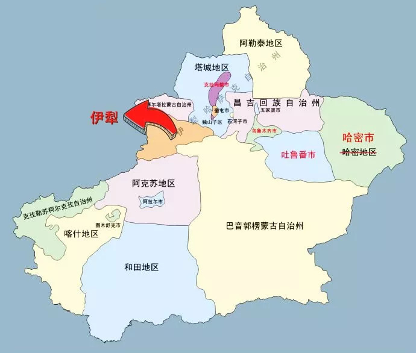

- [晚清沧海事 第二版 下卷 B](#晚清沧海事-第二版-下卷-b)
  - [新疆沦陷（一）](#新疆沦陷一)
  - [新疆沦陷（二）](#新疆沦陷二)
  - [新疆沦陷（三）](#新疆沦陷三)
  - [新疆沦陷（四）](#新疆沦陷四)
  - [新疆沦陷（五）](#新疆沦陷五)
  - [新疆沦陷（六）](#新疆沦陷六)
  - [新疆沦陷（七）](#新疆沦陷七)
  - [新疆沦陷（八）](#新疆沦陷八)
  - [新疆沦陷（九）](#新疆沦陷九)
  - [新疆沦陷（十）](#新疆沦陷十)
  - [新疆沦陷（十一）](#新疆沦陷十一)
  - [新疆沦陷（十二）](#新疆沦陷十二)
  - [新疆沦陷（十三）](#新疆沦陷十三)
  - [群魔乱舞（一）](#群魔乱舞一)
  - [群魔乱舞（二）](#群魔乱舞二)
  - [群魔乱舞（三）](#群魔乱舞三)
  - [群魔乱舞（四）](#群魔乱舞四)
  - [群魔乱舞（五）](#群魔乱舞五)
  - [群魔乱舞（六）](#群魔乱舞六)

# 晚清沧海事 第二版 下卷 B

作者：罗马主义

## 新疆沦陷（一）

“可以保证，我们会在东干人中间找到可靠的朋友。现在他们就已经不止一次的问我:俄国人是不是很快开始与中国人的战争？然后补充说：哪怕是只有100个俄国人到我们这里来，我们就立刻人人奋起反对中国人！’”

俄·普尔热瓦利斯基《我的第四次旅行》

同治元年6月22日，就在白彦虎挑起了陕西穆斯林全面叛乱的同时，俄罗斯的军队也到达了大清的边境，准备发动入侵。

不过这个边境，并不是今天的中哈边境，而是从现在哈萨克斯坦最大的城市阿拉木图，到哈萨克斯坦的巴尔喀什湖一线，哈萨克斯坦最好的地方，离现在的边境很远很远。

那个时候，这里都是大清的疆域，这块土地，大约有40多万平方公里，比法国小点，比德国大一点，接近四川和黑龙江的面积。

那么俄罗斯军队，为什么恰恰在陕西穆斯林发动叛乱的同时，企图入侵大清，这是一个巧合吗？

当然不是，早在1861年，西伯利亚军区参谋康斯坦丁考夫曼，后来的俄罗斯突厥斯坦总督，就已经制定了入侵中国的计划，初步目标是占领整个哈萨克斯坦，然后看形势的发展，再决定是否攻下伊犁，进而控制新疆北部。

那么，俄国人为什么突然决定，要对大清动手了呢？因为他们已经得到了情报，居住在金积堡的新教首领马化龙，已经决定在1862年春夏之交发动叛乱，在西北地区建立伊斯兰国。

早在第2次鸦片战争爆发之前，新教首领马化龙就已经和俄国人搭上了关系，并且帮助俄国人在新疆建立了情报网，双方因此关系密切。

所以这次马化龙传来口信，就是希望俄国人能在他们动手的同时，也能发动对新疆的入侵，牵制驻扎在新疆北部的清军，让他们不能入关平叛，这样穆斯林叛乱分子，就能顺利的占领陕西，甘肃和青海一带。

一旦他们叛乱成功，就隔断了新疆和内地的联系，到时候驻扎在新疆的清军必然孤立无援，俄军就可以轻松的拿下大清所属的哈萨克斯坦地区，双方都会大获成功，收获满满。

所以自然而然，俄国人也对这个合作充满了期望。

而且马化龙还向俄罗斯人保证，一旦他们进攻大清，马化龙将派人在新疆发动叛乱，让清军前后受敌，俄军就可以兵不血刃的拿下整个哈萨克斯坦东部，当时属于大清的疆域。

到时候双方就以伊犁河为界，俄国人就可以拿走大清的40多万平方公里，穆斯林也可以在中国西北建立伊斯兰国，这样就各取所需，两全其美。

双方最后约定，一旦新教教主马化龙在内地动手，就会立刻派人通知俄罗斯驻伊犁的领事，然后俄军就乘机入侵新疆，穆斯林新教徒也会发动叛乱作为内应。

作为交换条件，俄军会对马化龙所属的新教教徒，给予武器和资金资助，帮助他们拿下整个新疆。

收到了这些来自外交部的绝密情报，康斯坦丁考夫曼觉得这确实是一个机会，于是就拟定了一个作战方案，上呈给了当时的俄罗斯战争部长迪米德里·米柳京，获得了他的支持以后，上奏给俄皇亚历山大二世，他也认为这是个机会，所以就立刻批准。

于是，俄军就开始按这个方案准备，他们秘密集结了四路大军，只等中国内地的穆斯林叛乱爆发，他们就发动入侵。

有人会问，你怎么知道这些事的呢？

因为这些就写在康斯坦丁考夫曼的传记里，还有其他一些俄文和英文资料中，这些资料是：

Сушанло М., Дунганскоевосстание второй половины XIX в. и роль в нем Бай Янь-ху, Фрунзе, 1959.  
Думан Л. И., Биянху— вождьдунганского восстания 1862—1877гг., "Записки института востоковедения АНСССР", 1939.  
Константин Петрович фонКауфман ，Сибирскийторгово-промышленный ежегодник. Издание Д. Р. Юнг. Типография «Наш век».Санкт-Петербург. 1912  
Familiar Strangers: AHistory of Muslims inNorthwest China (Studies on Ethnic Groups in China)，Jonathan N. Lipman,University of Washington Press (February 1998)  

不过俄国人对这些穆斯林叛党，到底有没有能力掀起一场暴乱，还是持有怀疑态度的，所以俄国人先派出了一支小部队，到达边境以后，并没有马上动手，他们想先看一看，到底有没有穆斯林极端分子，前来接应。

于是，这支部队就在清军的哨所前驻扎了下来，等待传说中的穆斯林叛军前来会合，那么，他们等到了这些人吗？

说到这里，有读者可能会问，等等，马化龙怎么可能会和俄罗斯人联系得上呢？他们是通过什么途径联系的呢？

不好意思，书里没有记载，不过既然这些情报都是外交部传递过来的，那很可能就是通过俄罗斯在北京的东正教会得到的，因为那是由俄国外交部负责的。

而在北京住了很久的白彦虎，还有齐化门外清真寺的金爷，很可能就是联络人，从后来的历史看，白彦虎和俄罗斯人之间的关系，真是说不清，道不明。

有读者可能又奇怪了，在第2次鸦片战争之前，北京城里怎么会有俄罗斯人的东正教会呢？这事说起来话长。

1685年，康熙在雅克萨击败了俄罗斯远征军，有50多名俄罗斯的哥萨克人投降了清军。

由于哥萨克人作战勇猛，所以得到了康熙大帝的赏识，被他带回了北京，编进了八旗，成为了清军中的一部分，驻地在北京城东北角的胡家圈胡同。

和这些人一起来到北京的，还有一个东正教的神父，专门负责为大家烧香磕头，求神拜佛。

开始的时候，由于没有地方，所以只能在露天做礼拜唱赞歌，引得京城里的人纷纷围观，就像看耍猴一样热闹，还指指点点。

于是俄国人也感到很尴尬，就向康熙大帝请求，能不能给一块地方建教堂。

既然都是自己人了，也不能让大家难堪，所以康熙就给了他们一个当地的关公庙，让他们改成东正教教堂，有个地方遮风挡雨，也免得京城百姓，都以为这帮俄罗斯人，没事在集体卖艺。

这些人在北京结婚生子，几代以后，也学会了侃大山，耍贫嘴，俄语也忘得差不多了，而且由于和中国妇女结婚，长得都不像俄罗斯人了，慢慢的也就被同化了。

有一张八国联军入侵北京的老照片里面，一群大胡子的哥萨克，正和两个正宗的北京人合影，貌似其乐融融，让不明就里的中国人看得云里雾里，其实两人就是俄国人的后代，他们都是老乡，祖上说不定还是亲戚。

说来这些人也挺惨，义和团进入北京以后，杀了他们后代二百多人，理由是他们信洋教，肯定都是汉奸，其实他们本来就是二毛子，信东正教是他们祖上传下来，而且是康熙皇帝亲自批准的，这时他们早就变成了中华民族的一份子。

满清王朝覆灭以后，他们一部分被归入了俄罗斯族，一部分被归入了满族，现在从长相上已经完全分辨不出来了。

那么俄国人是怎么知道他们的呢？原来雅克萨之战后不久，康熙派图理琛去访问俄罗斯，顺路前往在伏尔加流域的蒙古土尔扈特部落，商讨共同对付蒙古准噶尔的事务。

使团在途经俄罗斯人的地盘，和俄罗斯人的交往中，让俄罗斯人得知了这帮人和这个神父的存在。

这事让俄罗斯的东正教会，激动的不得了，因为他们向西传不动教，那里是更牛逼的天主教和新教，看不上他们这些土老帽。

向南就更传不动教，那里是穆斯林的地盘，大家都很极端，动不动就喊打喊杀，随便乱说话是会掉脑袋的。

现在一听到大清这么宽容，于是俄罗斯的东正教会，一下子来了精神，东想西想，产生幻觉，希望在中国把东正教发扬光大。

于是在1700年，在东正教会的强烈要求下，彼得大帝亲自给康熙写信，请求允许派一支东正教传教团，来北京传播东正教。

虽然俄国人没抱多大的希望，但没有想到，康熙非常大度，不像后来那些小鸡肚肠的皇帝，不但没有推三阻四，反而立刻就予以批准。

因此从1715年开始，每隔一段时间，就会有俄罗斯传教士来到北京，负责传教工作。

不过，当时的俄罗斯也很落后，所以这些俄罗斯的传教士，眼高手低，也没什么真本事。

同来自西欧的传教士相比，他们既不掌握什么科学知识，也没有耶稣会教士那么狂热，反而以酗酒和乱搞女人出名，所以名声一直很差。

不过庸人自有庸人福，看着这帮每天研究二锅头比研究圣经还多的家伙，大部分时间都烂醉在街头巷尾的酒鬼，大清的儒家学者们，丝毫不觉得他们有什么威胁，反而觉得他们是一个很好的反面教材，一定要加以保护利用，多多展示，让大家都知道，洋鬼子就是不如我们。

因此虽然在雍正年间，保守势力大反弹，所有那些热心传教的外国传教士，都被赶出了内地，独独只有他们和那些有一技之长的外国传教士，被留了下来，这也算是塞翁失马，焉知祸福吧。

在1807年以前，俄国也不咋样，所以他们派来的这些传教士，除了贪污公款，花天酒地，基本上也不干正事。

可是从1807年以后，俄国人慢慢的开窍了，他们的外交部就开始插手委派传教士的工作，派出的人就不仅仅只是传教士了，同时也是外交人员，而且还负责打听中国内地的消息，担负起了间谍的责任。

而且这些人多才多艺，彻底掌握了中国文化，带来了俄国东方学的兴起，并且能在西方汉学界长期独执牛耳，就是靠这批人打下的基础。

所以，马化龙很可能就是通过在北京齐化门外清真寺的金爷，和俄国人牵上线的，而且白彦虎也久居北京，也应该是这个时候和他们搭上关系的。

可以肯定，是马化龙他们主动去找俄国人的，不然俄国人怎么会知道，在中国的内地，居然有这样一群居心险恶的卖国贼，想和他们建立合作关系！

当然，这些都是推测，不过这也是唯一说得通的解释。

但是我需要指出的一件事是，对清代穆斯林第一本最权威的研究著作，恰好就是这个时代，由俄国驻北京东正教大主教，修士大司祭巴拉第亲自撰写的，题目就叫做《关于中国的伊斯兰教徒》。

他为什么会对中国的穆斯林话题感兴趣？又怎么能把中国的穆斯林问题了解的一清二楚？这可是在清代呀！他甚至连西北都没有去过，住在北京城里，他居然洋洋洒洒地写了好几大本厚厚的学术专著，谁给他提供的资料？想想我前面的推测，这个答案自然也就呼之欲出了。

而且同时代的俄罗斯学者瓦西里耶夫教授，在他的著作《论中国伊斯兰教徒的运动》里，他信誓旦旦的宣称，中国将来可能会成为一个伊斯兰教国家，你不觉得这很奇怪吗？

这怎么看都像是一句疯话，但如果你看过我写的《晚清沧海事》上卷，你就会知道，事实上，他的预言差点成功了，中国有一半的领土几乎就要被分裂出去，变成一个纯粹的伊斯兰国。

在清代，大部分的外国学者都没有注意到，中国内地有很多穆斯林信徒，只有俄国人说出了他们的准确数量，在两千到三千万之间，为什么俄罗斯学者会这么清楚呢？

而且更重要的一点，曾经住在北京的东正教的大主教巴拉第，在他的著作《关于中国的伊斯兰教徒》里，有这样一段话:“毫无疑义，中国叛乱分子（指白彦虎马化龙那帮人）的秘密挑拨行动，希望把活动场所移向中国西部，远离欧洲人的干涉，使用伊斯兰教居民行事，作为实现自己阴谋的工具。”

再加上本文开头所引用的，普尔热瓦利斯基的原文，你就会发现一件非常诡异的事情，在清代，只有俄罗斯人了解中国的穆斯林，这种了解程度，甚至超过了中国的大清政府，为什么我会这么说呢？

因为在普尔热瓦利斯基的中国游记里，他总是能和中国的穆斯林叛军在一起聊天，总是能得到他们的热情接待，这在一个信息极端闭塞，兵荒马乱的年代里，是不是太神奇了一点？

而且更夸张的，他还为他们出主意，他是这样说的:“如果领导叛变的有一个总的领导人，决定推动东干人大众齐心协力越过黄河直捣北京，那么在北京的城墙下，就可能最后解决伊斯兰教国家，在亚洲东部独立存在的问题。”

在那个时代，大部分西方人都搞不清楚西北到底发生了什么事，可是一个俄国的“旅行家”居然知道，叛军内部缺乏统一的指挥，这需要多深的介入？

所以，只是本着学术的严肃性，我说我对关于马化龙和白彦虎在北京勾结俄罗斯人的问题，是一个合理推测，但是事实上，我只要稍微给你展现一下证据链，你就会发现，这几乎就是板上钉钉的事实。

虽然对他们最初的接头方式我们只能推测，但他们随后协助俄国人入侵新疆，那些就都是历史事实了，被俄国人白纸黑字的写在他们的回忆录和历史书里。

所以在这一章里，我讲给你的所有故事，你绝对前所未闻，毕竟这是这段历史在国内的第1次披露，虽然内容看起来很耸人听闻，让你毛骨悚然，但这才是历史的真相。

好了，闲话就说到这里。

那么，俄罗斯人等到了穆斯林的叛军吗？遗憾的是，没有任何人来和他们碰头。

于是，心急的俄罗斯前线军官，就企图自己动手，直接侵占清军的边防哨所，结果没想到，双方一动手，他们反而吃了一点小亏，于是后方就紧急叫停，先派人过来谈判边界的划分问题。

俄罗斯人为什么要和大清谈判边界问题呢？

这要说到1860年的第2次鸦片战争，俄国人乘大清被英法联军打得大败之际，在双方的议和过程中，假装当做调停人，借机为自己牟取利益。

当时的大清内外交困，在北方，京城被洋人占领了，圆明园被英法联军一把火烧了，皇帝逃到了热河，惶惶不可终日。

在南方，清军的江北大营刚刚覆灭，7万多大军灰飞烟灭，就连最能征善战的湘军，也被太平军打得大败，曾国藩一度差点准备自杀。

不久之后，太平天国的名将李秀成又横扫江浙，陈玉成兵临武汉，大清帝国摇摇欲坠，所以急于和英法签订合约，就把希望寄托在俄国人的调停上。

没想到俄国人却不是一个善主，他们趁机连蒙带骗，借机逼大清签下了《中俄北京条约》，把外兴安岭和库页岛还有海参崴全部划走，讹走了中国40多万平方公里，又在新疆三个城市设立领事，获得治外法权。

而且他们还趁人之危，得寸进尺的提出，要重新划定西部边界，把地图规范一下，要按大山和河流的走向来划分，但是具体怎么划，却说的很笼统，没有一个确定的方案。

所以，俄国人本来想趁中国内乱之际，在新疆穆斯林叛匪的帮助之下，先抢占中国一大块土地以后，造成既成事实再来谈。

可是没有想到，他们没有看到穆斯林叛军前来接应，于是就决定先停一停，去找清政府的官员谈一谈再说，顺便看看，到底是怎么回事，穆斯林为什么没有如约发动叛乱？

当然，我们现在都知道，陕西的穆斯林确实如约发动了叛乱，而且占领了陕西的大部分地区，但是新疆为什么没有动起来呢？俄罗斯人为什么没有看到前来接应的穆斯林叛军？马化龙到底有没有派人来呢？

当然有，马化龙派了一个叫妥得璘的人，早在这一年的年初，就已经到达了乌鲁木齐，和隐藏在清军中的内奸，乌鲁木齐提督参将索焕章接上了头，住在了他的家里。

而且他还派人传信给了俄国驻伊犁的领事，通知了他们，暴乱将准时发生。

妥得璘并不是一个人来的，他还带了一个叫做杨春的家伙，以及一群塔利班，早已分布在新疆各地，开始煽动叛乱。

说到这里，有读者可能会有疑问了，塔利班是怎么回事？新疆不都是维吾尔人吗？怎么会有很多信新教的穆斯林呢？

塔利班是阿富汗的普什图语，意思就是伊斯兰教的学生，在中国叫做满拉，在信仰伊斯兰教的地区，清真寺会开一些学院，专门教授年轻人伊斯兰教知识，其中有一些，打着传教的名义，实际上是培养穆斯林极端分子。

年轻人即热血又冲动，所以相对容易被蛊惑，因此是干极端恐怖活动的最佳人选，所以伊斯兰教中的极端派别，就通过宗教学院来培养这些人。

阿富汗的塔利班，当年就是极端宗教势力，通过在难民营中开办宗教学校，培养了一批年轻人，靠他们所组织的军队，获得了政权的。

在中国一度也有很多清真寺，以教授阿拉伯语之名，行培养宗教极端分子之实，不过，现在已经大部分都被政府取缔了，这是非常有远见的。

在清代，新教也秘密开设了很多宗教学院，培养这种年轻的宗教极端分子，所以跟着妥得璘来的，也有很多滿拉，实际上也就是塔利班。

那么新疆为什么会有很多信仰新教的穆斯林呢？

这有两个原因，首先清初的时候，乾隆决定向北疆移民，但是为了不激起当地人的反感，所以开始的时候，限制汉人移民，只选择穆斯林，特别是西北的穆斯林。

这个政策执行了一段时间以后，清朝政府尝到了屯垦的好处，再加上财政压力，才逐步放开汉人移民。

所以最初来到新疆屯垦的，有非常多的内地穆斯林，其中自然会有很多新教徒。

其次是在乾隆年间，新教发动了两次叛乱，有大量的新教徒被流放到了新疆，再到后来，乾隆取缔新教，在内地管理的很严，信教必杀。

不过在新疆，由于山高皇帝远，当时属于塞外苦寒之地，只要愿意来，爱咋咋地，没有什么人管，所以一些新教徒就跑到了新疆，因为在这里，他们可以自由自在的发展。

因此在新疆，内地迁移过来的穆斯林众多，新教的势力是很大的，甚至就连绿营的军队中，也有大量的穆斯林，就像乌鲁木齐提督参将索焕章，也是一个穆斯林，和马化龙早有勾搭，所以妥得璘一来就找到了他，而且把他家作为了活动据点。

可是为什么，他们没有能立刻煽动起叛乱呢？

这有两个原因，首先，新疆北部是清军重兵驻扎之地，绿营只是其中的一小部分，看过我们前面故事的读者都知道，这里还有锡伯营，索伦营等等这些战斗力很强的满洲八旗部队。

除了他们，还有土尔扈特的蒙古人，归附清朝的准噶尔人，哈萨克人以及吉尔吉斯坦人，这些游牧部落都是效忠清朝政府的，平时为民，战时为伍，而且战斗力极强，所有加起来，也有好几万人。

因此，虽然妥得璘在乌鲁木齐极力煽动索焕章发动叛乱，杨春和塔利班们，前往库车和阿克苏一带，挑动穆斯林动手，可是这些人虽然心存异志，却都觉得没有把握，所以也不敢轻举妄动。

除了这些，还有另外一个原因，就是当时的通讯非常落后，虽然妥得璘他们信誓旦旦，说内地的穆斯林已经发动了叛乱，可是这些人却没有听到丝毫的消息，自然也就是将信将疑。

再加上这些人亲眼目睹，清军数次平定南疆的叛乱，每一次在军事上都势如破竹，更是让这些人心存畏惧，所以也就犹犹豫豫，不敢去接应俄军。

而俄军没有得到这些人的接应，也害怕孤军深入哈萨克草原，几百公里长的战线，光是补给就让他们头痛，稍有不慎就会全军覆没，因此也不敢贸然深入，所以就在边境上先停了下来，局势一时陷入了僵局。

虽然清政府对这些密谋一无所知，但是局势看起来并不危险，因为北疆本来就是一座大兵营，无论是俄军还是穆斯林，单独没有人能打的败清军，除非他们能联手，否则就没有任何可能。

但是由于穆斯林方面失约，一时看起来，这种情况好像也不存在了，新疆似乎又度过了一劫，但它真的能有这样的好运吗？

就在这样的气氛下，俄国公使来到了伊犁，开始和清政府谈判，商讨划界问题，不过他们的无理要求都被拒绝，在北京，俄罗斯驻中国大使，也在向总理衙门施压，同样没有达到任何效果。

很快，陕西爆发穆斯林叛乱的消息，传到了新疆，但是俄军还是举棋不定，新疆的穆斯林依然在观望，他们都没有把握，单独击败北疆的清军，毕竟对手有好几万人。

时间很快到了1863年，看起来新疆的上空，虽然阴云密布，不过这场暴风雨，似乎很快就会被风吹散，最终还是有惊无险。

但是，就在这个时候，一个不速之客，秘密拜访了俄罗斯在伊犁的谈判代表，他带来的消息，终于让俄国人觉得吃了一个定心丸。

于是，俄国人向大清发出了最后通牒，在遭到了清朝政府的拒绝以后，俄国人借口穆斯林叛乱，损害了他们的利益，他们必须前往内地干涉，于是就兵分四路，开始进攻大清辖有的哈萨克草原了，不过这并非易事。

清朝的一个边防哨所，齐钦卡伦里，守将邵光看着不期而至的俄军，并不慌张，因为他的城虽然不大，但是却足够坚固，里面驻军也有五六百人，既有大炮，也有火枪，弹药和粮草都很充足。

俄国人远道而来，只能携带小口径火炮，根本就不可能轰开他的城墙，而且他们带来的粮草有限，在这里呆不了多久就必须撤退，因此，只要他守住了这个哨所，俄罗斯人就无法继续向前，所以他很有信心。

不过，俄军前线总指挥格拉希姆·科尔帕科夫斯基，虽然率军包围了清军哨所，但是他并没打算攻城，因为靠他手里的这点资源，这个城是攻不下来，毕竟齐钦卡伦，不是那种小哨所，而是一个坚固的军事堡垒。

但是他也不急，因为他知道，今夜这座城，肯定会落到他的手中，只要拿下了这个哨所，后面就将畅行无阻，而且他的兵力还会迅速的增加，为什么他会这么有把握呢？

## 新疆沦陷（二）

不久之前……

索焕章听完了妥得璘带来的教主的最新指示后，沉默了半响。

他和其他的伊斯兰教徒们不同，他可是政府的高级干部，而且是军功世家出身，世受皇恩。

其父是甘肃提督索文，在西北绿营里，那可是鼎鼎大名的。

靠着父亲的荫蔽，他的仕途，自然也是一路顺风顺水，没有任何军功，却年纪轻轻的，就当上了乌鲁木齐绿营参将，说起来，他也是体制内的受益者，大清可没有任何地方，对不起他的。

但是作为一个穆斯林，特别是新教的狂热信徒，他的理想，却不是为大清建功立业，而是要建立伊斯兰国。

所以，他和妥得璘这样的流浪传教士，二不挂五的社会闲杂人员不一样，他既不为名，也不为利，纯粹是为了狂热的信仰，要推翻大清王朝。

妥得璘看见他双眉紧皱，沉默不语，不由得担心，他是不是放不下荣华富贵，临阵退缩了，可是又不好直接指出，于是就婉转的说道：

“索兄弟，陕西的兄弟们已经动手了，教主也马上就要行动了。

现在箭已在弦上，如果你还不举事的话，到时候清妖调北疆的军队入关，那咱们的大事就难成了，为了千千万万的兄弟们，你可千万不能耽误呀！你必须马上派人去，和俄国人接头呀！”

但是索焕章听完了以后，并不言语，只是从椅子上站了起来，开始在客厅里来回踱步，不知道在想些什么。

看着索焕章不说话，妥得璘不由的有点急，又想再次催促他，但还是忍住了，只是默默的看着索焕章一个人，来回踱步，心中暗自焦急。

又过了一会，索焕章忽然停住了脚步，抬起头来，哼的冷笑了一声，然后面带得意的坐回了椅子上，喝起了茶。

看见索焕章一副高深莫测的样子，妥得璘不知道，他葫芦里究竟卖的是什么药，于是就觉得，不如干脆摊牌算了：“索兄弟，这样，你最后给个说法，到底是干还是不干！”

索焕章微微的笑了一笑，说道：“干！当然要干！但不是现在！”

妥得璘一听，不由的火了，猛的站了起来，正想指责他，但是索焕章却朝他摆摆手，示意他话还没说完。

看见妥得璘气呼呼的又坐了下来，索焕章微微一笑，不慌不忙的拿起了茶碗，呷了一口，又放回了桌子上，然后才慢悠悠的说道：

“现在如果我们跳出去，除了被别人绑上法场，白白丢了性命不说，什么事也办不到，所以不能急！”

“为了安拉而死，那是我们每一个信众的荣耀，我们不怕！最后我们一定会上天堂的！”一听完索焕章的话，妥得璘忽然变得激动了起来。

看着脸红筋胀的妥得璘，索焕章只是微微的笑了一笑，然后沉下了面孔，严肃的说道：“没人怕死，但是耽误了真主的事业，那就是最大的罪孽。”

看见妥得璘还想反驳，索焕章又笑着摆了摆手，再次制止了他，然后接着说道：“我说不急，不是什么事都不做，最关键的一点，就是要把北疆的兵，全部调到边境上去，然后咱们才有机会。”

“那你就快点把兵调过去啊！”妥得璘急忙插口说道。

索焕章忽然哈哈哈的笑了起来，说道：“你高看了我，这兵我可调不动，不要说我了，就是我的上司，乌鲁木齐都统叶布冲额，他也调不动！这调兵的大事，要伊犁将军常清说了才作数，还轮不到我说话。”

“额……”妥得璘听到索焕章这个说法，有点意外，他原以为，索焕章是一个大的不得了的官，可以在官场上一手遮天，没想到他居然还有很多上司。

看见妥得璘惊讶的样子，索焕章并不觉得意外，虽然在教里的地位，妥得璘要比索焕章高的多，可是他对清朝的官场制度，却一点儿也不了解。

“不过你也不用急，如果俄国人攻过来，常清自然会把兵调到边境上去。”索焕章不慌不忙的又举起了茶碗，用盖子刨开上面的叶秣，再呷了一口茶。

“那你就快派人去接应俄国人啊，不然他们怎么敢攻过来呢？！”妥得璘赶紧的催促道。

“没有军令，我若是敢派一个人，离开了我的防区，不出三天，立刻就会被绑送伊犁将军府，我这项上的人头，只怕就要搬家了。”索焕章敲了敲自己的脑门，自嘲的笑了笑。

“这……”妥得璘不由的一时语塞，愣了片刻，然后他一发狠，跺脚说道：“那不行的话，我就带滿拉和这里的兄弟们去，这样总成吧！”

索焕章看着妥得璘，不由的摇了摇头，叹了一口气说道：“你知道卡伦在哪里吗？离这里上千里地之外！先别说你们要走多久了，单说你带着一群种地人，携带凶器，成群结队的跑到草原上去，你觉得被戍边的官兵们看见了，他们会怎么对付你们？”

“那……”妥得璘再次涨红了脸，急的一头都是汗，却什么也说不出来。

看着妥得璘的一脸窘态，索焕章微微觉得有点满意，但考虑到他是马化龙的代表，他决定不再折磨妥得璘了，于是就对他说：

“办法我是有的，但是急不得，只需……”

昏暗的烛火下，两个人开始了窃窃私语……

——

一个国家的战略目标，到底是不是让自己受益？好多当局者，其实也未必搞得清楚，自己给自己挖坑，是很多国家，经常都在干的事情。

俄国就是一个例子，由于价值观的原因，它在法国大革命以后，立刻加入了反法同盟，成了反法急先锋，变成了拿破仑最头痛的一个对手，最后自己，也成了拿破仑的重点打击对象。

这个时候的俄国，工业刚刚有了萌芽，但是却因为刚起步，生产出来的产品，难免质次价高，而英国人在这个时候，已经完成了工业革命，蒸汽机被大量的推广使用，生产的产品，价廉物美，在欧洲市场上，横扫所有的对手。

在这样强悍的对手面前，俄国的工厂主们，还是小规模的手工业生产，哪里是早已使用了机器，进行大规模生产的英国人的对手？

所以俄国的企业，只能为生存苦苦挣扎，根本谈不上什么发展了，因此一直在低水平徘徊。

但是拿破仑上台以后，为了打击英国，保护本国的工业，开始在欧洲大陆，实行大陆封锁政策，不让英国的产品，进入欧洲。

虽然这个政策，在拿破仑下台以后，就被废止了，可是却给了俄国人机会。

就是在这短短的，不到十年的时间里，俄国的企业，一下子没了对手，终于有了咸鱼翻身的机会，迅速的发展壮大起来，国家也终于开始了现代化进程。

可是好景不长，没有多久，拿破仑终于被打败，欧洲的大陆再次开放，英国的产品，又像潮水一样涌了进来，俄国的企业，再次陷入了艰难的境地，直接被英国人，从欧洲市场挤了出去。

而造成这个局面，导致拿破仑下台的最大功臣，恰恰就是俄国人自己，可以说，这是一个典型的南辕北辙的故事。

那么，既然在西欧和中欧都站不住脚，俄国人也总得找出路吧，于是他们就把目光，投向土耳其和它控制下的巴尔干和中东地区，俄国的工业，于是再次得到了发展。

可是由于俄国是专制社会，皇权和新兴资本家之间的目的，是不一样的。

一个要的是土地，一个要的是市场，没有过多久，沙皇的手又痒痒了，开始不断的暴揍土耳其人。

土耳其人倒是被俄国人揍得遍体鳞伤，俄国人也得到了大片的土地，但是市场也跟着就丢失了。

因为俄国人没有想到，被他们打残了的土耳其，在别人的眼里，自然也是一个懦夫，大家都想来捏下软柿子，所以无意之中，俄国人又给别人，做了嫁衣裳。

英法趁土耳其，被俄国人打得灰头土脸之际，强迫土耳其开放市场，结果导致俄国的产品，又被从这些地方挤了出来。

由于连续的干蠢事，导致工业革命后，欧洲最黄金的这段发展时间里，俄国却一再错失发展良机，它的发展速度，始终比不上西欧，慢慢的就被对方拉开了距离。

不过俄国也有一个好处，那就是地方大，西方不亮东方亮，俄国的工业产品，虽然在中东和欧洲没有了市场，可是却在中亚打开了销路，到了张格尔发动叛乱的时候，俄国工业制成品的2/3，都销往了中亚市场。

可是接下来，俄国人又干了蠢事，开始对中亚三个汗国虎视眈眈，就是希瓦，布哈拉和浩罕，大致就是今天中亚五国这块地方，结果，导致这三国全去找英国做靠山。

英国人很简单，找我做靠山可以，但是必须向我开放市场，于是质优价廉的英国产品，又迅速涌向了中亚，抢占了俄国人的大量份额，让俄国的工业界，再次叫苦连天。

由于俄国到了这个时候，已经有了9000多家企业，40多万产业工人了，税收贡献，在国家财政中的比例，急剧上升，所以沙皇再也不能像以前一样，一点都不考虑他们的利益了。

这一次，沙皇和俄国资本家们，终于达成了一致，眼看最后这块海外市场，也要守不住了，干脆买卖不成拳头在，下决心把这几块地方都拿下来，变成自家院子，不带英国人玩了。

所以从19世纪50年代开始，俄国人就开始对中亚三国动手，之所以是这个时间，还有一个原因，就是俄国人的铁路，现在也修到了中亚附近，终于解决了后勤问题，让他们有能力，打这些国家的主意了，首当其冲的，就是浩罕。

不过刚开始的时候，俄国人的进展并不顺利，因为浩罕在和俄国交界的锡尔河流域上，修建了一系列的军事堡垒，虽然俄国人费尽九牛二虎之力，用了几年的时间，一个一个都把他们攻了下来，但是一直到了1861年，俄国人才勉强控制了整个锡尔河流域。

如果按照这个进展速度，要想拿下中亚三国，真不知道要到猴年马月的了。

而且俄国人在这里的统治还非常不稳，浩罕不断用圣战的名义，号召哈萨克斯坦草原上，信奉伊斯兰教的游牧民族起义，这些人不停的袭扰俄国人的据点，更是让俄国人头痛不已。

更让俄国人心烦的是，他们很难消灭这些游牧民族，将他们斩草除根，因为一旦他们遇到威胁，就会退到大清控制的哈萨克草原里来，因为大清允许他们在这里游牧，只要每次进出，上交1%的牲畜就可以。

所以拿下整个哈萨克草原，断绝游牧民族的退路，同时也能从侧翼进攻浩罕，开辟新的战线，就成了这场战争，能不能快速取得胜利的关键。

于是，俄国人就决定暂时放一放浩罕，先向大清动手。

当然，这个想法，俄国人并不是今天才有的，他们早就有这个打算了，不过和大清在哈萨克斯坦打一仗，那也不是闹着玩的事，大清可比浩罕强多了，俄国人真是一点把握也没有。

所以俄国人虽然心怀鬼胎，但是一直也没有敢实施，还是在锡尔河流域，继续和浩罕人苦战，直到新教教主马化龙找上门来，终于让他们看到了机会，于是他们决定转攻大清了。

现在俄国人兵分4路，攻入了大清所属的哈萨克斯坦草原。听起来声势浩大，但实际上只有二千来人，每路只有几百人。

单纯从军事上来说，仅靠这点人，要想彻底打败驻防新疆的清军，纯属是天方夜谭！除非有人暗中相助。

所以，等在齐钦卡伦外的俄军指挥官，看着夜色中的城堡，心里也是忐忑不安，他知道，能不能兵不血刃的拿下这个军事要塞，是这次冒险的关键，但是，这个城门真的会自己打开吗？

……

几个月前……

伊犁将军爱新觉罗.常清，皇上的亲戚，这段时间也焦头烂额。由于陕甘发生了穆斯林叛乱，新疆和内地之间的通道被切断，所以内地的协饷，已经很久都没有送来了。

府库里的银子，现在是花一个少一个，如果协饷再不送来，他就要唱空城计了，这一但没钱了，发不出工资来，到时候肯定会出乱子，他该怎么办呢？！常清越想越心烦。

这还不说，更让他头痛的事，俄国派来勘界的公使，提出了种种无理要求，逼着他把伊犁河外的，几乎所有的哈萨克草原，都割让给俄罗斯，这他就是有几个脑袋，也不敢答应啊！

让他又气又恼的还有，俄国公使动不动就拿出兵做威胁，他也拿不准，对方只是在讹他，还是真的就要蛮干。

不仅仅如此，俄国人还在边境上生事，边境上的守将，已经几次来信报告，说是俄国人打骂清军巡边的士兵，不断的挑衅生事。

边境上的守将，不断的要求他增兵，可是向边境增兵，又涉及到花钱，而他现在最缺的就是钱。

这天，他刚刚和俄国人谈完，又被俄国人恐吓了一番，正感到憋屈的不得了，所以一个人坐在府邸里，暗自生闷气，忽然师爷来报，说是乌鲁木齐绿营参将索焕章求见。

“他来干嘛？不见不见，有啥事给你说就行了。”常清这时正心情郁闷，不耐烦的挥了挥手，叫师爷打发他走。

可是师爷却没有动身，反而陪着笑说道：“大人，他好像给您老人家带了不少礼物来，要不您还是见一见吧。”

常清听到这么一说，不由得来了一点兴趣，瞟了一眼师爷，忽然想起了，最近好像有一个官职空缺，于是就差不多猜到了索焕章的来意。

常清的嘴里忍不住哼了一声，然后轻描淡写的说道：“这小子还能有什么事呢？未立寸功，能做到今天这个位置，还不是全靠他老子的照应！难道他还想往上爬？”

然后他故作轻蔑的摇了摇头，叹了一口气说道：“看在他老子的面子上，就让他进来请个安吧。”

于是索焕章就被招了进来，自然他立刻就来了一番阿谀奉承，然后又献上了礼物，有上好的俄国貂皮，西洋来的自鸣钟，当然，也少不了大把的银子了。

看着上好的礼物，听着顺耳的言语，常清的心情顿时好了很多，于是就让索焕章坐下慢聊。

东拉西扯以后，很快就到了问题的关键，索焕章终于提到了那个空缺的职务，常清一听，微微一笑，果然不出他所料，真是无事不登三宝殿。

看在这厚重的礼物份上，常清心想，这个职务无关紧要，给他也无妨，但是话不能说得那么容易，于是常清就说：

“哎呀，索大人，虽然你这个人很实诚，可是生不逢时，没机会立功，到现在也没有什么拿得出手的政绩，让我很难服众呀。”

索焕章一听，立刻一脸谄笑的说道：“大人所说甚是，小的也一心想要报效朝廷，可是苦无机会呀。”

然后他话锋一转，接着又说道：“不过大人，这次俄夷犯境，小的也想略尽薄力，为朝廷分点忧，解点难，不知道大人能不能给在下一个机会。”

常清一听，立刻来了兴趣，于是就说道：“那你就说来听听。”

于是索焕章立刻离座，站在常清面前一拱手，行了一个礼，说道：“谢谢大人。”

常清挥了挥手，示意他不必客气，然后他赶紧回到座上，屁股微微挨在椅子上，弓着上身，接着说道：

“大人，小的听说，这次划界谈判中，俄夷非常的猖狂，动不动就威胁兵戎相见，此等跳梁小丑，就是尽发他们全国的大军，也不是将军您的对手，只会碰得头破血流而已。”

常清听到这里，虽然心里知道，这不过是奉承之语，但还是满心欢喜，他撸了撸胡须，面带笑意的点了点头。

于是索焕章接着又说道：“但是明枪易躲，暗箭难防，小的担心，俄夷蹑于大将军的威名，很可能会搞一些阴谋诡计，特别是暗中偷袭，咱们边境上的卡伦。”

“现在边境上的卡伦，人手不足，可是如果派兵增援的话，今年陕甘生乱，协饷又没有及时送来，不发赏银，小得担心，士兵会不愿前往，甚至趁机闹事。”

常清一听到这里，完全说到他心里去了，于是就对索焕章说：“那你有什么妙计吗？”

索焕章立刻媚笑道：“小的能有什么妙计，一切都听大将军决断。不过小的空食国家俸禄多年，寸功未立，所以一直诚惶诚恐。

这次听说国家有难，小的到是有一群乡党，愿意自筹路费，前往边境哨所，帮助守边，以壮声威，让那俄夷不敢轻举妄动，不知大人意下如何？”

常清一听，顿时喜出望外，这可是帮了他大忙了，可是转念一想，这小子会不会拿着鸡毛当令箭，趁机搜刮，强行摊派，闹出些事端来呢？

看见常清有点犹豫，索焕章又急忙补充道：“大人请放心，这群乡党，全是在下的族人家丁，全部系自愿，绝不会强人所难，所有的费用，小人愿意资助，不以朝廷的名义调动派遣，绝不会惊动四方的百姓，如有半点不实，请大人治小人的罪。”

就在这个时候，师爷忽然慌慌张张的进来，拿了一份文书给常清，常清一看，原来又是边境上的一份求援的文书，说是俄国人越境扣留了清军13个巡边的士兵。

后来经过边境将领的交涉，虽然把人放了回来，却把马和武器全都抢走了，所以边境守将，再次请求增援。

常清看完，不由得叹了一口气，然后盯着索焕章，看了良久以后说道：

“你一心报国，这是一个好事，但是绝对不可以借机敛财，强行摊派，必须是自愿前往！若是做得好，我就会向朝廷保荐你，担任这个职务，若是闹出了乱子，那我可就唯你是问。”

索焕章赶紧发誓赌咒，保证把这件事办好，于是常清就批准了他的建议……

——

齐钦卡伦里，守将邵光仔细检查完了所有的防务，他要确保万无一失，因为他这个哨所里，本来只有100多个常驻士兵，面对俄军骚扰，他多次请求增援，却一直没有结果。

可是不久之前，后面却突然派了300多个自愿戍边的乡勇，前来增援。

这些人不仅仅带来了补给，而且对他毕恭毕敬，唯命是从，很快就被他训练得有模有样，让他喜出望外。

所以，邵光虽然被几百名俄军包围，心里却一点儿也不慌张。

这天，吃过晚饭以后，天渐渐的黑了下来，邵光决定再去城头上巡视一圈，特别是要去，新来的那些人，防守的地方，仔细检查一下，再叮嘱他们一些注意事项。

邵光沿着城墙，走到了这些人聚集的地方，正要对他们训话，可是他忽然觉得有点奇怪，怎么有几个人，竟然站到了他的背后去了呢？

就在他诧异之际，后背突然传来了一阵钻心的疼痛，一把刀已经插进了他的身体……

——

天已经黑了下来，俄军的指挥官瓦西里·谢罗夫，正躲在远处，观察着清军的城堡，一轮圆月挂在了半空中，草原上寂静的不得了。

突然，他听到城上传来了凄厉的惨叫声，接着又看到有人被从城上推了下来，然后就传出了一阵阵的喊杀声，兵器的撞击声，还有火枪的射击声，小城突然像炸开了锅一样，喧闹异常……

但是厮杀声并没有持续很久，很快，小城又陷入了平静，接着，城门在吱吱嘎嘎声中被打开了，有人在向他晃动火把……

## 新疆沦陷（三）

几个月以前……

额科托卡伦的守将杨继，目送着第四批自愿戍边的穆斯林离开以后，心里总觉得怪怪的。

额科托卡伦，是一个很大的边境哨所，或者说是边境堡垒也可以，位于齐钦卡伦，鄂尔果珠勒卡伦和格根卡伦等等，这些一线哨所的背后，是一个肩负纵深防御的哨所，兼具中转站的作用。

当第一批自愿戍边的穆斯林路过的时候，杨继很感动，他没有想到，当今天下，居然还有这样的义士！但是第二批到来的时候，他就有点诧异了，怎么好人这么多？

当第3批，第4批自愿戍边的穆斯林，路过的时候，杨继就觉得这事有点不对劲了，但又说不上，到底是哪里不对劲。

杨继觉得，这个世界上，有一个雷锋是正常的事，如果有十个雷锋，那是这个时代的造化，可是如果同时出现一千个雷锋的话，这事一定有问题。

现在陆陆续续的，居然有上千名志愿戍边的穆斯林，不图名，不图利，冒着掉脑袋的危险，分别前往前线各个极端艰苦的要塞，他们到底图什么呢？

几个月来，杨继的脑子里，一直在琢磨这件事，但是他确实想不清楚，难道这中间，有什么他不知道的油水吗，或者在这混一圈回去以后，他们能得到什么更大的好处吗？

几个月以后……

1863年7月初的一天，杨继正在城里清点库房，突然听到城墙上有人吹响了号角，于是赶紧三步并作两步，匆匆地登上了城墙。

一上了城墙，杨继就看见，从齐钦卡伦方向，有一队骑兵正在飞速的向这里疾驰，后面很远的地方，也有尘土飞扬，似乎还有追兵。

于是杨继立刻下令，鸣锣备战，在锣声的催促下，士兵们纷纷各就各位，做好了战斗准备，额科托卡伦驻有军民六百多人，所以战斗实力很强。

等到这队骑兵靠近了以后，杨继发现，他们原来是清军，于是就准许他们进城，这些人带来了一个噩耗，齐钦卡伦陷落了，所有的人都战死了，他们是侥幸苦战逃出来的。

看着这些风尘仆仆，一身是血的士兵，杨继忽然觉得，他们似乎很面熟，但是一时又想不起来了，是在哪儿见过他们！

问完了齐钦卡伦失陷的经过以后，他立刻安排这些人，先吃顿饱饭，然后再去休息休息，到时候听他吩咐。

安顿好了这些人以后，杨继立刻派人传信给伊犁将军常清，通知他俄军入侵的消息。

然后他就开始上城布防，看着城上部署的差不多了，他又下来巡视城门的防守。

当他检查完城门的状况后，满意的准备离开时，一回头，突然发现，刚才从齐钦卡伦逃回来的那十几个人，正挡在了他的面前……

……

根据康斯坦丁·考夫曼的计划，俄国将总计动员第42，57步兵师，以及第2奥伦堡哥萨克骑兵师，第7哈萨克骑兵师，还有下属的41个独立营，第22丶37丶39丶56炮兵旅，72个独立侦察连，共26,000人左右的军队，分四路发动入侵。

不过由于后勤问题，以及拿不准，到底能不能得到穆斯林叛军的支持，所以俄军一开始的时候，只派出了2000多人，进行试探性进攻。

为什么俄国人只派了这么少的人来试探呢？因为在1862年的首次入侵中，由于穆斯林未按约定出现，俄军单独迎击清军，都吃了小亏。

1862年6月22日，鄂尔果珠勒把总文良，率领驻军反击俄国入侵者，斩杀数十人，击退了俄军的入侵，一度追入俄罗斯境内。

1862年10月20日，俄国军队入侵齐钦卡伦，掠夺附近村庄的人畜财物，守将邵光发兵突袭，杀俄兵43人，把他们的尸体，全部都悬挂在，通往俄罗斯边境的路上。

所以在1863年2月17日，俄国驻大清全权大使，尼古拉·伊格那提耶夫，在北京对当时主政的恭亲王奕訢，控诉清军这些“暴行”，强烈要求严惩擅杀俄兵的清军将士，同时应该大笔的赔钱。

不过在那个弱肉强食的时代，没人把战败者，当成一回事。

恭亲王奕訢一听，哟！原来你们俄国人这么不能打，那对不起，你什么要求，我都不能答应你，所以在边境谈判中，否定了他的一切要求。

气的俄国大使，只能留下了一堆，诸如“你给我等着，有种别跑，老子找人去！”“晚上你给我小心点，有人会砸你家窗户”之类的狠话，别无办法。

除此之外，还有一个，同样让俄国人很谨慎的原因是，俄国人的军事技术，相比于英国人和法国人，是要落后很多的，对大清并没有碾压优势。

虽然早在彼得大帝的时候，俄国人就建立了兵工厂，可是到了现在，还是缺乏设计能力，所有的主战武器，都是仿制品，而且质量低劣。

到了这个时候，俄国住西伯利亚的军队中，大部分还装备着前膛M1844燧发滑膛枪，仿法国沙勒维尔1777式，是拿破仑时代的老古董。

只有一部分军队，装备了M1861来复枪，不过，那也是美国人帮助生产设计的。

而清军到了这个时候，在边境上的大部分部队，虽然依然使用的是老式的火绳枪，但是也有一些精锐部队，装备了英国人的恩菲尔德M1853式步枪和米尼弹。

所以，俄军虽然有火力优势，但是远远没有达到，英法军队那种压倒性的优势。

不久之前，在克里米亚战争中，他们和英法军队作战的时候，由于武器落后，更多的也是靠的白刃战，而清军恰恰不怕白刃战。

其次，俄军的火炮也不是很强，俄军主要使用的是18磅的格尔尼科夫滑膛炮攻城，这种炮虽然口径比较大，但是由于俄国人的冶金技术落后，所以非常的笨重。

再加上火药配方也不如英法科学，所以攻城的时候，威力并不是很大，通常需要，花上百颗实心炮弹，才能轰塌城墙。

由于体型巨大，再加上需要的炮弹众多，所以运输极其困难，严重影响军队的行进速度，因此能发挥的作用，也很有限。

所以，摆在俄军面前的问题是，它要攻克清政府在边境设置的十几座卡伦，如果没有足够数量的大口径火炮，基本上就只能采用云梯或者坑道战术，那不知道要死多少人，才能攻下一座卡伦。

而如果要带着大量的大炮的话，军队的行进速度，就会慢的像蜗牛。这可是一块和四川差不多大的土地，人烟稀少，基本没路。

在从一座卡伦，到另一座卡伦之间的遥远路程，以及等待大炮轰倒城墙的日子里，士兵还是要吃饭的，炮弹也是需要运送的，因此后勤压力很大。

而且如果攻城的速度太慢，清军听到了消息，就会派出援军，到时候，清军就会以这些卡伦为依托，和俄军开展野战，所以带炮也不一定必胜。

因此，要实现康斯坦丁考夫曼的计划，最好的办法，就是要有内应，不战拿下这些卡伦，然后才可以调集大军，带上大炮，迅速的向塔尔巴哈台和伊犁进军，这样后勤上才能有保障。

所以一切的关键，就是有没有人帮助俄军，打开卡伦的大门。

但是这一次，穆斯林没有食言，俄军走到哪里，哪里的卡伦就打开了大门，齐钦，格根，鄂尔果珠乐等等一系列卡伦，纷纷被穆斯林叛军拿下，献给了俄国人。

当前线实际总指挥，格拉希姆·科尔帕科夫斯基，收到了这些消息以后，大喜过望，立刻增派了一万多人，分别支援，正在向前运动中的四路先锋，这样，侵入中国境内的俄军，就达到了1万多人了。

现在，“拿下”了齐钦卡伦的瓦西里.谢罗夫，和“拿下”了格根卡伦的尼古拉·威里夫金，两支部队在额科托卡伦下会师了。

在他们的队伍里，还有数百名穆斯林叛军，不过为了不被额科托卡伦里的敌人发现，全都藏在远处，与此同时，还有一支俄军4000人的后援部队，也在赶往这里。

不过，他们估计，自己最多只会在这里，呆上一两天，因为穆斯林的叛匪，已经化装成败兵，成功的渗入了额科托卡伦里，按照约定，等俄军围城以后，他们就会伺机打开城门，到时候俄军一拥而入，就可以结束战斗了。

……

杨继刚刚检查完城门的状况，猛地一回头，突然看见，那十几个才逃出来的清军，全挡在了自己的面前，把自己堵在了阴森森的城门洞里，吓了他一跳，于是，他下意识的抓紧了腰间的刀柄。

不过，这些人似乎并没有恶意，他们只是前来请求，帮助守城而已，比如把守眼前的这个城门之类的，好让他们有机会杀敌报仇。

听到他们这么一说，杨继这才松了一口气，手悄悄的从刀柄上滑了下来，于是就立刻一口答应，把这些人，安排在这个城门，担任守卫了。

……

如果我们看地图的话，我们会发现，俄军这次进攻的方向，更靠近外蒙古，当时也是中国的领土，所以乌里雅苏台将军明谊，第一个得到了俄军入侵的消息，立刻开始向朝廷汇报。

不久之后，巴里坤领队大臣讷尔济，乌鲁木齐都统额宸也得到了消息，纷纷向朝廷奏报，那么伊犁将军常清，他得到消息了吗？

当然得到了，但是他却向朝廷奏报，只是俄人骚扰而已，并不严重。

常清之所以谎报军情，是因为害怕朝廷怪罪他，在和俄国人的勘界谈判中，处置不利，挑起了战火。

再加上根据他得到的消息，似乎入侵的俄军人数并不是很多，好像只有几百人，而且他也不知道，穆斯林已经跟俄国人勾结在一起了。

所以在他看来，也许只是一场小规模的侵扰而已，因此他准备自己解决。

于是，他亲自带着一支几千人的部队，主要由锡伯索伦和准噶尔骑兵组成，前去收复这些失陷的卡伦，先从最南边的鄂尔果珠勒卡伦开始。

不过，他并不知道，俄军现在已经开始发动全面进攻了，在这个方向上，新派上来了3000多名援兵，正携带着18磅格尔尼科夫滑膛炮，先进的M1861步枪，前往支援迪米德里·诺曼诺韦斯基率领的南路军，此时，他们正在前往铁克力方向。

……

索府里，妥得璘兴冲冲的对索焕章说：“前面送消息来了，我们和俄国人联系上了，现在已经帮助他们，拿下四座卡伦了，听说常清也准备要带兵出征了。

索兄弟，这次全靠你的妙计，终于这俄国人攻进来了，清妖也要调兵到边境上去了，你可是居功至伟啊！

那么，咱们是不是也该趁虚而入，抓紧举事了？”

“杨春那边怎么样了？”索焕章没有直接回答妥得璘的问题，反而问起了杨春的行踪。

“黑头缠回（黑山派维吾尔人）同意和我们联手，但是不愿意尊教主为王，非要推自己的和卓为王，让我们听他们的，现在正僵着呢。”妥得璘说道。

“鄂对家族绝不会反清，这群黑头缠回，不知道在想什么！”索焕章轻蔑的笑了一笑。

妥得璘听了，微微的愣了一下，然后他突然想到，这谈话好像偏离主题了，于是他说道：“索兄弟，库车那边你不用担心，阿克苏和奇台我们也安排好了，伊犁的兄弟随时都在等我们的号召了，但是咱们什么时候动手？”

“现在还太早。”索焕章摇了摇头说道：“你想过没有？万一常清把俄国人打败了怎么办？我们现在动手，他以得胜之军回师，你想过后果吗？”

“这怎么可能？”妥得璘听到了索焕章这句话，不由的有点意外，接着说道：“俄国人洋枪洋炮，威猛无比，我听前面的兄弟说，他们正在往这里增兵”。

然后他又非常有把握的说道：“常清那个纨绔子弟，只知道贪污受贿，怎么可能打的过俄国人？！”

“洋枪洋炮？”索焕章鄙夷的笑了笑：“俄国人不是英夷，而且在草原上打仗，关键是骑兵。俄夷的哥萨克骑兵，未必打得过锡伯索伦。

再说，就算常清不行，但是他手下还有很多宿将，会帮他出谋划策的，所以胜负很难讲。

而且巴里坤的清军，讷尔济的人还没有调开，他们战斗力也很强，再加上不久之前，还买了很多洋枪，咱们现在动手，他们一旦来援，咱们也没有把握打得过他们。

所以，我们必须确保常清战败，让他把所有的人都调过去。”

“哦……”妥得璘听完索焕章的说法，不由的也有点忧虑，于是追问道：“那咱们该怎么办？”

“那就让常清彻底打个大败仗！”索焕章恶狠狠的对妥得璘说道，然后伏在他耳边，窃窃私语道：“你让……”

听罢索焕章的计谋，妥得璘恍然大悟……

……

常清带领着五千多锡伯索伦和准噶尔营的骑兵，离开了伊犁，一路风驰电掣，迅速的逼近了额尔果珠勒卡伦。

不过前锋在攻打敌军的时候，吃了点小亏，发现敌军不是几百人，而是已经变成了3000多人，枪炮好像和以前也不一样了，火力极猛。

这让常清有点儿惊讶，原来俄国人不是骚扰，而是全面入侵，于是他赶紧召开军事会议，和手下商量对策。

根据前锋传回来的信息，俄军的枪炮，虽然比以前凶猛了很多，但是大部分都是步兵，骑兵好像并不是很多。

于是就有将领提议，我们假装战败，把俄军诱离坚固设防的卡伦，让他们到草原上来，我们再和他们决战。

等到敌人布阵以后，我们不硬攻，只是在两翼骚扰，引诱对方的骑兵出战，如果对方接战，我们就把他们引离对方的主阵，让他们失去步兵的支援，利用数量优势消灭对方。

如果对方不出战，我们就分兵绕到敌人的后方去，袭击他们的后队，断绝粮道和补给，让他们进退两难。

等到对方难以首尾兼顾之时，必然分兵应付，我们就可以乘俄夷步兵队形混乱之际，再伺机发动猛攻，必可大获全胜。

常清一听，觉得很有道理，心想，俄军既然是以步兵为主，虽然枪炮甚猛，但是也必须要布成阵列才有用。

若是消灭了他们的骑兵，剩下的步兵移动缓慢，又要保持队形，我们总有机会能干掉他们，若是对方的骑兵不上当，那我们就耗死他们。

想到这里，常清不由得豪气冲天，心想，此役若是能大破俄军，自己必然会名垂青史，和卫青霍去病比肩。

于是，常清就批准了这个作战方案，准备把俄军诱往杜念子堡附近，进行决战，反正能打就打，不能打就撤。

在这几百公里的草原上，虽然有很多星星点点的村庄集市，但都是些芝麻大小的地方，也没有什么地方，是非守不可的，因此，这个战术，总是没有输的道理。

常清越想越高兴，就在这个时候，忽然有哨兵来报，说是有千余名附近的穆斯林，听说官军要打击俄夷，就自备战马武器，前来助战，首领正在等着召见。

常清听罢，顿时喜出望外，这可是雪中送炭，天上掉馅饼啊！于是他觉得自己击败俄军的把握，又大了几分，立刻让哨兵，把穆斯林首领带进来说话……

……

瓦西里.谢罗夫和尼古拉.威里夫金，包围了额科托卡伦，也准备好了突击队，只等夜幕降临，穆斯林打开城门之际，就发动决定性的攻击。

天渐渐的黑了，草原上的天空，少见的布满了乌云，笼罩着小山上的孤城，有几分异样的美。

不过瓦西里.谢罗夫对此毫不在意，他只是专注的盯着额科托卡伦的城墙上，等着那个关键的时刻。

夜半的时候，有一个灯光，按照约定的信号，闪了几下，瓦西里.谢罗夫看到以后，嘴角露出了一丝狞笑，他一挥手，俄军的突击队，迅速悄悄地向那个城门靠近了……

## 新疆沦陷（四）

乌里雅苏台将军明谊，是大清俄罗斯问题的专家，这到不是说他对俄罗斯有多了解，而是因为他和俄罗斯人打交道最多。

明谊出生在蒙古八旗的一个官宦世家里，也算是当地的一个显贵，不过他走入仕途，却不是靠托关系走后门，而是凭着自己的本事，这在蒙古人贵族中，也是不多见的。

他是堂堂正正的科举出身，作为一个蒙古人，居然考了一个二甲进士，还真是有点不简单，而且他当官的地点也很有意思，分别在中国的最西和最南。

作为一个北方人，他第一次担任重要职位，居然是在海南省，当然，那个时候，海南还只是一个市级单位，所以他的官职，叫做琼州知府。

不知道一个生在冰天雪地里的蒙古人，突然来到了酷热难耐的海南岛，是一个什么样的感受？

不过，他这个北方人，在海南干的还挺好，最大的贡献就是，修订了海南的地方志，说起来，也算是一个重大的文化成果。

明谊这个人，做官的名声不错，算是一个清官，而且也是一个能吏。在历次平定南疆的叛乱中，他主要负责后勤补给，工作干得井井有条，所以深得朝廷的赏识。

他第一次和俄国人打交道，是在1858年，当年，新疆发生了一件大事。

在中俄边境上淘金的中国淘金者，和俄国人发生了严重冲突。

事情最初发生在1855年，当时中国的淘金者，在边境上发现了一个金矿，引起了俄国人的眼红，就想据为己有。

当时双方虽然有边境，但是并不明确，而且受技术手段的限制，地图和实际差别很大。

当时的情况是，大的地方双方有共识，可是具体到了一个小地点，特别是人烟罕至的地点，大家就各说各话了。

而这个金矿，恰恰就在这样一个地点，因此俄国人就借机发难。

他们说，中国淘金者是越界淘金，所以必须离开。但是中国淘金者认为，自己是在中国境内淘金，不肯离去。

最后俄国人派兵驱赶，双方发生了冲突，有数名中国淘金者被对方枪杀。

吃了亏的中国淘金者，立刻聚集了五六百人，前往塔尔巴哈台，请求政府保护，帮助他们夺回淘金地。

当时的塔尔巴哈台参赞大臣英秀，听到了这个消息，立刻头大如斗。按理说，他应该出兵去帮助中国淘金者，可是实际上，当时他根本就做不到。

为什么他做不到呢？因为在一年前，太平军攻入了河北，京师告急，清军在外蒙和新疆的精锐，全部被僧格林沁调去，阻挡北伐的太平军。

这个时候，能打的部队，都在河北境内，南方都快丢完了，京师也不知道能不能守得住，谁还有心思关心，千里之外发生的一个金矿之争？！

所以塔尔巴哈台参赞大臣英秀，自然心知肚明，朝廷不可能准许他，在这个帝国风雨飘摇的时候，派兵去和俄国人叫板。

可是不派兵，这事就没法解决，所以塔尔巴哈台参赞大臣英秀，干脆就做了缩头乌龟，说这事不归朝廷管，让老百姓自己去和俄国人谈。

老百姓一听，什么？你不管？！让我们自己解决？！那简单，一把火就把俄国人在塔尔巴哈台的商站给烧了，然后又把东西抢了一个精光。

不让我们淘金，我们也不让你们做生意。

这一下事情就闹大了，现在不光是淘金的人闹事，俄国人也找上门来了。

由于塔尔巴哈台参赞大臣英秀处置不当，结果让清政府成了风箱里的老鼠，两头受气。

烧了俄国人的房子，抢了俄国人的钱，俄国人当然不干了，因此威胁要派兵报复，所以英秀一听，害怕了，赶紧给朝廷上奏，要求派兵支援，防范俄罗斯人可能的入侵。

可是咸丰皇帝一听，立刻就火了。

虽然这个时候，僧格林沁刚刚在河北打败了北伐的太平军，可是江南的清军却连吃败仗，英法又在广州闹事，军舰都开到了天津来了。

这火都烧到眉毛上来了，你居然还叫嚷着要从内地增兵，准备和俄国人开战，你是嫌皇上死的不够快吗？

所以，英秀立刻就被撤职，咸丰皇帝另外找能人，去把这事抹平。

而且这个代替英秀的人，只能有一个选择，那就是尽快的和谈，越快越好，免得事件升级。

当然，最后的结果，也不能太吃亏，否则，皇上也是不接受的。

明谊就是在这个情况下出场的，说实话，这个差事真不好干，横竖都是罪人。

首先，中国的淘金者把俄国人的商站给烧了，你总得赔吧？可是赔多少合适呢？俄国人狮子大开口，要中国赔25万两，这明显是敲竹杠。

而另一方面，中国的淘金者也不是好惹的，俄军一走，他们又把俄国的淘金者给赶跑了，自己又把那块地方占了，现在俄国人要中国政府，立刻把他们全都叫回去，否则将再次派兵驱赶。

这两件事，无论明谊做了那一件，都将变成千夫所指，遗臭万年的卖国贼，一辈子的清名，也就付之东流了。

可是，如果他只是爱惜自己的羽毛，不愿为国受辱的话，那就会严重的损害大清的利益，让新疆的民众陷入危机。

所以，明谊只能不顾骂名，厚着脸皮和俄国公使慢慢磨，最后好说歹说，只赔了13万多两白银，5000多箱茶叶，算是把这个事搞定了。

至于中国边民越境的事情，明谊只有和稀泥，因为当时不光是有淘金者，在两国争议地区淘金，还有普通的中国贫民，也在这些地方开垦。

这些地方，都在中国的哨所之外，但是理论上属于中国土地，所以明谊的处理方式只能是，俄国人提到了，就把这些人叫回来，俄国人没提到的，也就睁只眼闭只眼吧。

不过实事求是的说，大清在这件事情上，是吃了亏的，可是又能怎么办呢？弱国无外交，从古至今都是如此。

在明谊的处理下，总算亏得不凶，所以咸丰皇帝觉得，他还挺有办事能力，于是就把他提升为乌里雅苏台将军，专门负责处理西北这边的烂摊子。

1861年，为了落实《中俄北京条约》，所以中俄双方，在新疆塔尔巴哈台再次开展勘界谈判，明谊作为清朝政府的全权代表，负责主谈，塔尔巴哈台参赞大臣明绪，伊犁将军常清负责协助。

明谊这个人，办事还是非常认真的，他发现《中俄北京条约》，居然只写了三个地名，含含糊糊的说了一些山川河流的走向，就要进行勘界，这不是纯粹胡扯蛋吗？

于是，他立刻就进行了大量的研究，把各个时代的，各种文字的地图全都找了出来，以此作为依据，和俄国人进行谈判。

果然，俄国人一上来就胡搅蛮缠，在地名上纠缠不清，因为当时所有的地名，都是译名，所以俄国人故意指东为西，企图借此侵吞中国的大片领土。

明谊则不慌不忙，一一予以驳斥，把一张张的地图和史料拿出来，再把各种文字的版本摆上桌子，同俄国人说的地方相对比，证明俄国人所说的地名是错误的，正确的地名应该是哪里，弄的俄国人经常哑口无言。

所以俄国人很快发现，在谈判桌子上占不到任何便宜，越谈事情越清楚，事情越清楚，俄国人的地方就会越小。

而且俄国人在证据准备方面，显然没有大清的官员充足，所以要么只能装傻，要么只能耍无赖，最后实在装不下去了，俄国人发现，只有用军事手段，才能解决问题了！

1862年，双方没有谈出一个结果，由于冬季新疆一带大雪封山，交通不便，所以就约定1863年再谈。

1863年7月，在穆斯林内奸的协助下，俄军对新疆发动了进攻，不久之后，消息也传到了北京，让清廷万分忧虑。

这个时候，甘肃青海的穆斯林已经全面叛乱，疯狂的屠杀了数百万非穆斯林民众，整个西北，现在万分危急。

多隆阿虽然率领湘军，已经进军陕西，但是和穆斯林叛军之间的战事，正处于胶着状态，所以朝廷无力再在新疆和俄国人开战，只能寄希望于，能够尽快的签订条约，息事宁人，集中精力对付穆斯林叛军。

因此，朝廷指示明谊，尽快和俄国人重开谈判，争取能在少丢点土地的基础上，早日同俄国人达成协议，安定边疆。

所以，在这样一个背景下，明谊再次来到了新疆的塔尔巴哈台，准备尽快结束和俄国人之间的冲突。

可是他一到了新疆，就发现伊犁将军常清失踪了，这是怎么回事呢？

……

夜色之下，额科托卡伦外，俄军指挥官瓦西里.谢罗夫，终于等到了期盼已久的信号，穆斯林内奸已经得手了，他看见城门被打开了一条缝，有人在那里，正向俄军摇火把。

看来，今天的这场战斗，将是齐钦卡伦的翻版，他们将在穆斯林叛军的帮助下，再次不费吹灰之力，拿下清军严密防守的要塞。

瓦西里.谢罗夫心想，到底是外交部的哪个家伙，这么有能耐，在大清国内，发展出了这样一帮叛徒！将来有机会，一定对他说声谢谢。

于是他面露轻松的微笑，对突击队的指挥官，做出了一个向前的手势，于是数百名俄军，迅速的涌向了城门。

当他们排着密集的队形，冲到离城门只有10来米的时候，城门被彻底打开了，冲在最前面的人，依稀的看到城门里，似乎有几点火星，然后他们的脸上，立刻显露出了极度的惊恐！

他们看见了什么？原来是几个黑洞洞的炮口，在他们还来不及发出惊呼的时候，只见火光一闪，大炮射出了密集的霰弹，一下子就打倒了最前面的十几个人。

几声炮响之后，几十名俄军倒地，但他们才发出的惨叫声，又立刻被雷鸣般的枪声掩盖。

城头上突然出现了很多人，对着下面的俄国人，开始了密集的射击，枪弹和箭雨，劈头盖脸的飞向了俄国人。

俄国人完全被打蒙了，好多人稀里糊涂的到死，也没有明白是怎么回事。

紧接着，不等俄国人回过神来，城门里又冲出了一支上百人的骑兵队伍，挥舞着马刀，冲向那些还傻站着的俄国人。

一瞬间，马刀在月色下划出了一道道银光，人头在天空中飞舞，血雾溅满了士兵的脸庞，惊呼声和哀嚎声在为他们伴奏。

然后，俄军的士兵，这才突然反应过来，他们开始四下里乱窜，拼命的逃跑，躲避清军骑兵的追杀。

由于这一切发生的太突然了，正在后方观战的瓦西里.谢罗夫，面对眼前的情景，脑子里也是一片空白，当他看到骑兵冲出来的时候，才突然反应过来，上当了。

于是，他急忙调上后备队，同时命令哥萨克骑兵去迎击敌人，解救被敌人骑兵冲击的步兵。

可是当他做完这些部署以后，清军早已退回了城内，城外只剩下了一堆死尸，还有一群躺在地上，痛苦的哀嚎着，垂死的伤兵。

这一夜，俄军被打得大败，损失惨重。

第二天一早，瓦西里.谢罗夫看见，城墙上挂出了十几个穆斯林叛党的头颅，正是那些和俄国人勾结的穆斯林内奸，结果全被杨继给识破了。

因为杨继一直觉得这些人很面熟，最后他终于想起来，这些人就是那些志愿去戍守边疆的穆斯林，然后困扰了他心中几个月的谜团，一下就被解开了。

于是杨继借吃晚饭之际，把他们全部拿下，一番审讯之后，果然证明，他猜的丝毫不错，这些人就是内奸。

于是他将计就计，把俄国人骗到城门下，打了他们一个措手不及，让对方留下了一地的尸体。

俄国人没有办法，只能开始硬攻，这时候俄国人的援军也到了，四千多人开始围攻这座小城，爬云梯，挖地道，炸城墙，什么办法都想遍了，除了留下一堆尸体，毫无进展。

最后瓦西里.谢罗夫发现，手头的小炮无法对付这座城堡，其他的办法，除了让阵亡的名单越来越长以外，毫无作用。

于是他就要求，后方派攻城重炮前来支援，10多天以后，重炮终于被运了上来。

可是杨继看见，敌人开始布置攻城重炮以后，他才没那么傻，留在城里等死。

于是当晚，他就趁着夜色，带领主力，悄悄的溜出了城外，藏入了附近的山里，只留下了一些志愿者和走不动的伤兵守城。

俄军狂轰滥炸了三天以后，终于把城墙轰倒，然后全军一拥而入，结果发现居然是一座空城，而且残留的清军伤兵，又点燃了火药库，炸死了很多冲进城里的俄军。

逃出城的杨继，利用熟悉地形的特点，又开始不断的骚扰俄军，在夜里几次攻击了俄国人的小部队，让俄军成了惊弓之鸟，不得安宁。

整整快一个月了，4000多俄军，还在额科托卡伦附近滞留，四处拉网搜索清军，因为如果不消灭杨继，他们就不敢贸然继续往前，于是中路的俄军，就被拖住了。

通过这个战例，我们可以看得出来，如果没有穆斯林做内应，俄军要是硬碰硬的去攻打一座一座的卡伦，会是多么的困难，可能后面很多事情，就不会发生，中国也不会丢掉那么多国土！

但是，伊斯兰教和儒家文明之间，有着不可调和的冲突，它不在关键时候，在中华文明的背后捅刀子，那反而倒成了一件不可思议的事情了！

另外，我还要纠正一些固有看法，实际上，俄罗斯人在清代，并没有大家想的那么强，它和其他的西方列强，还是有差距的。

在彼得大帝以后，他们配得上战斗民族这个称号，只在两段时间里，第一次是从拿破仑入侵俄国，一直到克里米亚战争之前，他们是名副其实的欧洲宪兵，专门镇压各类革命。

第二段时间，就是从第二次世界大战爆发，德国入侵苏联开始，一只到苏联解体，他们是大名鼎鼎的红色苏联，专门支持各类革命。

只有在这两段时间里，俄罗斯人可以被称作战斗民族，他们是当之无愧的陆战之王！

在这两段时间里，他们所向披靡，战无不胜，让所有的对手，对他们都充满了恐惧。

但是，除了这两段光辉岁月，他们也当过欧洲病夫，成为过别人的笑柄。

实际上，俄军在1840年以后，受限于国内的政治体制和军事技术水平低下，就已经开始落后于英法了，只是因为没有发生战争，所以大家没有觉察到。

到了1853年，克里米亚战争爆发以后，俄军的弱点，一下子暴露无遗，所以被英法击败，从此开始走下坡路。

俄国在当时，有两大弱点，第一个是在1861年以前，它一直是农奴制，虽然俄国军队，他的军官都是贵族精英，外加拥有一部分，训练有素的职业军人，作为军队骨干。

但是大部分士兵，却是临时抓来的农奴，没有丝毫荣誉感，随时都想逃跑，要想让他们好好打仗，只能靠皮鞭，酒精外加抢劫带来的诱惑。

所以它在组织制度上，和清军半斤八两，不像西欧其他先进国家，已经进入了民族国家时期，士兵作战，是为了自己民族的荣誉，或者是某种理想，自愿而战的。

反观俄国人和大清，士兵都是为了皇上作战，和自己无关，因此战斗意志相差甚远。

还有一点，前面我们已经说过，就是俄国人武器落后，俄国人到了这个时候，在工业上已经被英法拉开了距离。

因此从克里米亚战争以后，俄国人开始一路走下坡路，后来又被黄皮肤的日本人击败，更成了整个欧洲的笑柄。

到了第一次世界大战的时候，德国人打俄国人，纯属砍瓜切菜，不但以少打多，而且动不动一场战役下来，一抓就是几十万俘虏。

那个时候，可没有人称俄国人是战斗民族，所有的欧洲人，都觉得俄国是一个落后反动，不可救药的国家。

后来当了德国总统的兴登堡，还有和希特勒一起搞政变的鲁登道夫，都是靠打俄国人打出名的。

俄国在第一次世界大战中，彻底没落了，直到10月革命爆发，布尔什维克上台以后，他们才再次改头换面。

不过，话也说回来，在这段时间里，俄军虽然不强，但是毕竟紧靠着欧洲，属于西方文明范畴，所以比当时的大清，还是要强一点，但也仅仅只是一点而已。

实际上在整个清代，俄国人从来没有像英法那样，直接把大清打服，所以左宗棠后来敢和俄军叫板，那也是有原因的，当然，这些我们会在以后的故事里，向大家慢慢讲述。

好了，闲话少说，我们还有一个问题没有讲，那就是伊犁将军常清，为什么突然失踪了？他到底发生了什么事呢？

## 新疆沦陷（五）

迪米德里·诺曼诺韦斯基，是入侵俄军的南路总指挥，在穆斯林叛军的帮助下，他兵不血刃的拿下了鄂尔果珠勒卡伦，又轻松地攻下了铁克力卡伦，正等着和中路的俄军会合。

现在，后方派来的援军已经到达，他手下的军队，人数已经达到了3000多人。

几天前，他刚刚击败了一支几百人的清军骑兵，但是，他并不敢追击，因为对方明显不是真的战败，而是在诱惑他。

通过穆斯林内应传来的消息，他知道清军已经派出了6000多名骑兵，前来攻击他。

按照原计划，他的南路军，应该和中路的两支入侵军队会合以后，组成一支近万人的大军，击败清军可能出动的援军，然后一起向塔尔巴哈台方向进发，这样才能确保万无一失。

毕竟，在这一片由草原和山峦组成的荒野上，除了后勤是一个问题，军队的机动性，也是一个生死攸关的大问题。

虽然他的援军，是从后方派来的几支援军中，装备最好的一支，有先进的18磅攻城火炮和m1861步枪，可是毕竟是以步兵为主，移动速度缓慢。

如果和骑兵交手，除非对方想和他们打，否则，他们没有任何机会抓住对方，而要走到清军的设防重地，塔尔巴哈台一带，至少要走一个月，在这段时间中，对方可以选择任何一个时间攻击他，而他也不能保证自己，随时都无懈可击。

所以，他不敢去追击清军的骚扰部队，实在是因为风险太大。

因此，他必须等待中路的军队，拿下额科托卡伦，然后两军会师以后，才能继续向前，以防被清军各个击破。

可是中路的军队，已经在额科托卡伦那里，耗了快一个月了，还没有干掉杨继和他手下的那几百人，所以他们也不敢过来和他会师。

但是，这又带来另外一个严重问题，那就是，在哈萨克草原上打仗，一年的窗口期可是很短的，现在已经是8月中旬了，到了10月中旬，俄军就必须考虑过冬的事了。

俄国人在军事上，有一点比清军要领先的多，那就是向德国人学的参谋部制度。

这种制度是军队走向现代化的基础，参谋部制度，让军队不再是由一个领军将领，拍拍脑袋，就决定如何来打仗，而是通过一群专业人员，分别负责从情报搜集，后勤补给，进军路线规划，战术评估等等各个方面，分别进行研究，来统筹安排作战。

在之前的图上作业中，俄国人就发现，入侵大清是一件非常困难的事情，因为作战的窗口期太短。

首先，每年要到2月底3月初，大雪停止以后，中亚草原上的一系列山隘，才能够勉强通行。

俄军从各个过冬驻防地，集结到大清的边境，大概要一个多月的时间，再加上运输粮草弹药，基本上要到4月底5月初，大军才能准备完毕。

如果当年的天气不好，大雪封山的时间稍微长一点，可能要到5月底6月初，才能做好一切准备。

而且清军的卡伦，也就是哨所，或者称为前线堡垒更妥当一点，并不在大清后来的国境线上，还有很远的距离。

所以俄军又需要行军半个多月，才能到达清军的卡伦，这就到了6月底7月初了。

由于各路俄军的行军路途并不一致，有难有易，统一进攻，必须在7月初左右，才能都准备好。

事实上，在1862年和1863年，俄军都是在6月底7月初，各路俄军都到达指定位置后，才开始发动进攻的。

但是这还只是困难的一部分，清军沿着边境修建的哨所，一共分为三层，每一层都相隔上百公里。

俄军就是每一层打半个月，再行军半个月，也得三个月才能把他们突破完，这还是非常理想的假设，必须是驻边清军，完全没有得到援军，俄军每战必胜的情况下，显然这是不可能的。

即便是非常顺利，这也要耗到10月份了，可是一旦到了10月中旬，大雪就会封山，交通就会被阻断。

如果稍微发生一点意外，俄军不能按期突破这3层防线，打到清朝在新疆的农耕地带，塔尔巴哈台和伊犁附近，俄军就会进退两难，必须在荒野上过冬。

这个时候，俄军将面临着两个噩梦，第一个是，过冬的粮草够不够？第二个是，明年的天气是不是给力？大雪封山的时间不能太长，否则到时候能不能有足够的粮食，支撑到下一次粮食的到来，就会是一个大问题！

因此，以前他们是不敢进行这样的冒险的。

这次在穆斯林内奸的帮助下，他们只用了十多天的时间，不但拿下了第1层的卡伦，而且也拿下了大部分的第2层的卡伦。

按照原计划，他们将在9月初，出现在伊犁河谷，这样他们就可以进入人口稠密的地区，方便收集到足够的军粮，过冬就有把握。

这次在穆斯林叛党的帮助下，俄军在各个方向上，本来进展的都很顺利，可是独独就剩下了一个额科托卡伦，守将杨继识破了穆斯林内奸的诡计，把中路军给拖住了，让他们没法和南路军会合，这下就麻烦了。

所以这件事，把南路军总指挥迪米德里·诺曼诺韦斯基给愁坏了，如果他再不出发的话，他就没有办法在9月初，到达伊犁河谷一带，找到一个有粮食的地方过冬。

因此，他很想去追击那些诈退清军，然后粉碎清军援军的主力，接着快速前往伊犁方向，这样胜利才会有保证。

可是，他也知道，仅仅凭他手边的3000多人，又是以步兵为主，他现在追出去，面对6000多骑兵，还有他们可能的各种阴谋诡计，他多半死无葬身之地。

所以，他只能等，但他实在不知道，中路军到底什么时候，才能抓得住杨继，消灭他那只烦人的小部队。

如果再拖半个月，9月初再动身的话，穆斯林内奸为他们带来的一切战术优势，都将化为泡影，到时候很可能只能全线退兵，今年就算白忙活了。

如果到时候还是强行进军的话，他们肯定无法到达伊犁河谷，到时候就只有在前不着村，后不着店的哈萨克草原上过冬，谁知道会发生什么事？

在荒野上，大自然才是最可怕的敌人，万一在漫长的冬季里，遇到一场零下几十度的暴风雪，还会有多少的人畜能活着？

更可怕的是，如果天气不好，运输无法如期进行的话，一旦断粮了，很可能就会发生人吃人的惨剧。

这样的事，也不是没发生过，早期经常有探险队，因为大雪封山，无法动弹，最后被饿死在荒野上。

光是想想这个场景，迪米德里·诺曼诺韦斯基就感到恐怖，现在每过一天，他的焦虑就增加一分，因为时间越来越少了。

就在迪米德里·诺曼诺韦斯基感到快要绝望的时候，这一天，他的情报参谋，急匆匆的给他带来了一个信使……

伊犁将军常清，早已在杜念子堡附近，布下了天罗地网，只等着俄军，前来飞蛾扑火。

但是让他有点郁闷的是，不管他怎样勾引俄军，俄军就是不上当，不肯前来追击，让他始终不能上演一场，辉煌的战争史诗大戏。

气得他忍不住责怪手下的将领，演技拙劣，现在为什么俄军不上当，一定是大家演的不认真，演得不够卖力，所以大家一定要多读一读《演员的自我修养》，好好琢磨一下，如何把俄军骗过来。

不过他手下的幕僚和将领们，似乎并不关心他的艺术创作，他们觉得，再等一等，天就会冷了，俄国人上当也罢，不上当也罢，到时候他们都得拍拍屁股走人了，这事就算过去了，何必演的那么卖力，多累人啊！

常清想想也是，不过他还是想，如果万一能把俄国人勾过来，他的这个作品，很可能就会登上票房榜首位，成为经典。

所以常清有事没事，还是继续派清军去引诱俄军，反正闲着也是闲着。

这一天，常清正在大帐里，装模作样的读孙子兵法，一边做着白日梦，幻想着他大破俄军，班师回朝，被皇帝加封，做了首席军机大臣，在朝廷里得意洋洋，京城里万人向他欢呼的场景。

突然，值班的军官快步来报，这次派去诱敌的部队，终于成功了，俄军全军离开了卡伦，正在追击清军，前锋即将进入伏击圈。

常清一听，大喜过望，猛的站了起来，忍不住再次向值班的军官，确认这个消息，值班的军官言之凿凿，俄军步兵2000多人，骑兵数百人，携带大炮辎重，正在前往清军预设的伏击圈。

常清听罢，激动得微微有点发抖，他似乎都能听到，自己的心跳声了。

但是，他还是努力的保持镇静，尽量的让自己，不要喜形于色，那样有失大将的风度。

常清深吸了一口气，然后缓缓吐出，让自己平静下来以后，对着传令官说道：“召集众将，立刻到大帐来商议军情。”

不过，大概是由于太激动了，当传令官正要离开大帐的时候，他才想起来，自己还忘了一件事。

于是，他立刻招呼传令官停下：“等等，还有那个民团首领，别忘了把他一起叫来。”

……

瓦西里.谢罗夫和威里夫金两个人，带领着4000多大军，已经在额科托卡伦下，耗了快一个月了。

在这个由茫茫的草原，连绵的山谷组成的荒野上，他们人生地不熟，去抓杨继和他手下的那几百个骑兵，简直就是大海捞针。

自从攻陷了卡伦的城堡以后，他们已经在这里搜索了半个多月了，可是除了时不时的被偷袭以外，根本连这帮人的影子，都摸不着，让全军走也不是，留也不是。

不过解铃还需系铃人，既然是穆斯林叛军帮他们走到了这一步，那也需要穆斯林叛军，来帮他们解决这个难题，毕竟，他们还有很多俄国人想不到的办法。

现在，穆斯林内奸，正帮他们带来了一个人，据说是一个在附近活跃的商队首领，也是一个穆斯林，他有办法抓住杨继，不过，代价是一袋金币。

……

当迪米德里·诺曼诺韦斯基统领的俄军，最后一队也越过了山隘以后，他们已经全军进入了清军的伏击圈，一片山峦之间的平原中。

常清已经派人扎住了口子，阻止俄军逃跑，同时也阻止俄军的援军增援，然后他会摆出大阵和俄军交战。

他的计划是从两翼袭击俄军的骑兵，诈败后逃跑，把他们引离步兵，然后埋伏在暗处的骑兵突然冲出，断了他们的退路，把他们一网打尽。

如果俄军不动，他们就把他们围住，不停的在夜间袭扰他们，直到他们崩溃为止。

如果他们全军压上，常清就会边打边退，把他们诱入一块地形崎岖的地方，那里他早就埋伏好了人，只等着关门打狗。

常清虽然没有参谋部，但是他有一群作战经验丰富的老将，他们已经帮他设想了，各种可能发生的情况。

所有的方案，都是确保他能全歼俄军，而且他们还事先排练过了几次，就连穆斯林民团都参加了，目的就是确保，全军都能领会统帅的意图，避免有人犯错，在关键的时候把戏演砸。

现在是万事俱备，只欠东风。

所以，当常清听说俄军追了出来，进入了他的伏击圈以后，他当然会激动的一塌糊涂！

于是常清就命令，清军按事先准备好的预案，迎战俄军，按计划，他派出去的只是一半的骑兵，还有一半的人，躲在周围的林地和山谷里，等着打埋伏。

为了让自己看起来不堪一击，他特意让穆斯林民团也首发出场，那些人穿的乱七八糟，武器看起来也不怎么好，他相信俄国人这样就更可能失去警惕，麻痹大意，中了他的圈套。

俄军发现清军主力以后，迅速的开始布阵，果然不出常清手下的将领预先做的猜测，他们排成了数条步兵纵队，然后用骑兵在两翼掩护。

但是稍微有点出乎常清意料的是，他们没有等常清派清军先去挑战，就直接压了过来，不过在将领们给他提出的预案中，这个也有应对方法。

常清让两翼的骑兵，开始装作袭击对方，等到和对方哥萨克骑兵交手以后，装作不敌败退。

在两翼的骑兵出动以后，常清为了让周围的将领看看，一个好的演员是怎么表演的，是怎么样把敌人诱入圈套的！

于是，他就命令中央阵线也向前压上，特别叮嘱带队的指挥官，一定要等对方放了枪以后再撤退，而且要边打边退，不要对方没打就跑，那样戏也演得太假了一点。

当然，将领和士兵们也无所谓，反正都是骑兵，早几分钟跑，完几分钟跑，没啥大不了的。

只要保持在敌人的火力范围外，就没有什么可担心的，反正不论怎么做，俄国人的步兵也不可能追上，只能任由他们戏耍。

双方开始逐渐逼近，清军的两翼骑兵，快速的逼近了俄军的两翼，开始攻击哥萨克骑兵，箭雨已经飞向了敌人。

不过常清稍微有点失望，他觉得清军的表演，实在是太假了，应该再靠近一点射，那么远，显然是在演戏，他担心俄军会不会上当。

但是很快他就放心了，俄军看来智商不高，骑兵果然就出动了，但是稍微有点意外的是，他们没有按照他的剧本演，在驱散了侧翼诱敌的骑兵以后，并没有去追击他们，反而冲向了他的中军。

常清微微皱了皱眉，不过这也无所谓，反正中军也是要装作撤退的，不过他忽然发现，中军的民团，不知道什么时候慢慢的落下来一点，已经全都掉在了中央阵线的背后。

常清心想，群众演员就是群众演员，关键的时候总是掉链子，演戏一点也不专业。

可是接下来，民团突然开始了大声的鼓噪，举起了刀矛，纵马向前方冲了过去，常清一看，立刻大声的鼓掌，对周围的将领说，这就对了，戏就该这么演！

但是他的手很快就停在了空中，他发现，民团的刀矛不是指向俄军的，而是奔向清军的后背。

阵线中央的400多名清军骑兵，刚刚向前方的俄军开了枪，射出了箭，正准备等着俄军回击以后，就诈败逃跑，可是突然之间发现，这些穆斯林民团，怎么举着刀矛，竟然刺向了他们？

整个战场上，所有的人都惊呆了，常清和他手下的将领，几乎设想了所有可能会发生的事，但是独独没有想到，这上千名穆斯林，竟然全是卧底!

即使是早已知道了这个计划的俄军南线总指挥，迪米德里·诺曼诺韦斯基，也觉得这是一个不可思议的时刻，一个国家里，怎么会有这么多大奸大恶之人？！

几天前，当穆斯林内奸，向他通报了这个计划的时候，他是既惊喜，又怀疑，他不相信，能有上千人，同时潜藏在清军之中。

但是穆斯林内奸，只是弱弱的问了问他，你的军队，是怎么到这个地方的？！

他哑口无言，只能选择相信。况且，他也必须进行这次冒险，因为他没有资本再等下去了。

现在，他看着400多名惊恐到了极点的清军骑兵，被穆斯林叛军，还有俄罗斯步兵，以及哥萨克骑兵围在了阵线前，正在被枪弹和刀剑，无情的屠杀。

显然他们中间有很多人，到现在也没有搞清楚，究竟发生了什么。毕竟，昨天还在和你称兄到弟，今天就在你的背后捅刀子，这不是一般人能做得出来的！

看着这群乱成一团的清军骑兵，纷纷的从战马上掉下来，迪米德里·诺曼诺韦斯基，也感到了一丝悲凉和同情。

作为一个信奉骑士精神的老贵族，职业军人，他感到这一刻，心中没有任何快乐，反而充满了羞耻。

他忍不住的看了一看，正在他旁边，充当向导和联络人的穆斯林内奸首领，心情相当的复杂。

那个人的脸上，充满了嗜血的冲动，显得兴奋莫名，迪米德里·诺曼诺韦斯基，现在真的不知道，他到底是应该感谢他？还是应该鄙视他！

当穆斯林叛军和俄军联手，杀死了最后一名被围的清军骑兵以后，立刻调转了方向，迅速逐个扫平，清军的各个埋伏点。

这支清军，本来就是由多个民族组成的，当他们看到了这一幕以后，立刻崩溃了，所有的人，都用警惕的目光，看着周围的人，然后拼了命的在逃跑。

穆斯林民团突然临阵倒戈，让常清失去了思考能力，他的大脑一片空白，他手下的亲兵，害怕周围的人中间还有叛徒，立刻簇拥着他单独逃跑。

在逃跑的路上，他们即使看到穿着清军服饰的人，也胆战心惊，迅速的藏起来，生怕再次被别人出卖。

最后，他们和溃军失去了联系，谁也不知道，他们跑到草原上的什么地方去了。

……

1863年8月16日，杨继的尸体，也终于被挂在了额科托卡伦的城门上，一个关系和他很铁的穆斯林商队首领，以向他提供补给为名，把他引诱到了俄军的埋伏地点，结果，他被俄军包围，在战斗中牺牲。

就这样，一个清军之中的无名之辈，没有被中国的史书所记载，连名字也是音译，只是因为差点毁掉了俄国人的这次进攻，才被俄国人记录在案的英雄，就这样默默无闻的消失了，不是因为俄军的枪炮，而是因为穆斯林内奸的出卖和背叛。

……

乌里雅苏台将军明谊，默默的听完了，溃退回来的清军将领的叙述后，他发现，现在的情况，非常的棘手，已经不再是简单的谈判问题了。

常清失败以后，新疆的门户已经洞开，如果不先挡住俄军的进攻，俄军就会迅速的攻入伊犁腹地，到时候就没法再谈了。

而且明谊现在才知道，穆斯林已经有相当一部分，和俄国人勾结在了一起，清军这么快丢掉了边境哨所，援军又被击溃，居然全是穆斯林背叛搞的鬼，他隐隐约约的感觉到，穆斯林的目的，恐怕不会这么简单。

内忧外困加在一起，本来就雪上加霜了，更要命的是，新疆现在群龙无首，最高指挥官常清，居然不知所踪，明谊只是一个外来的官员，他现在该怎么办呢？

## 新疆沦陷（六）

俄国人虽然觊觎大清的领土，可是由于入侵的难度实在是太高，所以这次进攻，最初只是抱着试试的想法，刚开始的时候，仅仅只派出了二千来人，胃口也不是很大。

可是没有想到，在穆斯林内奸的帮助下，居然一路过关斩将，拿下了清军众多的边防哨所。

现在，又靠着他们临阵倒戈，俄军击溃了常清率领的清军主力，于是，俄罗斯人立刻变得野心勃勃了，想在穆斯林内奸的配合下，直接拿下塔尔巴哈台和伊犁。

所以，俄军迅速的开始增兵，到了1863年的8月底9月初，进入大清境内，今天的哈萨克斯坦东部地区的俄军，已多达2万多人，几乎把俄国在中亚地区的主力，全部都派了出来。

由于大清在新疆的最高军事指挥官常清失踪，新疆现在群龙无首，没有了统一指挥，整个边防线乱成了一团，无法有效的阻挡俄军。

俄军在穆斯林叛军的带领下，正日夜兼程，三路大军，迅速的扑向塔尔巴哈台和伊犁一带的农耕地区，照这个架势，最多到9月底10月初，他们就会出现在这两座城下，整个北疆，很可能都会保不住了。

……

乌里雅苏台将军明谊，就是在这样岌岌可危的形势下，来到了塔尔巴哈台，他本来是准备和俄国人谈判的，但是，俄国人现在已经不想和他谈了，于是明谊的任务，就变成了如何保住新疆，阻挡住俄军的快速推进。

这本来不是他份内的任务，也没有人要求他这么做，但是现在，他必须担负起这份责任。作为一个坚定的儒家思想信奉者，他知道，到了他该挺身而出的时候了。

不过明谊面临的问题非常的棘手，首先他不是本地官员，别人会不会听他的，这还要打一个问号。

其次，最能打的清军，都已经被常清带走了，现在虽然陆陆续续的，有溃军退了回来，但这些人都成了惊弓之鸟，剩下的只有乌鲁木齐和巴里坤的二线部队，战斗力实在让人堪忧。

不过，明谊管不了那么多事了，他必须先做着再说。

明谊迅速的召集当地的官员开会，向他们阐明了眼前的危险形势，指出必须立刻进行反击，否则后果不堪设想。

让他稍微有点意外的是，这帮平常只知道贪污腐败的大臣，这时居然都在为这个事着急，明谊的进展出乎意料的顺利。

明谊的主张，获得了大家的一致认可，被大家推举为，临时前线总指挥，于是，他立刻开始调兵遣将，首先派乌鲁木齐都统额宸和巴里坤领队大臣讷尔济，率军奔赴前线，阻挡俄军的快速推进。

然后他迅速向朝廷汇报，要求立刻调土尔扈特的蒙古部落前来增援，以及尽可能的派出，其他任何可能的援军。

当然，他也知道，这只是幻想而已，由于陕甘穆斯林叛乱，除了蒙古部落以外，已经没有任何援军会到达。

不过，他还是尽自己最大的努力，向朝廷说明局势的危险性，希望朝廷能予以重视。

但是和常清有一点不一样，他知道，现在最大的威胁，并不仅仅只是俄军，而是来自于穆斯林内奸的出卖。

于是，明谊特别安排塔尔巴哈台当地的官员，动用一切关系，尽量的去打听穆斯林的动态，以便及时的发现任何的异常，而且他许诺，一定会论功行赏，如果有重大发现的，连升三级都可以。

不过这些举措有用吗？一个文职出身的官员明谊，在自己的辖地之外，靠临时筹集的一些二线军队，他能在大雪封山之前，把俄军挡在伊犁河谷之外吗？

……

塔尔巴哈台的伊斯兰教大阿訇石金斗，最近很不爽，他发现自己被架空了，一群打着新教教主马化龙招牌的家伙，四处召集人秘密开会，然后不断的带着一些人，悄悄的离开了他的教区，连招呼都不和他打一个。

老教的影响力，正在日益下降，新教正咄咄逼人的和他抢信徒，这让他的权威日益下降，收入也随之减少，令他忿忿不平。

信新教，过去在内地，那可是要杀头的！可是在新疆，这个当时的塞外之地，却根本没人管。

当官的巴不得移民越多越好，可以多征税，根本不愿意为了念经的时候，是该摇头，还是该不摇头？这样一点芝麻大的破事，吓跑了愿意前来移民的内地人。

所以，石金斗只能眼巴巴的看着，新教的规模日益做大，老教的地盘日益减小，于是他一直琢磨着，找个机会，收拾一下这帮新教徒。

最近一段时间，隔三差五的，就有几百名的新教徒，莫名其妙的就消失了，问家里的人，说是到西边去淘金了，可是西边正在打仗，他们去淘什么金啊？

于是，他就派人悄悄去打听，终于有一个卧底打听到了，这帮人据说是和俄国人搭上了关系，要造反，建立伊斯兰国。

听说，俄国人送给了他们一大批武器，而且还派人来，教他们使用，这些消失的人，实际上是到了一个隐秘的地方，偷偷集训去了。

而且他的卧底还告诉他，俄国人马上就要打过来了，到时候，这帮人就会里应外合，在背后攻打清军。

听到了这些消息以后，石金斗吓了一大跳，这可是谋逆的大罪呀，那可是要诛九族的。

不过，尽管石金斗很想整一下新教的人，可是这个事，实在是太大了，他不敢去告发他们。

首先，因为穆斯林告发穆斯林造反，导致穆斯林被杀，那会让他名誉扫地，将来在教众中不好混。

其次，他也害怕这帮家伙，担心自己的安全。因为他知道，新教的那帮人，心狠手辣，如果一旦知道是他告发了他们的话，肯定他全家，都要被杀个精光。

因此，如果没有大甜头，石金斗才不想去冒这个险。

不过，话虽如此，石金斗总觉得心有不甘，他老是在想，能不能借这个事，做一点什么文章。

这一天，和他同属老教的塔尔巴哈台驻军将领米庆，说是有要事想和他商量，叫他迅速到他府中去。

米庆找他有什么事呢？

……

俄军到底有没有本事，像英法联军那样，打的大清帝国毫无还手之力，只能满地找牙呢？

让我们来看一看，没有了穆斯林内奸的帮忙以后，双方的第一次公平决斗。

俄军的北路军数千人，同乌鲁木齐都统额宸，还有叶尔羌参赞大臣景廉，率领的数千清军相遇了，双方在天山西侧展开了战斗。

俄军北路军的先发部队，装备的是拿破仑时期的老古董，老式的M1844击发式滑膛枪，仿法国沙勒维尔1777式，装备先进的M1861步枪和新式野战炮的后援部队，还没有到达。

而清军乌鲁木齐都统额宸率领的军队，少部分装备了老式的英国伯克式燧发线膛枪，大部分装备的是火绳枪和抬枪，比俄军差一些，但也不是差的很远。

双方一交手，居然各自都没有能力，把对方迅速打倒。

俄军是一线主力部队，炮火比清军猛烈，步枪也比清军好一点，虽然在战场上占了上风，但是却无法击溃，清军的这些二线部队。

双方先硬战了几场，基本上是俄国人死一到两个，大清死三到四个，虽然有点吃亏，但是远远达不到英法打大清的时候，他们死一个，大清就要死几十个的比例，所以这个仗，清军还能撑得住。

而且清军的将领脑袋挺灵，发现火力不如对方猛烈，于是就在战术上弥补，边打边退，层层设阻，很快双方的伤亡比就差不多了。

俄军和清军激战了半个多月，只是向前推进了几十公里，在茫茫的哈萨克大草原上，几十公里根本就不算推进，这样一来，俄军就不可能在大雪封山之前，赶到塔尔巴哈台城下了。

于是俄军北路总指挥，格拉希姆·科尔帕科夫斯基急了，赶紧让塔尔巴哈台的穆斯林内奸，立刻从后方攻击北路防守的清军，让他们腹背受敌，为俄军创造全歼清军的机会。

这个时候，在塔尔巴哈台地区，一个秘密的山谷里，上千名接受了俄军武器资助，被俄军训练妥当的穆斯林叛军，已经初步形成了战斗力。

他们的原计划，是要等俄军进攻塔尔巴哈台时，作为内应的。

可是没有想到，没有了他们的帮忙，俄军居然被清军给挡住了，于是穆斯林叛军立刻出发，打着自愿支持清军的名义，准备再玩一次临阵倒戈，彻底击溃北路的清军。

当他们浩浩荡荡出发的时候，道路两边，全是欢送的人群，当地的官员，还亲自到场，对他们大加表彰，人群里，只有塔尔巴哈台大阿訇石金斗，知道他们的真实面目，他会不会向清政府告发呢？

……

在南路战场，清军面临的压力更大。

迪米德里·诺曼诺韦斯基和威利夫金两军会师了，组成了一支包括7000多名俄军，2000多名穆斯林叛军的庞大军团，直奔伊犁方向而来。

这支部队不仅人数众多，而且武器先进，其中有一半以上的俄军，装备了先进的M1861步枪，18磅攻城大炮。

俄军不仅仅人数占优势，而且大部分将领，都参加过克里米亚的战争，所以经验丰富，一个个都是老油条。

反观清军这边，指挥官是巴里坤领队大臣讷尔济，生卒年月不详，之前也没有什么光辉事迹，全靠他姐姐，是道光皇帝的一个妃子，混到了这个职务上。

这个皇亲国戚，到底会不会打仗？实在是没人知道，现在他率领巴里坤的绿营，还有一千多名常清的溃军，总计不足4000人，担负着，阻挡俄军南路军前进的重任。

不仅仅指挥官没有经验，人数也居于劣势，而且这支清军的武器装备，也远远没有办法和对面的俄军相比。

因为除了少量老款的英国伯克式燧发线膛枪以外，剩下的人全都是火绳枪和抬枪，比对面俄军的武器，落后了一代。

那么，这群乌合之众，到底能不能挡的住俄军呢？

当讷尔济赶到战场的时候，俄军主力已经离伊犁河谷，只有不到100公里了，所以他不能再让敌军，轻松的前进，否则后果不堪设想。

双方一遭遇，讷尔济先正面和俄军，硬碰硬的打了一仗，由于武器和人数都不如敌人，所以一上来，就处于挨打的地位，差点被敌军围歼。

打不过不要紧，重要的是，不能把本钱一次就输完了，讷尔济在这一点上，是很明智的。

而且出人意料的是，这个怎么看都像纨绔子弟的家伙，居然还很有指挥才能，在火力和人数都处于绝对劣势的情况下，他只付出了很少的代价，就成功的把部队，井井有条的从战场上撤了下来，没有造成任何混乱，保持了战斗力。

他不但把部队撤了下来，还马上就调整了战术，不再在平原上和对方较劲，而是让部队守住关键山口，同时在一些险要的地形上设伏。

而且他也不是一味的死守，反而是组织了很多小股的部队，不断的偷袭敌军，结果，近万名拥有先进武器的俄军，竟然出乎意料的被清军拖住了。

双方打了一个月，俄军也只前进了二三十公里，清军虽然看起来，好像被打得节节后退，但那都是战术性的撤退，并不是全军溃败。

双方一直打到了11月初，也没有分出决定性的胜负。

随着寒风在草原上刮起，俄军不敢再继续向前了，于是他们找了一个，可以避寒的山谷，在离伊犁河谷50公里的地方，被迫停下来，准备过冬了。

所以，这就回答了前面那个问题，只要没有穆斯林内奸背后捅刀子，俄军要想彻底打垮清军，那也不是一件容易的事情。

11月9日，离大雪封山还有十多天，南路俄军就被迫停了下来，为的是在大雪封山之前，留出半个月的时间，向这里运粮，让俄军能够撑过冬天。

毕竟他们也是破天荒的，第一次打到了这么远的地方，当然不想再退回去了，因为一旦退了回去，下次没了内应，他们是绝对打不到这里来的，所以无论如何都要赖在这里。

南路的俄军，没有达到他们最初的战术目的，只有等熬过冬天，明年开春再战了。

讷尔济率领的，这只匆忙拼凑起来的二线清军，仅仅后退了几十公里，就挡住了人数和火力都占优势的俄军，让他们没有达成战役目标。

……

北路，穆斯林的内奸们，打着志愿报国的名头，在众人的欢呼声中，离开了塔尔巴哈台附近，开赴前线。

在南线，他们已经玩过一次这个花招了，在关键的时候临阵倒戈，让清军淬不及防，导致清军大败，现在他们准备在北线，再玩一次背后捅刀子。

不过这次的具体细节，略有变化，他们准备一到达前线，就立刻放火烧毁清军的粮草，让清军无法支撑，必须后退。

然后趁清军撤退之机，和俄国人配合，前后夹击清军，争取彻底击溃北路清军，然后在11月底之前，帮助俄军赶到塔尔巴哈台，拿下该城。

就在他们快要到达前线的时候，突然一个清军军官带着几个人，拦住了他们，命令他们跟他走，前往另外一个方向，支援前线作战。

这下，穆斯林内奸傻了，因为这个方向，和他们要支援的俄军北路军的方向，是不一致的，于是他们的首领，大吵大闹的坚持要往原来的方向前进。

但是清军军官坚决不同意，一定要让他们听从指挥，前往另外一个方向。

一看到这个清军军官，会破坏他们的原定行动方案，而周围又没有其他人，于是穆斯林内奸的首领，就给周围递了个眼色，于是一群穆斯林叛军，突然围住了这几个人，把这几个清军斩杀下马，然后开始隐藏尸体。

但是让他们没有想到的是，周围其实布满了清军，当他们做出这个举动的时候，一声炮响，周围的清军迅速的冲向这帮人……

这是怎么回事呢？原来，听到明谊说，如果发现了穆斯林叛乱的迹象，及时汇报，就可以升官发财的许诺以后，清军穆斯林将领米庆，就动了心思。

其实他早就听说了，教内的人和陕甘的穆斯林叛军有联系，但是并不知道具体情况。

于是他就想到了，塔尔巴哈台的老教阿訇石金斗，因为，作为一个宗教首领，他知道的消息，肯定比他要多得多，所以，就找石金斗来打听。

听说检举可以升官以后，石金斗也动了心，觉得这个险值得冒，就一五一十的，把自己知道的情况，全都告诉了米庆。

米庆听了大喜，立刻去向明谊汇报，明谊听了以后又惊又喜，不过他接着发现，这个事居然很难办。

首先你不能贸然去抓人，毕竟这些人是自愿去帮清军打仗的，万一你搞错了，这可会伤了大家的心，以后就没有人愿意，帮清军去打仗了。

现在正是要用人的时候，所以这种事是万万做不得的。

但是如果不去抓人，万一对方真的是穆斯林内奸，在前线再搞一个里应外合，那清军的北路肯定就崩溃了。

思来想去以后，明谊决定，试一试这些人，如果他们不是穆斯林内奸，只是爱国群众，那么，他们肯定会听从清军的指挥，叫他们去那里，他们一定会去那里。

如果他们是穆斯林内奸，他们就一定有自己的行动目标，肯定会拒绝清军的指挥，到时候再下手不迟。

但是让明谊有点意外的是，这帮人居然直接动手，竟敢在光天化日之下，砍了清军的传令官。

用不着动员，所有的清军，早就恨透了这帮吃里扒外的卖国贼，于是，事先埋伏在附近的清军，一涌而出，把这帮家伙杀了个精光！

……

俄军北路总指挥，格拉希姆·科尔帕科夫斯，费尽了九牛二虎之力，也无法打垮清军，虽然说起来，他还是一路在继续向前，但是这样的行进速度，在如此广袤的荒野中，根本没有任何意义。

而且在不断的激战中，他的部队伤亡也越来越多，天气越来越冷，盼望中的穆斯林内奸，却始终没有出现。

终于，他得到了穆斯林内奸被发现，然后全军覆没的消息以后，他也不敢继续向前了，刚刚进入11月，他就找了一个避风的山谷，全军驻扎了下来，等待明年再战了。

俄军的三路进攻，全都没有达到预期的目的，中路甚至遭到了哈萨克人的反击，有100多名俄军驻扎的霍尔木勒，竟然被哈萨克人攻下，所有的俄军全部被歼灭。

俄军紧急从南线派军增援，威利夫金率领3000多人，用了三天的时间，才重新夺回了霍尔木勒，打跑了几百个哈萨克人。

秋季的作战，让俄军发现，单纯靠军事进攻，他们无法得到想要的一切，他们没有迅速击败清军的能力。

唯一的办法，就是必须加大对穆斯林内奸的支持，只有靠他们发动更大规模的叛乱，俄国人才能迫使清军两线作战，这样他们才有机会，从大清的手下夺取哈萨克东部，霸占整个哈萨克草原，甚至拿下塔尔巴哈台和伊犁，那么，他们的愿望能实现吗？

塔尔巴哈台参赞大臣明绪，乌里雅苏台将军明谊的堂兄，看见俄军被挡住，于是立刻向清朝政府报喜，把大部分的功劳都揽在了他的身上，把之前失败的责任，全都归罪于常清。

于是在北京的恭亲王奕䜣，看见了新疆传来的捷报，顿时觉得自己腰杆又硬了很多，因此，他再次拒绝了俄国公使的无理要求，坚持中方的合理立场。

11月下旬，大雪在新疆上空飞舞了起来，不过这个新疆，并不是我们今天所说的那个小小的新疆，而是包括了今天哈萨克斯坦东部在内的，那个诺大的新疆。

所有的一切军事活动，现在都必须停止了，似乎，新疆又恢复了往日的宁静。

不过，这将是未来十多年里，新疆最后一个祥和的冬天。

呼啸的北风，一声比一声凄厉，黑暗正在聚集，邪恶正在崛起，当1864年到来的时候，新疆又会发生什么呢？

## 新疆沦陷（七）

故事读到这里，有些读者可能纳闷了，明明俄军已经攻入了中国境内，为什么大清的官员们，只是把他们挡在伊犁和塔尔巴哈台之外，居然就兴高采烈，好像仗打赢了一样呢？这是不是也太阿Q了一点？

而且更让人奇怪的是，不光是他们这么想，就连俄国人自己也垂头丧气，内部也开始互相指责，为什么会这样呢？

很简单，因为在哈萨克东部的荒野上，你占的地方不算地方，除非，你能在这个地方住下来，守得住，你才算真正拥有了这块地方。

所以俄罗斯人，虽然已经攻到了离伊犁河谷只有50公里的地方，可是如果他们要想在这里，长期驻扎下去，那就需要，在这里修堡垒。

而且修一个堡垒还不够，你必须沿着你的后勤线，每隔几十公里就得修一个堡垒，一直要和俄军在哈萨克西部的堡垒连起来，这才算数。

要干成这件事情，就必须要出动几十万民工，花一笔天文数字的钱，而且还需要，长达几年的时间，才能彻底搞定。

但是这几年的时间里，你还必须随时准备，应对清军的进攻，所以，你必须驻扎一支足够数量的，至少是几万人的大军。

在这支大军的背后，有几百公里长的，荒无人烟的不毛之地，在这样遥远的距离上，维持前线大军的补给，产生的花费，足以压垮俄罗斯的财政，这是他们根本就办不到的。

所以清军看起来兴高采烈，俄军看起来垂头丧气，就不难解释了。

而且俄国人对1863年的战役结果不满意，还有另外一层原因，那就是：

如果俄军和大清打成了持久战，那么俄军就违背了最初的战略方针，它的目的是要拿下中亚三国，逼近印度洋，寻找出海口。

它进攻哈萨克东部的目的，就是为了更好的进攻浩罕，巩固它在哈萨克斯坦的统治，为南下打好基础，而不是为了和大清，在这里进行决战的。

所以，1863年秋季作战结束以后，西伯利亚总督杜加洛夫，还有俄军在前线的实际总指挥格拉希姆·科尔帕科夫斯基，在俄国内部，也受到了很大的压力，这就不难理解了。

外交部嫌他们军事行动不利，没有能迅速压垮清政府，尽快达成协议，财政部嫌他们的钱花多了，质疑这次军事行动的必要性。

为了支援2万多人的大军，能在荒野上过冬，西伯利亚总督杜加洛夫，组织了10多万当地人，为他们提供补给，各地的行政官员，为此费尽了九牛二虎之力，一个个都怨声载道。

当时的俄国人都知道，他们没法在同浩罕开战的同时，也同大清进行战争，俄国没有这样的军事能力，财政上也负担不起。

所以尽快击败清军，逼迫他们签订条约，才是唯一可行之路，但是这谈何容易？

1863年秋季的作战，让俄罗斯人意识到，清军的作战能力，远远不是中亚的其他穆斯林汗国，甚至是包括土耳其在内，可以相提并论的，它是一个比这些文明高的多的文明。

俄军现在唯一的筹码，就是武器更先进一点，但是这个优势，和那个要命的劣势，补给线太长相比，渐渐变得不那么优势。

而反观清军，他们虽然武器相对落后一些，但是，他们可以用空间来换取时间，通过缓缓的退却，迟滞俄军的进攻，加重俄军的后勤负担，直到最后托垮俄军，而且这些战争说起来打的惊天动地，其实双方都没有死几个人，所以对清军的压力并不大。

而且，随着越来越靠近伊犁和塔尔巴哈台，清军就进入了坚固设防的地带，武器的劣势，也可以得到弥补，因为光是在伊犁一带，清政府就修了九座坚城。

这些城市不同于边境上的卡伦，一个个城高墙厚，都是俄军18磅火炮啃不动的硬骨头。

面对这些城市，俄军都必须用最原始的爬云梯，挖地洞来进攻，随之而来的伤亡，也会是一个天文数字。

所以清军的武器劣势，随着战线的收缩，逐渐进入坚固设防地区，那么这个劣势，也就不是非常的劣势了。

而且俄军还知道，清政府还有一个杀手锏，到现在还没有用，那就是在新疆焉耆（过去叫喀喇沙尔）附近的土尔扈特蒙古人，必要的时候，他们可以出动2万多骑兵，支援伊犁的清军。

所以，俄军虽然攻到了距离伊犁河谷，只有50公里的地方，但是他们，并不比刚刚出发的时候，多了多少优势，距离最后的胜利，依然还是很遥远。

所以，西伯利亚总督杜加洛夫，还有前线指挥官格拉希姆·科尔帕科夫斯基，现在会面临众多的质疑。

特别是，他们在荒野上驻军这个决定，不但造成了军费的飙升，而且把战争拖入了下一年，让很多俄国内部的人，感到忧虑。

因为俄国政界和军界的很多人，根据俄军和清军的表现，不认为他们能迅速打得赢这场战争。

他们认为应该适当的减少要求，尽快和大清签订协议，然后抽身去对付浩罕，这才符合俄罗斯的国家利益。

他们向亚历山大二世皇帝进言，反对继续进行这场战争，他们说，俄罗斯需要的是南方的出海口，是四季不结冰的海洋，而不是另一片长着几根杂草的荒漠。

因此在1863年10月，曾经发生了一个插曲，发现俄军进军不顺利后，俄国政府在内部一些人的压力下，于10月下旬，派特别代表扎哈罗夫，前往塔尔巴哈台和明谊进行谈判。

在谈判中，明谊考虑到清政府内外交困的现实，以及战场上的不确定因素，实际上做出了一些让步，但是扎哈罗夫受到主战派的怂恿，态度也非常强硬，所以谈判再次破裂。

扎哈罗夫只呆了几天，就在10月25号离开了塔尔巴哈台，尽管明谊再三挽留，希望能尽快妥善解决这个问题，但是扎哈罗夫却没有丝毫动摇。

因为西伯利亚总督杜加洛夫，相信前线指挥官格拉希姆·科尔帕科夫斯基的保证，一定能在1864年获得军事优势，逼迫大清签下协议，拿下整个东哈萨克斯坦，所以他让扎哈罗夫，不能有一点退让。

而且在这个时候，还发生了一个乌龙事件，北京的清政府，由于消息滞后，以为常清大败以后，清军已经全面崩溃，所以就想在局势不可挽回之前，尽快的解决这个问题。

因此北京方面，曾一度同意了俄方的划界方案，所以俄方的谈判代表，扎哈罗夫得到了这个消息以后，就更不愿意让步了。

可是明谊并没有得到北京的明确指示，他当然不能同意，如此丧权辱国的条约，所以双方自然话不投机。

等到明谊收到了北京的指示时候，战场上的形势又发生了变化，所以明谊上奏，坚决反对这个方案。

而北京方面，这个时候也知道了，清军已经挡住了俄军，所以也没有坚持，就让明谊见机行事。

但是这件事，却让俄国主战派觉得，如果坚持下去，清廷肯定会让步的。

因此他们决定，不能退兵，宁肯驻扎在荒原上，冒一定的风险，明年开春以后，再努一把力，就一定能达到目的了。

所以主战派向俄皇亚历山大二世保证，请他放心，他们一定可以很快拿下整个东哈萨克斯坦。

而且他们向俄皇强调，只有拿下了整个东哈萨克斯坦，向南的战争才能变得更加容易。

况且他们认为，最多只需要半年的时间，就能达成目的，所以他们希望皇帝陛下，切勿听信谗言，千万不要动摇。

看到这里，大家是不是有点奇怪，俄国的主战派，不是在1863年的秋季，都没办法打败清军，那他们为什么这么有把握，能保证在1864年夏季，就一定能解决战斗呢？

……

从内地赶来的妥得璘，现在再也不催索焕章了。

他终于搞明白了，在新疆造反，那不是从家里拿把菜刀，大呼小叫着冲上街，就可以办得成的事！

新疆北部是什么地方？那就是一个大兵营！

在新疆造反，同内地是完全不同，你在内地造反，要打的人，最多就是城管和联防，大不了还有几个便衣警察。

对付这些人，那真是多几把菜刀就可以的！

可是在新疆，你要对付的是什么人？

不仅仅有锡伯营，索伦营，察哈尔营，额鲁特营这些优秀的骑兵部队，而且还有大量装备了火器的绿营，以及土尔扈特，和硕，卫拉特蒙古人，全都是一些天天练习，如何杀人的狠人。

这些人都是野战军，国家的正规部队，而且和内地不同，新疆的穆斯林叛乱，就没有停止过，所以这些人，始终处于战斗状态，和内地那些已经腐朽了的八旗军，是完全不同的。

因此，你就是把菜刀店买空，腰间掖两把，屁股上也插两把，手上再舞两把，那也是没有用的。

而妥得璘主要依靠的，是信奉新教的内地移民，以及信奉黑山派的维吾尔人，这两种人，在新疆都属于弱鸡，而且手无寸铁，没有受过军事训练。

因此索焕章很谨慎，各地的新教徒，也都不敢贸然动手，因为他们都知道，扛着菜刀，是无法和前面提到的，那些野战军干仗的。

所以，妥得璘现在也明白了，要在新疆发动叛乱，关键是要打垮驻新疆的清军，而要打垮驻新疆的清军，就必须和俄国人密切合作。

因此妥得璘积极的配合俄国人的行动，不断的四处做内应，就是期待着，俄军攻近伊犁和塔尔巴哈台的时候，后方的野战军，都会调到前线去，然后他们就可以拿着菜刀，去对付城管和联防了。

可是，让他没有想到的是，俄军居然也被清军给挡住了，现在，却还反过来求他，希望他能尽快的发动叛乱，让清军两面受敌，这样俄军才能攻得过来。

俄国人不仅仅希望，他尽快发动叛乱，而且还希望，他在他们指定的地方发动叛乱，那就是库车。

为什么是这里呢？首先，这里是战略要地，新疆南北交通的命门。

一旦在这里发动叛乱，向东就可以隔断伊犁和喀喇沙尔之间的联系，让蒙古援军无法到达伊犁。

向北可以截断伊犁和乌鲁木齐之间的联系，阻止乌鲁木齐向伊犁提供增援，断了伊犁的粮道。

这样伊犁就会变成孤城，清军两面受敌，俄军就有希望彻底打败清军。

在这里，发动叛乱还有一个好处，那就是对于穆斯林内奸来说，这里向西可以得到俄军的接济，获得俄军的武器，让他们不用只拿着菜刀，面对全副武装的清军。

另一方面，俄军可以把原来在军队中的几千名穆斯林叛军，分批化装成平民，悄悄的派过来，这些人，已经有一定的战斗经验，可以更有效的，对付清军。

而且，俄国人认为，这里是黑山派的大本营，而黑山派和新教是同宗，他们之间的勾结，俄国人是知道的，所以俄国人相信，妥得璘在这里，完全有能力煽动起叛乱。

那么俄国人的要求，妥得璘能办得到吗？

对于他来说，这不是办不办的到的问题，而是必须办到！

因为不帮俄国人攻入新疆，穆斯林就没有办法，在新疆发动全面叛乱，前面的所有忙活，都会变成竹篮打水一场空。

但是，话虽这么说，实际做起来，也并不容易。

他有几个问题要解决，首先，就是发动叛乱以后，如何打败前来镇压的清军。

扛着铁锹锄头，从没有受过军事训练的一群乌合之众，就算人再多，也无法迎战，身披重甲的清军弓骑兵和火绳枪兵的攻击。

这其实也是最初，当地的穆斯林，不敢动手的最重要的原因。

当然，这个问题，现在俄国人给了一个解决方案，就是把之前为他们做内应的穆斯林叛军派过来，让他们作为战斗主力。

这些人已经获得了俄国人的武器装备，接受了俄国人的训练，可以让他们，作为叛乱的中坚骨干。

而且这些人的到来，还有一个好处，必要的时候，他们可以强行裹挟其他穆斯林参加。

其次，就是如何攻下库车城，读过我们前面故事的读者，应该还记得，当年雅尔哈善率领了一万多职业军人，携带了大量的火炮，也没能在一个月内，攻下库车城，万一清军到时候紧锁城门，非专业的穆斯林叛军，该如何是好呢？

再者，他们一旦动手，库车城的守军，肯定会立刻向距离最近的喀喇沙尔的土尔扈特蒙古人求援，蒙古骑兵可是花不了多少时间，就会赶到，到时候他们该如何应对？

不解决这几个问题，就算发动了叛乱，也可能瞬间就被清军镇压，那么妥得璘有没有办法，来解决这些问题呢？他的叛乱能不能成功呢？

……

伊犁将军常清，在外面晃荡了一个多月以后，终于回到了伊犁，从明谊手中，接回了前线的指挥权。

但是随后，他就受到了暴风骤雨般的弹劾，地位摇摇欲坠。

尽管谁也不知道，他还能在这个位置上坐多久，但是犯了这么多错误之后，他的下课是不可避免的，那么继任者会是谁呢？

……

1863年的战斗结束以后，清军也没有闲着，乌里雅苏台将军明谊，塔尔巴哈台参赞大臣明绪，乌鲁木齐都统等人纷纷上奏，请求朝廷拨款，向英国人购买武器。

朝廷批准了他们的请求，但是却没有落实资金，甚至连每年给新疆的财政拨款，也始终没有完全到位。

不过，根据俄国人的记载，就在这段时间里，清军还是购买了一批先进武器，其中甚至有两门20磅的英制阿姆斯特朗大炮。

清军还动员了数万民夫，在一些前线地带，开始加固城防，深挖战壕，积极备战。

除了这些措施，乌里雅苏台将军明谊，还要求北京方面，征发外蒙古，撒拉族，土尔扈特的军队，支援北线作战。

……

明谊现在，不仅仅担心俄国人的问题，而且更担心穆斯林的问题。

在之前向朝廷的奏报中，他就已经指出了，俄军和穆斯林勾结，一部分穆斯林替俄军作战的情况。

他感觉事情不是这么简单，非常担心，新疆会像陕甘一样，很快就会爆发穆斯林叛乱，到时候难以同时兼顾内外。

因此，虽然他不同意朝廷大规模割地的主张，但是，他还是想，尽快和俄国人停战，专心防范内部风险。

1863年11月，他向俄罗斯西伯利亚总督发函，提出了一条新的分界线，大概在距离今天新疆和外蒙边界，一两百公里的地方划界。

这样大概会损失一二十万平方公里的国土，但是总比北京后来答应的，损失40多万平方公里的国土要好。

可是这个提议，还是遭到了俄罗斯西伯利亚总督的断然拒绝，他给明谊的回信说，要么就全盘接受，要么就别给我写信了，让我们用大炮说话吧。

明谊并没有被他吓倒，他还是给俄罗斯西伯利亚总督，回了一封信，柔中带刚。

他是这样写的：“在没有换约之前，我方一定会坚守所有的固有领土，你派来的人，我们一定会把他们都请回去，由此引发的一切不快，最终都必将由你们负责”。

俄罗斯西伯利亚总督杜沃洛夫，读出了信中的威胁之意，不过他并不在意。

虽然他也知道，清军正在积极备战，俄军要想突破清军正面防线，绝不是一件容易的事情。

但是，他还有特洛伊木马呢，那才是他的杀手锏！

想到这里，他不由得冷笑了一声，把明谊给他的信，丢进了壁炉里。

……

时间转眼就来到了1864年二月，当大雪停止，道路恢复了通行以后，受新教教主马化龙委托，跟着妥得璘一起来到新疆，密谋煽动叛乱的苏满拉和田满拉，以及其他一起前来的塔利班，正分批带着穆斯林叛军，从俄军的营地出发，化装成商人，牧民，走小路，悄悄地赶往库车，在他们驮马的行囊里，藏满了武器弹药。

在库车城里，和妥得璘一起来到新疆的玉门穆斯林杨春，正在库车城里，和当地的穆斯林托乎提尼亚孜哈里，马隆，马三宝密谋。

……

1864年3月，2万多俄军离开了过冬地，开始再次向伊犁和塔尔巴哈台方向进军，在他们的前方，清军早就部署好了，一道又一道的阵地，正严阵以待，等着他们的到来。

这场即将发生的战斗，会是什么结果呢？

## 新疆沦陷（八）

清代在边疆地区的统治，除了新疆以外，其实都是非常成功的，无论是在蒙古还是在西藏，自始至终，他们都没有出现过贰心，即使在清朝政府最风雨飘摇的日子里，他们也没有背弃过最初的誓约。

可是独独一个新疆，却自从清朝的国力下降以后，就再也没有太平过，这背后的原因到底是什么呢？

很多过去的书都告诉我们，穆斯林在新疆发动叛乱，是因为清朝政府对他们的残酷剥削和压迫，但是我要告诉你，这是一个彻头彻尾的谎言！

我们以库车（包括沙雅县），在1857年发生的一件事为例，来看一看清朝政府，到底在新疆是怎么统治的？

清朝政府在库车设有办事大臣，由满人担当，是当地的最高领导，但是由于语言不通，具体的民政事务，都是由27个当地的民族干部，也就是维吾尔族的上层贵族伯克，来实际管理。

那么库车有多少人呢？根据《大清一统志》的记载，大约有6500多人，不过我推测，这个数字肯定是非常的不准确，因为和后面发生叛乱的人数不匹配。

但是这个数字，毕竟是史书上记载的，我们就姑且按它来说事吧！

依据这个记载，新疆的官民比例并不算高，根据《回疆志》的记载，这27名民族干部，总共拥有235名的家奴，在总人口中，所占的比例很小，由此可见，新疆主要由自耕农组成的，所以，它绝对不是一个奴隶社会。

那么库车有多少土地呢？最初只有3万多亩。后来在清朝政府的大力推动下，到了1855年后，又开垦了12万多亩，总计大约有16万多亩。

这些土地中，大约有60%，是这些伯克们的祖传之地，以及清政府赐给他们的养廉地，剩下的就是自耕农的土地，算下来，自耕农人均也拥有近百亩土地，远远高于内地的农民，基本上和内地的小地主持平了。

那么清政府是如何收他们的税呢？每亩5升粮食。大约就是10公斤左右，占收成的3%~5%左右，赋税是相当轻的。

你要知道，在我们国家取消农业税之前，农村征收的比例，都是平均收成的15.5%，远远比清朝政府，在新疆的赋税，要高得多得多。

所以，任何人只要稍微算算账，就知道过去常见的一种说法，清政府残酷的剥削压迫新疆的穆斯林老百姓，导致他们活不下去了，被迫揭竿而起，那纯粹是胡扯蛋。

当然，任何事物都有两面性，虽然清朝政府的官方政策是非常好的，但是我们也都知道，到了具体的地方官手上，那肯定也会玩出花样，这是从古到今都不可避免的。

那么地方官怎么折腾呢？主要是通过徭役敛财，清朝政府规定，老百姓只要交钱，就可以免除徭役。

在当时，这个钱的数目，大概就是每户每月25文钱，考虑到每户拥有近五百亩耕地，这个压力并不大。

当然，那些民族干部，肯定不会老老实实的按这个钱收，一定会巧立名目，从中渔利，但是也非常的有限，因为清朝政府，还有非常严格的监督措施。

就以库车为例，当地的阿奇木柏克迈尔斯勒克，试图在清朝政府规定的税赋之外，额外摊派，就立刻被一个叫做买迈铁里的人，告到了伊犁将军那里。

由于清朝政府，对民族地区的矛盾非常敏感，所以伊犁将军立刻指派，当时还是叶尔羌参赞大臣的常清，紧急处理这件事。

常清马上就进行了调查，发现反映属实以后，立刻就命令，当时的库车办事大臣乌尔清阿，罢免了当事人，停止一切超出政府规定的摊派。

清朝政府对这种事，反应迅速，并不是个案，因为有一句话，叫做民族地区无小事。清朝政府在边疆地区的治理力度，远远比内地大得多。

比如库车王爷鄂对的后人艾玛特，在担任叶尔羌阿奇木伯克的时候，贪污受贿，被人举报以后，立刻就被免职，命令他回家反省。

所以客观的来讲，按当时那个文明程度，新疆的穆斯林，过的是挺不错的，无论在经济上还是在政治上，他们都没有必须造反的理由。

那么，为什么穆斯林还是要造反呢？我们以库车为例，继续讲下去。

买迈铁里告倒了库车的阿齐木伯克以后，回到乡里，立刻成了网红，当大家问他为什么这么厉害的时候，你猜他是怎么说的？

你以为他会说，是清朝政府体恤下情，反腐力度大吗？错了！

他说自己是受到了真主的启示，有神灵附体，所以异教徒必须听他的吩咐，因此就办成了这件事。

如果说，这只是吹吹牛皮，那也就罢了，可是接下来，就有点无厘头了。

从此以后，他开始装神弄鬼，告诉周围的穆斯林信徒们，他得到了真主的启示，要让他建立伊斯兰国，由他来担任哈里发，跟着他走的人不用交粮，不用纳税，都可以上天堂。

这些明显都是不着边际的鬼话，居然让周围的穆斯林，全都相信了，把他当神一样的供起。

然后他就自信心爆棚，竟敢纠集了一支2000多人的军队，几乎占了库车人口的1/3，竟试图夺取政权，前去进攻县城。

当然这是鸡蛋碰石头，拿着刀矛棍棒的普通老百姓，根本就不是训练有素的清军的对手，他们毫无悬念的，就被几百名驻防的清军骑兵击溃，买迈铁里也被活捉。

接下来，更神奇的事情发生了，当买迈铁里被处死以后，他居然就被谣传成了伊斯兰教的圣人，有一天终将回来，重建伊斯兰国。

这本来是穆斯林贵族和普通穆斯林之间的冲突，清朝政府扮演了公正的角色，可是闹到最后，矛头竟然指向了清朝政府，搞成了一个要建立伊斯兰国的闹剧，面对这样的一个神结局，你能想得明白，这其中的内在逻辑吗？

清政府在处理善后上，并不像之前的很多书籍所说的那样，反动透顶，愚顽不化，相反，它反应迅速，而且非常注意民意。

事发以后，清朝政府不仅仅罢免了库车办事大臣乌尔清阿，以及相关的民族干部，杖责流放了他们好几个人，而且还免除了当地自耕农一年的赋税，由那27个民族干部，维吾尔贵族伯克负责赔偿，力度不可谓不大。

从这件事我们可以看得出来，清朝政府在新疆的治理，实际上是谨之又谨，慎之又慎，生怕一不小心，会捅了那个马蜂窝。

但是这么小心，能赢得他们的心吗？可惜的是，从这个例子我们看得出，穆斯林造不造反，原因不在这里。

我再给你讲一个故事，1863年2月，从陕西和甘肃潜入新疆境内的极端穆斯林分子，杨三星（杨兴）和马二，试图对伊犁将军常清，发动斩首行动。

他们勾结伊犁将军的驻地，惠远城内的绿营穆斯林士兵，打开军械库，杀死守军，试图攻入将军府，干掉伊犁将军常清。

这件事的目的，明眼人都看得出，无非就是想让新疆群龙无首，方便他们全面煽动叛乱。

这是一起非常严重的政治事件，幸亏被清军及时发现，挫败了他们的阴谋，逮捕了两名主犯和100多名叛军，才不至于酿成大祸。

可是接下来发生的事情，却很诡异，伊利将军常清，只是处死了两名主犯，把100多名叛军，还有他们的家眷关了起来，就算结案了，竟然没有深究幕后的黑手。

按理说，稍微动动脑筋都可以想得出来，这么大规模的穆斯林叛乱，当地的穆斯林大阿訇马万信，肯定有牵连。

先不说他是否暗中参与了，至少他作为宗教领袖，他就绝不可能，没有听到一点风吹草动，光是这个知情不报的罪名，他就洗不干净。

吊诡的是，清朝政府却想把这件事，大事化小，小事化了，他们马上发布声明说：“该案是由一小撮宗教极端分子，制造的暴恐事件，和广大穆斯林无关，清朝政府绝对不会因为这件事，扩大打击面，请广大的穆斯林放心。”

你看，明明是别人想要清朝政府的命，可是清朝政府却好像自己做错了一样，生怕得罪了穆斯林，不仅不敢深究，反而四处去安慰伊斯兰教信徒。

有人觉得，清朝政府之所以这么做，是因为自从1862年，陕甘发生了穆斯林叛乱以后，各地对新疆的协饷断绝，驻疆官兵的薪俸，被长期拖欠，本就心怀不满，再加上军队中拥有大量的穆斯林官兵，万一深究下来，引起人心惶惶，引发兵变的话，那就得不偿失了。

还有人认为，由于陕甘发生穆斯林叛乱，波及到了新疆，所以穆斯林和其他各族之间的猜疑日深，这时候再大规模的调查穆斯林士兵的叛变，很可能会引起社会动荡，不是明智之举，因此清朝政府只能隐忍。

当然，这些说法都有道理，我那些政治不正确的分析，这里就不提了，免得又被封了。

但是这件事，至少解决了我们心中的另外一个困惑，那就是在1863年，为什么发生了那么多起，穆斯林勾结俄军叛乱的事件，清朝政府却从来没有，深入的调查过幕后的黑手，反而尽量回避矛盾，采取了鸵鸟政策，看来都有相似的原因。

通过这两个故事，我们也可以看得出，清朝政府在新疆的治理方式，几乎就是竭尽全力的去讨好穆斯林，生怕得罪了他们，他们这么做，最后能得到好的效果吗？

……

1864年4月，清朝政府驻库车城的办事大臣萨凌阿，忽然听到手下来报，说是城外有穆斯林在市场里闹事。

萨凌阿稍微有点意外，因为自从上次买迈铁里事件以后，朝廷在这里重点整治了吏治，而且还减免了老百姓的赋税和徭役，所以他们应该感恩戴德，怎么会又闹事了呢？

萨凌阿觉得，这应该不会是叛乱，很可能是一起偶发的治安事件。于是，他就安排了一个民族干部，带着十多个衙役先去看一看。

……

黑山派的热西丁和卓，怎么看都是一个无害的人，作为一个狂热的宗教苦修士，他每天除了祈祷，还是祈祷，似乎从不关心世俗的一切事物。

在库车，如果说鄂对家族，是最高的世俗领袖的话，那么他热西丁和卓，就是当地的最高精神领袖。

按照维吾尔人毛拉穆萨.塞拉米在《伊米德史》里的描述，所有当地的汉族和维吾尔族穆斯林，都视他为最高精神领袖。

这个隐居的人，并不像他表面装的那么简单，这个时候，他的堂叔包尔汉，好友毛拉乌斯曼等人，正在和妥得璘的代表杨春，当地新教的汉族穆斯林阿訇马隆，马秀尔，商议着一件大事。

作为一个虔诚的伊斯兰教徒，他一生最大的梦想，就是用伊斯兰教法来统治现实世界，而这就意味着，他迟早有一天，要拿起武器，和这个多次庇护过他们黑山派，挽救过他们性命的异教徒政府开战。

……

1864年3月4日，俄军南路军，在迪米德里·诺曼诺韦斯基的指挥下，离开了冬季宿营地，继续向伊犁河谷附近推进。

对于他来说，这次进攻就是孤注一掷，他必须尽快击败清军，逼他们签下协议，否则，他就无法向西伯利亚总督杜加洛夫交待。

而且西伯利亚总督杜加洛夫，也会无法向皇上交待，特别是，在西伯利亚总督相信了他的保证，指示谈判代表扎哈罗夫，拒绝了明谊的妥协方案以后，他就更不能发生意外了。

因此，虽然有了穆斯林叛军这张王牌，但是迪米德里·诺曼诺韦斯基，还是不敢只踩在一条船上，万一漏水了怎么办？

所以他又要求后方，在开春后增派了军队，希望能在战场上，即使不靠穆斯林发动叛乱，也能直接击败清军。

但是，令他沮丧的是，威里夫金率领的前锋部队，在伊犁河谷，被早已严阵以待的，巴里坤领队大臣讷尔济率领的清军，又给挡住了。

双方在一个叫做芦草沟的地方，展开了激战，清军依靠早已修筑好的工事，打退了俄军的进攻。

虽然俄军在大炮的掩护下，凭借先进的步枪，对清军展开了狂轰乱射，可是由于这里的地形，实在是太过险要，双方激战了一个多月，俄军依然无法突破清军的防线。

迫不得已之下，俄军被迫向北，试图绕过清军防线，但是他没有想到，他竟然犯了一个错误。

由于战线拉长，兵力自然被分散，清军居然发现了这个破绽，趁机发动了反攻，重创了威里夫金部，让他损失了四百多人，导致开战以来，俄军遭受了最惨重的一次战术失败。

而在北线，情况也不乐观。

1864年2月23日，俄军1万多人，和清军展开了会战，激战了数日之后，双方都损失惨重，最终俄军借助人数优势，勉强占了上风，乌鲁木齐都统额宸被迫率军东撤。

随后俄军继续向前，又击退了上万蒙古骑兵的骚扰，一路南下，似乎终于看到了胜利的希望。

但是俄军还没有来得及高兴，就又受到了塔尔巴哈台参赞大臣锡霖，率领的六千多人的阻截，双方在清军的预设阵地展开了激战。

清军在两门英制20磅阿姆斯特朗大炮的掩护下，依靠密集的壕沟，和俄军展开了猛烈的炮战，俄军虽然付出了重大的伤亡，却无法突破清军的防线。

俄军在这里耗了快一个多月，却依然在原地踏步，时间很快就来到了4月，迪米德里·诺曼诺韦斯基在南北两线，都陷入了僵局，现在他已经彻底明白，如果没人帮他，在大清背后捅上一刀，他这场仗，是无论如何也打不赢的。

可是这一刀，到底什么时候才能捅出来呢？迪米德里·诺曼诺韦斯基焦急的等待着。

……

库车办事大臣萨凌阿，本以为城外市场的穆斯林闹事，是一场小规模的治安事件，可是很快，被他派去查看的人，就有几个一身是血的逃了回来，向他报告，大群的穆斯林发动叛乱了，杀死了他派去的官员，放火烧毁了市场。

这实在大大出乎了他的意料，让萨凌阿不由得倒吸了一口冷气，但是他很快就平静了下来，因为几个穆斯林叛乱，也没有什么可怕的。

为什么他这么自信？因为在库车城里，还驻扎着一支六百多人的骑兵部队，他们是土尔扈特轻骑兵和索伦重甲弓骑兵。

这是一群武装到牙齿的职业军人，寻常的老百姓叛乱，就算是有几千人，也不是这几百人的对手。

于是，他立刻命令他们全体出动，前去镇压市场里的穆斯林叛乱，同时紧闭城门，防范其它意外发生。

清军的骑兵，刚一出了城，就远远的望见，市场那边，早已浓烟滚滚，大火熊熊，凄厉的惨叫声不断的传来，惊恐的人群正在四下里逃跑，穆斯林正举着砍刀在追杀他们。

清军急忙快马加鞭，冲向了出事地点，就在这个时候，他们突然发现，前方居然有二千多名穆斯林，排成了整齐的方阵在等着他们。

不过清军并不在乎，在他们的想象中，一群拿着砍刀斧头的老百姓，纯粹的乌合之众，有什么可怕的？别说二千多人，就是再多一点，他们也无所谓。

于是，他们立刻凭借着娴熟的技艺，在行进中调整成战斗队形，前方是平端着长矛的索伦重甲骑兵，后方是弯弓搭箭土尔扈特轻骑兵，准备在一阵密集的箭雨掩护下，冲垮对方的方阵。

随着他们越冲越近，他们突然发现，穆斯林的方阵中，居然有大炮，穆斯林手里拿的，竟全都是燧发枪。

这一瞬间，清军士兵惊讶得目瞪口呆，就在他们还没有回过神的时候，战马已经冲到了离敌人很近的地方，他们已经来不及调整了。

只见他们的眼前，火光一阵阵的闪过，接着他们听到了隆隆的炮响，然后就是密集的枪声，清军被弹雨一片一片的犁到，被打得人仰马翻。

他们可能到死也没有明白，普通的老百姓，怎么会有大炮和先进的燧发枪，而且还能娴熟的使用！

他们也绝不会猜到，他们眼前面对的，根本就不是普通的闹事老百姓，而是受过俄军训练的穆斯林叛军，他们现在正要在大清的后背，捅出那决定性的一刀！

当硝烟散去以后，只有几十名清军骑兵侥幸逃脱，飞速的奔回库车城内，由于太过意外，所有的人，都还没有从惊愕中清醒过来。

……

库车办事大臣萨凌阿，听完了这些刚逃回来，依然惊慌失措的士兵的叙述以后，足足的愣了半天，也没有想清楚，眼前到底发生了什么事，怎么会是这样？！

不过，他还是很快从慌乱中镇静了下来，迅速的开始思考对策，他忽然眼前一亮，想起了一个人，也许能帮他渡过这个难关，那么这个人是谁呢？

## 新疆沦陷（九）

有读者在问，穆斯林当中有没有爱国者？当然有！不但有，而且还非常的坚定，最杰出的代表，就是鄂对家族。

他们不但爱国，而且还贡献极大，绝对是穆斯林中的典范，为中华民族统一新疆，防范外敌，立下了汗马功劳。

鄂对帮助清军击败了大小和卓，他的孙子伊萨克，帮助清军活捉了张格尔，甚至就连他的老婆热依木，就是那个新疆真正的第一美女，也曾立下过盖世奇功。

读过前面的故事，大家可能还记得，热依木有多美，看看小和卓的表现就知道了，这家伙外面被大军包围，背上又受了箭伤，可是一看到她以后，立刻就被她迷得神魂颠倒，一度甚至连仗都不想打了，以至于在库车兵败的时候，还不忘了，把她一起带走。

可惜的是，小和卓霍集占虽然空有一腔痴情，却无法赢得美人心，后来在南下的乱军中，热依木在家臣的帮忙下，趁乱借机逃脱，隐匿他乡，最后历经千辛万苦，终于和鄂对破镜重圆。

但是这个新疆自古至今的第一美女，被记录在历史中的真正原因，她最闪亮的地方，并不是这段让人唏嘘的，八千里路云和月的佳话，而是热依木这个女中豪杰，千里走单骑的故事。

乾隆中期，乌什爆发了小规模的穆斯林叛乱，鄂对和儿子鄂斯满奉命带兵镇压，鄂对镇守的叶尔羌城防务空虚，当地的阿訇和伯克就开始蠢蠢欲动，四处串联，准备发动叛乱。

但是在这个世界上，没有不透风的墙，特别是在穆斯林世界，不久之后，就连远在库车的热依木，都听到了传闻。

这要是一般的女人，除了哭泣和唠叨之外，恐怕也就只能束手无策了，但是热依木是个奇女子，她可不是一个普通的女人。

考虑到丈夫鄂对，这时正带兵在外，难以前后兼顾，因此她就决定，自己来为丈夫分忧，亲自去替他解决这个问题。

于是她立刻从库车出发，只带着几个仆人，日夜兼程，仅用了5天5夜的时间，就穿越了塔克拉玛干大沙漠，赶到了3000里外的叶尔羌。

一到了叶尔羌，她立刻就召集，当地所有的阿訇和伯克开会，要制止这些人踏上歧途。

而这些人此时已经准备好了战马和武器，聚集了军队，正准备马上发动叛乱，局面已经非常的凶险，她一个女流，能力挽狂澜于不倒吗？

再加上，在伊斯兰社会里，女人是完全没有地位的，那些满脸大胡子，一脑袋极端思想的家伙，凭什么会听从于一个女人的劝说呢？

据说这些阿訇和伯克们，都是怀揣着利刃，来到了会场，他们是做好了血溅当场的准备的。

但是热依木确实不同凡响，当她来到会场的时候，这群杀气腾腾，五大三粗的老爷们，竟然都被她给镇住了。

这是非常神奇的一刻，不知道是蹑于她的气势，还是惊讶于她的美丽，所有握着刀柄的手，都不自觉的松开了，一个个呆若木鸡的站在那里，一声不吭。

而热依木进入会场以后，面对这群穷凶极恶的家伙，竟然毫无惧色，挥舞着马鞭，厉声的斥责这些人，指责他们的背信弃义，痛斥他们的愚蠢，说的这群人全都瑟瑟发抖，就好像她才是他们这群人中，最强壮的那一个。

当然，她也并不是一味的斥责，而是非常的讲策略，随后，她又话锋一转，对他们晓之以情，动之以理，然后又封官许愿，劝说他们放弃冒险。

在她的这番恩威并用，软硬兼施之下，这些人竟然全都跪在了她的脚下，痛哭流涕，请求她的宽恕。

随后热依木孤身一人，带着这些现在只敢唯唯诺诺的，跟在她背后的伯克和阿訇们，来到了叛军的集结地。

她一身戎装，英姿飒爽的骑在战马上，命令这些人立刻交出他们的战马和武器，黑压压的人群里，竟然没有一个人敢吱声，也没有一个人敢反抗。

收缴了武器以后，她命令人群散去，各回各家，这帮人连屁都不敢放一个，乖乖的回去，洗洗睡了。

这是一个不可思议的故事，但是它确实被众多的历史文献所记载，所以不容我们有半点的质疑。

就这样，新疆历史上的第一美女热依木，凭借着一己之力，化解了一场可能带来重大灾难的叛乱，是真正的巾帼不让须眉。

而且这个传奇的故事，实在是听起来近乎于神话，所以当年每一个来到新疆的人，自然都耳熟能详。

因此，当库车办事大臣萨凌阿，面临走投无路的时候，他突然想起，鄂对和热依木的嫡系子孙，库车郡王爱玛特，正赋闲在库车城里，这是他现在唯一能抓到的稻草。

所以他赶忙跑去找爱玛特出面，希望他能利用他们家族的声望，重演他祖奶奶的奇迹。

须眉皆白，已经70岁高龄的库车郡王爱玛特，毫不迟疑的挺身而出，出城去和叛军谈判。

但是传奇毕竟是传奇，如果任何人都能做得到，也就不能称之为传奇了！爱玛特没能说服叛军，反而被叛军用刀威逼着，让他一起叛乱。

叛军想利用库车郡王爱玛特的名望，让他担任名义上的首领，吸引更多的穆斯林，来参加叛乱。

但是遭到了爱玛特的断然拒绝，他看到事情已经无法挽回，于是就说出了下面这番话：

“你们是少数人，赫太（泛指满汉）比你们多得多，你们即使一时得势，也最终必将失败。我们家祖祖辈辈为大汗（清朝皇帝）效力，吃的是他给我们的盐，享受的是他给我们的太平生活，我必须尊重我吃过的盐，我绝不会和给我盐吃的人翻脸，做人要懂得感恩，不管他是不是异教徒，我也绝不会背叛他！”

当他说到了这里，已经不耐烦的极端分子，把刀扎入了他的胸膛，鲜血染红了他洁白的须发。

爱玛特信守了自己的承诺，他是一个真正的爱国者，他的儿子和孙子们，也和他一样，即使在新疆最黑暗的时刻，无论是身陷囹圄，还是流落他乡，他们家始终都没有人同极端分子同流合污，把自己真正当成了中华民族的一份子，他们永远值得我们敬重。

可惜的是，在那个年代，像这样好的穆斯林，实在是太少了……

库车被围的消息，迅速传到了乌鲁木齐，传到了北京，也传到了俄国人那里。

俄军前线总指挥迪米德里·诺曼诺韦斯基终于松了一口气，他知道，这只是前奏，真正的暴风骤雨，还没有开始，但他相信，大清政府的最终屈服，已经是指日可待了。

现在，他已经没有必要费力进攻了，因为就在清军防线的背后，一直犹犹豫豫的宁远城的阿齐木伯克阿卜杜勒和掌教阿訇赛尔丁，现在应该敢动手了。

之前就和俄国人有勾结的伊犁新教阿訇马万信，一直在劝说这两个人，和新教一起，在背后捅上伊犁前线的清军一刀，可是这两个人却害怕当出头鸟，始终下不了决心。

现在，库车已经打响了第一枪，他们应该没有什么顾忌了，而且迪米德里·诺曼诺韦斯基还派人捎话给他们两个，一旦他们决定动手，俄军将向他们提供所需的全部武器装备，确保他们有足够的实力和清军抗衡。

现在，迪米德里·诺曼诺韦斯基在等着他们最后的回话……

库车突然爆发的叛乱，打乱了清政府在新疆的军事部署，搞的伊犁将军常清焦头烂额，现在他突然发现，自己居然无兵可调。

清军几乎所有的主力，都在南北两线和俄军对峙，如果要从前线抽调兵力，肯定就挡不住俄军的进攻了，很可能就会全线崩溃。

如果不派兵立刻南下的话，穆斯林叛军一旦攻下库车城，就切断了新疆南北的联系，很可能会诱发南疆爆发大规模的叛乱，到时候就更加难以收场。

而后方唯一有军队的地方，就是乌鲁木齐，可是如果从乌鲁木齐抽走了军队以后，乌鲁木齐就变成了一个空城，如果穆斯林趁机叛乱的话，伊犁前线就失去了后方。

常清忽然发现，穆斯林发动叛乱的地点，准确的打在了新疆最要害的地方，他是不能不救，可是又无兵可救，这该如何是好呢？

思来想去之后，常清决定舍车保帅，收缩北线的防御，从那里挤出部队，他让伊犁参赞大臣明绪率军从塔尔巴哈台撤回，加强南线的防守，然后再从南线抽出兵力，去收复库车。

但是这个决策，却造成了北线的混乱，之前塔尔巴哈台参赞大臣锡霖，在拜格托别附近，利用密集的战壕，和20磅大口径的英制大炮掩护，打退了俄军的进攻。

俄军在整个4月里，不停的挖横向的战壕，企图借此躲过炮火的袭击，穿过清军纵向的战壕，而清军则在纵向的战壕上，又挖斜向的战壕，防止俄军利用清军的纵向战壕。

双在这里，大搞土木建设，一直搞到了5月初，显然俄军修理地球的能力，比不上清军，俄军忙活了半天，还是处处落了下风，被清军死死挡住，一步也无法向前。

无奈之下，俄军只有又搞小动作，重金收买了赛米尔汗·阿木哈达布哈提率领的，信奉伊斯兰教的哈萨克人，他们本来替清军防守侧翼，现在突然叛变，导致锡霖两面受敌。

形势变得万分危险，锡霖急忙向之前被俄军击退的景廉和额宸求助，景廉的部队这时已休整完毕，收到了求援后，急行军一天赶到了战场。

哈萨克人这时正企图迂回到锡霖侧后，突然和景廉的军队相遇，双方立刻展开了激战，哈萨克人是因为首领贪财叛变的，内心有愧，所以斗志不坚。

因此开战以后，很多士兵，不想和昨日的兄弟清军对战，开始纷纷逃跑，很快就导致了哈萨克人全线崩溃。

景廉趁势大破哈萨克人，击毙了对方2000多人，不仅仅如此，在追击的过程中，他们顺势绕到了俄军侧翼，反而让俄军两面受敌。

这一下战场上的形势，立刻就发生了逆转，俄军反而处于不利的态势，由于必须要分兵来防守景廉这边，北线俄军，顿时感到压力山大。

可是就在这个时候，库车发生叛乱的消息传来，伊犁参赞大臣明绪率领的后备军，被从塔尔巴哈台调走。

这个决定，顿时让塔尔巴哈台参赞大臣锡霖感到心中无底，他立刻就不敢和俄国人再硬拼了，他怕赔光了老本，后继无援，于是就决定主动后撤，保存实力。

而景廉在这个时候，刚打了一个大胜仗，士气正旺，就想让锡霖和他一起，左右夹击俄军，但是锡霖害怕，由于明绪已走，塔尔巴哈台再也没有其它生力军了，万一出击失败，损兵折将，那他就没有力量，守住塔尔巴哈台了，他可担不起这个责任，所以他坚决反对冒险。

两个人意见不合，大吵了一架，最后互相上奏指责对方，一直闹到了北京。

就这样，清军失去了一个彻底击败北线俄军的绝佳良机，保住44万平方公里国土的最后可能。

你说这能怪他们俩谁呢？其实谁也怪不了，两个人都有道理，怪就怪在这个关键的时候，发生了穆斯林叛乱，导致援兵被调走，这就是国运啊！

而且一旦走起背运，倒霉的事，就接连不断的接踵而来，锡霖在后退的同时，又想出了一个妙计，把俄军诱入了干旱的山谷里，然后命人放火烧山。

本来这里的天气极为干燥，植被茂盛，一旦燃起了熊熊的山火，山谷里的俄军，将无处可跑，即使勉强逃了出去，也将损失大半。

可是一个国家一旦倒起霉来，喝水都塞牙齿，大火刚刚被点燃，老天竟鬼使神差的，居然又下了一场大雨，在北疆的草原上，这样的雨水可是不多见的，俄军借此又逃过了一劫，哎……

杨春这个时候，已经赶回了乌鲁木齐，藏匿在索焕章的府邸里。

他带来了库车已经被攻陷的消息，而清政府这个时候，还不知道这个情况。

虽然此时此刻，穆斯林的叛乱给清政府带来了巨大的麻烦，但远远还不至于，到能彻底翻天的境地

而索焕章这个时候，也得到了一个消息，伊犁参赞大臣明绪已经率军南下，朝廷命令伊犁将军常清，必须立刻收复库车。

常清抗不住压力，所以他已经下令，分别从伊犁，乌鲁木齐，还有喀喇沙尔派出三支军队，在轮台附近汇合以后进攻库车。

如果这三支军队都能顺利出发的话，库车的穆斯林叛党，将无法抵挡，叛乱很可能会被扑灭。

而就在这个时候，叛乱的穆斯林由于内部不团结，自己也出了大问题。

库车的维吾尔族穆斯林叛军，拥戴了热西丁和卓担任最高首领，但是他和妥得璘这边的阿訇马隆意见不一致。

热西丁和卓要发兵进攻南疆，他想成为南疆和中亚的统治者，而阿訇马隆则按照妥得璘的意思，要率兵北上，支援北疆的叛乱。

争论了半天，双方意见不合，最后决定分道扬镳，各干各的。

因此攻下库车城的第3天，热西丁和卓就传檄南疆，宣布成立伊斯兰国，自称哈里发，同时派他的堂叔包尔汉，率领着一支由维吾尔人为主的军队，携带10门大炮，南下前去进攻乌什和阿克苏。

而阿訇马隆则带领着新教徒，拿着俄国人支援的燧发枪和大炮，开始向北进攻，不过这样一来，两个人的实力都不强，很可能被清军分头剿灭。

所以杨春来找索焕章，就是希望他能破坏乌鲁木齐清军的南下，但是妥得璘和索焕章并不这么想，他们想让乌鲁木齐的清军南下，这样城防空虚，他们就可以趁机发动叛乱。

当然，南下的清军也决不能让他们顺利向前，最好也让他们全军覆没，可是，如何才能做到这一点呢？

索府里，昏暗的灯光下，三个人交头接耳，窃窃私语……

就在这个最危机的时刻，曾经出现了一个小人物，差点改变了整个历史的走向，他是谁呢？

他是一个叫做朱小贵的无名之辈，历史书上说，他是一个遣勇，或者遣犯，就是在内地犯了罪，被发配到新疆当大头兵的人。

这一天傍晚，他走在街上，忽然看见前面两个人，长得很像衙役马全，驮户马八这两个人，这不是官府正在悬赏捉拿的通缉犯吗？于是他立刻跟了上去。

衙役马全，驮户马八这两个人，为什么会是通缉犯呢？

原来这两个人，都是新教穆斯林，史书上记载，他们都是索焕章的手下，后来又变成了妥得璘的爪牙。

他们的主要任务，就是借助他们公务员的身份，挑拨穆斯林和其他人之间的关系，煽动双方的对立，为穆斯林判乱做好准备。

不过，可能由于这两个人的工作太努力，散布谣言的能力太强，结果在1864年4月的时候，他们提前就挑起了汉族和穆斯林的冲突。

当时奇台地区的官府，为了加强治安，许可汉人成立民团，保卫本乡本土，这本来是一件利国利民的好事，可是到了马八和马全的嘴里，就完全变了味。

他们到处造谣说，汉人要成立民团，是准备要屠杀所有的穆斯林，如果穆斯林再不造反，到时候就会被他们杀个精光。

煽动完穆斯林以后，他们又利用自己衙役的身份，找到汉人的民团，假称官府指示，穆斯林马上就要造反，要杀光汉人，让他们做好战斗准备。

这样冒充政府指示，两边挑拨，竟然引发了当地汉人和穆斯林的集体恐慌，造成了双方互相仇视，引发了多起大规模的械斗。

事发以后，清朝政府迅速出动了军队，制止了双方的冲突。然后找双方一对质，立刻发现原来是这两个人搞的鬼，于是就开始通缉他们。

这两个人对自己做的坏事心知肚明，没等调查开始，早就躲到了住在山里的穆斯林村落里去了。

现在他们，为什么又偷偷的溜回了乌鲁木齐呢？原来妥得璘觉得，时机已经差不多了，应该为动手做准备了。

所以他就开始纠结自己的党羽，在清真寺中秘密集会，商量叛乱的细节安排。

但是没想到，这两个人一回到乌鲁木齐，就被朱小贵给盯上了，于是他就悄悄的跟着他们，想看看他们住在哪里，明天好报告给官府，派人来捉拿他们，自己也能领些赏钱。

转过几条街之后，他发现他们进入了一个清真寺，于是他就悄悄的跟了进去，趴在窗户上偷看，这一看不得了，里面竟有上百号人，正在密谋造反！

朱小贵不敢再看，只是伏在窗下，偷听这些人的谈话，越听越是心惊肉跳，第二天一早，他赶紧跑去报告给乌鲁木齐提督叶布冲额，叶布冲额听完以后，大惊失色，他会怎么应对呢？妥得璘和杨春会不会被一网打尽呢？

## 新疆沦陷（十）

穆斯林为什么一定要叛乱？

（本书中所说的穆斯林，都是特指生活在古代社会里，极少数极端宗教分子，不包含今天绝大多数善良的穆斯林，他们和本故事中提到的穆斯林无关。）

有人说，穆斯林之所以会走向极端，是因为他们即不喝酒，又不搞基，而且阿訇还不让他们做，所有能让生活变得更愉快的事，因此难免总是过的很压抑，没有任何乐趣。

所以，他们中间才会有一部分人，生活的很不快乐，时间久了，又没有正常的发泄通道，难免抑郁，因此才会被人稍一蛊惑，就会背上炸药包，去当人体炸弹。

但是这个说法有一个问题，就是在古代，新疆的那些穆斯林，不是这么生活的，他们既搞基，又喝酒，愉快的一塌糊度，为什么他们还是同样要会发动叛乱，走向极端呢？这又该怎么解释呢？

所以上述这种说法，只是对穆斯林的一种偏见！穆斯林经常发生叛乱的原因，并不在这里。

有人可能会说等等，听说穆斯林是不能喝酒搞基的，你说古代他们可以这么做，不会是瞎编的吧？

当然不是，在我们的这个故事里，说的每一件事，都是有历史依据的，在古代，在新疆和中亚一带，穆斯林喝酒搞基，确实都不算是什么大事。

比如上一篇中，我们跟你提到的热依木的故事，是一个“伟光正”的版本，其实还有一个版本，相对没有那么“高大全”的。

故事是这么说的，热依木到达叶尔羌以后，先假装要和当地的伯克和阿訇们叙旧，说是明天要举办盛宴，请他们吃饭，而且还有美女作陪。

众人一听，新疆第一美女要请他们吃饭，而且还有大把的小姐坐在自己的身旁，不由得心花怒放，想到在酒桌上可以摸摸搞搞，趁机揩油，于是众人就决定，先把叛乱的事放一放，等明天先爽了再说。

第二天，这帮人兴冲冲的，按约赶到了鄂对的官属内，人刚一到齐，热依木就立刻命令手下，关了大门，一个人也不让出去。

然后家丁举着明晃晃的刀矛，马上围住了这群人，一副关门打狗的架势。

这些人一看，原来是鸿门宴啊！顿时吓得魂飞魄散，赶紧高呼无罪，热依木微微一笑，说道，既然都是好人，那大家就吃饭，我们要说的重点，是以下的记载：

“热依木乃具筵，晓以利害，众皆泣。则出歌姬劝饮尽醉，阴使人遍收诸家战具，驱其马，令远牧。”

看见了没有？不仅仅可以喝酒，而且还不用话筒，不要电视，直接唱卡拉OK。就连平常装模作样的阿訇们，一样可以喝的伶仃大醉，抱着同桌的小妹们，互诉衷肠。

所以你通过这个故事，看看现在很多的穆斯林餐馆，动不动就在上面写个“清真饮食，严禁酒水”，是不是觉得很怪异？真不知道他们是向谁学的！

根据史书上记载，他们的祖先，不仅仅可以喝酒，而且女人也肯定没有穿罩袍，不然只露着两个眼睛，怎么能把这群阿訇和伯克们，全都灌醉了呢！

这我可不是瞎说，不仅仅《清史稿》有详细记载，就连维吾尔族的大学问家，写《和卓传》的穆罕默德·萨迪克·喀什噶，也有类似的记载。

在当时的新疆和中亚一带，穆斯林不仅仅可以喝酒，而且还可以搞基，我们下一个即将出场的主人公阿古柏，小时候就因为长得面容姣好，能歌善舞，所以长期供达官贵人们，拿来“插花”用。

不准喝酒搞基，那是原教旨主义的传统，晚清时被源自沙特阿拉伯的瓦哈比派，就是本拉登那个派别，传入新疆的。

曾经有人说过，如果在这个世界，还剩下最后一个人，那一定是一个穆斯林，为什么会这样呢？

因为穆斯林团体相对封闭，这让他们能极端擅长保密，经常达到令人匪夷所思的地步。

就像在我们的故事中，他们派出了那么多人去戍守卡伦，给俄国人做内应，却几乎没有被人发现过，上千人参加清军，突然临阵倒戈，事先竟然看不出一点苗头。

1864年5月，宁远城的阿齐木伯克阿卜杜勒和掌教阿訇赛尔丁，终于接受了新教阿訇马万信的劝说，同意了俄国人的条件，准备发动叛乱的时候，做出了一个规模空前的举动。

他们在伊犁地区的82个玉孜（维吾尔族村落）中，开始大规模的征兵，命令所有可以拿起武器的男子，一律参加叛乱，违者立刻处死。

说起来，这么大张旗鼓的搞事，早就该打草惊蛇，可是令人吃惊的是，驻扎在这一带的清军，竟然完全没有发现他们的异动。

你可别觉得是清政府无能，你想一想，前些年发生在乌鲁木齐的骚乱，还有随后发生的多起暴恐事件，那一起事先曾经被大家察觉了？

说到底，擅长保密，喜欢搞突然袭击，这就是他们的看家本领。

其次，他们擅长串联，精于洗脑。每次极端穆斯林发动叛乱，通常只需要极少数的头面人物互相联系，就可以立刻煽动，众多无知的穆斯林参加。

你看在南疆发生的数次叛乱，境外的和卓后裔们，通常最多只带了几百人，随便编几个谎言，立刻就能煽动数10万人一起暴动，这是让人匪夷所思的。

又比如，1864年的新疆叛乱，妥得璘只带了极少数的内地极端穆斯林分子，潜入新疆，轻而易举的，就能煽动当地那么多穆斯林去做卧底，挑起库车、伊犁和乌鲁木齐的叛乱，你不觉得这太神奇了一点吗？

关键是，如果看了前面的故事以后，你就可以知道，清朝政府真的没有任何地方，对不起穆斯林的，以当时的文明发展程度来看，清朝政府对穆斯林是非常仁义的，那么，为什么穆斯林还是这么容易，就被洗脑，依然要起来叛乱呢？！

当然，这个问题的答案，也许有1000种，但到底哪个是对的？其实很难下结论。

不过我想说的只有一点，伊斯兰教作为一种宗教，你是不可能消它的，所以除了限制那些极端化的思想，鼓励他们要融入当地文化，最重要的是要防止他们成为一个完全封闭的团体，这可能是关键中的关键。

不过，在这场大叛乱中，他们少有的几次露出马脚，其中就包括了，被朱小贵无意中撞到的这一次，这一次是最至关重要的！

如果乌鲁木齐提督叶布冲额，趁势深挖猛追的话，肯定能挫败这次叛乱，那他这么做了吗？

他当然这么做了，但是他却找错了人！

一听到朱小贵的报告以后，叶布冲额立刻把乌鲁木齐署理提督参将索焕章叫来，让他去调查这件事儿，务必要搞得水落石出！

大家一听他找索焕章，可能都会着急了，这是要坏事的节奏啊！叶布冲额怎么能去找他呢？那个家伙本身就是一个极端分子。

当然，这是我们知道了前因后果以后，才说的话，放在当时，叶布冲额怎么知道，索焕章会是这场叛乱的主谋之一呢？

如果你站在叶布冲额的角度上去想，你就很容易理解，要想让调查结果，能让所有的人，特别是包括穆斯林在内信服，最好的人选，当然是找一个穆斯林官员去调查了！

所以乌鲁木齐提督叶布冲额，自然要找一个，他绝对信得过的穆斯林官员，去查清楚这件事，那么他该找谁呢？

当然是他的手下，担任他的参谋的署理乌鲁木齐提督参将索焕章！

我们用叶布冲额的视角来想一想，就同样很容易的，会得出一个结论，索焕章是绝对没有问题。

你想，索焕章他们家世代为官，一直都效忠于朝廷，本人又是一个红二代，仕途顺利，他有什么理由要去造反呢？如果你连他都信不过，那你还有谁能信得过呢？

况且，在暴乱没有发生之前，叶布冲额又怎么会意识到，和他朝夕相处的，看起来人畜无害的索焕章，居然是一个“余则成”，潜伏的最深的极端穆斯林内奸？这事无论怎么想，它都是不合逻辑的呀！

所以自然而然的，他肯定只能派索焕章去调查这件事，调查的结果，大家自然都猜得到，索焕章说，经过他严密的调查，发现此事纯属子虚乌有。

他说，这事是朱小贵为了冒领奖赏，纯粹蓄意栽赃陷害，像他这样造谣生事，不但挑拨了民族关系，而且也破坏社会稳定，对于这种人，不杀不足以平民愤。

对于这个调查结果，乌鲁木齐提督叶布冲额，还有乌鲁木齐都统平瑞，看了看索焕章，又看了看朱小贵，立刻就做出了判断。

在他们眼里，一个是红二代，相处多年的同僚；另一个则是才发配到新疆充军的大头兵，以前的犯罪分子，该相信谁，不该相信谁，对他们来说，几乎就是不用思考的。

于是，朱小贵就被屈打成招，推上了刑场，在菜市口丢了脑袋，就这样，一个只因尽了自己的本分，老老实实报告了，自己所看到的一切的普通士兵，不幸蒙冤而死。

很多年以后，当左宗棠再次收复新疆的时候，这个默默无闻的小人物，被清朝政府平反，被追封为功臣，并抚恤了他的后人，还记载在了历史书上。

所以，今天我们才能知道，曾经有这样一个人，他叫做朱小贵，只是一个遣勇，居然差一点，就改变了历史的走向。

可惜的是，他的运气太不好，遇到了大奸大恶的索焕章，蒙受了不白之冤。

这个冤案，让清朝政府，失去了最后一个机会，一个彻底挫败穆斯林叛乱的机会，也让叶布冲额和平瑞，为此付出了惨重的代价。

……

库车失陷的消息传到了北京，引起了清朝政府的极度震怒，朝廷下旨严厉的谴责伊犁将军常清，指责他姑息养奸，没有及时的发现问题，命令他立刻收复库车。

这下子常清再也坐不住了，他命令，乌鲁木齐都统平瑞，立刻率军前去镇压，不得有片刻迟疑。

然后他又命令，驻扎在今天新疆库尔勒一带的喀喇沙尔办事大臣，从今天的巴音格勒蒙古自治州附近，调集土尔扈特部落以及和硕特部落的蒙古人，一同前往讨伐。

接着，常清又做出了另一个安排，他不等伊犁参赞大臣明绪的援军，从塔尔巴哈台赶到伊犁，就从伊犁抗俄前线，又抽调出了500名士兵，迅速南下。

按照他的计划，三路军队，将在轮台会合，然后一同进军，迅速拿下库车。

可惜的是，计划不如变化快，这三支军队中，从伊犁南下的500名士兵，在一个叫做冰岭的地方，遇到了恶劣天气，没能及时赶到。

而派去征发土尔扈特以及和硕特蒙古人的喀喇沙尔办事大臣，一时之间，也无法按时出发。

因为他需要时间，才能招集齐蒙古人。

蒙古人的生活方式，决定了他们平时大部分时间，都散布在广阔的草原上游牧，那么大的一块地方，你得派人挨家挨户的把他们都找到，不是说走就能走的。

所以在这三只军队中，唯一一支能按时出发的部队，就是从乌鲁木齐南下的绿营，这毕竟是一支常备军，随时都处于战备状态的。

当时在乌鲁木齐城内，有总计数千人的绿营和满营。

如果乌鲁木齐都统平瑞，能够带个一两千人去，哪怕就算只有他一支军队，最后按时到达，那么这场穆斯林叛乱，基本上也就算玩完了。

为什么会这么说呢？因为在库车参加叛乱的，虽然有二三千名穆斯林，可是因为他们意见不合，叛军一分为三，一路向南，一路向北，还有一路向东，然后又留了一部分人守城，所以各个方向的力量，到目前为止，其实都很弱。

虽然他们中间有一部分人，得到了俄国人的武器支援，但是俄国人给他们的，并不是最先进的M1861式步枪，相反，都是些准备淘汰的老式燧发枪，并不比清军好多少，和绿营的装备，只能说是半斤八两。

如果双方的人数都差不多，硬碰硬的话，看看清军和俄军的战果，你肯定能猜得到，给俄国人当伪军的穆斯林叛军，大概率的，会输的连裤子都找不着。

所以杨春才跑到了乌鲁木齐，来找索焕章想办法，那么索焕章又有什么办法，能破坏乌鲁木齐都统平瑞的进军呢？

……

1864年，在遥远的江浙一带，发生了两件事，后来竟对新疆产生了重大影响。

第一件事是，汇丰银行在香港成立，在上海设立了分行，这家银行的崛起，竟然和后来大清平定穆斯林叛乱，收复新疆，有着莫大的关系。

第二件事是，左宗棠在法国雇佣兵的帮助下，在浙江连战连捷，收复了杭州，被封为太子少保，赏穿黄马褂，从此名动天下，和曾国藩，李鸿章齐名。

看起来两件互不相关的事情，后来竟决定了中国西北边疆的命运，这在当时，是谁也想不到的。

后来左宗棠西征的风险投资人，就是汇丰银行，左宗棠的军费当中，有相当大一部分，都来自于汇丰银行的借款，左宗棠最终能成大事，和汇丰银行的资金支持是分不开的。

当然，汇丰银行可绝不是雷锋，他们恰好赶上了一个好时光，那就是世界各国纷纷向金本位转型，很多国家不再用白银作为货币。

所以在这个时候，伦敦的白银价格极为低廉，汇丰银行从伦敦借入了英镑，低价换成白银，然后再借给清政府，最后让清政府再用英镑计价还钱。

在这个过程中，除了息差，还有汇率差，利润之高，是非常惊人的，所以它后来能成为世界金融巨头，全靠对清政府的借款发的家。

1864年，还发生了一件事，美国内战的战火，烧到了南方，国际棉价飞涨，屡创新高。

因此俄国内部，有相当多的人，对和大清的战争，越来越感到不耐烦，认为这完全是一场南辕北辙的行动。

他们呼吁尽快结束和大清的争执，掉头南下，夺取中亚三国，赶紧获得棉花产地，抓紧时间赚大钱，不要再在不毛之地上，和大清政府浪费时间，这才是俄国的根本利益之所在。

但是库车爆发的穆斯林叛乱，鼓舞了俄罗斯的西伯利亚总督杜加洛夫，于是他顶住压力，再三向莫斯科保证，他有充分的把握，穆斯林将在新疆发动全面叛乱，彻底动摇大清的统治，他相信内外夹击之下，清政府一定会在几个月之内，彻底屈服。

他的预言会成真吗？

其实，当他做出这个保证的时候，俄军在南线和北线，却依然进展缓慢，离取得决定性的胜利，逼迫清政府低头，还相距十万八千里。

虽然由于库车发生了叛乱，清军被迫在南线和北线同时收缩战线，抽调兵力应付内乱，但是他们依然挡住了俄军的进攻。

在南线，清军还在后退的过程中，趁俄军不备，夜袭了俄军营地，然后又引诱俄军追击，利用熟悉地形的优势，借机再打了一次埋伏。

在这次战斗中，清军又歼敌数百人，再次重创了南线的威里夫金部，让他们从此提心吊胆，更加小心翼翼，前进的步伐，变得越来越慢。

如果清军再能坚持半年，西伯利亚总督，将扛不住国内的压力，很可能就会在划界问题上，做出让步，中国也就不会丢失这44万平方公里的国土，至少不会全丢完。

但是，历史没有但是！就在这个最关键的时候，穆斯林极端分子再次出手了！

索焕章，这个隐藏在清朝内部的最大的内奸，这个时候又偷偷使了一个绊子，他破坏了清军，去消灭立足未稳的库车穆斯林叛军，最后的一个机会。

他找到乌鲁木齐都统平瑞，向他进言，说由于朱小贵事件，乌鲁木齐城内民心不稳，这时候如果抽空城内的兵力，万一发生内乱的话，责任都是他平瑞的事。

相反，面对上面的压力，其实乌鲁木齐都统平瑞，做做样子就可以了，他可以先派个几百人去应付一下，让他们先在轮台等着，等三路大军到齐以后，再继续南下。

而且索焕章还对乌鲁木齐都统平瑞说，这个方案绝不会误事，毕竟伊犁已经派军过来，而且最多再等半个月，蒙古人也会集结完毕，到时候打败一群，由农民组成的叛军，那还不是易如反掌？！

乌鲁木齐都统平瑞一听，觉得有理！还是索焕章这个兄弟好，啥事都替我着想，于是就采纳了他的意见，只派了几百人南下，让他们不要贸然向前，先在轮台县附近等着。

平瑞为什么这么傻，居然会相信索焕章呢？其实你仔细想想，也挺容易理解，索焕章和平瑞之间的关系，就是那种所谓的三大铁的“关系”。

同为干部子弟出身，同在一个大院长大，又一起当兵，一起花天酒地，双方知根知底，朝夕相处了十多年，这样的人，你怎么会想得到，他会下得了手，在背后捅你一刀呢？

平瑞确实想不到，但是不等于索焕章干不出来！他说服了乌鲁木齐都统平瑞以后，立刻让杨春派人通知库车的叛军，趁援军未到之际，在清军前往轮台县的要道上设伏。

这一下一个在明，一个在暗，结果不言而喻，清军被打了一个埋伏，全军覆没。

这还没完，狡猾的穆斯林叛军，又穿上乌鲁木齐清军的号衣，骗过了轮台的守军，结果轮台也失陷了。

于是周围的穆斯林，要么自愿，要么被裹挟，全都参加了叛军，一时间贼势大炽。

消息很快传到了乌鲁木齐，都统平瑞和提督叶布冲额，顿时慌了手脚，一时不知该如何是好。

而恰好这个时候，喀喇沙尔办事大臣文永，终于集合起了一支蒙古军，然后通知乌鲁木齐都统平瑞，让他再派大军南下配合，由他负责统领，一同进攻库车。

就在这个时候，乌鲁木齐署理提督参将索焕章，又跑来给平瑞和叶布冲额出主意来了。

有人可能会忍不住惊讶了，他才把事情搞砸，怎么又敢跑出来出馊主意，难道平瑞和叶布冲额还会相信他吗？他又来出了什么主意呢？

## 新疆沦陷（十一）

前面我们说到，乌鲁木齐都统平瑞派出去的，第一支几百人的小部队，被索焕章派他的手下马如智，在杨春的帮助下，指挥库车的极端穆斯林叛军，在去轮台的路上，选了一个紧要的地方，打了一个伏击，全军覆没。

消息传回了乌鲁木齐，那么乌鲁木齐都统平瑞，还有乌鲁木齐提督叶布冲额，到底有没有怀疑，是索焕章搞的鬼呢？

事实证明，这两个人根本就没有往这个方向去想，原因前面我们已经说过了，因为索焕章虽然是一个穆斯林，可是由于他们家世代为官，本人又官运亨通，实在是没有造反的理由，你让他们两个人去怀疑他，这一点都不合逻辑。

所以他们只是怪自己运气不好，敌人又太狡猾，在他们看来，这纯属是一个意外。

恰好在这个时候，库尔喀喇乌苏领队大臣文永，害怕乌鲁木齐都统平瑞，又只是装装样子，派出的兵力太少，因此亲自赶到了乌鲁木齐，敦促他们出兵。

于是索焕章又跳了出来，向乌鲁木齐都统平瑞和提督叶布冲额进言，其实也不算是他跳了出来，这就是他的本职工作，因为他就是提督参将。

这职务大概相当于今天的一个参谋长，所以什么军事行动，都不可能把他落下。

索焕章说：“看来我们上次低估了敌人的力量，这次干脆多派点人过去，尤其是多派点穆斯林士兵，最好是把他们全都派去。”

为什么要这么做呢？他是这样给这两个人解释的，派穆斯林去镇压穆斯林，这样最大的好处，就是对方的斗志，不像打满汉军队那样坚定。

而且如果运气好，说不定还能分化瓦解对方，起到招降纳叛的作用，毕竟穆斯林和穆斯林之间，还是有很多共同语言的。

而且这样做，也不用担心这些人的忠诚度，因为他们的家眷都在乌鲁木齐，所以绝不会临阵倒戈。

而且这样做还有一个好处，如果让他们手上沾满了穆斯林的鲜血，他们就站在了，其他叛乱穆斯林的对立面去，和其他穆斯林结仇，也就不容易被人煽动蛊惑了，有利于乌鲁木齐的安定团结。

平瑞和叶布冲额一听，觉得非常有理，这简直是一个一石二鸟的妙计，于是齐声夸赞索焕章，不愧是当代的小诸葛。

两个人依计而行，把城中的兵力，特别是穆斯林众多的绿营，全都拨给了库尔喀喇乌苏办事大臣文永，让他带着去和蒙古人汇合，只留下了500满军守城。

有人可能就会奇怪了，这样一来，库车的极端穆斯林叛军岂不就危险了？索焕章的葫芦里，到底卖的是什么药呢？

我们看看，接下来发生的事情，马上就会知道，他为什么要这么做了。

库尔喀喇乌苏办事大臣文永，这时已经被委任成新的库车办事大臣，负责统领协调各路清军，去平定库车极端穆斯林的叛乱。

为了稳妥起见，他没有直接赶往库车，以免又中了埋伏，或者遇到拦截，而是先南下，准备和喀喇沙尔办事大臣伊里奇召集的蒙古人会合，然后再一起向西，从极端穆斯林叛军想象不到的方向，进攻库车。

按说这一招很高明，很有点出奇不意的架势，这要是放在正常情况下，绝对堪称经典。

可是现在，他什么秘密都没有，他的行军路线，早就被索焕章通知了极端穆斯林叛军，他们已经在喀喇沙尔附近，布下了埋伏。

文永率军赶到了距离喀喇沙尔所属的，乌沙克它尔兵站30里地外的新井子，突然和大股的极端穆斯林叛军相遇，这让他大吃一惊。

这个方向上怎么会有叛军？他抠破脑壳也没有想明白，不过虽然有点意外，但他看了一下敌人的数量，心中并不慌张。

毕竟他率领了2000多名清军主力，迎战几千名没有受过训练的极端穆斯林匪徒，他还是有把握的。

于是他立刻命令布阵，准备迎战极端穆斯林军，还是标准的战术，汉族和穆斯林步兵居中，满人的马队在两翼。

战斗开始以后，他命令炮兵轰击敌人阵地，中军向前压上，马队从两翼包抄敌人侧后，一切都进行的井井有条。

当双方逐渐逼近的时候，曾经多次上演过的一幕，再次出现了，阵中的穆斯林士兵突然倒戈，把枪口对准了汉军和满军。

由于太过意外，这些汉军和满军，面对突然向他们背后捅刀的穆斯林战友，惊愕得目瞪口呆，他们怎么也想不到，这些人昨天还和你称兄道弟，今天就能对你痛下杀手。

这一幕，从1862年开始，已经上演了不止一次，这不是一个人两个人的叛变，而是800多名穆斯林的集体叛变。

这实在是太可怕了，完全到了匪夷所思的境地，你无法想象，这800多人，是如何一起保守秘密，一起笑里藏刀，然后又突然集体变成恶魔的！

这个难度实在是太高，我不知道天下还有没有第二个教派，能够做到这一点！

结果毫无悬念，清军再次全军覆没！

不对，这不准确，应该是清军中的满人和汉人士兵，包括新任库车办事大臣文永在内，全部被就地屠戮，没有一个人逃脱，清朝政府是在一个月以后，才知道这件事的！

当这件事发生了以后，你就应该知道了索焕章的险恶用心了吧！他为什么要参加叛乱？没人猜得出他的动机，所有的一切，看起来都那么的不合逻辑。

据野史记载，当他的母亲，一个穆斯林老太太知道了这些事情以后，也实在想不明白，他为什么要背叛国家！

据说这个老太太悲痛欲绝，为家中出了这样一个逆子，惶恐不安，觉得对不起列祖列宗，几次上吊自杀，都被人救了下来，从此不再和索焕章说一句话，只是默默的以泪洗面。

哎……

消灭了新任的库车办事大臣文永的军队以后，绿营极端穆斯林叛军和库车极端穆斯林叛军，立刻合兵一处，迅速北上，直逼乌鲁木齐。

到了此时此刻，整个北疆腹地，乌鲁木齐一带，就只剩下了守卫现在乌鲁木齐市中心，当年的巩宁城内的500满兵。

而妥得璘和索焕章，终于也可以放心的撕下所有的伪装，发出他们最后的致命一击。

于是妥得璘命令，乌鲁木齐和附近昌吉奇台的极端穆斯林一起发动叛乱！

命令很简单，只有一条，就是杀光所有的异教徒。

现在一切都变得很清晰，再也没有任何悬念，索焕章命令手下军官马顺，打开乌鲁木齐城门，北上的原乌鲁木齐绿营穆斯林叛兵，还有库车叛军一拥而入，城里的极端穆斯林也全体响应，叛军见人就杀。

我不想说具体的数据，在那长长的一串零后面，都是无辜的生命，我也不想对你描述，到底有多么的残忍，因为这样的话，很多人就会疯了，又会拼命地举报我。

但是我可以告诉你，这是一场彻头彻尾的，无差别的大屠杀，只要你不是穆斯林，无论你是男的还是女的，老人还是小孩，甚至哪怕是孕妇和婴儿，在极端穆斯林的刀下，都必须死。

在这一天里，你会看到昨天还和你谈笑风生的穆斯林邻居，今天就会举起屠刀，强奸你的妻女，杀害你的家人，就好像你们从来都不认识，而且还有深仇大恨一样。

在这长达一个多月的大屠杀里，乌鲁木齐和周围的县城里，所有的汉人、满人和蒙古人，除了那些跑到山里去的以外，全部被杀了一个精光。

你无法想象，一个人，或者说一群人的心理，要扭曲到什么程度，才能做到这一切。

当极端穆斯林发动全面叛乱的时候，乌鲁木齐都统平瑞，率领最后的残兵，本来一直在奋力抵挡，但是，当他看到对方的指挥官，竟然是索焕章的时候，他崩溃了。

据说双方相逢的那一刻，乌鲁木齐都统平瑞被惊呆了，然后他突然发出恐怖的大笑声，放弃了抵抗，举刀自刎而死。

而乌鲁木齐提督叶布冲额，在叛乱爆发以后，把自己的家小全部托付给索焕章，把他当成了最可信的朋友。

但是，当他战败后逃到索焕章家里的时候，他忽然发现，所有的极端穆斯林叛乱首领，居然全都在索焕章家里，他自己的妻儿老小，早已横尸索家花园。

乌鲁木齐提督叶布冲额这才发现，这个人居然骗了自己这么多年，而自己竟然一点都没有发觉，于是他悔恨的痛哭流涕，最后都懒得逃跑，直接就服毒自杀了。

乌鲁木齐从此，就变成了人间地狱！

当我在写本书的过程中，经常会忍不住戾气上升，写一些政治不正确的话，因为当你读了这么多让人痛心疾首的故事以后，你无法能忍的住，那么多的愤怒。

有很多人都想掩盖这一段历史，或者美化他们，但是我可以告诉你们，那些都是谎言，1864年，没有起义，只有背叛，没有革命，只有屠杀，这才是事实的真相！

妥得璘宣布成立伊斯兰国，有些书上写做清真国，其实清真和伊斯兰就是一个意思，和今天的恐怖组织，ISIS本质上都是一回事。

妥得璘自任苏丹，有些书上说是哈里发，反正就是皇帝的意思，他封索焕章为元帅，库车新教阿訇马隆为翼长，单单从这一点你就看得出，自始至终，这些人都是勾结在一起的。

伊斯兰国建立以后，迅速派出了军队，向四周发动进攻，他们走到那里，烧杀抢掠到那里，没有宽恕，没有仁慈，只有无情的杀戮。

来自伊斯兰国的极端分子们，他们只有一个简单的想法，干着一个简单的工作，那就是杀死所有的异教徒，把整个新疆，彻底变成恶魔的乐园……

就在乌鲁木齐陷落的奏章，刚刚传到北京的时候，俄罗斯驻北京公使，也迫不及待的赶到了总理衙门，要求和恭亲王谈判，这是一段耐人寻味的对话。

俄罗斯公使：“你们已经失败了，必须立刻割地赔款！”

恭亲王：“你凭什么这么说？你们无论在南线和北线，都和我们未分胜负！”

俄罗斯公使：“穆斯林在新疆已经发动了大规模的叛乱，乌鲁木齐已经被占领了很久了，你们现在两面受敌，必须立刻割地赔款！”

恭亲王有点诧异，这消息今天才传到北京，但是对方好像早已知道了，于是他忍不住问道：“你是怎么知道的？”

俄罗斯公使高深莫测的笑了一笑：“我就是知道！”

恭亲王长时间的盯着俄罗斯公使，好像已经明白了一切。

俄罗斯公使递出了一个文件：“这是你们应该赔偿的数目，以及必须割去的地盘！”

但是恭亲王并没有接他的文件，反驳道：“我们并没有战败，你们从来没有在战场上打败过我们！”

俄罗斯公使听了恭亲王这个回答，也不好反驳，只能狡辩道：“我不想再和你纠结，是谁打败了你们的问题，但是我必须向你强调，你现在已经走投无路了！”

他看了看恭亲王，发现好像这是对方的底线。

为了能达成协议，他决定做点让步，于是说道：“好吧，就算你们没有被打败，可以不赔款，但是你们必须接受划界条件，否则的话，你是知道后果的！”

恭亲王看着眼前气势汹汹的俄国公使，他知道，这是实话，他不可能再争取到，更好的条件了。

于是他无奈的叹了口气，说道：“如果我们接受划界协议的话，你们必须立刻撤军，同时不得再暗中支持极端穆斯林叛军！”

俄罗斯公使虽然看起来声色俱厉，其实他也是虚张声势，心中无底。当他听到清政府终于认输，不由的也暗暗的松了一口气，立刻点了点头，表示同意，因为除了极端穆斯林叛乱这张王牌，他其实，也没有什么其它像样的牌了。

由于前线的俄军不给力，迟迟不能击败清军，这让俄罗斯公使觉得底气不足，当他和大清政府争论的时候，难免有点理不直，气不壮，更何况拿极端穆斯林叛乱说事，这让他觉得，自己不像一个堂堂正正的胜利者，更像一个借机敲诈的无赖。

再加上在俄国国内，反对这场战争的声浪越来越高，毕竟谁都知道，至少在当时，这场战争的战略方向，是有问题的，向南进攻中亚三国，才更符合俄罗斯的根本利益。

况且，这场战争花费巨大，如果大清坚持不签的话，虽然清军面临内外夹攻，迟早会被击溃，可是俄军如何占住这块地盘，怎么来掌控多如牛毛的极端穆斯林叛军，俄军自己也没有把握。

所以，没有和大清的一纸协议，俄罗斯最终能不能占稳这块地盘，始终是一个问号。

因此，俄罗斯公使权衡利弊以后，主动做出了让步，放弃了赔款的要求，见好就收，尽快结束这场战争，让俄军调转枪口，去打中亚三国。

1864年7月，俄罗斯和大清在北京达成了一致，双方决定停战，命令前线官员，开始就实际划界进行操作。

乌鲁木齐的叛乱，成了压垮大清的最后一根稻草，清军在战场上没有丢掉的东西，结果因为极端穆斯林叛乱的原因，最终让俄罗斯达成了目的。

从此，一块比德国还大的国土，整整44万平方公里，就此离开了中华文明的怀抱，被俄罗斯人巧取豪夺而去。

现在，前线的清军终于腾出了手来，他们能及时的调过来，打败极端穆斯林叛军吗？

## 新疆沦陷（十二）

假如真的有一天，世界末日来临，你生活在一个僵尸横行的世界里，你该怎么办？

在1864年，在新疆，每一个不是穆斯林的人，都面临着这样一个问题！

就像面对僵尸一样，当一个极端穆斯林分子，出现在你的面前的时候，你无论是哀求，投降，甚至要求改变信仰，那都是没有用的！他们会毫不留情的，用屠刀把你剁成肉块！

你和他们之间，没有任何沟通的可能，就好像你们两个，不是同一个物种一样，唯一的出路，要么就是逃跑，要么就是起来反抗。

可是在当时的北疆，你无路可逃，所有的地方，只要有极端穆斯林存在的，他们都举起了屠刀，如果你想知道，世界末日是一个怎么样的情形，那这个时候，就是世界末日的样子。

面对着散落在城市里，田野间，道路上，到处横七竖八的尸体，几乎所有的非穆斯林，都陷入了深深的恐惧和绝望之中。

但这只是几乎，并不是所有的人，当大家终于明白了，无论做什么，都无法避免被屠杀的命运之后，他们中的一些勇敢者，决定拿起武器，和恶魔抗争！

徐学功就是第一个拿起武器的人，他像在新疆北部的许许多多农民一样，祖上都曾经是当年戍守边关的清军，后来因为热爱这块美丽的土地，所以就在这里定居了下来，传宗接代，过着与世无争的田园生活。

徐学功的祖上，是清军的一个把总，大概就是一个排级干部，退役后留在了新疆，也许是受到了家庭的影响，徐学功从小就练就了一身好武艺。

在当时，留在新疆，不仅仅是徐学功一家的选择，也是当时很多来到新疆的清军士兵的选择，所以徐学功家住的村子里，大部分的人都是军人的后代。

留下来的原因，无外乎新疆人烟稀少，土地辽阔，物产富饶，而且国家还给予资助，所以远远比回到人口密集，竞争激烈的家乡，讨生活要容易许多。

在早期的新疆，地是无限多的，只要你愿意干，你总能获得让你满意的收获，即使到了1864年，人口密度翻了几番，这里人均拥有的土地，也是内地的几倍甚至十几倍。

所以这些人，已经变成了地地道道的新疆人，而且深爱着这片土地，可是现在，宁静的生活却被打破，恶魔从地狱中跑了出来，正露出了獠牙，威胁着所有人的生存。

徐学功住在偏僻的乡下，本来过着日出而作，日落而息的生活，常常几个月，都难得见到一个外乡人。

可是现在，一群又一群逃难的汉人，满人，还有蒙古人，带着一身的血污，还有那些令人毛骨悚然的故事，来寻求他们的庇护。

善良的老乡们，收留了这些走投无路的难民，为他们提供食物和住所，让这些刚刚从噩梦中走出来的人，稍微得到了一丝喘息的机会。

但这也只是片刻的喘息而已，恶魔不会放过他们的猎物，他们跟在不断涌入的难民的背后，已经逼近了徐学功他们所住的小村落。

很快，徐学功他们，就听见了从邻村传来的密集的枪炮声，人们的哭喊声，惊叫声，接着又看见了，四处被点燃的熊熊火光，浑身血污，披头散发的人，正惊恐的逃向他们的村庄。

当徐学功和村里的人，聚集在村头，看着这恐怖的一幕的时候，他们知道，下一个就轮到他们了，他们该怎么办呢？

……

1864年7月，俄军虽然和清军停战，但是并没有全部撤走，俄军的前线总指挥迪米德里·诺曼诺韦斯基，害怕乌里雅苏台将军明谊，再次抗旨不遵，不愿意签这个丧权辱国的条约，所以他们依然保持着对新疆前线的压力。

但是他多虑了，清军此时此刻，正面临着前所未有的困境，濒临崩溃的边缘，根本没有条件可谈。

由于乌鲁木齐一带，发生了全面的极端穆斯林叛乱，清军没有征收到足够的夏粮，正面临着饥荒的威胁。

不仅仅如此，从1862年开始，由于甘肃和陕西，发生了极端穆斯林叛乱，全面沦陷，所以，从内地向新疆提供饷银的通路被阻断。

因此，到了1864年，清军拖欠新疆士兵的薪饷，人均高达白银两百多两，这个数字是非常惊人的。

当然，这其中有一部分原因，是因为驻守新疆士兵的工资，远比内地要高得多，有边远地区补助的成分，这就像今天在西藏工作的内地人，都有特别津贴是一回事。

但是不管怎么说，拖欠这么多工资不发，毕竟严重影响了士气，能拿着白条和俄军打了一年多，已经算觉悟很高了。

再加上，乌鲁木齐一带没有叛乱之前，清军在新疆的粮食，是可以自给自足的，所以虽然拿着白条，但是饭至少还吃得饱，大家抱怨归抱怨，该尽的义务还是要尽的。

可是现在，吃饭都成问题了，所以和俄军停战以后，清军中的骑兵主力部队，比如锡伯营，索伦营之类的，家里都有清朝政府赐给的耕地，因此都急着回家去打理。

另外一些从伊犁附近，农垦兵团调来的汉族士兵，也慌着回家，而且伊犁将军常清，还巴不得他们快点回去，因为把他们留在军队里，府库里剩下的那点粮食，几下就会被他们吃完，到时候他就真的面临大麻烦了。

所以虽然和俄军停战了，可是清军也没人了，而且由于缺乏军粮，他也没有办法发动远征。

毕竟从伊犁到乌鲁木齐，说起来是在一个省之内，但实际有六百多公里的路程，需要将近一个月的行军时间，就是这点儿粮食，他也凑不出来了。

因此，伊犁将军常清，面对着朝廷发来的一个又一个，催促他尽快派兵去平定乌鲁木齐的圣旨，除了长吁短叹，他也无计可施。

于是清朝政府对他彻底失望，命令伊犁参赞大臣明绪，到达伊犁以后，立刻罢免常清，接过他的所有指挥权。

1864年8月，明绪带着两千多人的部队，从塔尔巴哈台赶到了伊犁，接手了常清的职务，担任了临时伊犁将军。

可是他一上任，就发现他接过的，是一个无比烫手的山芋，他面临的不仅仅是一个烂摊子，而且是一个即将爆发的火山。

到了这个时候，伊犁一带的极端穆斯林马上就要叛乱，这已经是一个公开的秘密。

他在率兵前往伊犁的途中，经过穆斯林村落的时候，对方要么就惊慌失措的全体逃走，要么就全副武装的严阵以待。

开始明绪很纳闷，这是搞什么鬼？可是他很快就反应过来，对方显然是以为，他们密谋叛乱的消息，已经走漏，他是来带兵镇压的。

明绪为了避免是非，被迫在行军的过程中，尽量回避极端穆斯林村落，实在避不开的，也尽量在黑夜里偷偷摸摸的经过，搞得自己反而像做贼一样。

而且为了稳住伊犁一带的极端穆斯林，他一上任以后，立刻向他们示好，主动把去年企图刺杀伊犁将军常清的那伙人，全都放了，还再三的向穆斯林首领倾诉衷肠，表示决不会把他们和妥得璘索焕章这些极端穆斯林分子，画上等号，希望他们能安分守己。

他这么做有用吗？当然没用！相反，周围极端穆斯林的气焰，正变得越来越嚣张，叛乱只是时间问题而已，连明绪自己都知道，这已经是板上钉钉的事实了！

那么他为什么不先下手为强呢？因为他不能这么做，首先这政治不正确，别人虽然在磨刀，可是毕竟还没向你捅过来，你先动手，那就是你的不对！

其次，他就是想动手，也无力动手，饥荒已经在伊犁一带蔓延，他能掌握的，还留在军队里为数不多的士兵，也因为营养不良，一个个饿的面黄肌瘦，有气无力，战斗力堪忧。

周围负责为清军屯垦的极端穆斯林，也已经公开拒绝纳粮交税，他害怕挑起事端，又不敢强行去征，而府库空空如也，他也没钱去买，面对这样一个，要啥啥也没有的局面，假如换做你，你又能怎么办呢？

一边是依然虎视眈眈的俄军，一边是蠢蠢欲动的极端穆斯林，一边又是朝廷一封又一封的催促圣旨，还有乌鲁木齐传来的，包含着血泪的告急文书，伊犁地区的惠远城将军府里，新上任的伊犁将军明绪，发现他正坐在一个，已经被点燃了导火索的炸药桶上，他该怎么办呢？

……

我曾经看到一份资料，把这场极端穆斯林叛乱，描绘成了一场，走投无路的穆斯林，为了自身的生存，拿起了锄头，木棍，剪羊毛的剪刀，和拿着火枪大炮的，企图杀光他们的清军之间，展开的殊死搏斗。

情况真是这样的吗？当然不是！这只不过是，另外又一个谎言而已，但是这样的场景，确实发生过，只不过角色不是极端穆斯林和清军，而是在为了求生的各族人民，和穷凶极恶的极端穆斯林分子之间！

而且拿着火枪，架着大炮的，其实是妥得璘派去，企图杀光异教徒的极端穆斯林分子，并不是传说中的清军。

他们拿着俄国人支援的燧发枪，滑膛炮，以及从清军军火库里抢来的火绳枪和威远炮，正气势汹汹的逼向了徐学功的村落。

而徐学功他们，这些真正的老实巴交的农民，为了求生，这个时候，也只有奋起反抗，在他们的手里，其实拿的才是锄头，镰刀，斧头，木棍，这才是事实的真相。

仗是怎么打的？历史书上没有记载，但是徐学功他们打赢了！我们只知道，几十名从来都是背朝黄土，面朝天的农民，在自己的家门口，用最简单的农具，消灭了上百名武装到了牙齿的极端穆斯林分子。

之所以他们能取得胜利，也许是因为，他们都是军人的后代，所以在他们的血管里，依然流淌着，充满了勇气的血液；也许是因为，他们是为了生存而战，为了保护自己的妻儿老小，那些流落到自己村落里的难民而战，所以自然会置之死地而后生。

但是，我更愿意相信，这是正义女神的眷顾，是正义战胜了邪恶！

事实上极端穆斯林分子，一向是色厉内荏的，他们对待手无寸铁的无辜者，从来都是残忍至极的，可是当他们真正上了战场的时候，通常又是不堪一击的。

看看我们前面讲的新疆的历史，你就会知道，极端穆斯林分子，在战场上遇到真正的勇士的时候，他们就是一群彻头彻尾的脓包，只要敢拿起武器，除非是敌我力量十分悬殊的情况，战败的通常都是极端穆斯林。

因为这一幕，不仅仅发生在徐学功这里，而且在新疆的很多地方，都发生了。只要走投无路的各族群众，敢拿起武器，就能打败极端穆斯林分子。

就在这个最黑暗的时刻，有很多勇士站了出来，他们自发的带领父老乡亲，为了自己的生存，开始和穆斯林极端分子作战。

在阜康有王者彦，在济木萨有孔才，在奇台有李恒秀，在昌吉有李德兴，在玛纳斯有赵兴体，在呼图壁有高四……

这些人在政府崩溃了以后，在四面被穆斯林极端分子包围，长达十多年没有援军的情况下，靠着自发组织起来的民团，一边生产，一边战斗，他们是真正的勇者。

面对着这种难以想象的，极端困难的处境，他们中的有一些人，甚至居然熬过了这个漫长的凛冬，就像在生化危机中，所展示的世界末日里，那些幸存者之城一样，他们最后活了下来，保存下了文明的火种，看到了新疆的春天。

……

在这场极端穆斯林的叛乱中，没有旁观者，也没有幸免者。

最初，蒙古人觉得这场暴乱和他们无关，他们以为，这是极端穆斯林分子和清政府之间的冲突，但是不久他们就发现，极端穆斯林的屠刀是无差别杀人的，他们很快也成了受害者。

当库尔勒的极端穆斯林发动暴乱的时候，游牧的蒙古人，本来是站在旁边看热闹的，可是穆斯林极端分子的屠刀，迅速就挥向了他们。

由于事发突然，蒙古人没有心理准备，看别人打架，结果自己挨了板砖，不计其数的土尔扈特和和硕特蒙古人，纷纷倒在了叛乱穆斯林的刀下。

当不计其数的蒙古包被烧毁，成群的牛羊被极端穆斯林抢走，蒙古人才发现，这不光是汉人和满人的事，和他们也有关，这是一场人类和恶魔之间的战争。

在此之前，喀喇沙尔办事大臣伊里奇，费尽了九牛二虎之力，才勉强筹集了一千多名蒙古士兵，剩下的蒙古人都东推西推，不想参加原定的那场，平定库车的战役。

毕竟谁都知道，打仗可不是一件好玩的事，而且他们都觉得，出征只是为清政府尽义务，也算是一种变相的徭役吧。

所以他们当然能推就推，实在推不了，就应付了事，毕竟在他们看来，这和他们并没有多大的利益冲突。

可是很快，当库车的极端穆斯林开始发动东征，库尔勒附近的城市，极端穆斯林纷纷发动了叛乱，开始了无差别的杀人的时候，蒙古人的鲜血，迅速就流满了大地，他们这才知道，什么叫做同呼吸，共命运，他们这才发现，他们不能袖手旁观！

于是蒙古人这次无需动员，也无需催促，他们上到王公贵族，下到普通牧民，全都挽起了弓箭，骑上了战马，怀着满腔的愤怒，同仇敌忾，去帮助清朝政府，保卫喀喇沙尔。

土尔扈特汗布彦乌勒伊图，把今天新疆巴音郭勒蒙古自治州里，所有能跨得上战马的男人，总计两万多人，都集结到了喀喇沙尔附近，去抵挡六万名极端穆斯林分子的进攻。

到了这个时候，他已经不仅仅是为了清朝政府而战，更重要的是为了自己而战，他绝不能让极端穆斯林分子，进入草原，那里有他们的妻儿老小，他绝不能让他们暴露在，这群丧心病狂的暴徒面前。

战斗在开都河附近爆发，装备和人数都处于绝对劣势的蒙古人，面对着六万名装备了大炮和火枪的穆斯林极端分子，展开了殊死的搏斗。

没有什么花招，也没有什么技巧，甚至都没有什么战术，一方就像魔戒里的半兽人军队，纯粹是为了杀戮而杀戮，另一方则是为了自己的生存，而在苦苦的挣扎。

战斗打得极端激烈，从早上一直打到了夜幕降临，整个战场上，炮声震天，枪声如雨，箭如飞蝗。

双方你来我往，互相冲击，金铁相撞，变成了纯粹意志力的较量，最后，为了生存而战的蒙古人，终于渐渐占了上风。

在夜幕即将降临的时候，他们终于打败了极端穆斯林分子，战场上留下了七千多具极端穆斯林分子的尸体，极端穆斯林全线崩溃，向西夺路而逃。

但是蒙古人也付出了惨重的代价，数千名蒙古人战死，元气大伤，被迫后退。

不久之后，穆斯林极端分子又卷土重来，四处屠杀落单的蒙古游牧家庭，蒙古人被迫把妻儿老小，全都藏到山里去，然后死死地守住几个山口，尽量不要让大股的极端穆斯林暴徒，突入草原。

这一幕的场景，和魔戒第2部里，希汗王被迫退到山谷里，抵御半兽人的大军，简直就是如出一辙。

这场极端穆斯林和蒙古人之间的战斗，让我们更看明白了，这场“穆斯林起义”的真相，那就是一场彻头彻尾的，反人类的大屠杀。

如果说极端穆斯林和清政府之间的战斗，还可以美化成反对清朝政府的暴政的话，那么进攻草原，屠杀蒙古人，又该怎么粉饰呢？草原上的牧羊人，什么时候又压迫了极端穆斯林呢？

……

1864年10月，中俄终于签署《中俄勘分西北界约记》，中国向俄国割让了44万平方公里的土地，而与此同时，已经被俄国人武装起来的极端穆斯林叛军，就在协议签订的同时，在伊犁爆发了叛乱。

伊犁将军明绪，现在无钱无粮，仅有的军队，被饥饿所笼罩，已经陷入了半瘫痪的状态，他该怎么应对呢？

伊犁将军明绪，现在有一种穷途末路的感觉。

就在明绪急得团团转的时候，他突然灵光一现，开了一个巨大无比的脑洞，能不能向俄罗斯借兵，来平定极端穆斯林的叛乱呢？

他的这个想法，虽然看起来，似乎是无厘头到了极点，简直就是病急乱投医，可是这也不是无中生有的，没有先例的，因为清朝政府在此之前，已经这样做过。

1860年，第2次鸦片战争中，英法军队把清政府打得大败，还放火烧了圆明园，双方看起来不共戴天。

可是到了1862年，情况就风云突变，英军帮助李鸿章守住了上海，法军帮助左宗棠收复了浙江，南方的战局，就是靠外国人的帮助，才挽回的。

那么既然江南可以这么做，西域为什么不可以呢？！于是伊犁将军明绪紧急上书朝廷，报告了他面临的种种困境，指出单凭一己之力，已经无法挽回危局。

他请求总理衙门立刻和俄国人联系，不管是出钱也好，给什么优惠条件也好，务必请他们派兵帮忙，平定极端穆斯林叛乱，不然新疆就守不住了！

这封奏章，立刻绕道蒙古，被800里加急送到了北京，那么朝廷会答应他的要求吗？

## 新疆沦陷（十三）

新任伊犁将军明绪向清政府请求，向俄国借兵一事，清政府会怎么决策呢？

出乎很多人意料的是，清政府立刻就答应了，而且还跑上跑下的，想尽快促成这件事。

因为这有成功的先例，李鸿章和左宗棠，都是因为靠向英国人或者法国人借兵，才获得了军事优势，因此才能在对太平军的战争中，大获全胜，所以，对于向外国人借兵，大家已经没有什么思想障碍了。

可能有人就会奇怪了？难道清政府就不知道，俄国人一直在暗中勾结极端穆斯林，帮助他们叛乱吗？

清政府当然知道，但是他们并不在意，因为在国际政治中，利益永远是最重要的，只要利益所在，所有的国家，翻脸都比脱裤子还快。

来自英国的传教士，甚至包括英国驻上海的领事，早期都是支持太平天国的，可是等清政府和英国签订条约，向他们开放口岸以后，他们的立场，立刻就发生了变化。

原因很简单，这些协议都是和清政府签的，如果清政府垮了，那么这些协议，也就变成了一张废纸。

所以他们之前和清政府打仗，同时暗中支持太平军，都是为了逼清政府签订协议，等到协议签订以后，太平军自然也就没有用了，英法又转而帮助清政府，确保协议能顺利履行。

因此虽然看起来，这些国家无情无义，两面三刀，但是国际政治就是这么玩的，只有永恒的利益，没有永恒的朋友。

就像当年，中越本来是同盟，为了共同的战略利益，一起抗击美国，号称是血浓于水的关系，看起来双方绝对不可能翻脸。

可是由于越战结束，越南更多的倒向了苏联，又开始入侵柬埔寨，谋求成为地区霸主以后，双方的利益，不再一致。

中国为了抵御苏联的威胁，已经加入美国领导的阵营，而越南则变成了苏联死心塌地的盟友，所以双方瞬间就翻脸。

因此才有了对越自卫反击战，一来是遏制苏联势力在东南亚的扩展，二来是向西方阵营交一个投名状，道理都是一样的。

所以在北京的恭亲王，找到了俄国驻华公使，希望俄国人能帮助在新疆的清军，他也非常的理直气壮，理由也很简单，你这协议是和大清政府签的，如果大清丢了新疆，你那就是一张废纸，所以帮不帮忙，你自己看着办！

但是这招对俄国人有用吗？

当俄国人听到了清政府的请求以后，他们也很犹豫，万一新疆沦陷到极端穆斯林手里，他们还真不知道，该找谁去落实这份协议！

虽然他们之前极力的扶持极端穆斯林叛军，可是目的是为了侵占中国的领土，现在目的已经达到了，这帮人自然也就没有用了。

但是问题是，俄国人衡量再三以后，发现自己真不能帮这个忙。

首先是有心无力，因为他们的军队主力，这时候已经全部调往了浩罕前线，开始了南征中亚三国的战争，所以他们无力来搅这趟浑水。

其次，俄国人和英法不同，俄国人侵占大清土地的目的，是为了更好的进攻中亚三国，现在这块土地已经拿到了，至少短时间内，极端穆斯林叛军还构不成威胁，所以对他们来说，帮助大清政府，能为他们带来的利益有限。

因为英法要的是和大清政府进行通商，所以中国越早恢复和平，越符合他们的商业利益，而俄国人要的是中国的土地，方便南侵，乱点说不定是个机会。

所以思量再三以后，他们婉拒了大清政府的请求。

不过清朝政府并没有死心，恭亲王在北京多次向俄罗斯驻华大使施压，指出俄国若不出兵相助的话，这个条约将来很可能会成为一个废纸。

同时他还以利相诱，表示如果俄军愿意出兵的话，将来必有酬谢，酬谢多少，大家可以谈。

这个消息被传回俄罗斯以后，有些俄国人动了心思，主张可以给清政府适当的援助，借机向清政府讹一笔大钱。

不过最先有这个想法的，似乎并不是俄罗斯的高层，而是俄罗斯的前线驻军。

所以他们派出了官员，于1865年2月18日，前往伊犁进行考察，和清朝政府的官员，探讨出兵的可能性。

新任伊犁将军明绪，在惠远城外举行了盛大的欢迎仪式，他在随后的谈判中，提出了三个要求：

第一，请俄国政府派数千俄军前来助战，价格好商量。

第二，请俄国人向伊犁提供粮食和白银，同时从俄国大量购入武器装备，一切费用，都由北京加倍偿还。

第三，请俄国人帮助伊犁和北京之间，进行文书的传递，大清政府照价付费。

因为到了这个时候，伊犁一带的极端穆斯林，已经全面叛乱，伊犁的粮饷也完全断绝，和北京之间的文书联系，也是时断时通，情况已是万分危急，那么俄国人愿意看在金钱的份上，拉清政府一把吗？

……

自从1864年10月13日，宁远城的阿齐木伯克阿卜杜勒和掌教阿訇赛尔丁，伙同新教阿訇马万信，双方联合发动叛乱以后，很快就攻下了宁远城。

明绪派领队大臣托克托纳，率领二千多绿营军队，携带30门大炮，前去救援宁远城。

本来这次行动，清军是很有希望的，虽然看起来，清军的兵力不多，但是火力却非常的强大，占有绝对优势，正常情况下，极端穆斯林叛军绝不是对手。

可是双方一接战，大家熟悉的一幕又上演了，绿营中的极端穆斯林士兵再次临阵叛变，清军又被背后捅了刀子，几乎全军覆没，而且更重要的是，火炮也全部丢失。

到了这个时候，明绪终于明白了，再也不能搞什么政治正确了，极端穆斯林士兵是坚决不能用了，于是他把各城的官兵，全部换成了满人、汉人和蒙古人，这才算勉强稳住了阵脚。

与此同时，他派人迅速的去招回了，前段时间因为饥荒，已经回家种地的锡伯营和索伦营骑兵，由领队大臣荣全代领，在1864年10月20日，和正在赶往惠远城的叛军，发生了一场遭遇战。

清军依靠锡伯营和索伦营的重甲弓骑兵，用传统的战术，两翼包抄，终于打败了极端穆斯林叛军，夺回了数门大炮，暂时止住了敌军的嚣张势头。

而且在随后的战斗中，清军还从极端穆斯林那里，缴获了不少粮食，饥荒也得到了暂时的缓解。

但是胜利只是昙花一现，由于叛军中，有大量的原清军中的极端穆斯林士兵和军官参加，这些人同样战斗经验丰富。

所以虽然这次失利了，但是很快，叛乱极端穆斯林就在这些人的帮助下，重整了部队，又恢复了战斗力，部队的作战指挥，也逐步由这些人掌握。

再加上，他们有俄国人之前提供的武器，以及上次战役中缴获的大炮，武器装备已经和清军半斤八两，战场组织也相差不多。

于是战场上，迅速就出现了一场，清军打“清军”的奇观，极端穆斯林的阵营中，有大量穿着清军号服的前极端穆斯林士兵助战，双方知根知底，不分高下，很快就变成旗鼓相当，互有胜负了。

而与此同时，由于这帮人对清军的软肋一清二楚，他们干出了更狠的一招，来了一个釜底抽薪。

极端穆斯林叛军在伊犁一带进行了大屠杀，把伊犁百里之内，除了极端穆斯林以外，杀的空无一人，汉满蒙的普通百姓，纷纷向更北的外蒙方向逃跑。

这一结果，直接导致驻守伊犁的清军，彻底断绝了后备兵力来源，也失去了最后的粮食支撑。

同时极端穆斯林叛军也知道，清军中最能打的是锡伯营和索伦营，在战场上，他们总是被这两支部队压制住，不过，打不过不要紧，他们可以玩阴的，这些昔日的战友，他们知道怎么来对付他们。

他们派人袭扰锡伯营和索伦营的驻地，去找他们老婆孩子的麻烦，导致这些部队必须分兵回去防守家园，保护妻儿老小，这一招正中要害，使清军再也无法集中起像样的兵力。

到了1865年1月初，清军已经无力出击，被迫困守孤城，到了1865年1月12日，在惠远城和惠宁城之间的巴彦岱城，被极端穆斯林叛军数万围攻。

很快南门被敌军炮火轰开，领队大臣穆克登额率领全城百姓，和攻入城内的极端穆斯林叛军，巷战了三天三夜，最后不敌，自杀殉国，全城百姓，尽遭荼毒。

极端穆斯林叛军在攻城之前，宣传说只杀清军，不杀百姓，可是进了城以后，不分男女，不分老幼，见人就杀，全城最终无人幸免。

接着情况变得更加危急，原来在中国境内游牧的，信奉伊斯兰教的哈萨克人，这时也加入了叛乱。

这些人本来是受到俄国人的压迫，被迫逃到清朝境内，受到清朝政府的庇护，可是现在却忘恩负义，反戈一击，开始进攻清军。

于是数万极端穆斯林叛军合兵一处，开始围攻伊犁将军明绪所在地的惠远城，这时城内只剩下不足3000守军，能战之人不足一半。

可是所有的人都知道，如果城破以后，没人能够侥幸逃脱一死，所以大家全都拼死奋战，凭借着城高墙厚，最后挫败了极端穆斯林叛军的进攻，于是极端穆斯林叛军主力，暂时转往攻击其他地方。

就在这个间隙，俄国官员索特纳克，穿过极端穆斯林叛军的防线，来到了伊犁城。

由于俄国人和极端穆斯林叛军之间，都是老熟人了，又是昔日的战斗伙伴，所以，虽然惠远城周围战火纷飞，但是他们却来去自由。

俄国官员带来的信件，其实是俄国的驻防军长官，亚纳拉尔私下所写，表示愿意出兵相助，但是要等双方政府批准。

而且这个特使，虽然名义上是俄罗斯的官方代表，但实际上，很可能只是代表着，留守前线的俄军将领。

从一些资料来看，当时在伊犁前线的俄罗斯驻防军，他们很想成为清朝的雇佣军，借机发一笔大财。

但是明绪并不了解对方的底细，以为是在和俄国政府谈判，双方刚开始谈的不错，俄国特使甚至同意，在获得莫斯科批准之前，就提前借兵，不过当他听说，钱要从北京拿以后，立刻就失去了兴趣。

很显然，这帮人是想干私活，但是如果通过北京拿钱，那都会落到沙皇的腰包里头，他们可是一个子都分不到，没人会干赔本买卖。

我们现在已经无法知道，明绪给对方许了多大的数字，但是无论这个数字有多大，对于前线的俄军士兵来说，都等于零。

至于向俄国政府借钱，让俄国人帮着送信之类的事情，更不是前线的俄军将领，愿意关心的事情了。

所以虽然明绪费尽了口舌，好酒好饭的款待对方，但是对方酒饱饭足之后，抹抹嘴巴，提着礼物，随便应付了几句，然后就拍拍屁股走人了，从此再无下文。

再后来，伊犁将军明绪，越来越撑不下去了，还曾经派领队大臣荣全到俄国去，再次和俄国人商谈借兵之事。

不过后来的商谈，都已经变成政府更高层面的事情了，而俄国政府经过反复考虑之后，觉得虽然借兵给清朝政府，可能能从清朝政府那里捞个几百万两白银，但是远远不如，向南攻下中亚三国的利益更大，从此就开始推脱清朝政府的请求。

向俄国借兵之事，就此成了泡影，而且就在这段时间里，其实在清朝政府内部，有很多人，也是不赞成这么做的。

甚至就连慈禧太后，也对这个想法，持保留态度，她和很多大臣都担心，俄国人可不是好缠的鬼，它要真来，也未必是件好事，将来很可能会请神容易送神难。

他们认为俄国人和英国人法国人不同，英法只是想挣钱，要和我们做生意，并没有领土野心，所以向他们借兵，无非就是花些银子。

可是俄国人和我们打仗，就是要的土地，你让他们进入新疆帮我们打仗，这就好像是把羊送给了老虎的嘴边，你还想把它拿得回来吗？

从后来的事实来看，这些人还是更有远见一些，不过在当时，主政的恭亲王实在也是无计可施，不得不出此下策。

因为除了向俄国人借兵，他还做了很多其他的努力，但都无疾而终。

首先，他命令当时的代理陕甘总督都灵阿，尽快的攻下宁夏，平定西北极端穆斯林叛乱，然后带兵进入新疆。

但是读过我们前面故事的读者都知道，都灵阿是一个无能之辈，把多隆阿开创的大好局面给葬送了，在宁夏被马化龙给挡住了。

随后恭亲王又寄希望于杨岳斌和穆图善，可是这两个人连自保都成问题，哪里有能力分兵到新疆。

唯一恭亲王真正调动了的，只有今天外蒙古的愘尔愘部落，他们出动了两万人，前去乌鲁木齐解围。

不过外蒙古人到了这个时候，早已不是我们想象中的，那种天生的战士了，已经退化成虚弱不堪的小绵羊。

而让他们退去野性的，恰好是清政府自己。自从乾隆朝开始，清朝政府花了上百年的时间，努力的让勇猛好战的外蒙古人，变成性格柔弱的守法良民。

他们花了大量的金钱，在外蒙古一带，修建了数量众多的喇嘛庙，首先在思想上，把外蒙古人都搞成那种，心地善良，走路恐伤蝼蚁命的唐僧。

其次，除了和清政府有血亲关系的内蒙古人以外，清朝政府对外蒙古的部落，在军事上也大力限制，平时没事的时候，基本上不让他们舞刀弄剑，更不准搞什么军事演习。

所以上百年来，他们已经远离了战争，过着世外桃源的生活，早已和他们嗜血的祖宗们，完全不是同一类人了，他们已经从草原上最凶猛的狼，变成了现在最温顺的羊。

即便是后来，为了阻止太平军北伐的时候，清政府哪怕是看起来，已经到了山穷水尽的地步，也只从绝对可靠的内蒙古征召军队，轻易不动外蒙古人，很大的一个原因，就是害怕他们恢复了血性，将来不好驾驭。

好了，现在从内地，根本就不可能调动军队前往新疆，而内蒙古的军队，正在僧格林沁的率领下，和捻军作战，唯一能调动的部队，就只有外蒙古人了，那么他们能行吗？

当然不行，他们和在新疆经常参加征战的土尔扈特蒙古人，准噶尔蒙古人，和硕特蒙古人，甚至和僧格林沁麾下的内蒙古人，完全都不是同一个概念。

虽然他们的马依然骑得很好，箭依然射的不错，但是内心，早已脆弱的如玻璃一般，已经经受不起，战场上腥风血雨的洗礼。

当2万多名，没有任何战争经验的外蒙古人，浩浩荡荡的从外蒙古赶往乌鲁木齐的时候，在古城附近，他们与妥得璘的军队相遇了。

妥得璘的军队，一个个都是杀人不眨眼的恶魔，又由从前清军中，战斗经验最丰富的极端穆斯林将领率领，武器也是以火器为主，方方面面都远远优于这些，早已变成了顺民的蒙古牧人。

所以战斗毫无悬念，双方甚至还没有面对面的交手，极端穆斯林叛军只是进行了几轮凶猛的炮击和密集的火枪射击以后，这些已经变成了绵羊的愘尔愘部落的牧民，立刻吓得魂飞魄散，全线崩溃，跑了个精光。

看着这帮成吉思汗的嫡系子孙，如此让人大跌眼镜的表现，清朝政府除了一声叹息，也无计可施。

就在这个时候，清朝政府最后的希望，从塔尔巴哈台派兵援救伊犁和乌鲁木齐的想法，也彻底破灭了，因为塔尔巴哈台也出事了。

伊犁告急，乌鲁木齐沦陷以后，塔尔巴哈台参赞大臣锡霖，奉当时的伊犁将军常清之令，准备调集2000名土尔扈特蒙古兵，厄鲁特和察哈尔人，南下支援伊犁。

可是就在这个时候，妥得璘属下的乌鲁木齐叛军，有一股军队，袭扰了塔尔巴哈台和乌鲁木齐之间的兵站，导致锡霖被迫派他们去防守，手中再也没有多余的部队。

紧接着，塔尔巴哈台附近的极端穆斯林开始骚动，锡霖请绿营中的极端穆斯林将领米庆，掌教阿訇石金斗，前去说服，暂时算稳住了局面。

当然，作为回报，这两个人再次得到了升官嘉奖，就连掌教阿訇石金斗，现在都混到了5品顶戴。

由于之前极端穆斯林将领米庆和掌教阿訇石金斗，曾经揭发了极端穆斯林叛军和俄罗斯人之间的勾结，这次又稳住了极端穆斯林闹事，所以锡霖对他们两个人，非常的信任。

可是让他没有想到的是，这两个人其实是墙头草，特别是伊犁告急，乌鲁木齐陷落以后，这两个人的立场，实际上已经悄悄发生了变化。

当他们发现内地的援军无望，向俄罗斯借兵无果，外蒙古的军队又不堪一击以后，他们觉得大清政府这条船，很可能会沉。

因此，虽然塔尔巴哈台大臣锡霖，对他们依然无比信任，但是他们自己，已经决定换种活法，另外上一条船。

他们开始暗中和极端穆斯林极端分子秘密联络，准备在塔尔巴哈台发动叛乱。

1865年的春节，当塔尔巴哈台的满汉人等，都在高高兴兴的过春节之时，一个叫苏玉德的极端极端穆斯林分子，纠集了200多人，悄悄地潜入了清军的军火库。

由于这天正好是初一，大部分的清军将领和士兵，都不在军营内，留下的人，也喝得酩酊大醉。

于是这200人突然一涌而入，杀死了守卫军械库的士兵，抢走了大量的军械。

当锡霖得知了消息，慌忙带人来追的时候，已经有一半的军火，被极端穆斯林极端分子运走，人也逃得无影无踪了。

这件事可能的后果，实在是太严重了。事情发生了以后，锡霖赶紧找来了米庆和石金斗，让他们先别忙着过年，立刻去追查，到底是那群极端穆斯林干的这件事。

于此同时，他也命令其他士兵，停止休假，立刻回营，赶紧做好准备，防范极端穆斯林再次偷袭。

很快，米庆和石金斗就带回了消息，初三这天，他们告诉锡霖说，他们已经找到了，是哪些人干的，而且这些人，现在已经在他们的说服教育下，全都悔过了，愿意把武器交出。

但是他们害怕被追究责任，所以想听塔尔巴哈台参赞大臣锡霖的一个亲口保证，绝不秋后算账，如果是这样的话，他们会立刻把武器全部交出，而且保证不会作出，任何再次叛逆的行为。

锡霖听到了这个说法以后，有点犹豫，因为双方约定会面的地方，是一个城外的清真寺里。

虽然按照米庆和石金斗的说法，之所以约在清真寺里，是为了双方的安全，因为极端穆斯林绝不会在清真寺里杀人，因为那相当于亵渎先知，是伊斯兰教义绝对禁止的，所以锡霖不必担心。

同时这两个人还强调，极端穆斯林只相信，锡霖在他们神庙里的发誓赌咒，这样他们才觉得，保证是可靠的。

锡霖犹豫了半天，但是考虑到，现在塔尔巴哈台城内，只剩下了一千多名守军，绝对经受不起一场叛乱的折腾，所以最终他决定，为了平息一场可能发生的极端穆斯林叛乱，这个险值得冒。

于是他就留下了领队大臣武隆额留守城内，自己带着博勒果素等几个官员，还有几十名士兵前往。

可是他忘了一句话，叫做“极端穆斯林的饭吃得，话听不得！”不仅仅是他，很多人都在这句话上栽了跟头。

当他们赶到清真寺以后，一群极端穆斯林跪在寺内，装作痛哭流涕的样子，表示愿意悔改，锡霖看到了这个场景，不由得有点放松了警惕，就和他们一起进入了寺内。

当然，这也怪不了他，在整个新疆的极端穆斯林叛乱中，极端穆斯林绝对可以算得上，世界上最好的演员，金鸡奖，金马奖，甚至奥斯卡金像奖，对他们来说，简直不值一提。

即使今天最好的演员，演技和他们也不在一个境界上，前一分钟还能对你笑，后一分钟就能背后对你捅刀子，这对他们来说，简直不算什么难事。

所以当锡霖他们，走进寺内以后，一支长矛突然从窗户外，捅向了锡霖，博勒果素眼疾手快，一把抓住了长矛，折成了两段。

然后他恰好回头看见了米庆，只见对方正在掏枪，然后他全都明白了，立刻扑了过去，用半截长矛连刺米庆数下，口中大骂他忘恩负义。

虽然米庆被当场刺到，但是就在这个时候，几十只枪管也伸进了窗户，更多的长矛也在往里面捅，包括锡霖在内的所有清朝官员，全部被当场杀害。

鲜血染红了清真寺内的礼拜堂，没有什么地方，是极端穆斯林不能杀人的！

与此同时，上万早已埋伏好的极端穆斯林，已经开始围攻塔尔巴哈台城，武隆额和他手下的一千余名士兵，能守得住塔尔巴哈台吗？

就在整个新疆北部，全部陷入动乱的同时，新疆的中部和南部，又发生了什么事情呢？

## 群魔乱舞（一）

1835年左右，一个叫做穆罕默德.亚库普的塔吉克族小鲜肉，也可能是乌兹别克族，但肯定不是维吾尔族，正在塔什干的舞场里，和一群满脸留着络腮胡子，腆着大肚皮的怪蜀黍们，眉来眼去。

就在他像鸭子一样翩翩起舞，而那些怪蜀黍们，正用油腻腻的大手，摸着他粉嫩的脸蛋，掐着他翘挺的小屁股，讨论着和他进行“插花艺术”的价格的时候，他大概怎么也想不到，他后来竟被人称为：“维吾尔族最伟大的英雄！”

一个叫做热比亚的东突恐怖分子，在所谓的东突厥斯坦大会上，改变了他的身份，把他称作维吾尔人，要求全世界的极端恐怖分子，以他为榜样，到中国去做一番“事业”。

当然，他究竟是什么人，具体是什么民族，对极端穆斯林分子来说，其实这并不重要，反正他们也不学无术，更何况在他们的嘴里，从来就没有一句真话。

那么他究竟是谁呢？他就是后来大名鼎鼎的，入侵新疆，建立了“哲德沙尔汗国”的阿古柏。

当然，这个时候的阿古柏，还是一个穷困潦倒的“菊花”小贩，他小时候父亲死得早，母亲改嫁给了浩罕国的一个小官吏，后来他母亲死了以后，被赶出了家门，一个人流落在塔什干街头，主要靠“卖艺”为生。

那么他又是怎么翻身的呢？因为他还有一个和他一样漂亮的同母姐姐，后来嫁给了塔什干总督纳尔.默罕默德汗，作为小舅子的他，当然不能再在塔什干街头卖“花”，所以就被安排到军队里，做了一个小官。

但是你千万不要因为他，曾经经营过皮肉生意，就小看了他，恰恰是因为这段经历，让他学会了非常强的看人能力，同时又极其擅长讨好他人，真正的“媚力无比”。

既然有了这两个本领，那就掌握了当官的秘诀，仕途肯定就是一帆风顺，所以不久之后，他就升任成为中亚一座城市的市长，也就是阿奇木柏克。

1845年，浩罕国统治阶级上层，发生了激烈的争权夺利的斗争，胡达雅尔汗的哥哥毛拉汗，废黜了他的弟弟，成功上位。

擅长察言观色的阿古柏，自然也不会放弃这个投机机会，他成为了毛拉汗最积极的拥护者之一，所以政治地位迅速上升，被委任成边境地区，一个要塞的总司令，从而第一次踏入了军事生涯。

虽然阿古柏是卖肉出身，而且史书上说他是“巴恰”，就是扮演成女人的男人，或者简称为人妖，就是去泰国旅游必看的那个项目。

但是我们必须客观的说，他很可能在“插花”活动中，实际扮演的是男角，因为他在和俄罗斯人的冲突中，表现的真还不错。

在俄军进攻锡尔河的战役中，他居然以少胜多，守住了自己的要塞，因此名声鹊起，被人称作勇将。

不过接下来，他表现得有点视力不佳，在浩罕国的内斗中，接连上错船，胡达雅尔汗被废除以后，又东山再起，杀死了毛拉汗。

阿古柏再次进行政治投机，这次他追随一个大酋长阿利姆.库里，企图另外拥立一个王族。

不过这次他没有押对宝，叛乱失败，所以被迫逃到中亚城市布哈拉，去暂避风头。

不久之后，阿利姆.库里又卷土重来，阿古柏再次出山，重新走上了政治舞台，然后他和阿利姆两人，再次在锡尔河前线，和俄军作战。

不过这一次他们被俄军击败，没有守住要塞，而且阿利姆和阿古柏两人之间，还发生了矛盾，互相把对方视为眼中钉。

阿利姆发现阿古柏野心勃勃，随时都想把自己取而代之，而阿古柏把阿利姆当作挡路石，恨不得能一脚把他踢开，两人之间，渐渐变得水火不能相容。

读到这里，有读者可能会觉得纳闷了，这些人和这些地方，以及发生的这些事，完全让人云里雾里，和我们要说的新疆的故事，有什么关系吗？

当然有，因为如果我们不知道这些背景，我们就不可能了解阿古柏这个人，当你看完了上面的这些故事以后，相信你就可以得出两个结论：

第一，阿古柏有着丰富的政治斗争经验。

第二，阿古柏有一定的军事才能，是见过大场面，打过大仗的人。

只有知道了这两点，你才能知道，为什么后来新疆的那些极端分子，都不是他的对手。

1865年1月，就在阿利姆和阿古柏两个人，已经到了剑拔弩张的境地的时候，喀什噶尔的金相印，恰好派人来浩罕邀请，大和卓波罗尼都的后裔素布鲁克，去南疆领导叛乱。

而阿古柏这个时候，处境正岌岌可危，为了离开是非之地，他就主动跳了出来，要求带领50名骑兵，护送素布鲁克进入南疆。

那么金相应是谁呢？他为什么又来邀请大和卓波罗尼都的后裔素布鲁克呢？

……

让我们先把时间，拉回到1864年，说说那个和妥得璘勾结，策划库车叛变的热西丁和卓，他的另外一个称呼，也叫做黄和卓。

库车叛乱以后，他和后来被妥得璘封为翼长的新教阿訇马隆，这两个人，在向南还是向北的问题上，意见不合，随后就分道扬镳。

根据毛拉穆萨，萨拉米所著《伊米德史》记载，热西丁和卓在称汗的第三天，就起草了一份檄文，宣布成立伊斯兰国，自任最高统治者。

这份檄文迅速被送到了南疆和中亚，以及当时他们能想到的所有穆斯林地区。

有读者可能就会奇怪了，送到南疆可以理解，为什么又要送到中亚去呢？

在这里，我们必须了解一个概念，在伊斯兰原教旨主义的语境中，所谓的伊斯兰国，是没有边境的，每一个伊斯兰国，都负有“解放”全人类的使命。

在这一点上，伊斯兰国和其他民族之间所说的“国”，含义是完全不同的，日本人所说的日本国，肯定不会包含俄国，俄罗斯人所说的俄国，肯定也不会包含日本。

虽然双方之间可能会发生战争，互相侵略对方的领土，但是他们说的国的意思，还是有一个限定范围的。

但是伊斯兰国完全不同，因为在伊斯兰的教义里，所有的穆斯林都是一家人，所有的伊斯兰国都应该是一个国，虽然有众多的伊斯兰国，但是互相之间，都是可以取代的。

所以上个世纪六七十年代，埃及，利比亚，叙利亚曾经联合成一个大阿拉伯国，就是依照这个逻辑。

当然，在现实中，由于各个穆斯林国家之间，由于教派不同，民族不同，利益不同，诉求不同，权力也无法合理分配，所以变成同一个伊斯兰国，也只是他们的一个幻想而已。

知道了这一点，你就明白了为什么热西丁和卓，要把檄文送到中亚了，受限于当时的交通条件，这也算是信息能传递的极限了。

当然，如果是今天的话，他会发一个朋友圈，通知所有的穆斯林，他才是伊斯兰世界的正主，让大家速速点赞。

光发一个朋友圈，显然是不够的，就在檄文发出的当天，他命令自己的堂叔包尔汉，次子马赫穆丁，立刻开始发动“伟大的南征”。

他是这样命令包尔汗的，拿下整个南疆，进攻浩罕，布哈拉和希瓦，然后继续向前，如果有谁敢不服的话，砍掉他们的脑袋，你拿去当球球耍。

听完了他这番的豪言壮语之后，你一定以为他派出了一支多大的军队，但是非常搞笑的是，只有168人，他们携带了十门大炮，就准备征服整个世界。

所以极端穆斯林的思维方式，你永远也无法理解。

可能有人又会奇怪了，为什么他们只有这么一点人呢？原因很简单，库车叛乱的主力，都是妥得璘的人，他们这个时候，已经北上去协助乌鲁木齐叛乱了。

因为1864年的这场叛乱，和新疆以往的叛乱不同，它是由新教穆斯林发动的，也就是信奉伊斯兰教的汉族，马化龙和他派往新疆的那些人策划的，维吾尔族的穆斯林，只是跟着一起瞎起哄的而已。

但是你也别小瞧了这支168人的部队，他们出去以后，沿路鼓动其他穆斯林，发动圣战，居然到了离阿克苏还有130里的地方的时候，已经乱哄哄的聚集了四五千人。

但是这个时候，乌鲁木齐和伊犁还没有发生叛乱，新疆各城的民族干部，还站在清政府一边，因为根据以往的历史经验的教训，任何穆斯林发动的叛乱，都不会有好下场。

所以驻守阿克苏的阿奇木柏克赛义德，自然把这群人当成了神经病，他带领阿克苏城内的联防、城管，联合附近的清军，突袭了这帮人。

根据《伊米德史》的记载：“当晚雨雪交加，赫提夫和卓（即包尔汉）等人都避入了民房，昏昏欲睡，士兵或躲在墙角，或躲在树下，依着马鞍，进入了梦乡，就在这个时候，扎木台的清军（一个兵站的名称，今天地图上还有，在温宿县和拜城之间）和阿奇木柏克赛义德，率领军队猛扑了过来，他们点燃了炮火……”

“大家惊醒过来，才知道被敌人团团包围，全都乱作一团，有人骑上了有鞍子的马，有人骑上了没鞍子的马，有人徒步，大家落荒而逃……大约有2800人死于非命。”

热西丁和卓的第一次南征，这场闹剧，就这样以惨败收场。

本来如果清军顺势一击的话，库车的叛乱，立刻就会土崩瓦解，可是就在这个时候，由于众所周知的内奸，乌鲁木齐提督参将索焕章的破坏，几次收服库车的努力，都最终失败，居然给了热西丁和卓喘息的机会。

当乌鲁木齐发生叛乱以后，热西丁和卓又发动了第2次南征，这一次他吸收了前一次的经验教训，重整了军队，绞死了4名不听指挥的军官，罢免了包尔汉。

他派他的哥哥加马力丁，重新组织了军队，再次发动南征。

加马力丁这个人，有一定的军事才能，他带领二千多名整训过的部队，没有直接南下，而是先向北偷袭了清军的一个兵站，阿拉秀尔（查了半天地图，也没找到在哪里，不知道是不是阿拉尔市，但是方位又不对）获得了大量的武器装备，然后才向南进攻阿克苏。

他们首先偷袭了清军驻防的扎木台兵站，根据《伊米德史》的记载，这帮家伙在一个大雪天，身披白布，摸到清军兵站前，清军淬不及防，被打了一个大败。

（这本书里，这场战斗的场景有点奇怪，当时正值夏季，不知道为什么会有雪？）

不过，这些都是非常小的战斗，因为当时的这些兵站，里面最多也不过就是几十个清军，真正导致新疆中部失守的，却是一个让人想都没有想到的意外。

这个意外并不是说阿克苏的失守，因为乌鲁木齐发生叛乱以后，阿克苏城内的穆斯林立刻见风转舵，作为内应打开了城门，其实是意料之中的。

真正的意外是发生在乌什城，这里才是当时清军重点驻防的城市，就在加马力丁进攻阿克苏的同时，热西丁和卓又重新启用了他的堂叔包尔汉，命令他进攻乌什。

当然，不出意外的是，乌什城的阿奇木柏克，听说乌鲁木齐失守以后，自然也叛变了。

这些人在清政府强大的时候，专门作威作福，利用民族干部的身份，压榨维吾尔老百姓，破坏清朝政府的声誉。

一旦清朝政府陷入危机，他们就立刻跳船逃跑，完全就是一帮投机分子。

不过驻防的清军早有心理准备，之前就把他们派出城外，名义上是防守一个山谷，实际上是避免对方又搞里应外合。

随后包尔汉率领叛军，包围了乌什城，开始进行围攻，在当时，火炮是轰不垮乌什城的，所以攻城的套路，无非就是挖地道和架云梯。

当然，守军对破解这些套路的方法，也是一清二楚的，他们在城上观察敌人挖地道的方向，然后在夜里悄悄地用绳子把人吊下城，带一个火药桶，埋在地道的上方附近，然后把引线连到城上。

等到第二天敌人进地道干活的时候，守城的士兵点燃引线，一声巨响，所有的叛军全都被埋在了地道里。

至于爬云梯，穆斯林只试了一次就放弃了，这样干，不把尸体堆成山，是攻不下一座城的。

无奈之下，他们又用木头和土篮，架起了炮台，和清军对轰，可是射击技术，又没有对方好，一座座的炮台，很快都被清军打垮。

虽然守城的清军不足500人，攻城的穆斯林叛军多达上万人，但他们毕竟不是专业的军队，组织和管理都有问题，很快就陷入了混乱，粮草也渐渐短缺，因此包尔汗准备先撤回去，过段时间再来。

就在他们收拾好营帐，准备离开的时候，一个意外发生了，究竟发生了什么事呢？

……

乌鲁木齐的陷落是一件标志性的事情，它导致南疆的穆斯林放弃了观望，大部分都投入了叛乱。

喀什噶尔的汉族穆斯林首领金相印，联合吉尔吉斯族首领司迪克，发动了叛乱。

看过我们前面的文章都知道，自从张格尔叛乱以后，那彦城在南疆，修建了很多新的军事堡垒，也就是所谓的满城或者是汉城，远离穆斯林生活的回城，以避免被对方偷袭。

所以金相印和司迪克发动叛乱以后，他们只是占领了回城，只有攻下了汉城，他们才能算是叛乱成功。

而当时驻守喀什噶尔汉城的，是绿营将领何步云，他率领了1000多人，也有资料说，是2000多人，死死守住了汉城，让金相印和司迪克多次进攻无果。

到了这个时候，这两个人忽然发现，自己竟然处于一个骑虎难下的状态，因为喀什噶尔的大部分维吾尔人，居然都在观望。

要理解他们为什么不参加金相印和司迪克的叛乱，其实也很容易，因为金相印是汉族穆斯林，司迪克是吉尔吉斯族人，他们都不是维吾尔人，所以喀什噶尔城周围的维吾尔人，自然不会听他们的号召。

于是这两个人感到了一阵恐慌，因为他们的人数，虽然远远多于驻守的清军，可是却大大少于喀什噶尔的维吾尔人。

万一维吾尔人发现他们打不过清军，攻不下汉城，决定站到清朝政府一边，那么他们这两伙人，就死无葬身之地了！

所以思来想去，两个人觉得，只有把维吾尔人也拉上叛乱的战车，他们才有成功的机会，可是怎么才能把维吾尔人，也煽动起来叛乱呢？

很简单，也是唯一的办法，去请白山派和卓的后裔，让他们出面，只有他们才号召得动，喀什噶尔的维吾尔人。

所以就有了前面的故事，他们去浩罕，请大和卓波罗尼都的后裔，素布鲁克这件事，因为他们听说，这个人非常的平庸，很容易就可以被控制。

那么他们的这个想法对吗？绝对没错，素布鲁克确实就是一个平庸的人，从后面发生的故事来看，这个人和他的先祖，无论是大小和卓，或者是张格尔倭里罕等人，根本就不在一个境界上，大概是因为这个家族坏事做多了，基因发生了突变的结果。

但是让他们万万没有想到的，是跟在素布鲁克后面的那个人，当时他们都没有注意到的，那个不起眼的，只带了50名骑兵，护送素布鲁克前来的浩罕军官阿古柏，这个人才是真正厉害的角色。

那么人生地不熟，要兵没兵，要权没权的阿古柏，究竟做了什么，最后竟然几乎占领了整个新疆的呢？

……

在1864年的这场叛乱中，我必须客观的说，大部分的清军将领，都是恪尽职守的，由于他们的生命太过短暂，所以我无法一一的详述他们的生平。

武隆额就是其中一个，锡霖被穆斯林叛军欺骗，惨遭杀害以后，守卫塔尔巴哈台的重任，就落在了他的肩上。

但是这场仗真不好打，是在城内城外同时展开的。

锡霖走后，武隆额预感到不妙，于是就自作主张，紧闭了城门。

他的这个直觉，暂时救了塔尔巴哈台全城百姓的命，果然没过多久，城内城外的穆斯林就一起暴动，对塔尔巴哈台发动了进攻。

这要是放在一般的将领指挥，内外夹击之下，瞬间就崩溃了，但是武隆额却临危不乱，他一方面组织士兵，消灭了城内的穆斯林叛军，一方面又亲自在城上指挥，挡住了城外穆斯林的进攻。

幸好塔尔巴哈台的清军，是一支精锐部队，在和俄国人打仗的时候，也没有落过下风，很快他们就扫平了城内的穆斯林叛党，暂时没有了内忧。

但是城外攻城的穆斯林叛军，那也不是一般人，他们是由参加了对俄作战的哈萨克人，还有一些绿营穆斯林士兵，以及半职业的农垦兵团里的穆斯林组成的，也都是一些厉害角色。

这也是这场新疆叛乱中，最让人头痛的一点，基本上都是职业军人对职业军人，同历次平定南疆穆斯林的叛乱，有着本质的不同。

战斗从春节一直打到了正月十五，昼夜不停，双方都是专业的攻防，火力也相差无几，武隆额唯一的优势，就是他站在城墙上。

当战斗打到正月十五的时候，守城的士兵中，已经有四百多人阵亡，剩下的六百多人中，大部分都已经负伤，只有150个人，还能继续作战。

形势非常的不妙，虽然武隆额派人向明绪告急，请伊犁将军明绪派兵来救，可是他自己心里也知道，这只是自我安慰而已，明绪现在，早就是泥菩萨过河，自身难保了。

除了向明绪求援，他也像土尔扈特北路的蒙古亲王策林勒布坦求援，可是到了这个时候，树倒猢狲散，一向最忠于清朝的土尔扈特蒙古人，这时也动摇了，他们害怕招惹穆斯林叛军，居然按兵不动。

所以武隆额和他手下的一些士兵，已经渐渐感到了绝望，他们准备好了火药，打算城破之日，和家人一起同时殉国，宁死也不受极端穆斯林的凌辱。

但是幸运的是，穆斯林叛军对塔尔巴哈台的围攻，也让他们自己受到了极大的损失，所以攻势也渐渐缓了下来。

武隆额靠着手下的这一百来人，居然撑到了3月份，就在这个时候，他忽然想起了一个人，这个人既不是部落首领，也不是政府官员，甚至是最不可能拿起刀杀人的人，但是很可能只有他，才是塔尔巴哈台的救星！

由于这个时候，塔尔巴哈台城已经被围得水泄不通，所以武隆额紧急动员所有能动的人，连夜挖地道出城送信，他们的生死，全都寄托在这个人身上了，那么这个人是谁呢？

## 群魔乱舞（二）

看过电影《少林寺》的人，一定都知道十三棍僧救唐王的故事，这件事从此奠定了少林寺在武侠小说中，武林泰斗的地位。

不过，虽然这件事有那么一点点历史依据，但是更多的，依然只是小说家的想象而已。

那么在现实的世界里，是否真有这样武艺高强的僧人？他们又是否曾经真拿起过武器，去匡扶正义呢？

我可以负责任的告诉你，有！而且就发生在，我们所讲的，新疆穆斯林大叛乱的过程中。

他们的所作所为，和少林寺的棍僧们，如出一辙，只不过主角们，却是一群信奉黄教的喇嘛。

至于他们是不是像金庸的武侠小说《天龙八部》里，著名的鸠摩智一样，即会小无相功，又会火焰刀，武功高强，盖世无双，历史书里没有记载。

但是当你读完这些历史文献，你忍不住会想，这些传说中的武功，或者说这些武功所表现出来的能力，这群黄教的喇嘛，也许真的拥有。

而这个传奇故事的主角，是一个叫做根嘎扎勒参的喇嘛，这个名字太长，念起来也太困难了，我们就用他的另外一个名字，白活佛来称呼他吧，顺便也表示一下我对他的敬意。

白活佛是一个虔诚的佛教僧人，在距离塔尔巴哈台不远的地方，打理着一个黄教的喇嘛庙，过着吃斋念佛，磕木撞钟的生活。

但是当塔尔巴哈台的穆斯林发动叛乱的时候，这个与世无争的僧人，也被迫卷入了其中。

现在，在他的案头上，昏暗的油灯下，放着一封信，那是塔尔巴哈台领队大臣武隆额派人送来的。这是一封求救信，是一封关系着上万人生命的告急文书。

武隆额为什么想起了他，要给他写信求救？今天我们已经搞不清楚他最初的想法，但是从事后的结果来看，他找对了人。

白活佛看着这封信，内心充满了矛盾。作为一个佛门弟子，他是不能舞刀弄枪的，更不能介入尘世的纷争。

可是基于同样的原因，因为自己是一个佛门子弟，也就有普度众生的义务，因为这也是佛家的正道。

在经过一番内心痛苦的纠结，对佛理的深刻思考以后，白活佛终于决定，要拿起武器，帮助受苦受难的人们。

他对寺内的其他喇嘛，宣布了他的这个决定，决心要帮助塔尔巴哈台的驻军，替他们筹集援兵，去解救已经被围困了三个多月，挣扎在死亡线上的众多百姓。

当然，这是有风险的，毕竟他也没有打过仗，不知道自己到底能不能帮得上忙，但是作为一个佛家弟子，我不入地狱，谁入地狱？！

他的这个想法，得到了其他喇嘛们的一致赞同，于是他命令寺内的喇嘛，去动员周围的蒙古人，那些忠实的佛教信徒们，在他们中间，寻求志愿者，组成军队。

与此同时，他决定先带30名喇嘛，去查看一下具体的情况。

下面的这段描写，听起来太过神奇，但绝不是武侠小说中的桥段，他是被记入正史的历史事实。

白活佛带着30名喇嘛，先去塔尔巴哈台附近侦察情况，在路上，他们遇到了2000名叛乱的哈萨克骑兵，正在烧杀抢掠。

看见众多无辜的百姓，惨死在极端穆斯林份子的刀下，他们再也忍无可忍，赤手空拳的冲向了穆斯林叛军。

在说结果之前，我必须提醒大家，哈萨克叛军，那可不是普通人，他们曾经和俄国人打过仗，而且还多次打胜过，现在又和清军打，把清军全都围在了城内，所以说起来，战斗能力是无可质疑的。

他们不但战斗经验丰富，而且装备精良，他们头带有沿铁盔，身披锁子甲，背着一支火绳或者燧发滑膛枪，手持长矛，腰间挎有马刀，马背上还有一个圆盾，完全就是职业军人。

这些人不仅仅装备精良，而且他们的人数众多，2000多人对30人，别说是用火枪轰击了，就是纵马一踩，也能把这帮赤手空拳的喇嘛，踏成肉泥了。

当然，他们当时正在四处追杀无辜的百姓，并没有聚集在一起，但是即使这样，我们也很难想象，赤手空拳的喇嘛们，怎么能对付的了这些武装到了牙齿的恶魔！

如果不是因为记载在《钦定平定陕甘新疆回匪方略》卷110，以及噶桑勒协著，吴均翻译的《察罕呼图克图衮噶嘉勒赞传》里，我真的不敢相信，最终的结果，是他们居然打赢了这帮穆斯林叛军，逼得对方逃跑。

所以，唯一的解释就是，也许白活佛和这30名喇嘛，真的就是深藏不露的武林高手，会鸠摩智的小无相功，火焰刀之类的绝技。

因此他们可以手撕活人，就像抗战神剧里演的一样，打了对方一个措手不及，把对方吓跑了。

当然，也不排除这些记载有夸大的可能，或者遇到的敌人并没有这么多，但是他们的勇气，绝对是无懈可击的！

当白活佛他们侦查了一圈，发现塔尔巴哈台城，确实已经岌岌可危了以后，他迅速回到寺内，带着其他僧人，还有从草原上临时招募来的，2000多蒙古牧民，立刻出发，前去救援塔尔巴哈台城。

可是塔尔巴哈台城外，这时有上万的穆斯林叛军，这些人大部分都是职业军人，而且装备精良，拥有大量的火炮和火枪。

白活佛可从来没有打过仗，更没有指挥千军万马的战斗经验。就凭着这样一群，从来没有受过专业训练，临时凑在一起的牧民，他能够成功吗？

……

当热西丁和卓派去的包尔汉他们，面对防守坚固的乌什城，无计可施，正垂头丧气的准备撤退之际，一个意外发生了。

根据《伊米德史》的记载，就在穆斯林叛军已经收拾好行囊，开始撤退的时候，清军的军火库突然发生了大爆炸。

据说，当时亲眼目睹的人是这么形容的：“爆炸声震天动地，不论是清军士兵、城墙、还是庙宇，大炮，甚至是燕子山，霎那间都变成了尘埃，飞向四处，人们甚至看不清楚，对面的一切，本来晴朗的天空，现在迅速变成了黑夜，清军的尸体，最远被抛出了两里地之外，树干上到处都挂着人类的残肢……”

早不炸晚不炸，偏偏这个时候发生了大爆炸，这……，哎！命数，一切都是命数，就这样，新疆中部的大部分城市都沦陷了，只剩下了巴尔楚克，还在清军手里。

乌什战役结束以后，热西丁和卓听说吉尔吉斯族的司迪克占领了喀什噶尔，并没有前来向自己臣服，顿时感到很生气。

他发现对方竟然不看他的檄文，也不在朋友圈里为他点赞，实在是太不给面子了，于是立刻就命令，包尔汗离开乌什，继续南征。

在南征的路上，发生了一个插曲，叛军抓住了两个商人，然后其中有一个人，被叛军迅速的认了出来，他就是阿克苏的前阿奇木伯克赛义德，就是之前打败过包尔汉的那个人。

他算是维吾尔人中，比较少见的一个，到了这个时候，他依然忠于清政府。

之前在加马力丁进攻阿克苏的时候，他在发现阿克苏城内的穆斯林，都已经准备叛变，自己肯定无力回天的情况下，心想好汉不吃眼前亏，留得青山在，不怕没柴烧，于是就提前逃跑了。

现在，他正准备投奔伊犁，向伊犁将军明绪报告南疆的情况，寻求救兵，结果不幸在半路上被包尔汉的叛军抓住。

包尔汉之前被他偷袭，差点全军覆没，自然恨他入骨，立刻就判处了他的死刑，正在准备执行的时候，有人提醒包尔汉说，他的哥哥是喀什噶尔的伯克，留着他说不定有用。

再加上当时新疆中部的维吾尔上层贵族们，大多都有沾亲带故的关系，所以自然而然，也有很多人为他求情。

而且赛义德在被逼无奈之下，也愿意投降，所以包尔汉碍不过这么多人的面子，虽然心里恨得要死，但是也只有赦免了他，还让他在叛军中，担任了一个军官。

在这场穆斯林大叛乱中，维吾尔上层贵族里，最忠贞的爱国者，当属库车郡王爱玛特，他绝对排名第一。

赛义德也算表现不错的，大概也能排在前几位，虽然他后来投降了叛军，但毕竟实属无奈，能坚持到这个地步，在当时的维吾尔上层贵族中，已经算是非常难得地。

至于这场南征的结果，看看包尔汉前面的表现，你就知道，以他的这个智商，在这群奸诈的穆斯林极端分子中间，他只能被别人耍的团团转。

这个时候是1864年的10月，金相印和司迪克正在围攻何步云把守的喀什噶尔汉城，自然无力应付包尔汗的进攻。

于是他们就耍了一个花招，说是欢迎包尔汉的到来，愿意臣服在热西丁和卓的脚下，包尔汉信以为真，跟着他们高高兴兴的进了城，参加酒宴。

然后他又被安排在一个华丽的宅邸里，有美女相伴，手下的士兵也都得到了妥善的安置，每天都被好吃好喝的招待着。

但是几天以后，他突然发现，他和他手下的人，就在每天沉迷于盛大的宴会，吃的肠肥脑圆的时候，不知不觉之中，他们的武器和马匹，都悄悄地被当地人收走，他们已经被解除了武装。

手里没有了刀，对方对待他们的态度，自然就来了一个180度的大转弯，很快他们就全体被软禁了起来，好酒好肉就不要想了，就连有没有口水喝，那也得看对方的心情，现在好不好。

包尔汉他们的待遇，自然从座上宾，变成了阶下囚，还没有等他们适应过来这个转变，金相印和司迪克，又开始给他们增加心理负担，没事就派人来他们门口磨刀，吱吱喳喳的声音，听着渗人。

就在他们被吓得屁滚尿流，以为接下来，大家就要被绑到巴扎（市场）里，身首异处的时候，金相印和司迪克忽然派人来，看望他们。

不过不是要砍他们的头，而是说要和他们缔结友好条约，划定边界，从此互不侵犯。

到了这个时候，包尔汗七魂中已经吓掉了六魂，哪里还敢说一个不字，于是也不管别人写了些什么，自己只管签字画押，只要能把小命保住就行。

这纸协议，让金相印和司迪克达到了目的，于是立刻大家又称兄道弟，大吃大喝一顿以后，就把他们扫地出门，礼送出境。

不过这件事，虽然让金相印和司迪克，暂时化解了危机，但也加深了他们的危机意识，让他们意识到，自己实际上，处在一个孤立无援的位置上。

所以他们很快就派人去浩罕，邀请和卓的后裔素布鲁克，来加入他们的团队，这也是一个重要的诱因。

至于库车方面，热西丁和卓听说了这个条约以后，气的大发雷霆，可是由于条约是在众多宗教人士的见证下签订的，虽然热西丁和卓，内心很想当个婊子，可是外表又要立牌坊，因此也不好发作，只能吃了这个哑巴亏。

看完了这个故事，大家可能会觉得，金相印和司迪克这两个人，老奸巨猾，简直难以对付。

不过，这你可得看对什么人，他们和随后到达的阿古柏相比，那简直幼稚得就像一个小屁孩。

那阿古柏具体是怎么做的呢？

……

当时间到了1865年，妥得璘在乌鲁木齐一带，基本站稳了脚跟以后，决定要发动打通新疆和甘肃的战役，他的目的很简单，就是要实现和金积堡之间的联系。
不过要实现这个目的，有一个让他头痛的人，那就是在他背后，无时无刻不在骚扰他的徐学功。

徐学功现在，已经收容了几千名难民，他把他们中间能战斗的数百人组织起来，让剩下的人负责生产，他们这里，现在已经真正变成了，像电影《生化危机》里所描述的那种，幸存者之城了。

一旦离开了他们的地盘，到处都是食人僵尸，而这些食人僵尸，就是妥得璘和他手下的那些极端穆斯林份子。

人和僵尸之间，自然是无法共存的，于是妥得璘组织军队，不断的进攻徐学功和他手下的幸存者，据史书记载，双方几乎是无月不战，最严酷的时候，甚至是无日不战！

虽然这些战斗，大部分都以穆斯林的失败而告终，但是这座小小的幸存者之城，毕竟人丁稀少，渐渐的有点扛不住了。

徐学功一度非常绝望，他和他手下在乌鲁木齐的大屠杀中，被隔在了乌鲁木齐以西的幸存者，甚至都做好了全体赴死的准备。

但是徐学功是幸运的，老天开了眼，大概是为了留下他，让他在日后收复新疆的战役里，建立功勋。

就在这个最危险的时候，妥得璘的军队，忽然全都撤退了，这是怎么回事呢？

原来，前任奇台县令恒颐，在之前的穆斯林大叛乱中，被迫弃城而逃以后，并没有放弃抵抗。

他向东跑到了汉民聚集的乡下，和当地的一个叫张和的乡绅，把幸存的父老乡亲们，全都组织了起来，编成了民团。

然后他又联合济木萨的汉民，孔才组织的民团，向妥得璘手下的穆斯林叛军，发动了反攻。

由于这个时候，妥得璘正组织主力，在进攻徐学功的幸存者之城，所以后防空虚。恒颐他们的反攻，自然一击得手，居然接连攻下了奇台，古城，还有济木萨，形势一度发生了逆转。

妥得璘无奈，只有放弃了进攻徐学功，转而向东，来攻打恒颐和他手下的民团，他派出之前乌鲁木齐的绿营穆斯林将领马升，带领七八千人前来进攻。

双方在今天新疆的阜康附近，发生了大战，但由于穆斯林叛军装备着大炮和火枪，中间又有很多专业军人，恒颐、张和手下，全是拿着锄头钉耙的老百姓，自然抵挡不住。

于是刚刚收复的几座城市，再次沦陷，而且穆斯林叛军，这次下手更狠，把这一带，又杀了一个鸡犬不留。

残存的民团和还活着的老百姓，被迫离开了家园，逃向了巴里坤，投靠清军，寻求保护。

而妥得璘这时干脆一不做二不休，决定先把乌鲁木齐西边的徐学功放一放，把乌鲁木齐东边的汉人，彻底杀个精光再说。

于是他命令马升率领大军，尾随民团和逃难的百姓而来，顺便进攻哈密和巴里坤，打通通往甘肃的道路，和马化龙连成一片。

而我们前面介绍过的，之前指挥南线抗俄战争，负责保卫边境的巴里坤领队大臣讷尔济，现在已经回到了这里。

他必须守住这个地方，因为一旦巴里坤失手，新疆和甘肃就会连成一片，穆斯林叛军就可以互相支援，那后果将不堪设想！

可是之前巴里坤的军队，大部分都被调往了伊犁，参加对俄边境保卫战，后来由于伊犁发生了叛乱，全部都被困在了那里。

虽然讷尔济奉命回到了巴里坤，负责防守这里，但是他的手下，现在只有几百人的军队，而且全是上次剩了下来的老弱残兵，基本上和一个光杆司令没什么两样。

就在这个时候，屋漏偏逢连阴雨，一个更大的噩耗传来了。哈密的穆斯林，为了配合妥得璘的东征，也发动了叛乱，驻守哈密的办事大臣扎克当阿战死，巴里坤通往内地和蒙古的粮道被断，现在变成了一个孤城。

东逃的难民，依然在源源不断地涌入巴里坤，现在他们既没法进入甘肃，因为那里已经是穆斯林的天下，也是一个恶魔遍布的世界，同时也没有办法避入蒙古，因为哈密也已经失守，道路已被切断。

新疆东部还活着的人，现在已经四面楚歌，极端穆斯林分子马升，带领着他的僵尸兵团，正在向他们节节逼近，死亡的号角，也已经吹响。

既然已经无路可逃，面对杀人不眨眼的恶魔，那么唯一的生路，就是发动绝地反击，打败他们！

可是没粮没钱没兵的讷尔济，能担得起这个重任吗？

……

打仗这种事，是需要天赋的，根嘎扎勒参喇嘛，也就是白活佛，虽然前半生一直在念经行善，但是当他一跨上战马的时候，居然表现的，就像是一个久经沙场的老将。

根据史书记载，他首先宣布了纪律，要求所有的人都统一行动，在战场上不听号令的人，将被立即处死，这话从一个喇嘛的口中说出，多少让人有点诧异。

然后他又根据这些人所属的部落，选出了临时指挥官，对他们面授机宜，安排了作战计划，接着又挑了50名最勇敢的蒙古人，担任全军先锋。

当然，最重要的一点，是要做好思想工作，在我们今天看来，这大概算是封建迷信，不过在当时，还是非常有效的。

白活佛告诉大家，这次行动，可以修十辈子的福，而且有佛祖的保佑，勇敢的人，都有佛光笼罩，绝对会刀枪不入的！

只有那些贪生怕死的人，才会被刀枪所伤，受到报应。

听完了他这番话，所有的人立刻信心百倍，个个跃跃欲试，恨不得马上就投入战斗。

白活佛看到大家士气高昂，于是立刻整队出发。

很快，他们就来到了塔尔巴哈台城下，和穆斯林叛军相遇了。

这是一场神奇的战斗！

双方排好阵势以后，一边是头戴白帽，身披白袍的穆斯林阿訇，出队向他们的神祈祷，鼓舞穆斯林叛军的士气。

一边是喇嘛们高声念经，挥舞法器，逐个替蒙古兵祈福保佑，为他们的武器开光，加持神力。

这场战斗，双方比的不是军事技巧，更不是战术高低，而是比的谁的神，更牛一些。

当双方都做完法事以后，根嘎扎勒参喇嘛，也就是我们俗称的白活佛，身披黄红色的袈裟，手持一根镀金禅杖，一马当先，冲在了最前面。

紧随他身后的，是几十名武功高强的红衣喇嘛，剩下的二千多蒙古人，生怕自己不够勇敢，得不到佛祖的保佑，于是也一拥而上，和穆斯林叛军的骑兵，开始了最猛烈的对冲。

据说这一天，我佛大慈大悲，站在了塔尔巴哈台的云端，金光四射，用佛力罩住了勇敢的蒙古人，让他们免受枪弹之伤，迅速的就杀入了敌阵。

当然，这只是一种说法。

在另外的一些记载中，说的是蒙古人骑术高明，他们在冲锋的时候，能在飞驰的战马上，把自己藏在了马肚子底下，当冲到了敌人跟前的时候，才翻出马背，所以让敌人的射击，全都落了空。

客观的说，要论骑术的高明，没有人可以和蒙古人比肩，在马上舞刀弄剑，更没有人是蒙古人的对手。

但是这有一个前提，那就是这些蒙古牧人，必须要有足够的胆量，而白活佛恰恰给了他们这个勇气。

这一天，就像荷马史诗中，描绘的特洛伊战场中的场景，天上的神在比拼法力，地下的人，在比拼勇猛。

也许是因为，安拉只有一个，而佛有很多尊，所以在这一天，光明驱散了黑暗，二千多蒙古人，大破上万穆斯林叛军。

而与此同时，城里被围困日久的清军和平民，看见蒙古人所到之处，敌人望风披靡，顿时也士气大振。

他们在平民李殿荣，商人苗时润的带领下，和武隆额率领的清军，一起冲出了城来，内外夹击穆斯林叛军。

在蒙古人的鼓舞下，他们现在也变得勇气十足，不惧密集的弹雨，迅速的冲过了穆斯林挖掘的围城壕沟，烧毁了穆斯林叛军的炮台，四处追杀穆斯林叛军。

穆斯林叛军在里外夹击之下，全线崩溃，土崩瓦解，本地的穆斯林残匪都逃入了一座坚固设防的清真寺，据险死守。

而哈萨克穆斯林叛徒，全部都逃进了山里，塔尔巴哈塔城周围的叛军，暂时被全部打跑。

这一天，是在这个悲惨的岁月里，难得的一个，让人开怀的日子，劫后余生的人们，激动的拥抱着他们的蒙古同胞，拜伏在白活佛的脚下，人人都流出了激动的泪水。

但是在新疆的大地上，乌云还没有散去，阳光只是露出了一丝缝隙，黑暗势力还没有被消灭，不久之后，它们还将卷土重来。

## 群魔乱舞（三）

如果要说在新疆穆斯林发动叛乱的初期，最重要的一战的话，那既不是保卫伊犁，也不是救援塔尔巴哈台，更不是发生在南疆和新疆中部的那些战役，而是能不能守住巴里坤。

为什么说这一仗极端重要呢？因为巴里坤一旦失守，新疆的穆斯林叛军，将会沿着河西走廊进入甘肃，和宁夏的马化龙叛军连成一体，顿时就会声势浩大，力量倍增。

相反，只有守住了巴里坤，那么穆斯林新教叛军，才会被互相隔离，每一股的实力相对有限，将来才有机会。

清政府虽然这个时候，在西北已经陷入四面楚歌，但只有守住了巴里坤，将来才有翻本的可能。

如果做不到这一点，那么即使后来等到左宗棠出马，再想要平定西北，所要付出的努力，恐怕也会是最初的几倍。

看过我们前面故事的读者都知道，就是为了打垮一个马化龙，左宗棠几次都被逼入了绝境，差点功败垂成。

如果再加上新疆的穆斯林叛军，大概率的说，很可能今天的西北数省，早已不属于中国。

这个道理，妥得璘自然也是知道的，因此他拿下了乌鲁木齐，又在古城击溃了两万多名，被临时赶鸭子上轿的蒙古人以后，立刻挥师向东，准备驰马关内。

为了实现这一点，他做了最精心的安排，首先勾结哈密的穆斯林，发动了叛乱，打跑了忠于清朝政府的锡伯尔王，切断了巴里坤和内外蒙古之间的联系。

然后他又派人秘密潜入甘肃，煽动嘉峪关的穆斯林守军，发动了判乱，具体的过程，我们在前一本书中已经介绍过，这里就不再重复了，结果是酒泉一带，也落入了穆斯林叛党之手。

与此同时，他又派索焕章进攻吐鲁番一带，切断了南路土尔扈特蒙古人，以及和硕特蒙古人，可能为巴里坤提供的支援，让巴里坤彻底变成一座孤城。

做完了这一切以后，他决定作出最后一击，派出久经沙场的前绿营穆斯林将领马升，率领着数万名，刚刚打败了二万多蒙古人，又击败了各路民团的极端穆斯林僵尸大军，一路烧杀劫掠，浩浩荡荡的攻向了巴里坤。

那么巴里坤现在是一个什么情况呢？简单的说，就是乱成一团。

首先，这里群龙无首，虽然巴里坤领队大臣讷尔济，名义上是这里的最高指挥官，可是刚从奇台溃退下来的哈密帮办大臣文麟，手下的兵比讷尔济还多，到底听谁的指挥，还真不好说。

其次，这里的正规军，全是各地溃逃来的残兵败将，士气低落，剩下的都是民团，乌合之众，没有纪律，也缺乏战斗经验。

更重要的是，这帮人全加起来，也不到五千人，人数处于绝对劣势。

更气人的是，这时候巴里坤还没有总兵，清政府到处找人来干，可是被点到名的人，不是突发疾病，就是家里有急事，总之，这个在平时，绝对能让大家挤破头的职位，现在人人却唯恐避之不及。

无奈之下，讷尔济只有临时安排，巴里坤守备何琯，临时代理这个职位。

为什么一定要有一个总兵官呢？因为根据史料记载，巴里坤有两座城，一座是汉城，一座是满城，从资料上看，好像还不在一起。

讷尔济自然要负责守满城，可是汉城也得有人守吧？那时又没有电话，更没有灼识掌中宝，这个出类拔萃的管理软件，自然也无法遥控指挥。

可是够资格的人，现在全都躲得远远的，不来上任，这也不怪这些人，毕竟谁都知道，你前脚接了官印，后脚就得准备去买棺材，而且前提是，如果还有买棺材的时间的话。

所以讷尔济无奈之下，只有让一个正处级干部的何琯，临时充当地市级领导，这可比火箭提拔还要火箭，但是却没人羡慕，人人都等着看，风口过了，他摔下来的惨样。

就这样一个烂摊子，怎么看都是一个不堪一击的局面，那么他们的失败，真的是无可避免了吗？

……

对于挑起喀什叛乱的吉尔吉斯坦部落首领司迪克来说，阿古柏就是他眼中的灰犀牛，虽然对方体量庞大，又不停的在他面前晃来晃去，但他几乎却全然没有注意到他。

因为在他的眼里，阿古柏不过就是一个侍卫长，用现在的话说，就是一个保镖头头而已，这样的人，是无法入他的法眼的。

所以他的目光，自然而然的，全都集中在了素布鲁克，这个白山派的后裔身上，司迪克一门心思的考虑着，如何来操控他。

结果他发现，素布鲁克真好驾驭，只要给他金钱，女人，美酒，外加虚名，基本上让他干什么，他就做什么，完全就是一个提线木偶。

既然他都这么好操控，那么根据人以群分，物以类聚这个说法，他手下的人，那也就不值得多虑了。

所以阿古柏一到了喀什噶尔，就到处去拜访浩罕商人，当地的宗教领袖，部落首领等人，竟然完全没有引起司迪克的注意。

但是一个人的悲剧，往往就发生在，过高的估计了自己，过低的估计了对手。

有两个成语，他显然没有听说过，一个叫做装猪吃象，一个叫做媚力超群。

素布鲁克的确能力有限，可是他并不傻，更何况在他的背后，还有阿古柏替他出谋划策，所以看起来他对司迪克言听计从，实际上也在暗中寻找机会。

至于阿古柏，他和司迪克完全就不在一个维度上，前面我们讲过了，阿古柏是“娱乐业”出身，待人接物的水平，那就像卡拉OK里的“妈咪”一样，见人说人话，见鬼说鬼话，八面玲珑，绝对能把你糊弄得心花怒放。

阿古柏是见过大世面的人，大风大浪、生死攸关的政治斗争，参加了无数次，所以斗斗一直生活在和平环境里，过着太平生活的司迪克，自然是小菜一碟。

因此和阿古柏这样的对手相处，司迪克自然就是被别人卖了，还要替别人数钱那种角色。

看见素布鲁克非常的好操纵以后，司迪克高高兴兴的宣布，成立哲德沙尔汗国，立素布鲁克为名义上的最高首领，自己总揽所有大权。

当然，这都是他的一厢情愿而已，虽然阿古柏他们，在1865年元月，才来到了喀什，可是仅仅到了3月，也就是两个月后，司迪克就忽然发现，自己辛辛苦苦打下的江山，已经变成了阿古柏的囊中之物。

阿古柏成了发号施令的，人人都对他言听计从，而自己的说话则跟放屁一样，没人理会，莫名其妙的就靠边站了。

至于这一切是怎么发生的，司迪克完全摸不着头脑，就连他的好基友金相印，现在也是唯阿古柏之命是从。

对于这个变故，司迪克感到无比愤怒，他想要夺回属于自己的一切。

可是当他振臂一呼的时候才发现，周围的人，就像看一个疯子一样看着他，完全忽视了他的正当要求。

不仅仅维吾尔人不听他的指挥，就连他手下的人，很多也站到了阿古柏一边，司迪克这才发现，大事不妙！

现在已经不是他能不能夺回权力的问题了，是再留在这里，恐怕连小命都不保了，于是他赶紧带着几个亲信，连夜逃回了老家。

不过这一路上，他越想越气，痛恨自己引狼入室，觉得此仇不报非君子，一定要从家乡带领大军，夺回属于自己的一切。

他心想，阿古柏，咱们走着瞧，别以为你擅长搞阴谋诡计，就能万事大吉，我可是吉尔吉斯族游牧部落的首领，手下还有几千骑兵，咱们真刀真枪的战场上见，不信我就收拾不了，你这个“卖菊花”的家伙。

客观的说，他这个想法是有一定依据的，因为在南疆，吉尔吉斯骑兵，绝对是各个部落中，最强悍的军队。

而阿古柏现在，手下还真没有几个兵，那么他打得过，即将卷土重来的司迪克吗？

……

面对气势汹汹而来的穆斯林叛军，文麟决定主动出击，至于讷尔济是怎么想的，何琯有没有出谋划策，史书里都没有记载。

总之，文麟率领了2000多清军主力，前去迎战马升率领的数万穆斯林大军，为什么他敢去迎战呢？

因为他们人数虽少，但是毕竟装备精良，巴里坤是清朝在新疆最重要的军事基地，囤积了大量的军事物资。

文麟在这里重整了部队，补充了武器弹药，战斗力得到了极大的恢复。

而且他认为，困守孤城是下之下策，应该抢先占领外围的险要地势，构筑防线，寻机主动击败敌人。

他觉得，只有这样才能进退有据，肯定会比一味的死守孤城，更有前途。

而且他还认为，虽然穆斯林叛军人数众多，可是其中能打的人并不多，主要就是从前绿营里，那些职业的穆斯林士兵，其他的都是乌合之众。

只要打败了他们的主力，那些乌合之众，自然也会跟着一哄而散。

那么，他的这个想法对吗？

1865年6月15日，从哈密方向过来的叛军骑兵先锋，和文麟的军队相遇了，双方开始交战。

穆斯林叛军首先派出了马队，冲击文麟的防线，由于文麟已经事先占领了有利地形，在10多门火炮的掩护下，他们用密集的弹雨，击溃了穆斯林叛军的骑兵。

随后穆斯林叛军的步兵也赶到了战场，开始对文麟的阵地发动了攻击，但是全都被疯狂吐着火舌的火枪和大炮所击退。

双方激战了半天以后，穆斯林叛军渐渐不敌，最后开始全线逃跑，文麟一看机会来了，立刻指挥全军出击。

可是他万万没有想到的是，这其实是一个陷阱，指挥穆斯林叛军的将领是马升，他也是以前清军中，实战经验非常丰富的一个将领。

他一上来就发现，先到的文麟的部队，占据着有利地形，而且炮火凶猛，硬攻很难拿下，于是他就决定耍一个花招，把他们诱出坚固设防的阵地。

不过为了避免被对方识破，把戏表演得更真一些，他并没有一上来就假装溃退，而是不断的发动凶猛的进攻，看起来就像真的一样。

在丢下了一大堆尸体以后，他觉得戏演的差不多了，于是就命令前面的穆斯林假装撤退。

由于对方演技太高，文麟没有识破对方的阴谋，果然中计，于是命令全军出击。

可是刚刚追出去了没有多远，文麟突然发现，敌人正在向他的两侧迂回，他发现自己中计了，即将被围歼。

于是文麟急忙命令撤退，可是这一下队形大乱，士兵互相推挤，完全失去了控制。

虽然他竭尽全力，试图把部队收拢在一起，可是已经来不及了，情急之下，他只有带着还没有被包围的部队，夺路而逃。

最后只有他和一部分骑兵，侥幸逃脱，他们一直跑进了附近的一个沼泽区里，才算摆脱了追兵，不过他也彻底失去了战斗力。

这场大败，让巴里坤的清军更加雪上加霜，守卫巴里坤汉城的何琯，很快就看见了，铺天盖地而来的穆斯林叛军。

这些穆斯林叛军，密密麻麻的布满了整个原野，手里挥舞着刚刚缴获而来的清军大旗，骑兵的长矛上，全都挑着一个人头，数目多得数都数不清。

看到这一番情景，守城的士兵，没人不吓得瑟瑟发抖，挤满了难民的街道上，所有的人，甚至连哭都哭不出来了。

他们已经知道，自己在劫难逃，他们在等待着，末日的最后降临，只剩下不到2000守军的巴里坤，已经被黑暗所笼罩，他们还有逃出生天的希望吗？

……

进攻喀什噶尔失败以后，想成为世界之主的那个跳梁小丑，热西丁和卓，并没有停止妄想，他决定先进攻叶尔羌，在南疆获得一个据点。

为什么他选择叶尔羌呢？因为这个时候，这里早已乱成一团。当地的汉族穆斯林，在一个叫苏莱曼的人率领下，发动了叛乱。

附近的维吾尔族穆斯林，在原来叶尔羌的阿奇木柏克，也就是自治区主席阿不都热合曼的率领下，也割据一方。

至于原来驻防的清军，由于人数不多，这个时候被迫困守在满城里，也在艰苦求生，期待着奇迹。

三方互相交战，形势错综复杂，库车的热西丁和卓，自然觉得这是一个机会，于是他就派自己的兄弟，谢赫纳扎尔丁和卓（不是我们前面说的那个加马力丁），还有他的儿子哈木丁，率领7500名士兵，进攻叶尔羌。

由于热西丁和卓的手下，之前已经攻克了新疆中部，大部分的清军兵站，缴获了不少武器弹药，所以这支军队的装备，是非常精良的，和妥得璘的乌鲁木齐叛军不相上下。

自然而然的，当他们跨过沙漠，来到叶尔羌的时候，当地的两支叛军武装，都不是他们的对手，自然只能暂时投降。

不过这帮人口服心不服，暗中谋划着，推翻热西丁和卓的统治。

就在这个时候，叶尔羌的原自治区副主席，一个叫做加牙尼兹的家伙，决定来一次政治投机。

他写信给在喀什噶尔的阿古柏，请他出兵来占领叶尔羌。

他在信里给阿古柏说，只要阿古柏肯来，白山派的信徒，肯定会因为他是白山派和卓后裔，素布鲁克的总司令，必然会揭竿而起，团结在他的周围，打跑黑山派的热西丁和卓。

阿古柏一听，觉得这个想法很好，于是就率领了500多名骑兵，主要是住在喀什噶尔的浩罕人组成的，赶往叶尔羌。

不过出乎阿古柏意料的是，由于在前面几次的和卓叛乱中，浩罕人四处烧杀抢掠，在南疆人的心目中，基本上是和恶魔划等号的。

所以他们虽然出于宗教感情，支持白山派和卓素布鲁克，但是并不喜欢浩罕人，结果只有很少的人，站在了阿古柏一边。

他们在夜里悄悄打开了城门，让阿古柏进城发动了突袭。

不过让阿古柏没有想到的是，这其实是一个陷阱，热西丁和卓的儿子哈木丁，事先已经得知了消息，所以当阿古柏他们入城以后，哈木丁立刻下令，锁上城门，准备来一个关门打狗。

这要是换成一般人，大概就只能束手待毙了，不过阿古柏可是有丰富战斗经验的，他一看形势不妙，立刻就骑马冲上了城墙。

他为什么要冲上城墙呢？因为根据之前的战斗经验，他知道在这种情况下，如果在街道上乱跑的话，很容易会中了埋伏，被路两边的暗枪所伤。

相反，如果冲上城墙的话，四周的情况，一眼就看得清楚，而且更重要的一点是，沿着城墙跑的话，他可以以最快的速度，找一个还没有关上的城门，或者设法攻下一个城门。

古代的城墙，都有专门的坡道，供马匹上下，阿古柏的这一招，哈木丁完全没有想到，他把军队都埋伏在街道上了，一时之间，只能看着阿古柏他们在城墙上乱转。

不过阿古柏手下的很多人，这时早已吓破了胆，他们跟着阿古柏冲上城墙以后，直接就纵马往城下跳，后果可想而知，自然摔得粉身碎骨。

说来阿古柏的运气非常不错，他在城墙上转了不到半圈，就发现了一个还没有关上的城门，于是他立刻又从城墙上冲了下来，杀散正在关门的士兵，指挥手下的人，先往外冲。

可是就在这个时候，一个他没有想到的意外发生了，原来这个地方之所以关门关的晚，是因为士兵先把城墙外的浮桥给收了起来，因此耽误了时间。

所以阿古柏和他手下的人，刚一冲出城门，才发现前面已经没有了桥，可是因为速度太快，一下子勒不住马，纷纷连人带马的栽到了壕沟里，全部都叠成了一堆，人和马紧紧的压在了一起。

而就在这个时候，急忙爬上了城中最高点，清真寺宣礼塔上的哈木丁，已经在城内火烛的照明下，看清楚了阿古柏的去向，命令手下的人，立刻向这个方向追来。

跟在逃跑队伍中的阿古柏，正挥鞭纵马，急匆匆的冲向城外，他也因为看不清楚情况，跌进了护城的壕沟，摔了一个狗啃屎，跌落在深深的土沟里。

就在这个时候，库车穆斯林叛军的追兵已经接近，摔得鼻青脸肿的阿古柏，正奋力挣扎着，试图摆脱压在身上的其他的人和马，爬出壕沟，他能逃得过这一劫吗？

## 群魔乱舞（四）

被临时赶鸭子上轿的巴里坤代理总兵何琯，看着从哈密方向赶来的穆斯林叛军，密密麻麻的越过了城外的南山坡，多的数不胜数。

这个景象，就像一股巨大的黑色浊流，迅速的铺满了整个巴里坤城周围，让小小的巴里坤城，看起来就像一叶孤舟，挣扎在波涛汹涌的海面上，随时都有被吞没的可能。

更让人心惊胆战的是，穆斯林叛军的长矛上，挑着上千个人头，而这些人在几天之前，还和守城的人一起生活，现在他们全成了刀下之鬼。

城上的人甚至还能认得出来，这个是步营的老李，那个是炮营的老张，还有那个是骑兵队的把总老王……

几天前他们和文麟一起出发的时候，大家还一起同饮了壮行酒，互祝了平安，没想到几天以后，他们全变成了穆斯林叛军，用来恐吓众人的骷髅。

没有人不胆战心惊，没有人不腿脚发软，新任巴里坤总兵何琯，虽然强作镇定，努力的四处给大家打气，但是其实他内心也在打鼓。

尽管他努力的在众人面前发出豪言壮语，把胸口拍得通红，表示要与巴里坤共存亡，但是却没有什么成效。

因为光凭苍白的语言，是无论如何也无法挥走，那片沉沉的压在巴里坤城上，末日将至的阴云。

何琯努力的控制自己的面部肌肉，让自己看起来似乎始终在微笑，可是他从旁人的眼神里却读出，自己很可能，只是挂着一脸苦笑，甚至有可能看起来，笑的像是在哭。

就在他沮丧的在城上，漫无目的的巡视，内心益发的感到惶恐不安的时候，他突然看到，有几个守城的军官，居然在这个时候，竟敢在偷偷的喝酒，而且还旁若无人的聊得眉飞色舞。

何琯见状大怒，立刻快步的冲了过去，就在他正要发火的时候，一个军官恰好抬头看见了他，居然招呼他说：“来，何大人也来喝一口！”

……

阿古柏在慌乱中，纵马冲出了城门，忽然发现，自己人和马，似乎都已经离开了地面，悬在了半空中，心中暗叫：“不好！”

接着他就掉进了城外的护城壕沟里，摔得鼻青脸肿，眼冒金星，还没缓过神来，又被后面掉下来的人砸在身上。

就在这个时候，从城里传来的杀声越来越响，马蹄声越来越密，阿古柏知道追兵已经靠近，努力的挣扎着想爬出壕沟。

可是黑暗中，周围掉下来的人，也在努力的向上爬，大家你拉我扯，缠在了一起，结果反而谁都动不了。

阿古柏急忙大喊：“让我先上！让我先出去！”可是这个时候，大家全都慌了神，逃命要紧，谁还管得着你是不是司令官，根本没人理他。

阿古柏一看，这么挤成一堆，等他能爬的出去的时候，恐怕追兵早就赶到了，到时候他就死无葬身之地了。

于是他一发狠，从鞋筒里抽出匕首，对着周围就是一阵乱挥，把身旁碍事的人纷纷刺倒，也不管这些人是不是自己的亲信，或者是自己的死党，总之逃命要紧。

就这样，在周围的一片惨叫声中，他硬生生的杀出了一条血路，终于爬出了壕沟。

可是刚刚站起身，就看见后面库车穆斯林的骑兵，举着明晃晃的火炬，已经冲到了城门旁，于是他撒腿就跑。

接着周围响起了一阵阵的火枪声，子弹嗖嗖的从他四周掠过，然后他又听见有人在喊，把浮桥推出去，一个都不要让他们跑了。

于是他更加吓得魂飞魄散，没命的在旷野里狂奔，很快在他的背后，就响起了震耳欲聋的马蹄声，无数的火把，在地平线上晃动。

阿古柏一边跑，一边脱，把自己的佩剑，盔甲，头盔全都扔了，可是即使是这样，靠双脚他也仅仅只跑出去了几百米，就看见荒野上，一队骑兵正在向他逼近，阿古柏心想：“完了……”

……

何琯走近一看，喝酒的居然是协领伊勒屯，骁骑校金连福，防御阿里屯，心中不由得大为光火，大敌当前，这些人居然带头违反军令，实在可恶。

更让人生气的是，这些人竟没有对他行礼，虽然不久之前，他和这些人的官职相差不大，可是现在他是总兵，尽管只是一个临时的，但是也有尊卑之分。

就在他一脸怒气，准备大发雷霆的时候，金连福却对他说：“来来来，何大人，咱们今天一醉方休，明天一起去赴死！”

这话一说，何琯竟一下不知道说什么好，他猛然想到，明天横竖都是一个死，再去计较这些，似乎也没什么意义了，于是一肚子怒气，忽然一下就消失的无影无踪了，竟然下意识的接过了酒碗，跟着呼噜噜的全干了下去。

“谁说咱们一定会死？”听了金连福的话以后，已经有点醉眼迷离的老将伊勒屯这时却说话了：“我当年跟着伊犁将军奕山王爷，南下去打这帮家伙的时候，一个人就干掉了他们1000多人，明天就是要死，也得拉2000个人垫背。”

这时金连福也喝的有点多的，听完了伊勒屯吹的牛皮以后，不服的说道：“那老子明天要拉3000个人垫背，就是要死，也得挣够本。”

阿里屯也喝了不少，听罢他俩的大话，做了一个鬼脸，半带讥讽，半带不服气的说道：“你俩一个干掉2000人，一个干掉3000人，那我去干掉4000人算了，明天咱们也不用麻烦其他人，就凭我们三个，就把城下的这些穆斯林叛军，全都宰了算了，你们看怎么样？”

这话一说完，周围的人全都哄堂大笑，这一笑不要紧，城墙上的愁眉苦脸的士兵们，全都往这边看，众人全都好奇这边发生了什么事，竟然还有人在这个时候，能笑的出来。

何琯敏锐的注意到了这个情况，不由得心中一下有了主意，他立刻把军需官叫来，让他把好酒好菜，全都给士兵送上来。

接着他又命令，把以前南下打过仗的老兵全找来，然后让他们每人去主持一个酒局，重点是让他们去吹自己当年的战功，杀过一个人的，就说杀过10个人，杀过10个人的，就说杀过100个人。

谁吹得最悬乎，谁组织的酒局笑声最大，他就立刻赏谁银子，而且给他们的酒局加酒加肉。

众人一听，这事容易，吹牛谁不会呀？而且吹牛还有银子领，那大家就使劲的吹吧。

于是何琯命令，在城墙上点起篝火，大家分头边吃边喝，重点是要吹牛皮，讲笑话，一定要声音够大，让周围的人，听的见笑声。

既有酒喝，又鼓励吹牛，要点笑声还不容易？这样一来，城墙上的守军全都嗨了，笑声此起彼伏，顿时成了欢乐的海洋。

这一来城里的居民全都纳闷了，本来人人都在暗中哭泣，绝望之极，可是现在，听见城墙上的守军不停的放声大笑，于是都纷纷出门来看，搞不清楚发生了什么事，自然也就交头接耳，互相打听，然后就各种谣言满天飞。

当然，这些谣言也是何琯安排的，说是朝廷的大军已经出关了，最多几天后，就会赶到巴里坤，所以大家现在都不用担心了，于是众人就互相奔走相告，整个城里的气氛，顿时就放松了，大家忽然对未来，都充满了希望。

而城外的穆斯林叛军，这时也被城上守军的举动给搞懵了，看着这群走投无路的清军，居然大半夜的都不睡觉，竟然敢聚在一起喝酒，而且还笑得出来，实在是想不明白为什么？

于是就有人推测，是不是有援军要到了？所以这帮家伙这么高兴？慢慢的，各种奇怪的传闻，也开始在城外的穆斯林叛军中流传，搞得他们也人心慌慌。

甚至就连穆斯林叛军的总指挥马升，也绕着巴里坤城转了几圈，实在想不明白怎么整个城上的守军，到处都欢声笑语，为什么这么高兴，心里不由的也开始暗暗打鼓。

第二天一早，折腾了一晚上的守军还在呼呼大睡，而提心吊胆了一夜的穆斯林叛军，这时也无精打采。

整整一个上午，穆斯林主将马升都不敢发动进攻，反而派出了大量的骑兵，四处侦察，仔仔细细的查看了巴里坤周围，方圆十几里的地方，到底有没有暗中埋伏的援兵。

一直过了中午，侦察的骑兵陆陆续续回来以后，马升才终于确定，周围肯定没有任何援兵以后，于是他才敢下令，发动了攻城，不过虽然如此，他手下的士兵，却依然疑神疑鬼。

为了避免夜长梦多，马升决定不搞什么花样，直接霸王硬上弓，先用炮火轰击，然后在火枪的掩护下，准备用最笨的办法，直接架云梯攻城，希望能尽快结束战斗，免得大家胡思乱想。

而且，他对这样做是有把握的，因为他之前已经从俘虏那里，得知了巴里坤城里，守军不足的消息，他现在的兵力数量，有压倒优势，所以在这种场景下，最简单的办法，就是最好的办法。

那么，吹了一夜牛皮的清军，现在终于要硬碰硬的开战了，他们能守得住巴里坤吗？

……

阿古柏看着渐渐追近的骑兵，确定他们是奔他而来的以后，他决定不跑了，因为人是绝对跑不过马的，再加上他也跑不动了，于是干脆就一屁股坐在了荒原上。

看着正在逼近的骑兵，他脑子里闪过了无数个念头，心想自己是会被长矛穿心？还是会被马刀斩首？反正都无所谓了，最好别把他抓去折磨半天，不如死个痛快。

就在他一边喘着气，一边绝望的胡思乱想的时候，他突然发现，最前面的那个骑兵，他有点面熟，再仔细一看，居然是他留下来，守辎重的十夫长穆罕默德.巴巴，于是他赶紧站起来向他挥手……

就这样，阿古柏侥幸逃过了一劫，他在南疆的第一次战役，就这样以惨败告终。

而且，福不双至，祸不单行，就在阿古柏赔光了他仅有的一点本钱的时候，对他恨之入骨的司迪克，又募集了几千名吉尔吉斯坦骑兵，正准备前往喀什噶尔，找他报仇，夺回属于自己的一切。

这要是换成了一般人，早就崩溃了，不过阿古柏这个家伙，还真不是一般人，他居然在逃跑回去的路上，尽管只带着寥寥无几的几个残兵败将，却敢打着和卓后裔素布鲁克的名义，见人就忽悠，凭着曾经在娱乐业练就的过硬本领，这家伙巧舌如簧，居然在逃回喀什噶尔的路上，又拉起了一支上千人的队伍。

阿古柏考虑到直接回去的话，在经历了叶尔羌这场惨败以后，自己很可能会被人看不起，甚至有可能失去原来的盟友，于是阿古柏决定冒一个险，去攻打清军将领何步云把守的喀什汉城。

有人觉得他这样是不是疯了？带着一群乌合之众，去攻打还有2000多名守军的，清军坚固设防的堡垒，这不是鸡蛋碰石头吗？

还真不是，因为他在路上恰好打听到，清军已经断粮很久了，所以他决定去碰碰运气，搞一个虚张声势，看看能不能把清军吓住。

这个时候，喀什汉城的守军，士气已经跌落到了极点，大家都已经听说了，乌鲁木齐沦陷，新疆大部分地方，都已经发生叛乱的消息，所以人心慌慌。

这还不说，最重要的一点是，清军已经断粮了，城已经没法守了，而突围又没有地方去，因为新疆中部，大部分城市，都落入了库车叛军的手中，所以喀什噶尔参赞大臣奎英，现在完全束手无策，城里弥漫着一股绝望的气息。

如果要是其他的穆斯林叛军来攻的话，清军一定会死战到底，因为横竖都是一个死，可是阿古柏是来碰运气的，他根本就没能力来攻下汉城，所以他反而有了机会。

他把城围住以后，知道自己没能力攻城，于是干脆先给城内的守军开出了一个条件，看看有没有意外惊喜。

条件是这样的，让城里的清军改信伊斯兰教，加入他的队伍，他以他的神的名义起誓，不仅仅确保清军的人身和家属安全，而且还会让他们得到重用。

这个消息传到城里以后，已经走投无路的清军士兵，立刻觉得，这是生存的唯一希望，是最后一根救命稻草，于是集体要求守将何步云，接受阿古柏的条件，同时劝喀什噶尔参赞大臣奎英，也一起投降。

虽然对大部分人来说，活着比什么都重要，可是对于有些人来说，大义才是更重要的，面对众叛亲离的局面，奎英知道自己没有办法，为手下的士兵找到其他生路，更无力劝阻他们为了求生而投降，于是他决定，独自为国尽忠。

他拒绝了何步云和其他人的再三劝说，坚决不同意投降邪教，只是让何步云给他送来了一桶炸药，然后带着全家，朝着内地的方向三磕九拜之后，点燃了炸药……

奎英是在这场战争中，众多为国尽忠的英雄之一，他们是中华民族的脊梁，可惜的是，历史已经将他们遗忘……

阿古柏的这次冒险，撞了大运，不仅仅获得了大量的武器弹药，而且由于这批清军的加盟，实力得到了极大的增强，更重要的是，他现在终于可以摆出“英雄”的姿态，趾高气扬的回到喀什噶尔，一时间声名大振。

但是，阿古柏也知道，光靠这点人，要想征服南疆，还是远远不够的，于是他决定从喀什噶尔选出了9名美女，还有大量的金银财宝，送往浩罕，向当地人炫耀他的成功，鼓励他们来参加他的圣战。

而就在这个时候，司迪克带着7000多名吉尔吉斯坦骑兵，也已经赶到了喀什噶尔，他要亲手割下阿古柏的人头，为自己出口气。

那么，阿古柏能逃得过这一劫吗？

……

何琯组织的吹牛大会，获得了极大的成功，吹到最后，大家开始随意发挥，有人说自己用一根牙签，捅死了一串穆斯林士兵，有人吹自己尿了一泡尿，淹死了一堆穆斯林士兵。

虽然大家都知道这是吹牛，但是大家真的是开心啊，一个个都笑得你死我活，更神奇的是，到了第二天，大家看着漫山遍野的穆斯林叛军，居然都不害怕了。

于是何琯决定，将吹牛进行到底！第二天，当穆斯林叛军在下午开始攻城的时候，双方开始了激烈的炮战。

何琯特意选了一些嗓门大的士兵，沿着城墙奔跑，传送假捷报，他命令去北门的士兵，沿着北边的城墙大声高呼：“南门大捷了，摧毁了敌人十几门大炮！”

然后又命令去南门的士兵，沿着南边城墙大喊：“北门大捷了，歼灭了3000名敌军。”

他让士兵们，不停的从一边城门，跑向另一边的城门，去虚构另一面的胜利，沿途听到的士兵，无不士气大振，而城下的穆斯林叛军，也听得清清楚楚，个个顿时胆战心惊。

打仗这种事，有时候就是讲一个气势，这来来回回的不断传送假捷报，让城内的居民听见后，也是欢呼声连连，民心大振。

越来越多的市民，都主动要求加入战斗，冒着枪林弹雨，为士兵送水送饭，救助伤员，甚至直接参加战斗。

而城下的穆斯林，不断的听到城内的欢呼声震耳欲聋，心里也是越来越胆怯，攻势也变得越来越弱，好多人甚至开始悄悄思考退路。

由于巴里坤城，毕竟是军事重镇，城高墙厚，虽然现在兵力不足，但是火炮数量众多，渐渐的在炮战中占了优势，打哑了穆斯林叛军的火炮。

而且穆斯林叛军，由于搞不清楚清军来回大喊的捷报，到底是真是假，渐渐的都以为，其他方向已经失利，所以迟迟不敢架云梯攻城，害怕出了意外，丧失了最佳的进攻时机。

穆斯林叛军主将马升，也被何琯这一招，搞得也是满腹狐疑，不断的派人四处核实，到底情况如何，最后渐渐的发现，清军是在瞎胡喊。

虽然他终于搞清楚了情况，但是要在兵荒马乱的战场上，让他手下的那么多士兵，也知道真相，却是一件不可能完成的任务。

尽管他派出了传令兵，去到各个方向，通知指挥官，清军在玩心理战，可是没有想到清军的戏演的太好，让各个方向的穆斯林将领，反而怀疑马升是在骗他们，企图让他们当炮灰。

何琯观察着敌情，知道这招已经生效了。但是他也知道，如果晚上敌人收队回去，一见面就会全体发现真相，明天再玩这一套就不行了，所以必须趁热打铁，现在就给敌人致命的一击。

于是他决定冒一个险，集中了1000名骑兵，突然打开了北门，冲了出去，绕着城墙，主动对敌人发动进攻。

穆斯林叛军到了这个时候，心里的承受能力已经逼近了极限，看见清军竟敢出城进攻，更觉得前面那些捷报都是真的，肯定是其他方向都已经全线崩溃了，于是掉头就跑。

而城上的清军，也不知道这些捷报的真假，看见穆斯林一跑，也相信这些捷报肯定都是真的，生怕放走了这些穆斯林叛军，直接就从城上抛下绳索，滑下城墙就开始追击穆斯林叛军。

这个举动，更是把穆斯林叛军给吓疯了，于是本来黑压压聚在巴里坤城周围的穆斯林叛军，现在忽然像潮水一样的向四面散去。

然后战场上出现了诡异的一幕，稀稀拉拉的清军，追着密密麻麻的穆斯林叛军猛打，战场上丢下了无数具穆斯林叛军的尸体。

马升完全失去了对军队的控制，虽然他和他手下的亲兵竭尽全力的大喊，清军是在骗人的，可是现在已经没人听他们的，然后他们也被潮水般的人群裹挟着，只能一起逃跑了

甚至就连何琯，也失去了对军队的控制，所有的城门，都被守军自作主张的打开，民众也全都冲了出来，去追杀叛军，一直把叛军追出了十几里地，何琯才好不容易收拢了部队。

这一仗清军大获全胜，斩杀无数，整个从巴里坤到哈密的路上，堆满了穆斯林叛军丢下的死尸和辎重，清军成功的守住了巴里坤城。

清军以不足二千人，击败了数万名敌军，杀敌近万，全靠吹牛皮给自己带来的信心，也靠吹牛皮把敌人吓破了胆，看来人生有些时候，喝喝小酒，吹吹牛皮，未必是什么坏事，说不定还能给你带来意外的成功！

但是这次大败，并没有让妥得璘放弃他的计划，不久之后，他又组织重兵，对巴里坤城发动了第二次进攻，这一次声势更加浩大，那么清军显然不能再靠吹牛皮了，他们还有其他办法，能守得住巴里坤城吗？

## 群魔乱舞（五）

故事讲到这里，有好多读者留言反映，故事看着很热闹，可是完全不知道彼此之间的关系，希望我能再给大家梳理一下，到底是谁在和谁打？又在什么地方？属于什么民族？信的是什么样的教？毕竟大部分人对新疆都不了解，看着看着，很容易就变成一脑袋浆糊了。

好的，那我就给大家再做一次详细的背景介绍，我们由北向南，由西向东，逐个的给大家介绍，各个战区的详细情况，然后再在每个战区的下面，都发一个地图，让大家知道它大概的地理位置。

首先我们从最北的塔尔巴哈台说起，这里北边和西伯利亚接壤，东边和哈萨克大草原接壤，西边和外蒙古接壤，南边是伊犁。

不过我们要强调一下，新疆占中国面积的1/6，所以在新疆说接壤这个概念，那都是指要走几百公里荒无人烟的地段，才能看见自己的邻居，这和内地所说的接壤，意义是完全不同的。

在这里交战的一共有4股力量，第一股是驻守塔尔巴哈台的清军，由领队大臣武隆额率领，只剩下了几百人，除去伤病号，估计还有百把人能作战。

这股力量还包含塔尔巴哈台城内的居民，主要是军属和商人，大概现在还剩下几千人。

第2股力量，就是我们前面说的白活佛，根嘎扎勒参喇嘛率领的蒙古志愿民兵，人数在1000~3000人之间，为什么我们这么说呢？因为别人是志愿兵，想来就来，想走就走，所以人数忽多忽少也是正常的，他们是清军的坚定盟友。

第3股力量，就是挑起叛乱的汉族新教穆斯林，他们一部分是驻防的绿营士兵，还有一部分是当地屯垦的农垦兵团职工，他们人数众多，除去妇孺老幼，能战斗的有上万人。

他们在被白活佛率领的蒙古兵击败以后，一直以城外的大清真寺为核心，在周围修建了大量的堡垒，挖掘了众多的壕沟，占据着城外的部分地区。

由于白活佛率领的蒙古兵缺乏攻坚能力，不会使用火炮，城里能动的清兵只剩下百把人，也无力出击，所以双方都无力消灭对方，只能处于对峙状态。

第4股力量是信奉伊斯兰教的哈萨克人，这些人在哈萨克草原上游牧，有时向俄罗斯政府效忠，有时向大清政府效忠，他们的人数也是从几千到几万，时多时少。

仗打得顺利，有战利品可抢的时候，就可能会有多达数万人，涌入塔尔巴哈台，一旦遇到了挫折，大部分人又会跑回哈萨克草原，只剩下数千名死硬分子，还在塔尔巴哈台一带作战，他们是汉族穆斯林叛军的盟友。

不过到了这个时候，最大的问题对双方来说，不是如何打仗，而是如何吃饭！守城的清军，在被白活佛他们解救之前，就已经断粮了，全靠白活佛他们，上次大胜穆斯林叛军的时候，从哈萨克人那里抢来的上千只牛羊过活。

但是城里有几千人，这点牛羊，也仅仅只勉强坚持到10月份，就再次陷入了粮荒，只能靠白活佛他们接济。

可是白活佛和他手下的蒙古人，毕竟是游牧部落，生产力低下，无法供养这么多人，而且更重要的是，白活佛他们自己也陷入了困境，渐渐的连自己吃饭都成了问题，为什么呢？

原因很简单，蒙古人过的是游牧生活，游牧需要广阔的草原，各个家庭，必须四下分散开来才行，这样牛羊才能茁壮成长。

可是由于现在是战时，如果四散开来，他们就会受到哈萨克人的袭击，于是他们的家庭被迫聚集在一起，但是这样一来，活动面积就变小了，牛羊就不容易吃饱了，抵抗力下降，而且由于牲畜过于密集，导致疫病蔓延，牛羊开始大面积的死亡，所以他们自己的吃饭也成了问题。

到了10月份，天气开始变冷，白活佛和他手下的蒙古人，必须把牛羊赶到距离塔尔巴哈台上百公里外的过冬地，不然牛羊就会全部饿死，但是这样一来，他们也就暂时无法再帮助塔尔巴哈台的守军了。

而且更要命的是，这个时候，一种疾病突然在塔尔巴哈台大规模的爆发了，根据当时的记载，这种病叫做《青腿牙疳》，人一旦得了这种病，就会双腿青肿，牙龈出血，快的几天以后就会死亡。

我查了一下现代医学资料，说这种病实际上是坏血病，是由于缺乏维生素c造成的，在长期远洋航行的海员中，最容易发生，而之所以在塔尔巴哈台爆发，很可能也是因为，当时长期除了牛羊肉以外，根本没有其他食物。

而且还有另外一个证据，可以证明这个观点，因为这种病，不仅仅平民百姓会得，甚至连塔尔巴哈台领队大臣武隆额，还有白活佛根嘎扎勒参喇嘛也得了这种病，看来这种病，和地位的高低，武功是否深厚，甚至吃不吃得饱饭，都完全没有关系。

随着寒冬的到来，这种病愈演愈烈，城内的清军和城外的蒙古人都失去了战斗力，更要命的是，屋漏偏逢连阴雨，这一年的暴风雪提前到来，根嘎扎勒参喇嘛和蒙古人在前往冬牧地的路上，遇到了风吹雪，大量的牲畜冻死，所有的人都陷入了饥寒交迫之中，一直到了第二年春天，都没有缓过气来。

当1866年的春季到来，哈萨克人再次来骚扰塔尔巴哈台时，他们意外的发现，城里几乎没有什么能站得起来的人了，而蒙古人这时也陷入了困境，无力来援救，于是他们轻松的攻陷了塔尔巴哈台，屠杀了残存的几千人。

塔尔巴哈台至此陷落，而挑起这场灾难的汉族新教穆斯林，他们也没有落得什么好下场，大部分人也没有熬过这场饥荒和瘟疫。

因为不久之后，有一个俄国旅行家，路过这里，发现塔尔巴哈台附近，已经荒无人烟，几乎回到了蛮荒时代，看不见任何文明的迹象。

除了遍地的白骨，坍塌的房屋，让人依稀的回想起，这里曾经是中俄之间最大的贸易口岸以外，放眼看去，就只有零零星星的哈萨克牧人，偶尔会出现在荒野间，完全是一片落寞凄凉的景象。那些信奉邪教，挑起了这场灾难的人，也同样消失得无影无踪。

只有根嘎扎勒参喇嘛，还有他率领的那些忠于中华文明的蒙古人们，依然在这片土地上苦苦挣扎，他们能熬得过漫长的黑夜，迎接黎明的到来吗？

……

从塔尔巴哈台向南，是新疆的第二个战场伊犁，这里现在也完全的与世隔绝。

交战的主要有三股力量，分别是伊犁将军明绪和他率领的数千清军，现在被分割包围在几座孤城中，而他们面对的敌人，分别是马万信率领的新教汉族穆斯林，以及他们的盟友，同样信奉伊斯兰教的阿齐木伯克阿卜杜勒和掌教阿訇赛尔丁率领的维吾尔人，当然，还有俄国人在旁边围观。

由于信奉极端伊斯兰教的恶魔，杀光了所有没有避入城内的汉人、满人以及蒙古人，伊犁周围的几座还在清军手中的城市，全部都陷入了粮荒。

到了1866年年中，惠远城内的清军，已经吃光了一切能找到的食物，甚至连老鼠都已经绝迹，而穆斯林叛军的攻势，却一日比一日凶猛。

就在这样走投无路的情况下，伊犁将军明绪依然拒绝向穆斯林叛军投降，即便是他们愿意放他们一条生路。

他抱着最后一线希望，派领队大臣荣全，跟着城里最后撤退的俄国商人一起，越过了穆斯林叛军的防线，再次去找西伯利亚总督，商讨借兵事宜。

荣全走后不久，惠远城的情况急剧恶化，残存的士兵不是饿死，就是战死，但即使在这样的情况下，他们也绝不投降，依然还顽强的坚持了几个月，最后还是被穆斯林叛军挖地道攻入了城内。

城破之时，明绪亲自上阵，率领残存的士兵拼死奋战，最后，他和残存的人被围在了伊犁将军府。

伊犁将军明绪知道，他为国尽忠的时刻到了，于是他让两个年幼的儿子，自行逃跑求生，自己和妻子以及剩下的士兵和家属们，聚在了一个炸药桶面前，点燃了引线。

可是就在这个时候，他的两个儿子也无处可去，哭着又跑了回来，抱着他的腿不肯再走，最后全家一起殉国……

这些人不管他们生前如何，但是在这一刻，他们是无比的伟大，他们是最忠贞的爱国者，他们和狼牙山五壮士没有任何的区别，我们欠他们很多很多！

任何试图把他们从历史中抹去的行为，都是对中华民族最无耻的犯罪！

随后，伊犁周围剩下的几座城，也陆陆续续的都失陷了，整个伊犁地区，全部落入了穆斯林叛军之手。

但是，魔鬼并没有停止跳舞，这场灾难还远远没有结束，接下来，穆斯林叛军为了争权夺利，又开始了规模空前的自相残杀，单场过万人的“内战”，接连不断，每一任“苏丹”的寿命，最多不会超过半年。

杀到最后，策划这场叛乱的新教穆斯林首领马万信，以及他手下的所有汉族穆斯林，还有他们的妻儿老小，多达数万人，一个不剩，也全部被其他穆斯林杀了一个精光，这也算是恶有恶报吧。

等到俄罗斯决定插手新疆事务，占领伊犁的时候，伊犁一带，到处都跳跃着鬼火，八成的人都已经死于非命，其中大部分都是穆斯林，而且还是死在他们自己的屠刀之下！

极端伊斯兰教给新疆带来的，除了灾难，还是灾难！

……

第3个战区，是伊犁西南方向，俄罗斯和浩罕之间的战役，有人可能会说了，等等，我们不是在讲新疆的穆斯林叛乱吗？怎么又扯到了俄罗斯和浩罕之间的战斗呢？

其实这场战斗，和新疆之间的关系密不可分，千万不要忘了阿古柏就是来自浩罕的，和卓的后裔素布鲁克，也是靠浩罕人的支持登台的，所以在俄罗斯和浩罕战场上发生的一切，都会影响到在南疆的阿古柏和素布鲁克建立的伪政权。

俄国人在穆斯林叛军的帮助下，逼清朝政府签定了城下之盟，割让了44万平方公里的土地以后，立刻发动了全面入侵浩罕的战斗。

不过这个行为引起了英国人的警惕，他们担心俄国人一路南下，会威胁到英国的殖民地印度，于是他们决定，全面介入中亚和新疆事务，英俄在新疆的大角力时代就此开始。

1865年4月，俄军开始全力进攻，今天的乌兹别克首都塔什干，当时属于浩罕的领土，阿古柏的政治盟友，也是他的对手大酋长库里战死，被他们赶下台的胡达雅尔汗再次上台。

这个结果导致库里手下的人，现在两面受敌，一方面胡达雅尔汗要找他们算旧账，另一方面，俄国人也要把他们赶尽杀绝，逐出过去的土地，这些人现在处境艰难。

而恰好在这个时候，阿古柏派人带着美女和金钱，去浩罕炫耀他的成功，让这些人看到了一条新的出路，于是这些人纷纷的离开了浩罕，前往新疆，去参加阿古柏的冒险。

1866年8月，俄国人彻底攻下了塔什干，随之而来的是，成千上万战败的浩罕贵族和军人，大规模的涌入了新疆，阿古柏的实力，迅速成几何指数的增长，喀什噶尔几乎成了浩罕人的城市。

而俄国和浩罕的战场，实际上和第4个战场是连在一起的，那就是整个南疆战场。

在这里有两个主角，一个是库车的热西丁合卓，就是那个癞蛤蟆想吃天鹅肉，不断的发动南征，攻击喀什，又占领了叶尔羌的家伙，他的梦想是成为中亚的主人。

另一个就是盘踞在喀什的阿古柏，还有他扶植的傀儡素布鲁克，他们也是一心要占领整个新疆的。

除了这两个主角，其他还有一大堆配角，就是在叶尔羌，和阗一带大大小小的割据势力，这些人都没有什么雄心壮志，目的只是自保。

所以从库车以南，一直到今天的中印中巴边界，争夺南疆的战斗，主要发生在热西丁和卓和阿古柏之间，当然，偶尔也有串场的小丑，来舞台上扭几下，不过他们都是过眼云烟，就比如引狼入室的吉尔吉斯族首领司迪克，他就属于这样的跳梁小丑。

在这里我要强调一下，在当时还没有吉尔吉斯这个概念，司迪克和他的族人，被称作柯尔克孜人，虽然这些人现在已经被称作吉尔吉斯人，但是他们是属于清政府管辖的，生活在中国境内的游牧民族。

所以有读者指出，我叫他们吉尔吉斯人，可能有点不太恰当，我考虑了一下，确实有政治不正确的可能，在这里我向这位读者表示感谢，同时也向大家说明一下。

当司迪克带着7000多骑兵，想要来找阿古柏报仇的时候，结果他万万没有想到，阿古柏并不急着同他硬拼，而是花钱收买他手下的人，让他们临阵反戈。

等到阿古柏决定出城和司迪克对阵的时候，司迪克再次突然发现，他手下的人，又都不听他的了，全站在了阿古柏那一边，于是他只能再次急急忙忙的逃跑，他带来的这些骑兵，都变成了阿古柏手下的雇佣军。

阿古柏的实力正变得越来越强，而库车的热西丁和卓，对阿古柏越来越看不顺眼，于是他组织了四万多大军，上百门火炮，浩浩荡荡的前往喀什，决定去干掉这个卖菊花的家伙。

在他看来，一个曾经的人妖，有什么资格，和他这个“圣人之后”争夺南疆，不过他可能忘了，他的那个祖上“圣人”，其实也是一个骗子。那么这场战斗的结果如何呢？

……

第五个战场，也是最重要的一个战场，就是以乌鲁木齐为核心的整个北疆战场，在这里，妥得璘和他建立的伊斯兰国，正集中全力，要攻下巴里坤，想打通前往关内的道路。

他们和其他穆斯林叛乱者不同，他们是马化龙的嫡系团伙，妥得璘曾经长期在金积堡求学，深得马化龙的真传，他们是这场穆斯林大叛乱的主谋。

马化龙和妥得璘他们的目的，就是要把中国的半壁江山，变成邪教的天堂，而实现这一切的关键，就是要把西北和新疆连成一片，如果他们做到了这一点，那么今天的中国，可能早就四分五裂了，甚至可能已经不存在了。

而在当时，担负守卫巴里坤的讷尔济，何琯，文麟，并不知道他们的肩上，担负着一个国家的命运，他们只是为了生存，而在苦苦的挣扎。

何琯击败了马升的第一次进攻以后，消息传开，大大的振奋了周围的幸存者，更多的汉人和民团涌入了巴里坤一带避难，这虽然增加了巴里坤一带的人力资源，可是也带来了一个新的问题，那就是粮荒，这里养不活那么多人。

而我们知道，伊犁和塔尔巴哈台的沦陷，很大程度上，都是由于粮荒造成的，那么巴里坤会不会重蹈覆辙呢？

## 群魔乱舞（六）

今天有一些新疆人，受到了极端思想的蛊惑，动不动就穿一身黑罩袍，或者用纱巾蒙面，自以为是忠于了本民族的传统，其实恰恰是打了他们自己祖先的脸，因为他们的祖先，曾经为了抵抗这些强加给他们的陈规陋习，付出了血的代价。

由于关于新疆的历史，长期以来都是一个禁区，即便是曾经允许发表的少量书籍，也都是掐头去尾，模模糊糊的，因此几乎很少有人知道真相。

其实新疆人的祖先，不仅仅从来都不穿罩袍，而且女人甚至连裹头的纱巾都不带，这些愚蠢之极的装束，都是阿古柏进入新疆以后，用屠刀强迫新疆人民被迫接受的。

阿古伯为什么要这么做呢？因为当年他急需寻求宗教权威的支持，在刚进入新疆不久之后，他面临着两大威胁，一个是来自库车热西丁和卓的军事威胁，另一个则是来自他自己扶持的，和卓素布鲁克对他独揽大权的阻碍。

这两个人都是那个著名的骗子，自称是伊斯兰教创始人穆罕默德的亲戚，冒充自己祖上是沙特人的那个乌兹别克流浪汉，马哈图木.阿杂木的后代。

我们在最前面的几篇文章里，详细介绍过他，还有这个骗子家族，在南疆的发迹史，忘了的朋友，可以去重温下本书的前面几章。

热西丁和卓是黑山派的后裔，素布鲁克和卓是白山派的后裔，这两派都在新疆经营了上百年的历史，各有各的势力范围，都有大量的粉丝，根底深厚，远远不是靠“卖菊花”出身，人单势孤，独在异乡的阿古柏，可以相提并论的。

可是要在新疆站稳脚跟，光靠军事实力是不够的，必须要得到宗教界的支持，而阿古伯在这方面，显然有先天地缺陷的，他该怎么办呢？

很简单，请“本.拉登”来帮忙，呵呵，开个玩笑，是请“本.拉登”的教派来帮忙，用最极端的瓦哈比派教义，也就是IsIs的那套治国理念，来博得新疆宗教界的支持。

可能有人会问了，新疆的伊斯兰教，不是苏菲派吗？那么这些派别的宗教人士，怎么又会支持瓦哈比派呢？还有朋友可能会问了，好乱好乱的名称，到底什么是苏菲派？什么又是瓦哈比派呢？

其是我们完全不用去关心这些名称，因为在伊斯兰教中，派系多如牛毛，苏菲派和瓦哈比派，都是这些牛毛中的一小撮牛毛，而且在这些牛毛上，还可以继续往下分，还有很多跳蚤教派，至于他们的来历和教义，真的要想让读者一清二楚，估计至少需要写上几十万字，恐怕也未必能随愿。

而且这么长的文字，很可能把大家看的，都恶心的吐了一地，也搞不清楚这些神叨叨的家伙，究竟在讲些什么，不信教的人很难理解。

那我们该怎么搞清楚，为什么阿古柏引进了瓦哈比派的教义，宗教人士立刻就开始支持他了呢？

很简单，看谁收益最大。

瓦哈比派的教义，是要求所有的人，都严格按照《古兰经》里规定的方式进行生活，而又由谁来判断穆斯林们，是否按照《古兰经》中规定的方式生活的呢？那就是普通的阿訇们。

那么这和以前有什么不同呢？因为这让普通的阿訇们，拥有了以前和卓们才拥有的权利，这是一个翻天覆地的变化。

以前阿訇们判断，普通穆斯林是不是按《古兰经》中的方式生活，是要由和卓的后裔们，来做一个最后的解释条款，其他的神职人员，要按照他解释的这个条款，来裁定穆斯林是否违规，其次是如果大家不服，还可以告到和卓后裔那里，由他做最后的裁定。

而阿古柏引进了瓦哈比派以后，神职人员就不再需要和卓的后裔们，他们自己就可以根据自己对《古兰经》的理解，独自做裁定，而且就是最终的审判，所以从某种意义上说，他们就不再需要和卓了，每个人都拥有了同和卓一样的权力。

所以阿古伯突然给了普通阿訇们这么大的权力，你说他们该会有多高兴？因此他们立刻开始全力支持阿古柏，和他结成同盟。

阿訇们突然有了这么大的权力，自然就开始想利用这个权力立威，不过这个时候喀什的军政大权，都被阿古伯掌控，阿訇们自然不敢去挑战，所以就只能从生活小事开始，但是从哪里着手呢？

于是阿訇们就开始上街寻找突破点，很快他们就被女人们婀娜多姿的身材所吸引，看着她们丰润圆满的翘臀，心想要是能敲打几下，该有多么的愉快，因此一个邪恶的计划就此诞生了，阿訇们规定，女人必须带上面纱，否则就要打屁股。

那么这个做法，真的是《古兰经》里规定的吗？可能让众人大跌眼镜的是，古兰经里没有只言片语，要求穆斯林这么做，只是在九世纪的一个叫做穆斯林·本·哈贾吉编辑的《穆斯林圣训实录》里，提到了这个说法，不过这本书成书的时候，已经比《古兰经》晚了几百年，所以到底是不是伊斯兰教先知说的话，其实真假难辨。

但是这并不重要，重要的是可以通过这个办法，树立起阿訇对日常事物的管理权，而且打女人又是风险最小，最容易办到的事情，所以阿訇们人人拿起了一个大木棍，满街去找女人们的麻烦，没带面纱的就当场打屁股，满足他们变态的欲望，如果有男人胆敢阻挡，阿古柏会帮着阿訇们，立刻就处死反对的人。

在无数的新疆妇女受尽了屈辱，无数反抗的男人血流成河之后，新疆的妇女们，才被迫带起了头巾，蒙上了面纱，这根本就不是什么民族传统，而是一场屈辱的历史记忆。

由此可见，新疆人从来就没有什么带面纱的传统，更不要说穿罩袍了，这个习俗就像清代汉人被迫留辫子一样，那都是外来统治者强加的。所以新疆人如果戴面纱，穿罩袍，还敢说自己是遵循本民族的传统，那实在是在打他们自己祖宗的脸。

阿古伯把伊斯兰教中的一些邪教派别，带入新疆以后，可不仅仅只是让大家带上面纱，穿上罩袍这么简单，他也可以借此来解决他的财政问题，其中最重要的一点就是，他恢复了宗教税，强迫信仰伊斯兰教的穆斯林，把收入的1/10交给阿訇，这样做一方面换取了阿訇们的支持，另一方面，他自己也可以从中分一杯羹。

但是光凭增加点十一税，还远远解决不了他的财政问题，打仗可是天文数字般的支出。所以不久之后，他干脆废除了清朝所有明码标价的税率，恢复了最落后的伊斯兰教管理方式。

阿古柏把普通穆斯林全都变成了他的奴隶，收多少税，全看他的心情，不再有定数，财产和女人，只要他想要的，立刻就可以拿走，如果有人敢说一个不字，马上就人头落地。新疆的普通穆斯林们终于感受到了，离开了中华文明的保护以后，他们会陷入多么惨痛的水深火热之中。

可能有人会奇怪了，既然阿古伯的统治这么残暴，那么新疆的穆斯林们，还会容忍他吗？

我必须客观的告诉你，阿古柏的统治，虽然和清政府的治下相比，是黑暗到了极点，可是和其他的穆斯林叛乱分子相比，他居然都算仁慈的了。

热西丁和卓占领新疆中部没有多久，乌什和吐鲁番的维吾尔族，就爆发了多次的起义。这些宗教贵族的统治，立刻就让他们知道了，什么才是真正的反动黑暗，什么才是真正的残暴无比，很多人都捶胸顿足，后悔参加了这场暴乱，他们又重新怀念起清政府治下的太平岁月。

因为清政府虽然未必有多好，但是做事至少是有底线的，大家的基本生活还是有保障的。而伊斯兰教贵族的统治则是没有底线的，对他们来说，没有最坏，只有更坏，他们可以坏到令人发指，即使他们面对的是同一信仰的穆斯林。

不过这些反抗现在都为时已晚，热西丁和卓和他手下的极端分子们，用空前残酷的屠杀，来对付和他同一信仰，反抗他残酷压迫的穆斯林，他们所到之处，只剩下一片尸山血海。

至于这种统治有多么的残酷，我只要再简单举一个例子，大家就可以明白，仅仅在1865年，热西丁和卓就出动了六万人，配合妥得璘发动东征，去进攻哈密和巴里坤，试图打开入关的缺口，入侵内地。

与此同时，他又出动了4万人，也有说是7万人，去进攻阿古柏，这两只军队加起来，多达十几万人，几乎就是新疆中部1/4的人口，也几乎就是除了妇幼老弱以外，所有能拿得起武器的男人，都被赶上了战场，因此你可以想象，他给人民造成了多大的痛苦！

不过邪教并不在乎人的生命，他们只是沉迷在狂热的幻想之中。根据《伊米德史》记载，热西丁和卓命人制作了成千上万具锁链，需要用200辆大车，才能把它们拉完，因为他要把喀什一带，所有支持阿古柏的人，都变成他的奴隶。

他派出了他那个最有军事能力的亲戚，加马力丁率领着72,000人，携带了上百门大炮，浩浩荡荡的前往南疆，去进攻阿古柏。

双方在英吉沙尔境内的罕依热克村附近相遇，虽然加马力丁有72,000人，但是根据记载，他的部队全都是“被用鞭子和长矛杆抽打着，被迫来到战场上的可怜的穆斯林，他们只会用犁翻开土地，用镰刀收割牧草，从来没有学过杀人的本领……”，所以战斗力堪忧。

而阿古伯的军队，则是由浩罕慕名而来的职业士兵，中亚充满了宗教狂热的圣战者，以及好战的柯尔克孜族雇佣骑兵组成，虽然只有万余人，但全都是精锐。

根据记载，“当安集延人的骑兵发动冲锋的时候，只会种地的穆斯林们都被吓破了胆，丢下武器就开始逃跑……”

“和卓们全然失措了，他们按照《圣训》里的说法，当你的力量不如对方的时候，逃跑也是默罕默德圣人允许的方法，他们遵从了这个教导，丢下了大量的大炮，武器还有帐篷甚至无数的金银，用马鞭凶狠的抽打着坐骑，奔往了阿克苏，这也是真主的指点……”

当我看到《伊米德史》里这段很有趣的描写的时候，我忽然发现，极端穆斯林怪不得打仗不行，原来他们也很会给自己找理由，和阿Q竟然是一路货色。

“和卓们虽然拥有阿克苏、乌什、库车、叶尔羌甚至库尔勒的税赋和各地穆斯林的钱财，甚至生命，以及费时两年造就的装备和兵器，但是到头来，他们连两个时辰都未对抗得了，就都化为了灰烬……”

这一仗让热西丁和卓颜面大失，但是却让阿古柏一下子成了中亚的网红，投奔他的人越来越多，1866年8月，7000多名被俄国人击败，从塔什干战场上溃退下来的浩罕正规军，又加入了阿古柏的行列，使阿古柏顿时如虎添翼，实力一跃成为，南疆各股叛军中，军力最强大的一支力量。

不过与此同时，他和和卓后裔素布鲁克之间的矛盾，也越来越深刻，特别是他为了拉拢其他宗教人士，在新疆实施伊斯兰教法以后，变相架空了和卓素布鲁克，两人之间渐渐的势同水火。

1866年12月，阿古柏决定进攻和阗，占领南疆最后一块不属于他的地盘，而与此同时，素布鲁克也开始秘密筹划，准备干掉阿古柏，那么他们之间，谁会取得这场内斗的胜利呢？

……

1866年，新疆的局势糟糕到了极点，塔尔巴哈台和伊犁先后陷落，而妥得璘为了打开入关的通路，同热西丁和卓联手，双方各出动了数万大军，总计10余万人，计划会师巴里坤城下，然后共同进军内地。

和南疆的情况不同，北疆的穆斯林叛军，大部分都是从前的绿营汉族穆斯林士兵，或者退役后，在当地参加农垦的汉族穆斯林，都有着丰富的作战经验，不是简单的乌合之众，而是经验老道的凶暴狂徒，战斗力和清军不相上下。

而与此同时，巴里坤的情况却糟糕到了极点，虽然巴里坤领队大臣讷尔济收编了大量的民团，并派出一个叫做百喜的将领，带领一批经验老道的士兵，把他们训练成正规军，可是有一个问题他却没法解决，那就是吃饭问题。

由于连续的征战，巴里坤周围的农业生产受到了极大的破坏，到了1866年年中，本来该收割麦子的时候，巴里坤却发生了粮荒，士兵每天只能吃五两粮食，家属只能吃三两粮食。

不仅仅如此，由于在同年这个时候，甘肃和陕西的战场被马化龙逆转，穆斯林叛军气焰嚣张，再加上捻匪的肆虐，西北一带的情况坏到了极点，朝廷已经彻底无力援助巴里坤，一切都只能听天由命。

巴里坤领队大臣讷尔济，和巴里坤总兵何琯商量以后，认为困守孤城是无法生存的，必须主动出击，于是就命令孔才和百喜率领新整编的民团，主动进攻济木萨，一方面减轻巴里坤吃饭的压力，一方面寻找新的粮食来源。

刚开始的时候，情况非常顺利，巴里坤虽然粮食不足，可是却不缺少武器，而且经过百喜和他率领的50名清军老兵的指点，孔才的民团的战斗力一下子上了一个台阶，数千人出征以后，迅速的收复了济木萨，大大的缓解了吃饭的压力，而且对妥得璘政权造成了极大的威胁。

可是接下来，穆斯林叛军又玩起了老花招，骗！被何琯击败以后，尚未恢复元气的马升率领的穆斯林叛军，在和孔才的战斗中，也是节节败退，于是他就给孔才写了一封信，表示真心悔过，愿意向孔才投降。

刚刚被清军收编，才进入了公务员序列的孔才，由于立功心切，急于表现，轻信了马升的谎言，带领全军去接受敌人投降时，居然中了敌人的埋伏，全军覆没，只有他一个人拼尽全力，才侥幸逃脱。

情况再次变得万分危急，已经缓过气来的马升，带着乌鲁木齐的叛军再次逼近，而与此同时，有消息传来，热西丁和卓派来的大军，也已经逼近了哈密，正准备北上攻击巴里坤。

清军再次陷入了困境，内无粮草，外无援兵，眼看就要走投无路的时候，忽然原来的哈密王伯锡尔，派人送来了消息，邀请清军一同去收复哈密，同时还表示愿意提供粮草，不过由于沿途受到穆斯林叛军袭扰，所以无法运来，要清军自己派人去拿。

由于到了这个时候，新疆大部分的穆斯林贵族都已经叛变，哈密王伯锡尔到底站在哪边，实在是让人难以判断，再加上清军又刚刚上了马升的当，这伯锡尔到底是真心报国，还是又是一个穆斯林叛乱分子的诡计呢？
